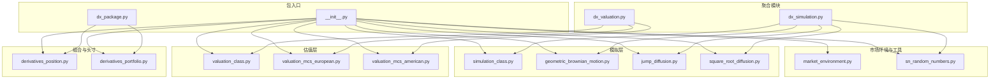
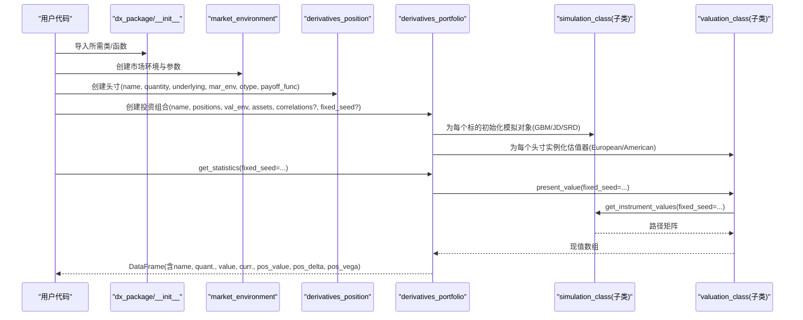
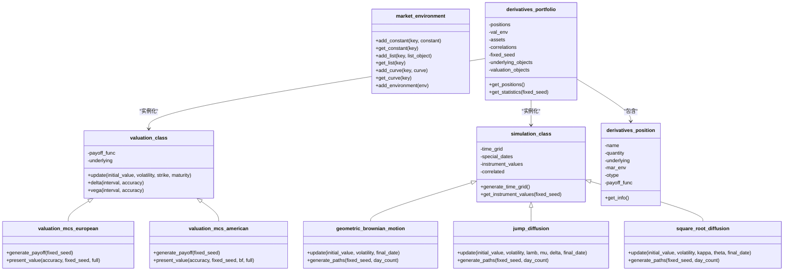

# API参考文档

<cite>
**本文档引用的文件**   
- [dx_package.py](file://py4fi2nd-master/code/dx/dx_package.py)
- [__init__.py](file://py4fi2nd-master/code/dx/__init__.py)
- [derivatives_position.py](file://py4fi2nd-master/code/dx/derivatives_position.py)
- [derivatives_portfolio.py](file://py4fi2nd-master/code/dx/derivatives_portfolio.py)
- [simulation_class.py](file://py4fi2nd-master/code/dx/simulation_class.py)
- [valuation_class.py](file://py4fi2nd-master/code/dx/valuation_class.py)
- [market_environment.py](file://py4fi2nd-master/code/dx/market_environment.py)
- [geometric_brownian_motion.py](file://py4fi2nd-master/code/dx/geometric_brownian_motion.py)
- [jump_diffusion.py](file://py4fi2nd-master/code/dx/jump_diffusion.py)
- [square_root_diffusion.py](file://py4fi2nd-master/code/dx/square_root_diffusion.py)
- [valuation_mcs_european.py](file://py4fi2nd-master/code/dx/valuation_mcs_european.py)
- [valuation_mcs_american.py](file://py4fi2nd-master/code/dx/valuation_mcs_american.py)
- [sn_random_numbers.py](file://py4fi2nd-master/code/dx/sn_random_numbers.py)
- [dx_valuation.py](file://py4fi2nd-master/code/dx/dx_valuation.py)
- [dx_simulation.py](file://py4fi2nd-master/code/dx/dx_simulation.py)
</cite>

## 目录
1. [简介](#简介)
2. [项目结构](#项目结构)
3. [核心组件](#核心组件)
4. [架构总览](#架构总览)
5. [详细组件分析](#详细组件分析)
6. [依赖关系分析](#依赖关系分析)
7. [性能考虑](#性能考虑)
8. [故障排查指南](#故障排查指南)
9. [结论](#结论)
10. [附录：常用用法与最佳实践](#附录常用用法与最佳实践)

## 简介
本文件为衍生品分析框架的完整API参考文档，覆盖所有公共接口、类定义、方法签名与参数说明。重点解释 DerivativesPosition（头寸）、DerivativesPortfolio（投资组合）、SimulationClass（模拟基类）等核心类的功能与用法，并提供调用示例、返回值说明与错误处理指南。同时给出模块间依赖关系与关键调用流程图，展示如何使用 dx_package 进行衍生品定价、风险分析和投资组合管理，并总结最佳实践与性能优化技巧。

## 项目结构
该框架位于 py4fi2nd-master/code/dx 目录下，采用模块化组织方式，按“市场环境与数据”“随机数生成”“模拟模型”“估值器”“头寸与投资组合”分层设计。入口通过 __init__.py 统一暴露常用类与函数，便于外部导入使用。

图表来源 
- [__init__.py:1-31](file://py4fi2nd-master/code/dx/__init__.py#L1-L31)
- [dx_package.py:1-13](file://py4fi2nd-master/code/dx/dx_package.py#L1-L13)
- [dx_valuation.py:1-17](file://py4fi2nd-master/code/dx/dx_valuation.py#L1-L17)
- [dx_simulation.py:1-19](file://py4fi2nd-master/code/dx/dx_simulation.py#L1-L19)

章节来源
- [__init__.py:1-31](file://py4fi2nd-master/code/dx/__init__.py#L1-L31)
- [dx_package.py:1-13](file://py4fi2nd-master/code/dx/dx_package.py#L1-L13)

## 核心组件
本节概述框架中的关键类及其职责，包括市场环境与数据容器、随机数生成、模拟模型、估值器、头寸与投资组合。

- market_environment：封装定价日期、常量、列表与曲线，支持环境合并与覆盖。
- simulation_class：模拟基类，提供时间网格生成、路径缓存与通用属性访问。
- geometric_brownian_motion / jump_diffusion / square_root_diffusion：具体模拟模型实现，支持相关性与路径生成。
- valuation_class：单因子估值基类，提供Delta/Vega数值计算与参数更新。
- valuation_mcs_european / valuation_mcs_american：欧式与美式期权蒙特卡洛估值器，分别基于贴现与LSM回归。
- derivatives_position：衍生品头寸对象，持有名称、数量、标的、市场环境与行权类型等信息。
- derivatives_portfolio：衍生品投资组合，负责多资产相关性建模、时间网格构建、估值对象实例化与统计汇总。

章节来源
- [market_environment.py:1-71](file://py4fi2nd-master/code/dx/market_environment.py#L1-L71)
- [simulation_class.py:1-98](file://py4fi2nd-master/code/dx/simulation_class.py#L1-L98)
- [geometric_brownian_motion.py:1-87](file://py4fi2nd-master/code/dx/geometric_brownian_motion.py#L1-L87)
- [jump_diffusion.py:1-109](file://py4fi2nd-master/code/dx/jump_diffusion.py#L1-L109)
- [square_root_diffusion.py:1-88](file://py4fi2nd-master/code/dx/square_root_diffusion.py#L1-L88)
- [valuation_class.py:1-116](file://py4fi2nd-master/code/dx/valuation_class.py#L1-L116)
- [valuation_mcs_european.py:1-79](file://py4fi2nd-master/code/dx/valuation_mcs_european.py#L1-L79)
- [valuation_mcs_american.py:1-86](file://py4fi2nd-master/code/dx/valuation_mcs_american.py#L1-L86)
- [derivatives_position.py:1-68](file://py4fi2nd-master/code/dx/derivatives_position.py#L1-L68)
- [derivatives_portfolio.py:1-198](file://py4fi2nd-master/code/dx/derivatives_portfolio.py#L1-L198)

## 架构总览
下图展示了从用户调用到估值输出的整体流程：用户通过 dx_package 或 __init__ 暴露的接口创建市场环境与头寸，组合层负责构建时间网格与相关性，估值层根据欧式/美式选择不同算法，最终返回现值与希腊字母。

图表来源 
- [dx_package.py:1-13](file://py4fi2nd-master/code/dx/dx_package.py#L1-L13)
- [__init__.py:1-31](file://py4fi2nd-master/code/dx/__init__.py#L1-L31)
- [market_environment.py:1-71](file://py4fi2nd-master/code/dx/market_environment.py#L1-L71)
- [derivatives_position.py:1-68](file://py4fi2nd-master/code/dx/derivatives_position.py#L1-L68)
- [derivatives_portfolio.py:1-198](file://py4fi2nd-master/code/dx/derivatives_portfolio.py#L1-L198)
- [simulation_class.py:1-98](file://py4fi2nd-master/code/dx/simulation_class.py#L1-L98)
- [valuation_class.py:1-116](file://py4fi2nd-master/code/dx/valuation_class.py#L1-L116)
- [valuation_mcs_european.py:1-79](file://py4fi2nd-master/code/dx/valuation_mcs_european.py#L1-L79)
- [valuation_mcs_american.py:1-86](file://py4fi2nd-master/code/dx/valuation_mcs_american.py#L1-L86)

## 详细组件分析

### 市场环境与数据：market_environment
- 作用：集中管理定价日期、常量、列表与曲线；支持环境合并与覆盖。
- 关键方法与属性
  - add_constant(key, constant)：添加常量键值对。
  - get_constant(key)：读取常量。
  - add_list(key, list_object)：添加列表型数据。
  - get_list(key)：读取列表型数据。
  - add_curve(key, curve)：添加曲线对象。
  - get_curve(key)：读取曲线对象。
  - add_environment(env)：合并另一个环境（覆盖已有键）。
- 典型用途：为模拟与估值提供统一的参数上下文。

章节来源
- [market_environment.py:1-71](file://py4fi2nd-master/code/dx/market_environment.py#L1-L71)

### 随机数生成：sn_random_numbers
- 作用：生成标准正态分布随机数，支持反变体与矩匹配，可选固定种子。
- 关键参数
  - shape：三元组 (o, n, m)，输出形状。
  - antithetic：是否使用反变体。
  - moment_matching：是否进行一阶二阶矩匹配。
  - fixed_seed：是否固定随机种子。
- 返回值：形状为 (o, n, m) 的数组（当 o=1 时返回二维切片）。

章节来源
- [sn_random_numbers.py:1-49](file://py4fi2nd-master/code/dx/sn_random_numbers.py#L1-L49)

### 模拟基类：simulation_class
- 作用：提供通用模拟能力，包括时间网格生成、路径缓存与相关性支持。
- 关键属性
  - name, pricing_date, initial_value, volatility, final_date, currency, frequency, paths, discount_curve
  - time_grid, special_dates, instrument_values, correlated
  - 若 corr=True：cholesky_matrix, rn_set, random_numbers
- 关键方法
  - generate_time_grid()：基于频率与特殊日期生成时间网格。
  - get_instrument_values(fixed_seed=True)：懒加载路径，必要时触发 generate_paths。
- 注意：generate_paths 由子类实现（如 GBM、跳跃扩散、平方根扩散）。

章节来源
- [simulation_class.py:1-98](file://py4fi2nd-master/code/dx/simulation_class.py#L1-L98)

### 模拟模型：几何布朗运动（GBM）
- 作用：基于Black-Scholes-Merton的几何布朗运动生成路径。
- 关键方法
  - update(initial_value=None, volatility=None, final_date=None)：更新参数并重置路径缓存。
  - generate_paths(fixed_seed=False, day_count=365.)：生成路径，支持相关性（Cholesky分解）。
- 输入依赖：discount_curve.short_rate 作为漂移项。

章节来源
- [geometric_brownian_motion.py:1-87](file://py4fi2nd-master/code/dx/geometric_brownian_motion.py#L1-L87)

### 模拟模型：跳跃扩散（Jump Diffusion）
- 作用：Merton跳跃扩散模型，包含泊松跳过程。
- 关键参数：lambda（强度）、mu（跳跃均值）、delta（跳跃波动）。
- 关键方法
  - update(...)：支持更新初始值、波动率、跳跃参数与到期日。
  - generate_paths(...)：生成带跳的路径，支持相关性。

章节来源
- [jump_diffusion.py:1-109](file://py4fi2nd-master/code/dx/jump_diffusion.py#L1-L109)

### 模拟模型：平方根扩散（CIR）
- 作用：Cox-Ingersoll-Ross平方根扩散模型，常用于利率。
- 关键参数：kappa（均值回复速度）、theta（长期均值）。
- 关键方法
  - update(...)：支持更新初始值、波动率、CIR参数与到期日。
  - generate_paths(...)：全截断欧拉离散，保证非负性。

章节来源
- [square_root_diffusion.py:1-88](file://py4fi2nd-master/code/dx/square_root_diffusion.py#L1-L88)

### 估值基类：valuation_class
- 作用：单因子估值基类，提供数值希腊字母与参数更新。
- 关键属性
  - name, pricing_date, strike（可选）, maturity, currency, frequency, paths, discount_curve
  - payoff_func（字符串表达式），underlying（模拟对象）
- 关键方法
  - update(initial_value=None, volatility=None, strike=None, maturity=None)：更新参数并维护时间网格。
  - delta(interval=None, accuracy=4)：前向差分近似Delta，边界修正。
  - vega(interval=0.01, accuracy=4)：前向差分近似Vega。
- 注意：present_value 由子类实现。

章节来源
- [valuation_class.py:1-116](file://py4fi2nd-master/code/dx/valuation_class.py#L1-L116)

### 欧式估值：valuation_mcs_european
- 作用：欧式期权蒙特卡洛估值，支持任意收益函数。
- 关键方法
  - generate_payoff(fixed_seed=False)：基于到期路径与路径统计量计算收益。
  - present_value(accuracy=6, fixed_seed=False, full=False)：贴现期望收益，full返回完整现金流。
- 收益函数变量：maturity_value、instrument_values、mean_value、max_value、min_value。

章节来源
- [valuation_mcs_european.py:1-79](file://py4fi2nd-master/code/dx/valuation_mcs_european.py#L1-L79)

### 美式估值：valuation_mcs_american
- 作用：美式期权蒙特卡洛估值，基于Longstaff-Schwartz回归。
- 关键方法
  - generate_payoff(fixed_seed=False)：返回路径段、内嵌价值、起止索引。
  - present_value(accuracy=6, fixed_seed=False, bf=5, full=False)：反向递推，回归得到继续价值，比较内嵌价值决定最优决策。
- 参数bf：基函数个数（多项式阶数）。

章节来源
- [valuation_mcs_american.py:1-86](file://py4fi2nd-master/code/dx/valuation_mcs_american.py#L1-L86)

### 头寸：derivatives_position
- 作用：描述单个衍生品头寸，包含名称、数量、标的、市场环境与行权类型、收益函数。
- 关键属性
  - name, quantity, underlying, mar_env, otype, payoff_func
- 关键方法
  - get_info()：打印头寸信息与市场环境详情。

章节来源
- [derivatives_position.py:1-68](file://py4fi2nd-master/code/dx/derivatives_position.py#L1-L68)

### 投资组合：derivatives_portfolio
- 作用：组合多个头寸，构建时间网格与相关性，实例化模拟与估值对象，输出统计结果。
- 关键属性
  - name, positions, val_env, assets, correlations, fixed_seed
  - underlyings, time_grid, underlying_objects, valuation_objects, special_dates
- 关键方法
  - get_positions()：打印所有头寸信息。
  - get_statistics(fixed_seed=False)：返回DataFrame，包含各头寸的现值、货币、头寸价值、Delta与Vega。
- 内部逻辑要点
  - 自动确定起始与到期日，构建全局时间网格并加入特殊日期。
  - 若提供correlations，则构造相关矩阵与Cholesky分解，共享随机数数组。
  - 为每个标的选择对应模拟模型（GBM/JD/SRD），并为每个头寸选择欧式/美式估值器。

章节来源
- [derivatives_portfolio.py:1-198](file://py4fi2nd-master/code/dx/derivatives_portfolio.py#L1-L198)

### 包入口与聚合模块
- __init__.py：统一导出常用类与函数，便于外部导入。
- dx_package.py：导出估值相关与头寸/组合类。
- dx_valuation.py：聚合估值相关类。
- dx_simulation.py：聚合模拟相关类与随机数生成。

章节来源
- [__init__.py:1-31](file://py4fi2nd-master/code/dx/__init__.py#L1-L31)
- [dx_package.py:1-13](file://py4fi2nd-master/code/dx/dx_package.py#L1-L13)
- [dx_valuation.py:1-17](file://py4fi2nd-master/code/dx/dx_valuation.py#L1-L17)
- [dx_simulation.py:1-19](file://py4fi2nd-master/code/dx/dx_simulation.py#L1-L19)

## 依赖关系分析
下图展示核心类之间的依赖关系与继承结构。

图表来源 
- [simulation_class.py:1-98](file://py4fi2nd-master/code/dx/simulation_class.py#L1-L98)
- [geometric_brownian_motion.py:1-87](file://py4fi2nd-master/code/dx/geometric_brownian_motion.py#L1-L87)
- [jump_diffusion.py:1-109](file://py4fi2nd-master/code/dx/jump_diffusion.py#L1-L109)
- [square_root_diffusion.py:1-88](file://py4fi2nd-master/code/dx/square_root_diffusion.py#L1-L88)
- [valuation_class.py:1-116](file://py4fi2nd-master/code/dx/valuation_class.py#L1-L116)
- [valuation_mcs_european.py:1-79](file://py4fi2nd-master/code/dx/valuation_mcs_european.py#L1-L79)
- [valuation_mcs_american.py:1-86](file://py4fi2nd-master/code/dx/valuation_mcs_american.py#L1-L86)
- [derivatives_position.py:1-68](file://py4fi2nd-master/code/dx/derivatives_position.py#L1-L68)
- [derivatives_portfolio.py:1-198](file://py4fi2nd-master/code/dx/derivatives_portfolio.py#L1-L198)

## 性能考虑
- 路径缓存：simulation_class.get_instrument_values 会缓存 instrument_values，避免重复计算；仅在 fixed_seed=False 时重新模拟。
- 随机数生成：sn_random_numbers 支持反变体与矩匹配，可显著降低方差与提高收敛速度。
- 相关性建模：在组合层面一次性生成随机数与Cholesky矩阵，减少重复开销。
- 估值精度：present_value 的 accuracy 控制小数位数；美式估值的 bf 影响回归复杂度与稳定性。
- 时间网格：合理设置频率与特殊日期，避免过多时间点导致内存与计算压力。
- 建议：
  - 大批路径下优先使用固定种子以复现实验结果。
  - 对高维标的相关性，确保相关矩阵条件数良好，必要时正则化。
  - 调整收益函数表达式以减少不必要的中间计算。

[本节为通用指导，不直接分析具体文件]

## 故障排查指南
- 到期日不在时间网格：欧式估值器在找不到到期日时会提示错误。需检查时间网格构建与特殊日期设置。
- 收益函数求值错误：eval(payoff_func) 失败会提示错误。需确认表达式中变量名与维度正确。
- Delta/Vega数值异常：前向差分可能产生越界值，基类已做边界修正；若仍异常，检查 interval 与精度设置。
- 相关性矩阵不可逆：Cholesky分解要求半正定，相关矩阵需严格小于1且对称。
- 路径未生成：若 instrument_values 为空，检查是否调用了 get_instrument_values 或 simulate 流程。

章节来源
- [valuation_mcs_european.py:1-79](file://py4fi2nd-master/code/dx/valuation_mcs_european.py#L1-L79)
- [valuation_mcs_american.py:1-86](file://py4fi2nd-master/code/dx/valuation_mcs_american.py#L1-L86)
- [valuation_class.py:1-116](file://py4fi2nd-master/code/dx/valuation_class.py#L1-L116)
- [derivatives_portfolio.py:1-198](file://py4fi2nd-master/code/dx/derivatives_portfolio.py#L1-L198)

## 结论
该框架以清晰的分层设计与可扩展的类体系，提供了完整的衍生品定价与风险管理能力。通过 market_environment 统一管理参数，simulation_class 抽象路径生成，valuation_class 抽象估值逻辑，组合层负责多资产与相关性建模。用户可通过 dx_package 快速接入，完成从定价到风险指标（Delta/Vega）的全流程分析。遵循最佳实践与性能优化建议，可在大规模场景下获得稳定高效的计算结果。

[本节为总结性内容，不直接分析具体文件]

## 附录：常用用法与最佳实践

### 使用 dx_package 进行衍生品定价与组合管理
- 步骤概览
  - 通过 __init__ 或 dx_package 导入所需类。
  - 创建 market_environment，设置定价日期、初始值、波动率、到期日、货币、频率、路径数与折扣曲线。
  - 创建若干 derivatives_position，指定名称、数量、标的、市场环境与行权类型（European/American）以及收益函数表达式。
  - 创建 derivatives_portfolio，传入头寸字典、估值环境、各标的的市场环境与可选的相关性列表。
  - 调用 portfolio.get_statistics(fixed_seed=...) 获取现值、头寸价值与希腊字母。
- 收益函数表达式
  - 欧式：可使用 maturity_value、instrument_values、mean_value、max_value、min_value 等变量。
  - 美式：在 generate_payoff 中返回 instrument_values 与内嵌价值，用于后续回归。
- 返回值说明
  - get_statistics 返回DataFrame，列包括 name、quant.、value、curr.、pos_value、pos_delta、pos_vega。
  - present_value(full=True) 可返回完整现金流数组，便于进一步分析。

章节来源
- [__init__.py:1-31](file://py4fi2nd-master/code/dx/__init__.py#L1-L31)
- [dx_package.py:1-13](file://py4fi2nd-master/code/dx/dx_package.py#L1-L13)
- [derivatives_position.py:1-68](file://py4fi2nd-master/code/dx/derivatives_position.py#L1-L68)
- [derivatives_portfolio.py:1-198](file://py4fi2nd-master/code/dx/derivatives_portfolio.py#L1-L198)
- [valuation_mcs_european.py:1-79](file://py4fi2nd-master/code/dx/valuation_mcs_european.py#L1-L79)
- [valuation_mcs_american.py:1-86](file://py4fi2nd-master/code/dx/valuation_mcs_american.py#L1-L86)

### 最佳实践
- 参数一致性：确保所有头寸的 mar_env 与 val_env 参数一致，避免时间网格冲突。
- 相关性建模：相关矩阵对角线为1，非对角线严格小于1；必要时进行数值稳定化处理。
- 路径与精度：路径数越大估计越稳定；美式回归的 bf 不宜过大以免过拟合。
- 固定种子：调试与对比实验时使用 fixed_seed=True，确保结果可复现。
- 收益函数：尽量简化表达式，避免复杂分支与广播操作，提升计算效率。

[本节为通用指导，不直接分析具体文件]