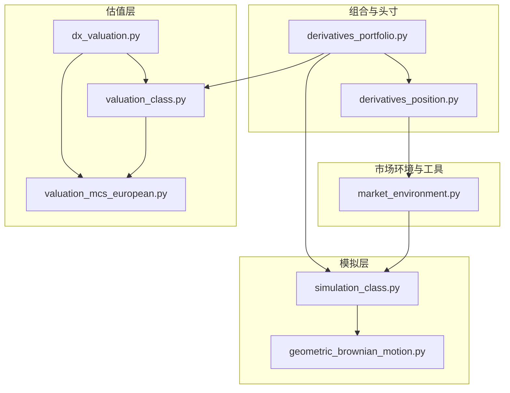
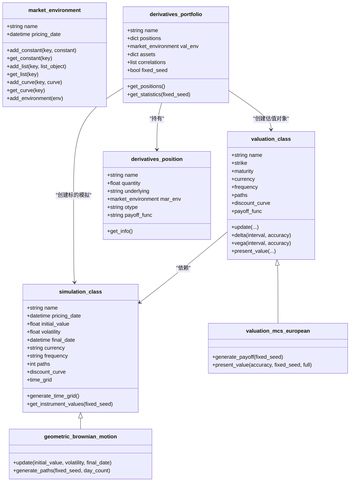
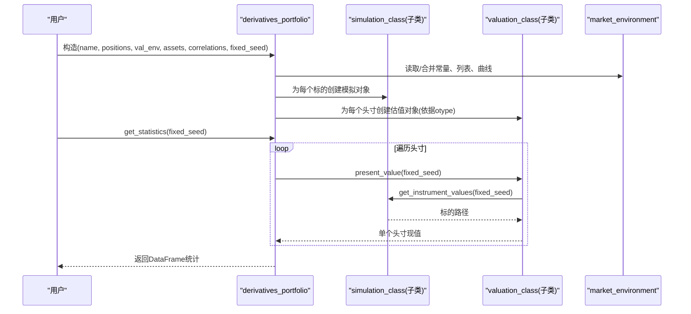
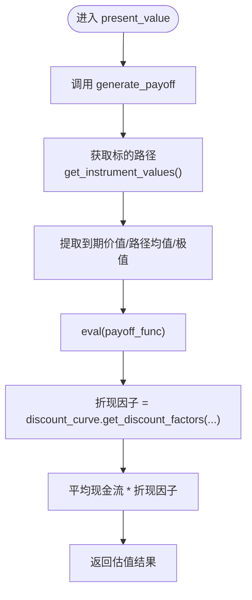
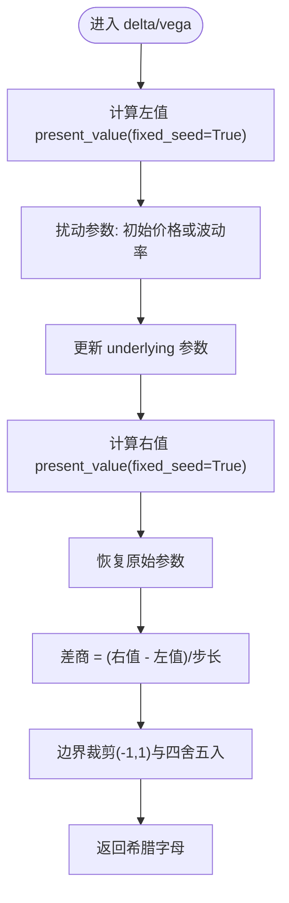
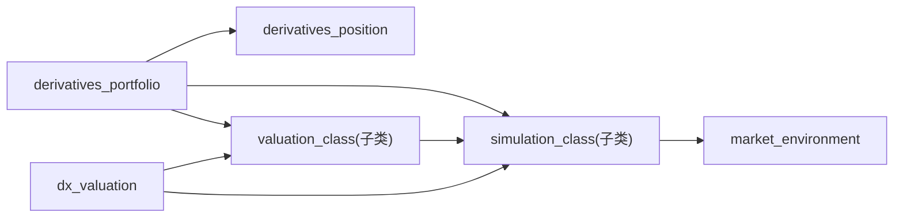

# 核心类文档

<cite>
**本文档引用的文件**   
- [derivatives_position.py](file://py4fi2nd-master/code/dx/derivatives_position.py)
- [derivatives_portfolio.py](file://py4fi2nd-master/code/dx/derivatives_portfolio.py)
- [simulation_class.py](file://py4fi2nd-master/code/dx/simulation_class.py)
- [valuation_class.py](file://py4fi2nd-master/code/dx/valuation_class.py)
- [market_environment.py](file://py4fi2nd-master/code/dx/market_environment.py)
- [dx_valuation.py](file://py4fi2nd-master/code/dx/dx_valuation.py)
- [geometric_brownian_motion.py](file://py4fi2nd-master/code/dx/geometric_brownian_motion.py)
- [valuation_mcs_european.py](file://py4fi2nd-master/code/dx/valuation_mcs_european.py)
</cite>

## 目录
1. [简介](#简介)
2. [项目结构](#项目结构)
3. [核心组件](#核心组件)
4. [架构总览](#架构总览)
5. [详细组件分析](#详细组件分析)
6. [依赖关系分析](#依赖关系分析)
7. [性能考虑](#性能考虑)
8. [故障排查指南](#故障排查指南)
9. [结论](#结论)
10. [附录：API参考与示例](#附录api参考与示例)

## 简介
本文件面向衍生品分析框架的核心类，提供完整、可操作的API文档。重点覆盖以下关键类：
- 头寸建模：DerivativesPosition（对应代码中的 derivatives_position）
- 投资组合管理：DerivativesPortfolio（对应代码中的 derivatives_portfolio）
- 模拟基类：SimulationClass（对应代码中的 simulation_class）
- 估值基类：ValuationClass（对应代码中的 valuation_class）

同时说明市场环境与具体模型/估值实现的关系，展示面向对象设计在金融建模中的应用，包括继承与组合模式、错误处理机制与最佳实践。

## 项目结构
该框架采用“模块按职责划分”的组织方式：
- 市场环境与数据容器：market_environment.py
- 模拟层：simulation_class.py 及其子类（如几何布朗运动）
- 估值层：valuation_class.py 及其子类（欧式/美式蒙特卡洛）
- 组合与头寸：derivatives_portfolio.py、derivatives_position.py
- 统一入口与导出：dx_valuation.py

图表来源
- [market_environment.py:12-71](file://py4fi2nd-master/code/dx/market_environment.py#L12-L71)
- [simulation_class.py:15-98](file://py4fi2nd-master/code/dx/simulation_class.py#L15-L98)
- [geometric_brownian_motion.py:17-87](file://py4fi2nd-master/code/dx/geometric_brownian_motion.py#L17-L87)
- [valuation_class.py:13-116](file://py4fi2nd-master/code/dx/valuation_class.py#L13-L116)
- [valuation_mcs_european.py:16-79](file://py4fi2nd-master/code/dx/valuation_mcs_european.py#L16-L79)
- [dx_valuation.py:11-17](file://py4fi2nd-master/code/dx/dx_valuation.py#L11-L17)
- [derivatives_position.py:13-68](file://py4fi2nd-master/code/dx/derivatives_position.py#L13-L68)
- [derivatives_portfolio.py:26-198](file://py4fi2nd-master/code/dx/derivatives_portfolio.py#L26-L198)

章节来源
- [market_environment.py:12-71](file://py4fi2nd-master/code/dx/market_environment.py#L12-L71)
- [simulation_class.py:15-98](file://py4fi2nd-master/code/dx/simulation_class.py#L15-L98)
- [valuation_class.py:13-116](file://py4fi2nd-master/code/dx/valuation_class.py#L13-L116)
- [derivatives_position.py:13-68](file://py4fi2nd-master/code/dx/derivatives_position.py#L13-L68)
- [derivatives_portfolio.py:26-198](file://py4fi2nd-master/code/dx/derivatives_portfolio.py#L26-L198)

## 核心组件
本节对四个核心类的接口进行系统化说明，涵盖构造函数参数、实例方法、属性访问器与返回值类型，并给出使用要点。

### DerivativesPosition（头寸）
- 作用：描述单一衍生品头寸的基本信息与定价所需的市场环境。
- 构造函数参数
  - name: str，头寸名称
  - quantity: float，头寸数量
  - underlying: str，标的资产或风险因子名称
  - mar_env: market_environment 实例，包含常量、列表与曲线等定价信息
  - otype: str，估值类选择标识（例如 European/American）
  - payoff_func: str，收益函数表达式（Python语法字符串）
- 主要方法与属性
  - get_info(): 打印头寸与市场环境的详细信息（无返回值）
  - 属性：name, quantity, underlying, mar_env, otype, payoff_func
- 使用要点
  - mar_env 需包含必要的常量（如初始值、波动率、到期日、货币、路径数、频率等）
  - payoff_func 中可使用 maturity_value、instrument_values 等变量名（由估值类注入）

章节来源
- [derivatives_position.py:13-68](file://py4fi2nd-master/code/dx/derivatives_position.py#L13-L68)
- [market_environment.py:12-71](file://py4fi2nd-master/code/dx/market_environment.py#L12-L71)

### DerivativesPortfolio（投资组合）
- 作用：聚合多个头寸，构建时间网格、相关性与随机数，生成底层模拟对象与估值对象，并提供统计汇总。
- 构造函数参数
  - name: str，组合名称
  - positions: dict，键为头寸标识，值为 derivatives_position 实例
  - val_env: market_environment 实例，组合级估值环境
  - assets: dict，键为标的名称，值为各标的的 market_environment
  - correlations: list of (i,j,corr)，可选，用于多标的相关性建模
  - fixed_seed: bool，是否固定随机种子
- 主要方法与属性
  - get_positions(): 遍历并打印所有头寸信息（无返回值）
  - get_statistics(fixed_seed=False): 返回 pandas.DataFrame，列含 name, quant., value, curr., pos_value, pos_delta, pos_vega
  - 内部属性：underlyings, time_grid, underlying_objects, valuation_objects, special_dates 等
- 行为要点
  - 自动合并起始/到期日期，生成统一时间网格
  - 若提供相关性，则计算Cholesky矩阵并共享随机数数组
  - 根据每个头寸的 otype 选择对应的估值类（欧式/美式）
  - 将 val_env 注入到各标的与头寸的市场环境中

章节来源
- [derivatives_portfolio.py:26-198](file://py4fi2nd-master/code/dx/derivatives_portfolio.py#L26-L198)

### SimulationClass（模拟基类）
- 作用：为各类随机过程模拟提供通用能力（时间网格生成、路径获取）。
- 构造函数参数
  - name: str，模拟对象名称
  - mar_env: market_environment 实例
  - corr: bool，是否参与相关性建模
- 主要方法与属性
  - generate_time_grid(): 生成时间网格（含起止与特殊日期），结果写入 self.time_grid
  - get_instrument_values(fixed_seed=True): 若未生成路径则触发生成；支持固定种子重算；返回 instrument_values（NumPy数组）
  - 属性：pricing_date, initial_value, volatility, final_date, currency, frequency, paths, discount_curve, time_grid, instrument_values, correlated, cholesky_matrix, rn_set, random_numbers（当corr=True时）
- 子类扩展
  - geometric_brownian_motion 继承并实现 generate_paths，完成GBM路径生成

章节来源
- [simulation_class.py:15-98](file://py4fi2nd-master/code/dx/simulation_class.py#L15-L98)
- [geometric_brownian_motion.py:17-87](file://py4fi2nd-master/code/dx/geometric_brownian_motion.py#L17-L87)

### ValuationClass（估值基类）
- 作用：单因子估值的基础抽象，封装更新、Delta/Vega数值微分等通用逻辑。
- 构造函数参数
  - name: str，估值对象名称
  - underlying: simulation_class 实例，驱动标的模拟
  - mar_env: market_environment 实例，包含 strike、maturity、currency 等
  - payoff_func: str，收益函数表达式（默认空串）
- 主要方法与属性
  - update(initial_value=None, volatility=None, strike=None, maturity=None): 增量更新参数，必要时刷新时间网格
  - delta(interval=None, accuracy=4): 数值Delta，返回四舍五入后的标量
  - vega(interval=0.01, accuracy=4): 数值Vega，返回四舍五入后的标量
  - present_value(...): 由子类实现（欧式/美式）
  - 属性：pricing_date, strike, maturity, currency, frequency, paths, discount_curve, payoff_func, underlying, special_dates
- 子类扩展
  - valuation_mcs_european 实现欧式期权的收益生成与折现估值

章节来源
- [valuation_class.py:13-116](file://py4fi2nd-master/code/dx/valuation_class.py#L13-L116)
- [valuation_mcs_european.py:16-79](file://py4fi2nd-master/code/dx/valuation_mcs_european.py#L16-L79)

## 架构总览
下图展示了从组合到估值的关键调用链与对象关系，体现组合模式（组合持有头寸与估值对象）与继承模式（估值/模拟基类与子类）。

图表来源
- [market_environment.py:12-71](file://py4fi2nd-master/code/dx/market_environment.py#L12-L71)
- [simulation_class.py:15-98](file://py4fi2nd-master/code/dx/simulation_class.py#L15-L98)
- [geometric_brownian_motion.py:17-87](file://py4fi2nd-master/code/dx/geometric_brownian_motion.py#L17-L87)
- [valuation_class.py:13-116](file://py4fi2nd-master/code/dx/valuation_class.py#L13-L116)
- [valuation_mcs_european.py:16-79](file://py4fi2nd-master/code/dx/valuation_mcs_european.py#L16-L79)
- [derivatives_position.py:13-68](file://py4fi2nd-master/code/dx/derivatives_position.py#L13-L68)
- [derivatives_portfolio.py:26-198](file://py4fi2nd-master/code/dx/derivatives_portfolio.py#L26-L198)

## 详细组件分析

### 头寸与组合的协作流程
组合在初始化时完成以下工作：
- 合并各头寸的市场环境，确定统一的起始/到期日期与时间网格
- 若存在相关性，构造Cholesky矩阵与共享随机数数组
- 为每个标的创建模拟对象（如GBM）
- 根据头寸的 otype 选择估值类（欧式/美式），并注入市场环境

图表来源
- [derivatives_portfolio.py:52-163](file://py4fi2nd-master/code/dx/derivatives_portfolio.py#L52-L163)
- [simulation_class.py:90-98](file://py4fi2nd-master/code/dx/simulation_class.py#L90-L98)
- [valuation_mcs_european.py:60-79](file://py4fi2nd-master/code/dx/valuation_mcs_european.py#L60-L79)

章节来源
- [derivatives_portfolio.py:52-198](file://py4fi2nd-master/code/dx/derivatives_portfolio.py#L52-L198)

### 欧式期权估值流程（蒙特卡洛）

图表来源
- [valuation_mcs_european.py:28-79](file://py4fi2nd-master/code/dx/valuation_mcs_european.py#L28-L79)

章节来源
- [valuation_mcs_european.py:28-79](file://py4fi2nd-master/code/dx/valuation_mcs_european.py#L28-L79)

### 数值希腊字母（Delta/Vega）流程

图表来源
- [valuation_class.py:78-116](file://py4fi2nd-master/code/dx/valuation_class.py#L78-L116)

章节来源
- [valuation_class.py:78-116](file://py4fi2nd-master/code/dx/valuation_class.py#L78-L116)

## 依赖关系分析
- 组合依赖头寸与环境：通过 dict 聚合头寸，并将组合级 val_env 注入到各标的与头寸的环境
- 估值依赖模拟：估值类通过 underlying 获取路径，从而计算收益与折现
- 模拟依赖环境：从 market_environment 读取常数、曲线与随机数（相关性场景）
- 导出模块 dx_valuation 统一暴露欧式/美式估值类与模拟类

图表来源
- [derivatives_portfolio.py:26-198](file://py4fi2nd-master/code/dx/derivatives_portfolio.py#L26-L198)
- [derivatives_position.py:13-68](file://py4fi2nd-master/code/dx/derivatives_position.py#L13-L68)
- [valuation_class.py:13-116](file://py4fi2nd-master/code/dx/valuation_class.py#L13-L116)
- [simulation_class.py:15-98](file://py4fi2nd-master/code/dx/simulation_class.py#L15-L98)
- [market_environment.py:12-71](file://py4fi2nd-master/code/dx/market_environment.py#L12-L71)
- [dx_valuation.py:11-17](file://py4fi2nd-master/code/dx/dx_valuation.py#L11-L17)

章节来源
- [dx_valuation.py:11-17](file://py4fi2nd-master/code/dx/dx_valuation.py#L11-L17)

## 性能考虑
- 路径生成与缓存：simulation_class.get_instrument_values 会缓存 instrument_values，避免重复计算；fixed_seed=False 时会强制重算
- 相关性建模：Cholesky分解与共享随机数数组可减少重复随机数生成开销，但需注意维度与内存占用
- 时间网格：组合层面统一时间网格减少重复计算；特殊日期（如到期日）会被插入以保证估值精度
- 数值微分：Delta/Vega采用前向差分，步长自适应（基于初始值或波动率），可通过 accuracy 控制输出精度

[本节为通用指导，不直接分析具体文件]

## 故障排查指南
- 收益函数求值失败
  - 现象：打印“Error evaluating payoff function.”
  - 原因：payoff_func 表达式非法或变量名不匹配
  - 处理：检查表达式语法与可用变量（如 maturity_value、instrument_values）
  - 参考位置：[valuation_mcs_european.py:55-58](file://py4fi2nd-master/code/dx/valuation_mcs_european.py#L55-L58)
- 到期日不在时间网格
  - 现象：打印“Maturity date not in time grid of underlying.”
  - 原因：时间网格未包含到期日
  - 处理：确保组合或标的的时间网格包含到期日，或在估值前更新参数以刷新网格
  - 参考位置：[valuation_mcs_european.py:43-46](file://py4fi2nd-master/code/dx/valuation_mcs_european.py#L43-L46)
- 数值异常（Delta越界）
  - 现象：Delta可能超出[-1,1]范围
  - 处理：估值基类已做边界裁剪；若仍异常，检查步长与路径稳定性
  - 参考位置：[valuation_class.py:93-98](file://py4fi2nd-master/code/dx/valuation_class.py#L93-L98)
- 相关性矩阵非正定
  - 现象：Cholesky分解失败
  - 处理：限制相关系数上限（代码中已限制接近1的值），检查输入相关性一致性
  - 参考位置：[derivatives_portfolio.py:108-114](file://py4fi2nd-master/code/dx/derivatives_portfolio.py#L108-L114)

章节来源
- [valuation_mcs_european.py:43-58](file://py4fi2nd-master/code/dx/valuation_mcs_european.py#L43-L58)
- [valuation_class.py:93-98](file://py4fi2nd-master/code/dx/valuation_class.py#L93-L98)
- [derivatives_portfolio.py:108-114](file://py4fi2nd-master/code/dx/derivatives_portfolio.py#L108-L114)

## 结论
该框架通过清晰的层次化设计与可扩展的继承体系，实现了从标的模拟到衍生品估值的完整链路。组合层负责协调头寸、环境与模型，估值层专注于收益与折现，模拟层专注路径生成。通过合理的错误处理与性能优化策略，可在保证精度的前提下提升运行效率。

[本节为总结性内容，不直接分析具体文件]

## 附录：API参考与示例

### API参考速览
- market_environment
  - add_constant/get_constant：添加/获取常量
  - add_list/get_list：添加/获取列表
  - add_curve/get_curve：添加/获取曲线
  - add_environment：合并另一个环境（覆盖同名项）
- simulation_class
  - generate_time_grid：生成时间网格
  - get_instrument_values：获取标的路径（支持固定种子）
- geometric_brownian_motion
  - update：更新初始值、波动率、到期日
  - generate_paths：生成GBM路径
- valuation_class
  - update：增量更新参数
  - delta/vega：数值希腊字母
  - present_value：由子类实现
- valuation_mcs_european
  - generate_payoff：根据路径与收益函数计算现金流
  - present_value：折现平均现金流得到估值
- derivatives_position
  - __init__：构造头寸
  - get_info：打印头寸信息
- derivatives_portfolio
  - __init__：构造组合，生成时间网格、相关性、模拟与估值对象
  - get_positions：打印所有头寸信息
  - get_statistics：返回组合统计DataFrame

章节来源
- [market_environment.py:12-71](file://py4fi2nd-master/code/dx/market_environment.py#L12-L71)
- [simulation_class.py:15-98](file://py4fi2nd-master/code/dx/simulation_class.py#L15-L98)
- [geometric_brownian_motion.py:17-87](file://py4fi2nd-master/code/dx/geometric_brownian_motion.py#L17-L87)
- [valuation_class.py:13-116](file://py4fi2nd-master/code/dx/valuation_class.py#L13-L116)
- [valuation_mcs_european.py:16-79](file://py4fi2nd-master/code/dx/valuation_mcs_european.py#L16-L79)
- [derivatives_position.py:13-68](file://py4fi2nd-master/code/dx/derivatives_position.py#L13-L68)
- [derivatives_portfolio.py:26-198](file://py4fi2nd-master/code/dx/derivatives_portfolio.py#L26-L198)

### 使用示例（步骤指引）
- 创建头寸
  - 准备 market_environment，设置必要常量（初始值、波动率、到期日、货币、路径数、频率等）
  - 构造 derivatives_position，传入名称、数量、标的、市场环境、估值类型与收益函数
- 构建投资组合
  - 准备组合级 val_env 与各标的的 assets 映射
  - 可选提供 correlations 以启用相关性建模
  - 构造 derivatives_portfolio，内部会自动生成时间网格与估值对象
- 执行模拟与估值
  - 调用 portfolio.get_statistics(fixed_seed=True/False) 获取各头寸现值、组合值与希腊字母
  - 如需重算，设置 fixed_seed=False 触发重新生成路径
- 进行敏感性分析
  - 使用 valuation_class.update 调整参数后，再次调用 delta/vega 获取数值希腊字母

[本节为概念性示例，不直接引用具体代码片段]