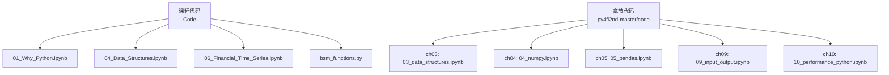
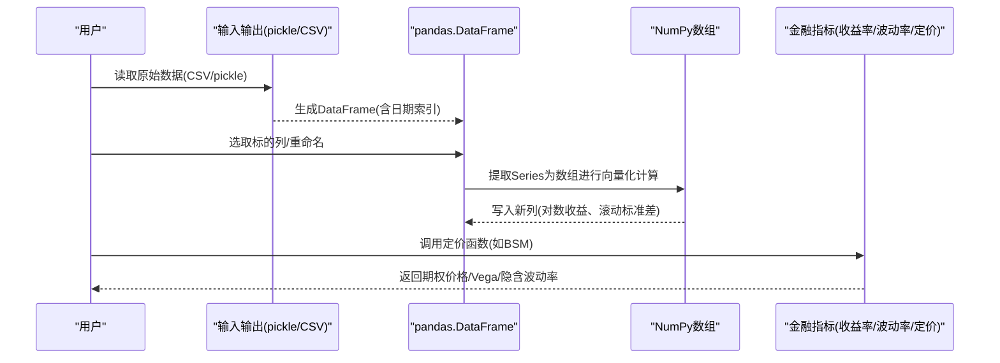
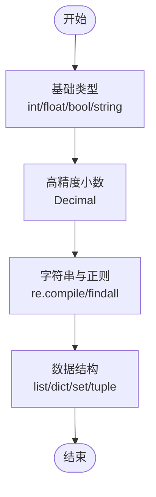
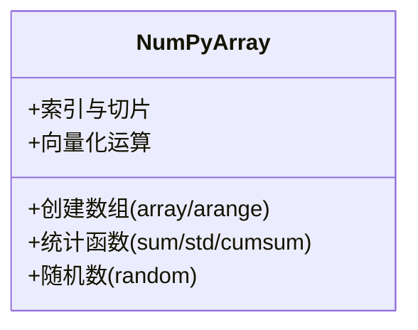
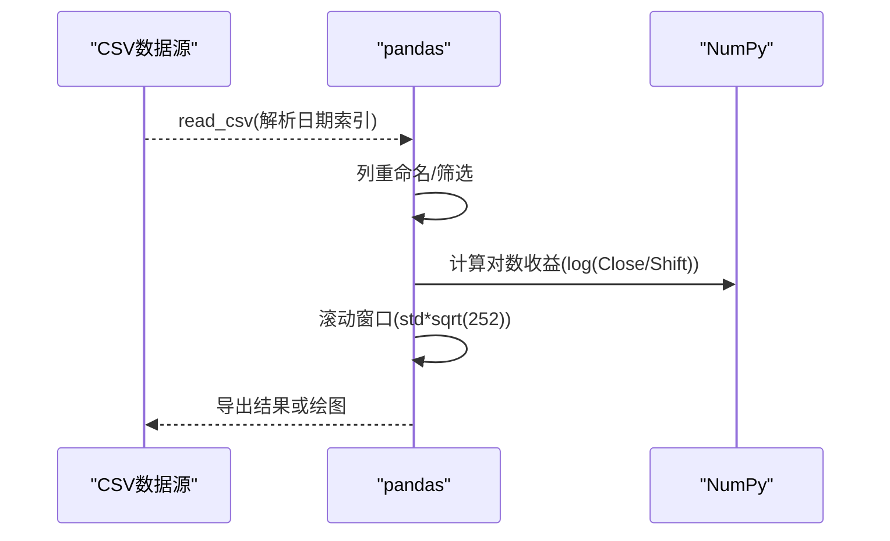
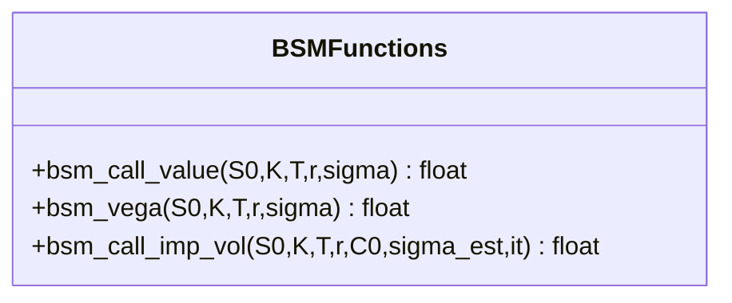
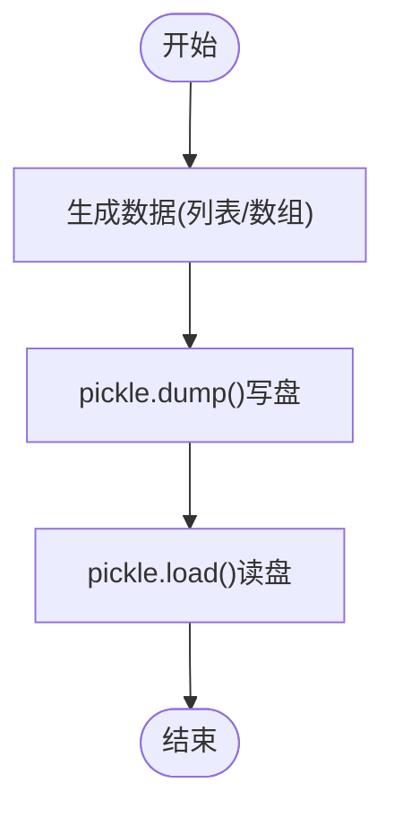
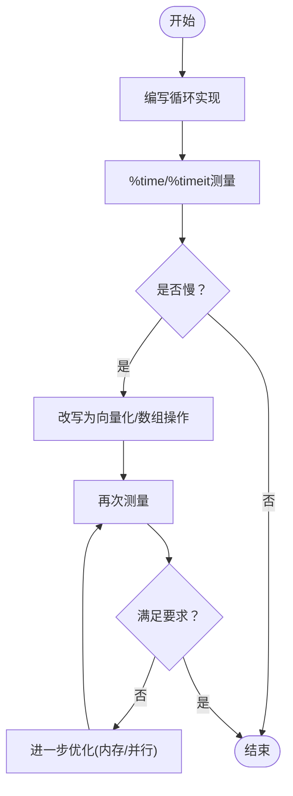
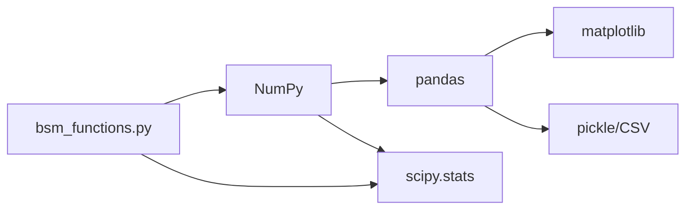

# Python编程基础

<cite>
**本文引用的文件**   
- [01_Why_Python.ipynb](file://Code/01_Why_Python.ipynb)
- [04_Data_Structures.ipynb](file://Code/04_Data_Structures.ipynb)
- [bsm_functions.py](file://Code/bsm_functions.py)
- [03_data_structures.ipynb](file://py4fi2nd-master/code/ch03/03_data_structures.ipynb)
- [04_numpy.ipynb](file://py4fi2nd-master/code/ch04/04_numpy.ipynb)
- [05_pandas.ipynb](file://py4fi2nd-master/code/ch05/05_pandas.ipynb)
- [06_Financial_Time_Series.ipynb](file://Code/06_Financial_Time_Series.ipynb)
- [09_input_output.ipynb](file://py4fi2nd-master/code/ch09/09_input_output.ipynb)
- [10_performance_python.ipynb](file://py4fi2nd-master/code/ch10/10_performance_python.ipynb)
</cite>

## 目录
1. [简介](#简介)
2. [项目结构](#项目结构)
3. [核心组件](#核心组件)
4. [架构总览](#架构总览)
5. [详细组件分析](#详细组件分析)
6. [依赖关系分析](#依赖关系分析)
7. [性能考量与优化](#性能考量与优化)
8. [故障排查指南](#故障排查指南)
9. [结论](#结论)
10. [附录：常用技能速查](#附录常用技能速查)

## 简介
本教程面向Python初学者与金融数据分析入门者，系统讲解Python在金融领域的应用优势与编程基础。内容覆盖语法基础、数据结构（列表、字典、集合）、函数定义、面向对象编程要点；结合真实金融数据场景，演示NumPy数组操作与Pandas数据处理的基本用法；并补充文件I/O、异常处理、模块导入等实用技能，以及性能优化技巧与最佳实践。通过循序渐进的示例与图示，帮助读者建立扎实的编程与数据分析能力。

## 项目结构
仓库包含多套Jupyter Notebook与示例代码，围绕“Python for Finance”主题展开，涵盖数据类型与结构、数值计算、数据分析、时间序列、输入输出与性能优化等章节。典型组织方式如下：
- Code：课程配套Notebook与少量脚本，如为什么选择Python、数据结构、金融时间序列、BSM定价函数等
- py4fi2nd-master/code：按章节组织的完整教学代码，包括ch03-ch10等，覆盖数据结构、NumPy、pandas、输入输出、性能等
- 其他练习与素材：用于课堂练习与扩展

图表来源
- [01_Why_Python.ipynb](file://Code/01_Why_Python.ipynb)
- [04_Data_Structures.ipynb](file://Code/04_Data_Structures.ipynb)
- [06_Financial_Time_Series.ipynb](file://Code/06_Financial_Time_Series.ipynb)
- [bsm_functions.py](file://Code/bsm_functions.py)
- [03_data_structures.ipynb](file://py4fi2nd-master/code/ch03/03_data_structures.ipynb)
- [04_numpy.ipynb](file://py4fi2nd-master/code/ch04/04_numpy.ipynb)
- [05_pandas.ipynb](file://py4fi2nd-master/code/ch05/05_pandas.ipynb)
- [09_input_output.ipynb](file://py4fi2nd-master/code/ch09/09_input_output.ipynb)
- [10_performance_python.ipynb](file://py4fi2nd-master/code/ch10/10_performance_python.ipynb)

章节来源
- [01_Why_Python.ipynb](file://Code/01_Why_Python.ipynb)
- [04_Data_Structures.ipynb](file://Code/04_Data_Structures.ipynb)
- [06_Financial_Time_Series.ipynb](file://Code/06_Financial_Time_Series.ipynb)
- [bsm_functions.py](file://Code/bsm_functions.py)
- [03_data_structures.ipynb](file://py4fi2nd-master/code/ch03/03_data_structures.ipynb)
- [04_numpy.ipynb](file://py4fi2nd-master/code/ch04/04_numpy.ipynb)
- [05_pandas.ipynb](file://py4fi2nd-master/code/ch05/05_pandas.ipynb)
- [09_input_output.ipynb](file://py4fi2nd-master/code/ch09/09_input_output.ipynb)
- [10_performance_python.ipynb](file://py4fi2nd-master/code/ch10/10_performance_python.ipynb)

## 核心组件
- 基础语法与数据类型：整数、浮点数、布尔值、字符串、正则表达式、Decimal高精度运算
- 数据结构：列表、元组、字典、集合及其在金融计算中的使用模式
- 数值计算：NumPy数组创建、索引切片、向量化运算、统计函数
- 数据分析：pandas DataFrame/Series构建、列操作、时间序列重采样与滚动窗口
- 金融应用：对数收益率、年化波动率、期权定价（BSM）与隐含波动率估计
- I/O与持久化：pickle序列化、CSV读写、二进制数组读写
- 性能优化：循环vs向量化、timeit基准测试、内存与类型选择

章节来源
- [04_Data_Structures.ipynb](file://Code/04_Data_Structures.ipynb)
- [03_data_structures.ipynb](file://py4fi2nd-master/code/ch03/03_data_structures.ipynb)
- [04_numpy.ipynb](file://py4fi2nd-master/code/ch04/04_numpy.ipynb)
- [05_pandas.ipynb](file://py4fi2nd-master/code/ch05/05_pandas.ipynb)
- [06_Financial_Time_Series.ipynb](file://Code/06_Financial_Time_Series.ipynb)
- [bsm_functions.py](file://Code/bsm_functions.py)
- [09_input_output.ipynb](file://py4fi2nd-master/code/ch09/09_input_output.ipynb)
- [10_performance_python.ipynb](file://py4fi2nd-master/code/ch10/10_performance_python.ipynb)

## 架构总览
下图展示从数据读取到指标计算的端到端流程，体现NumPy与pandas在金融数据处理中的协作关系。

图表来源
- [01_Why_Python.ipynb](file://Code/01_Why_Python.ipynb)
- [06_Financial_Time_Series.ipynb](file://Code/06_Financial_Time_Series.ipynb)
- [05_pandas.ipynb](file://py4fi2nd-master/code/ch05/05_pandas.ipynb)
- [04_numpy.ipynb](file://py4fi2nd-master/code/ch04/04_numpy.ipynb)
- [bsm_functions.py](file://Code/bsm_functions.py)

## 详细组件分析

### 组件A：数据结构与基础语法
- 目标：掌握Python基本类型与常用数据结构，理解其在金融数据建模中的作用
- 关键要点：
  - 整数与浮点数的精度问题与Decimal高精度场景
  - 字符串处理与正则表达式抽取时间戳
  - 列表、字典、集合的构造与常用方法
- 适用场景：清洗非结构化文本、构建特征映射、去重与集合运算

图表来源
- [04_Data_Structures.ipynb](file://Code/04_Data_Structures.ipynb)
- [03_data_structures.ipynb](file://py4fi2nd-master/code/ch03/03_data_structures.ipynb)

章节来源
- [04_Data_Structures.ipynb](file://Code/04_Data_Structures.ipynb)
- [03_data_structures.ipynb](file://py4fi2nd-master/code/ch03/03_data_structures.ipynb)

### 组件B：NumPy数组与向量化计算
- 目标：熟练使用NumPy进行高效数值计算，避免低效Python循环
- 关键要点：
  - 数组创建与类型控制（np.array, np.arange, dtype）
  - 索引与切片、广播机制
  - 聚合统计（sum/std/cumsum）与随机数生成
- 适用场景：大规模价格序列、蒙特卡洛模拟、矩阵运算

图表来源
- [04_numpy.ipynb](file://py4fi2nd-master/code/ch04/04_numpy.ipynb)

章节来源
- [04_numpy.ipynb](file://py4fi2nd-master/code/ch04/04_numpy.ipynb)

### 组件C：pandas数据处理与时间序列
- 目标：掌握DataFrame/Series的核心操作，完成金融时间序列的基础分析
- 关键要点：
  - 构建DataFrame、设置索引、列选择与新增列
  - 时间序列重采样、滚动窗口（rolling std）
  - 对数收益率计算与可视化
- 适用场景：日频行情清洗、技术指标计算、回测数据准备

图表来源
- [01_Why_Python.ipynb](file://Code/01_Why_Python.ipynb)
- [06_Financial_Time_Series.ipynb](file://Code/06_Financial_Time_Series.ipynb)
- [05_pandas.ipynb](file://py4fi2nd-master/code/ch05/05_pandas.ipynb)

章节来源
- [01_Why_Python.ipynb](file://Code/01_Why_Python.ipynb)
- [06_Financial_Time_Series.ipynb](file://Code/06_Financial_Time_Series.ipynb)
- [05_pandas.ipynb](file://py4fi2nd-master/code/ch05/05_pandas.ipynb)

### 组件D：金融模型与函数封装（BSM）
- 目标：将金融公式封装为可复用函数，支持定价、Vega与隐含波动率估算
- 关键要点：
  - Black-Scholes-Merton欧式看涨期权定价公式
  - Vega（波动率敏感度）计算
  - 牛顿迭代法求解隐含波动率
- 适用场景：期权定价、风险度量、参数校准

图表来源
- [bsm_functions.py](file://Code/bsm_functions.py)

章节来源
- [bsm_functions.py](file://Code/bsm_functions.py)

### 组件E：输入输出与持久化
- 目标：掌握对象序列化与文件读写，支撑数据管道与实验复现
- 关键要点：
  - pickle序列化/反序列化（大数据量效率）
  - CSV读写与日期解析
  - 二进制数组读写（array.tofile/fromfile）
- 适用场景：缓存中间结果、批量加载训练数据、跨进程传输

图表来源
- [09_input_output.ipynb](file://py4fi2nd-master/code/ch09/09_input_output.ipynb)
- [04_numpy.ipynb](file://py4fi2nd-master/code/ch04/04_numpy.ipynb)

章节来源
- [09_input_output.ipynb](file://py4fi2nd-master/code/ch09/09_input_output.ipynb)
- [04_numpy.ipynb](file://py4fi2nd-master/code/ch04/04_numpy.ipynb)

### 组件F：性能优化与基准测试
- 目标：识别性能瓶颈，采用向量化与合适的数据结构提升运行速度
- 关键要点：
  - Python循环 vs NumPy向量化对比
  - timeit与%time/%timeit魔法命令
  - 内存占用与类型选择（float64 vs float32）
- 适用场景：大规模回测、蒙特卡洛模拟、高频数据处理

图表来源
- [10_performance_python.ipynb](file://py4fi2nd-master/code/ch10/10_performance_python.ipynb)

章节来源
- [10_performance_python.ipynb](file://py4fi2nd-master/code/ch10/10_performance_python.ipynb)

## 依赖关系分析
- 模块依赖：
  - pandas依赖numpy，常用于时间序列与表格型数据处理
  - matplotlib用于可视化，常与pandas集成绘图
  - scipy.stats用于正态分布CDF/PDF（BSM定价）
  - pickle用于对象序列化
- 耦合与内聚：
  - bsm_functions.py独立性强，便于被多个Notebook复用
  - 数据处理流程以pandas为中心，NumPy作为底层加速
- 外部依赖：
  - 金融数据源（CSV）与可选API（Eikon）
  - 第三方库：numpy、pandas、matplotlib、scipy、pickle

图表来源
- [01_Why_Python.ipynb](file://Code/01_Why_Python.ipynb)
- [05_pandas.ipynb](file://py4fi2nd-master/code/ch05/05_pandas.ipynb)
- [04_numpy.ipynb](file://py4fi2nd-master/code/ch04/04_numpy.ipynb)
- [bsm_functions.py](file://Code/bsm_functions.py)
- [09_input_output.ipynb](file://py4fi2nd-master/code/ch09/09_input_output.ipynb)

章节来源
- [01_Why_Python.ipynb](file://Code/01_Why_Python.ipynb)
- [05_pandas.ipynb](file://py4fi2nd-master/code/ch05/05_pandas.ipynb)
- [04_numpy.ipynb](file://py4fi2nd-master/code/ch04/04_numpy.ipynb)
- [bsm_functions.py](file://Code/bsm_functions.py)
- [09_input_output.ipynb](file://py4fi2nd-master/code/ch09/09_input_output.ipynb)

## 性能考量与优化
- 优先使用向量化：用NumPy数组替代Python循环，显著降低解释开销
- 选择合适的dtype：float32可降低内存占用，适合大规模数据
- 合理使用滚动窗口：pandas rolling在时间序列上高效计算统计量
- 基准测试：使用%timeit评估不同实现的耗时差异
- 内存管理：避免不必要的副本，尽量原地修改或使用视图
- 序列化策略：pickle适合复杂对象快速存取，但需注意版本兼容与安全

[本节为通用指导，不直接分析具体文件]

## 故障排查指南
- 常见错误与定位：
  - 路径与编码问题：read_csv时日期解析失败或编码错误，检查parse_dates与encoding
  - 缺失值处理：shift与log后首行NaN，需合理填充或删除
  - 类型不一致：混合类型导致计算报错，统一dtype或转换
  - 性能退化：循环过多导致超时，改用向量化或减少中间对象
- 调试建议：
  - 打印关键变量形状与类型（shape/dtype）
  - 分步执行并观察中间结果
  - 使用warnings过滤干扰信息，聚焦错误堆栈

章节来源
- [01_Why_Python.ipynb](file://Code/01_Why_Python.ipynb)
- [06_Financial_Time_Series.ipynb](file://Code/06_Financial_Time_Series.ipynb)
- [09_input_output.ipynb](file://py4fi2nd-master/code/ch09/09_input_output.ipynb)

## 结论
本教程基于仓库中的教学代码，系统梳理了Python在金融数据分析中的基础能力与实践路径。从数据类型与结构、NumPy与pandas核心用法，到时间序列分析与金融模型封装，再到I/O与性能优化，形成了一条清晰的学习路线。建议读者结合Notebook逐步实践，并在真实数据上验证所学技能，逐步构建自己的金融数据分析工具箱。

[本节为总结性内容，不直接分析具体文件]

## 附录：常用技能速查
- 数据结构
  - 列表：append、extend、切片、推导式
  - 字典：键值映射、get默认值、items/keys/values
  - 集合：去重、交集/并集/差集
- 数值计算
  - NumPy：arange、reshape、广播、mean/std/cumsum
  - 随机数：seed、standard_normal、random
- 数据分析
  - pandas：DataFrame构建、loc/iloc、rename、assign、rolling
  - 时间序列：resample、shift、diff、rolling.std()*sqrt(252)
- 金融模型
  - BSM：call_value、vega、implied_vol
- I/O与性能
  - pickle：dump/load
  - CSV：read_csv/write_csv
  - 基准：%time、%timeit

[本节为速查清单，不直接分析具体文件]