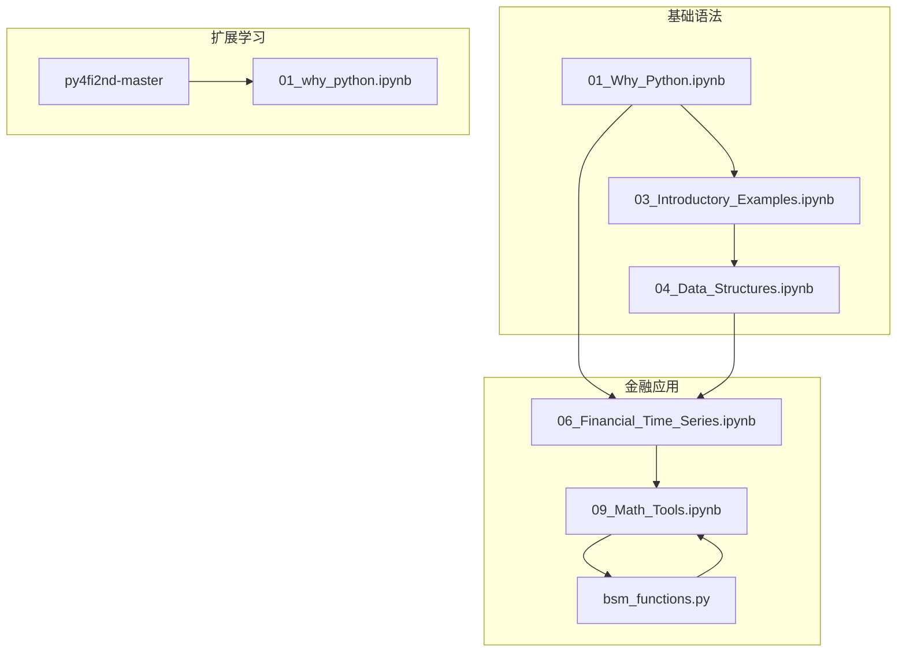
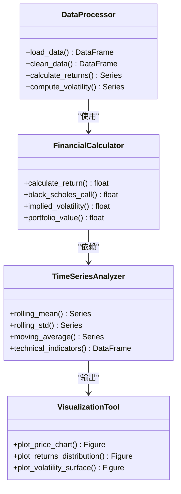
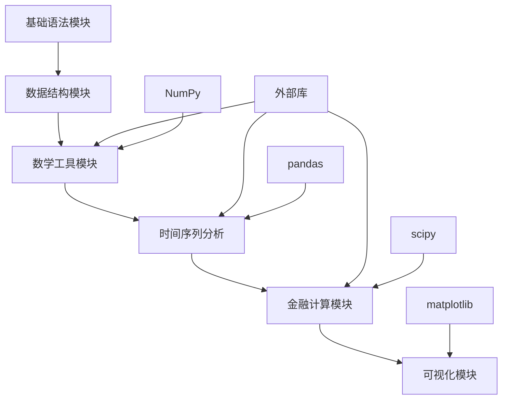

# Python语言基础

<cite>
**本文档中引用的文件**
- [01_Why_Python.ipynb](file://Code/01_Why_Python.ipynb)
- [03_Introductory_Examples.ipynb](file://Code/03_Introductory_Examples.ipynb)
- [04_Data_Structures.ipynb](file://Code/04_Data_Structures.ipynb)
- [06_Financial_Time_Series.ipynb](file://Code/06_Financial_Time_Series.ipynb)
- [09_Math_Tools.ipynb](file://Code/09_Math_Tools.ipynb)
- [bsm_functions.py](file://Code/bsm_functions.py)
- [01_why_python.ipynb](file://py4fi2nd-master/code/ch01/01_why_python.ipynb)
</cite>

## 目录
1. [简介](#简介)
2. [项目结构](#项目结构)
3. [核心组件](#核心组件)
4. [架构概览](#架构概览)
5. [详细组件分析](#详细组件分析)
6. [依赖关系分析](#依赖关系分析)
7. [性能考虑](#性能考虑)
8. [故障排除指南](#故障排除指南)
9. [结论](#结论)
10. [附录](#附录)

## 简介

本教程旨在为金融数据分析初学者提供全面的Python语言基础。通过结合实际的金融计算场景，我们将深入介绍Python的核心语法概念，包括变量定义、数据类型、运算符、控制流程、函数定义与调用等基础语法。教程将展示字符串处理、数值运算、逻辑判断在金融数据处理中的应用，并提供丰富的代码示例，涵盖列表推导式、生成器表达式等高级特性。

## 项目结构

本项目包含多个Jupyter Notebook文件和Python脚本，涵盖了从基础语法到高级金融计算的完整学习路径：



**图表来源**
- [01_Why_Python.ipynb:1-100](file://Code/01_Why_Python.ipynb#L1-L100)
- [04_Data_Structures.ipynb:1-100](file://Code/04_Data_Structures.ipynb#L1-L100)
- [06_Financial_Time_Series.ipynb:1-100](file://Code/06_Financial_Time_Series.ipynb#L1-L100)

**章节来源**
- [01_Why_Python.ipynb:1-50](file://Code/01_Why_Python.ipynb#L1-L50)
- [04_Data_Structures.ipynb:1-50](file://Code/04_Data_Structures.ipynb#L1-L50)

## 核心组件

### 1. 变量和数据类型

Python支持多种数据类型，在金融计算中尤为重要：

#### 整数和浮点数
```python
# 整数类型 - 用于计数和索引
stock_count = 1000
position_id = 42

# 浮点数类型 - 用于价格计算
stock_price = 150.75
interest_rate = 0.05
volatility = 0.25
```

#### 精确小数计算
```python
from decimal import Decimal

# 金融计算中使用Decimal确保精度
price = Decimal('150.75')
quantity = Decimal('100')
total = price * quantity
```

**章节来源**
- [04_Data_Structures.ipynb:70-120](file://Code/04_Data_Structures.ipynb#L70-L120)
- [04_Data_Structures.ipynb:250-350](file://Code/04_Data_Structures.ipynb#L250-L350)

### 2. 字符串处理

字符串操作在金融数据处理中非常常见：

```python
# 股票代码处理
ticker = "AAPL.O"
exchange = ticker.split('.')[1]  # 获取交易所信息

# 日期格式化
date_str = "2024-01-15"
formatted_date = date_str.replace("-", "/")

# 数据清洗
raw_data = "  1,234.56  "
cleaned_data = raw_data.strip().replace(",", "")
```

**章节来源**
- [04_Data_Structures.ipynb:540-720](file://Code/04_Data_Structures.ipynb#L540-L720)

### 3. 控制流程

条件语句和循环在金融算法中广泛应用：

```python
# 交易信号判断
if stock_price > moving_average:
    signal = "BUY"
elif stock_price < moving_average:
    signal = "SELL"
else:
    signal = "HOLD"

# 历史数据分析
for i in range(len(prices)):
    if prices[i] > threshold:
        print(f"Day {i}: Price above threshold")
```

**章节来源**
- [03_Introductory_Examples.ipynb:650-700](file://Code/03_Introductory_Examples.ipynb#L650-L700)

### 4. 函数定义与调用

函数是组织金融计算逻辑的关键：

```python
def calculate_return(initial_price, final_price):
    """计算收益率"""
    return (final_price - initial_price) / initial_price

def black_scholes_call(S, K, T, r, sigma):
    """Black-Scholes期权定价公式"""
    from math import log, sqrt, exp
    from scipy import stats
    
    d1 = (log(S/K) + (r + 0.5*sigma**2)*T) / (sigma*sqrt(T))
    d2 = d1 - sigma*sqrt(T)
    
    call_price = S*stats.norm.cdf(d1) - K*exp(-r*T)*stats.norm.cdf(d2)
    return call_price
```

**章节来源**
- [bsm_functions.py:10-42](file://Code/bsm_functions.py#L10-L42)
- [bsm_functions.py:47-76](file://Code/bsm_functions.py#L47-L76)

## 架构概览

整个Python金融数据分析系统采用模块化设计，各组件职责清晰：



**图表来源**
- [06_Financial_Time_Series.ipynb:100-200](file://Code/06_Financial_Time_Series.ipynb#L100-L200)
- [09_Math_Tools.ipynb:90-150](file://Code/09_Math_Tools.ipynb#L90-L150)

## 详细组件分析

### 1. 数据结构模块

Python提供了丰富的数据结构来存储和处理金融数据：

#### 列表和元组
```python
# 股票价格序列
prices = [150.50, 151.20, 149.80, 152.30, 151.90]

# 不可变的价格元组
daily_prices = (150.50, 151.20, 149.80, 152.30, 151.90)

# 字典存储股票信息
stock_info = {
    'symbol': 'AAPL',
    'price': 150.50,
    'volume': 1000000,
    'change': 0.02
}
```

#### 集合操作
```python
# 去重处理
unique_symbols = set(['AAPL', 'MSFT', 'AAPL', 'GOOGL'])

# 集合运算
traded_stocks = {'AAPL', 'MSFT', 'TSLA'}
watchlist = {'AAPL', 'GOOGL', 'AMZN'}
common_stocks = traded_stocks.intersection(watchlist)
```

**章节来源**
- [04_Data_Structures.ipynb:70-200](file://Code/04_Data_Structures.ipynb#L70-L200)

### 2. 数学工具模块

金融计算需要强大的数学支持：

#### 近似计算
```python
import numpy as np
import matplotlib.pyplot as plt

def f(x):
    return np.sin(x) + 0.5 * x

x = np.linspace(-2*np.pi, 2*np.pi, 50)
plt.plot(x, f(x), 'b')
plt.grid(True)
plt.xlabel('x')
plt.ylabel('f(x)')
```

#### 回归分析
```python
# 多项式拟合
reg = np.polyfit(x, f(x), deg=1)
ry = np.polyval(reg, x)
```

**章节来源**
- [09_Math_Tools.ipynb:90-150](file://Code/09_Math_Tools.ipynb#L90-L150)
- [09_Math_Tools.ipynb:160-200](file://Code/09_Math_Tools.ipynb#L160-L200)

### 3. 时间序列分析

金融数据大多是时间序列数据：

#### DataFrame操作
```python
import pandas as pd

# 创建DataFrame
df = pd.DataFrame([10, 20, 30, 40], columns=['numbers'],
                  index=['a', 'b', 'c', 'd'])

# 时间序列处理
time_series = pd.Series([1, 2, 3, 4, 5], 
                       index=pd.date_range('2024-01-01', periods=5))
```

**章节来源**
- [06_Financial_Time_Series.ipynb:100-200](file://Code/06_Financial_Time_Series.ipynb#L100-L200)

### 4. 期权定价模型

Black-Scholes-Merton模型的实现：

```python
def bsm_call_value(S0, K, T, r, sigma):
    ''' Black-Scholes欧式看涨期权定价 '''
    from math import log, sqrt, exp
    from scipy import stats
    
    d1 = (log(S0/K) + (r + 0.5*sigma**2)*T) / (sigma*sqrt(T))
    d2 = d1 - sigma*sqrt(T)
    
    value = S0*stats.norm.cdf(d1) - K*exp(-r*T)*stats.norm.cdf(d2)
    return value

def bsm_vega(S0, K, T, r, sigma):
    ''' Vega风险度量 '''
    from math import log, sqrt
    from scipy import stats
    
    d1 = (log(S0/K) + (r + 0.5*sigma**2)*T) / (sigma*sqrt(T))
    vega = S0*stats.norm.pdf(d1)*sqrt(T)
    return vega
```

**章节来源**
- [bsm_functions.py:10-42](file://Code/bsm_functions.py#L10-L42)
- [bsm_functions.py:47-76](file://Code/bsm_functions.py#L47-L76)

## 依赖关系分析

项目中的模块依赖关系如下：



**图表来源**
- [01_Why_Python.ipynb:60-70](file://Code/01_Why_Python.ipynb#L60-L70)
- [09_Math_Tools.ipynb:80-90](file://Code/09_Math_Tools.ipynb#L80-L90)

**章节来源**
- [01_Why_Python.ipynb:60-70](file://Code/01_Why_Python.ipynb#L60-L70)
- [09_Math_Tools.ipynb:80-90](file://Code/09_Math_Tools.ipynb#L80-L90)

## 性能考虑

在金融计算中，性能优化至关重要：

### 1. 向量化操作
```python
import numpy as np

# 避免循环，使用向量化
returns = np.log(prices[1:]) - np.log(prices[:-1])

# 批量计算
volumes = np.array([1000, 2000, 1500, 1800])
weighted_avg = np.average(prices, weights=volumes)
```

### 2. 内存管理
```python
# 使用生成器处理大数据集
def price_generator(price_list):
    for price in price_list:
        yield price * 1.05  # 调整后的价格

# 惰性计算
large_dataset = (x**2 for x in range(1000000))
```

### 3. 缓存机制
```python
from functools import lru_cache

@lru_cache(maxsize=128)
def expensive_calculation(x):
    # 耗时的计算过程
    return np.sum(np.random.randn(1000, 1000))
```

## 故障排除指南

### 1. 常见错误及解决方案

#### 数据类型错误
```python
# 错误：尝试对字符串进行数学运算
try:
    result = "100" + 50
except TypeError as e:
    print(f"类型错误: {e}")

# 正确做法
result = int("100") + 50
```

#### 导入错误
```python
# 错误：未安装必要的库
try:
    import pandas as pd
except ImportError:
    print("请安装pandas库: pip install pandas")

# 检查版本
import sys
print(f"Python版本: {sys.version}")
```

#### 数值计算问题
```python
# 浮点数精度问题
a = 0.1 + 0.2
print(f"0.1 + 0.2 = {a}")  # 可能不是0.3

# 使用Decimal确保精度
from decimal import Decimal
a_decimal = Decimal('0.1') + Decimal('0.2')
print(f"Decimal结果: {a_decimal}")
```

**章节来源**
- [01_Why_Python.ipynb:100-140](file://Code/01_Why_Python.ipynb#L100-L140)
- [04_Data_Structures.ipynb:400-500](file://Code/04_Data_Structures.ipynb#L400-L500)

### 2. 调试技巧

#### 打印调试
```python
def calculate_portfolio_value(prices, quantities):
    """投资组合价值计算"""
    print(f"输入价格: {prices[:3]}...")  # 显示前几个值
    print(f"数量: {quantities[:3]}...")
    
    total = sum(p * q for p, q in zip(prices, quantities))
    print(f"中间结果: {total}")
    
    return total
```

#### 异常处理
```python
def safe_divide(a, b):
    """安全的除法运算"""
    try:
        result = a / b
        return result
    except ZeroDivisionError:
        print("除数不能为零")
        return None
    except TypeError:
        print("参数类型错误")
        return None
```

## 结论

通过本教程的学习，您已经掌握了Python语言的基础知识及其在金融数据分析中的应用。从基本的变量定义、数据类型、运算符，到复杂的控制流程、函数定义，再到高级的列表推导式和生成器表达式，这些技能构成了金融编程的核心基础。

在实际的金融应用中，建议：
1. 始终使用合适的数值类型（如Decimal）确保计算精度
2. 充分利用NumPy和pandas的向量化操作提高性能
3. 编写清晰的函数和注释，便于维护和协作
4. 实施适当的错误处理和异常管理机制
5. 持续学习和探索新的Python库和最佳实践

这些基础知识将为您在金融数据分析领域的深入学习奠定坚实的基础。

## 附录

### 1. 常用Python库速查表

| 库名称 | 用途 | 安装命令 |
|--------|------|----------|
| NumPy | 数值计算 | `pip install numpy` |
| pandas | 数据处理 | `pip install pandas` |
| matplotlib | 数据可视化 | `pip install matplotlib` |
| scipy | 科学计算 | `pip install scipy` |
| sklearn | 机器学习 | `pip install scikit-learn` |

### 2. 金融计算常用公式

```python
# 收益率计算
def calculate_return(initial, final):
    return (final - initial) / initial

# 年化收益率
def annualized_return(total_return, years):
    return (1 + total_return)**(1/years) - 1

# 标准差（波动率）
def volatility(returns):
    return np.std(returns, ddof=1)

# 夏普比率
def sharpe_ratio(returns, risk_free_rate):
    excess_returns = returns - risk_free_rate
    return np.mean(excess_returns) / np.std(excess_returns)
```

### 3. 学习资源推荐

- **官方文档**: https://docs.python.org/3/
- **NumPy教程**: https://numpy.org/doc/stable/user/index.html
- **pandas文档**: https://pandas.pydata.org/docs/
- **金融Python书籍**: 《Python for Finance》by Yves Hilpisch

通过这些资源和实践，您可以进一步提升Python编程技能，在金融数据分析领域取得更好的成果。