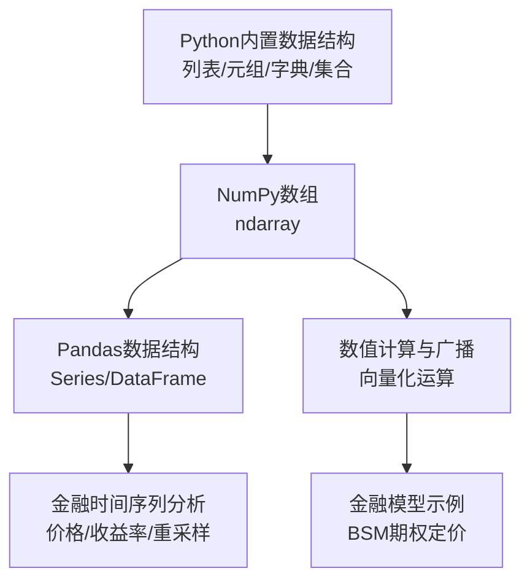
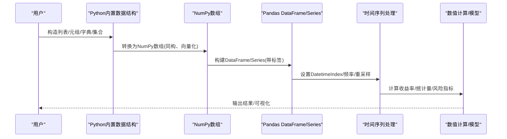
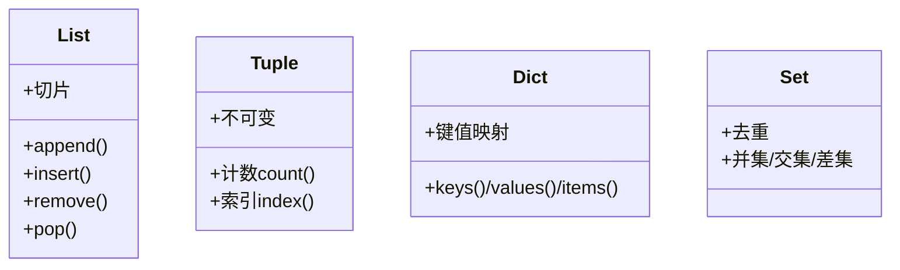
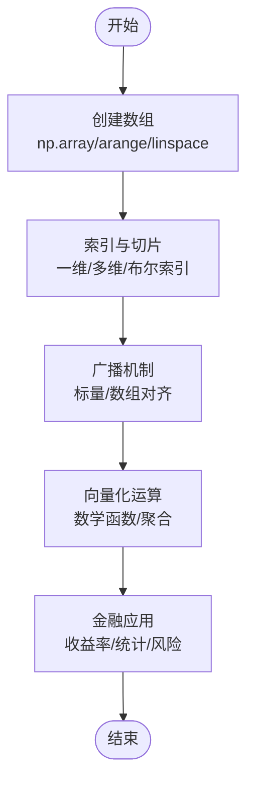
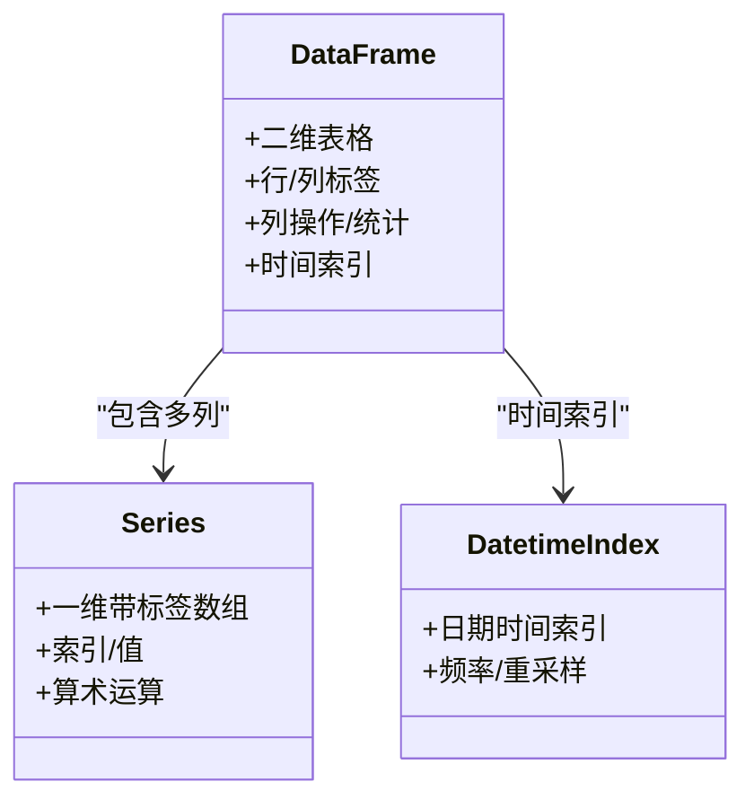
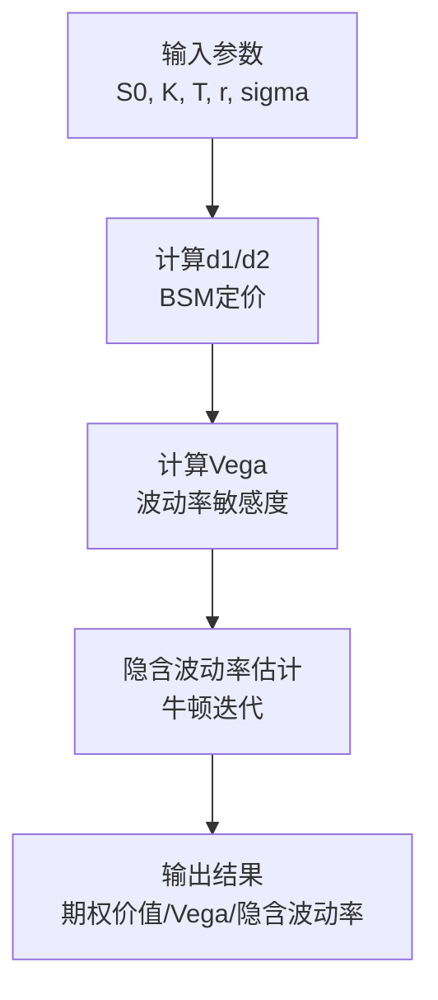
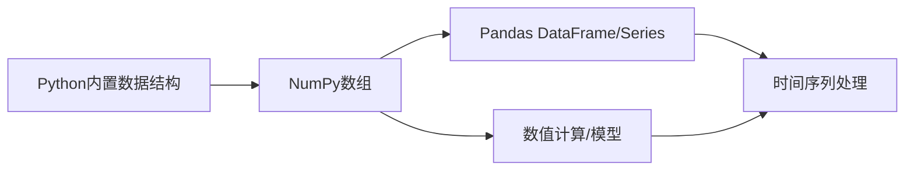

# 数据结构与算法

<cite>
**本文引用的文件**   
- [04_Data_Structures.ipynb](file://Code/04_Data_Structures.ipynb)
- [06_Financial_Time_Series.ipynb](file://Code/06_Financial_Time_Series.ipynb)
- [03_data_structures.ipynb](file://py4fi2nd-master/code/ch03/03_data_structures.ipynb)
- [04_numpy.ipynb](file://py4fi2nd-master/code/ch04/04_numpy.ipynb)
- [05_pandas.ipynb](file://py4fi2nd-master/code/ch05/05_pandas.ipynb)
- [bsm_functions.py](file://Code/bsm_functions.py)
- [03_NumPy.ipynb](file://章节课堂代码/03_NumPy.ipynb)
</cite>

## 目录
1. [引言](#引言)
2. [项目结构](#项目结构)
3. [核心组件](#核心组件)
4. [架构总览](#架构总览)
5. [详细组件分析](#详细组件分析)
6. [依赖关系分析](#依赖关系分析)
7. [性能考量](#性能考量)
8. [故障排查指南](#故障排查指南)
9. [结论](#结论)
10. [附录](#附录)

## 引言
本教程面向Python金融数据分析学习者，系统讲解从Python内置数据结构到NumPy数组、再到Pandas时间序列的完整知识体系。内容覆盖：
- Python内置数据结构（列表、元组、字典、集合）的特点、操作与适用场景
- NumPy数组的创建、索引、切片、广播机制与向量化运算
- 金融时间序列数据的存储与操作技巧
- Pandas Series与DataFrame基础概念与常用用法
- 内存管理、性能优化与最佳实践
- 结合期权定价等金融计算示例，展示常见数据处理模式

## 项目结构
仓库包含多套教学材料，其中与本主题直接相关的核心文件如下：
- Code/04_Data_Structures.ipynb：Python基础数据类型与基本数据结构示例
- py4fi2nd-master/code/ch03/03_data_structures.ipynb：数据结构进阶（布尔、字符串、控制流等）
- py4fi2nd-master/code/ch04/04_numpy.ipynb：NumPy数组基础、多维数组、属性与方法
- py4fi2nd-master/code/ch05/05_pandas.ipynb：Pandas DataFrame基础、列操作、统计与时间索引
- Code/06_Financial_Time_Series.ipynb：金融时间序列入门（绘图、DataFrame构建与操作）
- 章节课堂代码/03_NumPy.ipynb：面向金融的NumPy实战（收益率计算、索引切片、形状变换）
- Code/bsm_functions.py：Black-Scholes-Merton期权定价函数（数值计算示例）

图表来源
- [04_Data_Structures.ipynb:1-200](file://Code/04_Data_Structures.ipynb#L1-L200)
- [03_data_structures.ipynb:1-200](file://py4fi2nd-master/code/ch03/03_data_structures.ipynb#L1-L200)
- [04_numpy.ipynb:1-200](file://py4fi2nd-master/code/ch04/04_numpy.ipynb#L1-L200)
- [05_pandas.ipynb:1-200](file://py4fi2nd-master/code/ch05/05_pandas.ipynb#L1-L200)
- [06_Financial_Time_Series.ipynb:1-120](file://Code/06_Financial_Time_Series.ipynb#L1-L120)
- [03_NumPy.ipynb:1-200](file://章节课堂代码/03_NumPy.ipynb#L1-L200)
- [bsm_functions.py:1-108](file://Code/bsm_functions.py#L1-L108)

章节来源
- [04_Data_Structures.ipynb:1-200](file://Code/04_Data_Structures.ipynb#L1-L200)
- [03_data_structures.ipynb:1-200](file://py4fi2nd-master/code/ch03/03_data_structures.ipynb#L1-L200)
- [04_numpy.ipynb:1-200](file://py4fi2nd-master/code/ch04/04_numpy.ipynb#L1-L200)
- [05_pandas.ipynb:1-200](file://py4fi2nd-master/code/ch05/05_pandas.ipynb#L1-L200)
- [06_Financial_Time_Series.ipynb:1-120](file://Code/06_Financial_Time_Series.ipynb#L1-L120)
- [03_NumPy.ipynb:1-200](file://章节课堂代码/03_NumPy.ipynb#L1-L200)
- [bsm_functions.py:1-108](file://Code/bsm_functions.py#L1-L108)

## 核心组件
- Python内置数据结构
  - 列表：可变、有序、支持增删改查与切片；适合动态数据收集与通用处理
  - 元组：不可变、有序；适合固定记录、函数返回多个值、作为字典键
  - 字典：键值映射，哈希表实现；适合快速查找、配置项、特征映射
  - 集合：无序不重复元素；适合去重、成员测试、集合运算
- NumPy数组
  - 同构、连续内存、向量化运算；适合大规模数值计算
  - 关键能力：创建、索引/切片、广播、聚合统计、重塑与拼接
- Pandas数据结构
  - Series：带标签的一维数组；适合单列时间序列或指标
  - DataFrame：二维表格，行列均有标签；适合多变量时间序列与混合类型数据
- 金融时间序列
  - 基于DatetimeIndex的时间索引；支持频率转换、重采样、滚动窗口
- 数值计算与模型
  - 使用NumPy/scipy进行数学函数与统计计算
  - Black-Scholes-Merton期权定价函数示例

章节来源
- [04_Data_Structures.ipynb:800-1600](file://Code/04_Data_Structures.ipynb#L800-L1600)
- [03_data_structures.ipynb:800-1600](file://py4fi2nd-master/code/ch03/03_data_structures.ipynb#L800-L1600)
- [04_numpy.ipynb:800-1600](file://py4fi2nd-master/code/ch04/04_numpy.ipynb#L800-L1600)
- [05_pandas.ipynb:800-1600](file://py4fi2nd-master/code/ch05/05_pandas.ipynb#L800-L1600)
- [06_Financial_Time_Series.ipynb:1-200](file://Code/06_Financial_Time_Series.ipynb#L1-L200)
- [03_NumPy.ipynb:1-200](file://章节课堂代码/03_NumPy.ipynb#L1-L200)
- [bsm_functions.py:1-108](file://Code/bsm_functions.py#L1-L108)

## 架构总览
下图展示了从Python基础数据结构到NumPy/Pandas再到金融时间序列处理的整体流程与依赖关系。

图表来源
- [04_Data_Structures.ipynb:1-200](file://Code/04_Data_Structures.ipynb#L1-L200)
- [04_numpy.ipynb:1-200](file://py4fi2nd-master/code/ch04/04_numpy.ipynb#L1-L200)
- [05_pandas.ipynb:1-200](file://py4fi2nd-master/code/ch05/05_pandas.ipynb#L1-L200)
- [06_Financial_Time_Series.ipynb:1-200](file://Code/06_Financial_Time_Series.ipynb#L1-L200)
- [03_NumPy.ipynb:1-200](file://章节课堂代码/03_NumPy.ipynb#L1-L200)
- [bsm_functions.py:1-108](file://Code/bsm_functions.py#L1-L108)

## 详细组件分析

### Python内置数据结构
- 列表
  - 特点：可变、有序、可嵌套；支持append、insert、remove、pop、切片
  - 适用场景：动态数据收集、临时缓存、通用序列
  - 示例参考路径：[列表操作:1038-1340](file://Code/04_Data_Structures.ipynb#L1038-L1340)
- 元组
  - 特点：不可变、有序；适合固定记录、函数多返回值、字典键
  - 示例参考路径：[元组操作:855-1035](file://Code/04_Data_Structures.ipynb#L855-L1035)
- 字典
  - 特点：键值映射、哈希查找O(1)；适合配置、特征映射、分组统计
  - 示例参考路径：[字典与字符串处理:544-740](file://Code/04_Data_Structures.ipynb#L544-L740)
- 集合
  - 特点：无序不重复；适合去重、成员测试、集合运算
  - 示例参考路径：[集合与字符串方法:544-740](file://Code/04_Data_Structures.ipynb#L544-L740)

图表来源
- [04_Data_Structures.ipynb:800-1600](file://Code/04_Data_Structures.ipynb#L800-L1600)
- [03_data_structures.ipynb:800-1600](file://py4fi2nd-master/code/ch03/03_data_structures.ipynb#L800-L1600)

章节来源
- [04_Data_Structures.ipynb:800-1600](file://Code/04_Data_Structures.ipynb#L800-L1600)
- [03_data_structures.ipynb:800-1600](file://py4fi2nd-master/code/ch03/03_data_structures.ipynb#L800-L1600)

### NumPy数组
- 创建与属性
  - 从列表创建、arange/linspace、zeros/ones/eye、empty_like
  - 属性：shape、dtype、size、itemsize、nbytes、ndim
  - 示例参考路径：[数组创建与属性:540-760](file://py4fi2nd-master/code/ch04/04_numpy.ipynb#L540-L760)
- 索引与切片
  - 一维/多维索引、步长切片、布尔索引
  - 视图与副本：切片是视图，修改影响原数组
  - 示例参考路径：[多维数组与索引:1035-1200](file://py4fi2nd-master/code/ch04/04_numpy.ipynb#L1035-L1200)
- 广播机制
  - 标量与数组、数组间自动对齐维度进行逐元素运算
  - 示例参考路径：[广播与向量化:800-960](file://py4fi2nd-master/code/ch04/04_numpy.ipynb#L800-L960)
- 向量化操作
  - np.exp/sqrt/log等数学函数、cumsum/sum/std等聚合
  - 示例参考路径：[数学函数与聚合:900-1000](file://py4fi2nd-master/code/ch04/04_numpy.ipynb#L900-L1000)
- 金融应用
  - 收益率计算：prices[1:] / prices[:-1] - 1
  - 示例参考路径：[金融收益率计算:50-70](file://章节课堂代码/03_NumPy.ipynb#L50-L70)

图表来源
- [04_numpy.ipynb:540-1200](file://py4fi2nd-master/code/ch04/04_numpy.ipynb#L540-L1200)
- [03_NumPy.ipynb:50-70](file://章节课堂代码/03_NumPy.ipynb#L50-L70)

章节来源
- [04_numpy.ipynb:540-1200](file://py4fi2nd-master/code/ch04/04_numpy.ipynb#L540-L1200)
- [03_NumPy.ipynb:50-70](file://章节课堂代码/03_NumPy.ipynb#L50-L70)

### Pandas Series与DataFrame
- DataFrame基础
  - 创建：从列表/字典/NumPy数组构建
  - 列操作：新增列、选择列、赋值
  - 统计：sum/mean/std等按列聚合
  - 示例参考路径：[DataFrame基础:40-120](file://py4fi2nd-master/code/ch05/05_pandas.ipynb#L40-L120)
- 索引与选择
  - loc/iloc：基于标签与位置的选择
  - 条件筛选与布尔索引
  - 示例参考路径：[索引与选择:180-260](file://py4fi2nd-master/code/ch05/05_pandas.ipynb#L180-L260)
- 时间序列
  - DatetimeIndex与频率：date_range、freq='ME'
  - 重采样与滚动窗口
  - 示例参考路径：[时间索引:1430-1470](file://py4fi2nd-master/code/ch05/05_pandas.ipynb#L1430-L1470)
- 金融时间序列
  - 绘图与样式设置
  - 示例参考路径：[金融时间序列入门:60-120](file://Code/06_Financial_Time_Series.ipynb#L60-L120)

图表来源
- [05_pandas.ipynb:40-200](file://py4fi2nd-master/code/ch05/05_pandas.ipynb#L40-L200)
- [06_Financial_Time_Series.ipynb:60-120](file://Code/06_Financial_Time_Series.ipynb#L60-L120)

章节来源
- [05_pandas.ipynb:40-200](file://py4fi2nd-master/code/ch05/05_pandas.ipynb#L40-L200)
- [06_Financial_Time_Series.ipynb:60-120](file://Code/06_Financial_Time_Series.ipynb#L60-L120)

### 金融时间序列数据处理
- 价格与收益率
  - 使用NumPy向量计算收益率：prices[1:] / prices[:-1] - 1
  - 示例参考路径：[收益率计算:50-70](file://章节课堂代码/03_NumPy.ipynb#L50-L70)
- 时间索引与重采样
  - 使用pd.date_range生成时间索引，设置频率为月频
  - 示例参考路径：[时间索引:1430-1470](file://py4fi2nd-master/code/ch05/05_pandas.ipynb#L1430-L1470)
- 可视化与统计
  - matplotlib样式设置，DataFrame统计摘要
  - 示例参考路径：[可视化与统计:60-120](file://Code/06_Financial_Time_Series.ipynb#L60-L120)

章节来源
- [03_NumPy.ipynb:50-70](file://章节课堂代码/03_NumPy.ipynb#L50-L70)
- [05_pandas.ipynb:1430-1470](file://py4fi2nd-master/code/ch05/05_pandas.ipynb#L1430-L1470)
- [06_Financial_Time_Series.ipynb:60-120](file://Code/06_Financial_Time_Series.ipynb#L60-L120)

### 数值计算与模型示例（BSM）
- Black-Scholes-Merton期权定价
  - bsm_call_value：欧式看涨期权定价公式
  - bsm_vega：Vega（波动率敏感度）
  - bsm_call_imp_vol：隐含波动率估计（牛顿迭代）
  - 示例参考路径：[BSM函数:10-108](file://Code/bsm_functions.py#L10-L108)

图表来源
- [bsm_functions.py:10-108](file://Code/bsm_functions.py#L10-L108)

章节来源
- [bsm_functions.py:10-108](file://Code/bsm_functions.py#L10-L108)

## 依赖关系分析
- Python内置数据结构是基础，常用于数据预处理与临时存储
- NumPy数组提供高性能数值计算，是Pandas底层支撑
- Pandas在NumPy之上提供带标签的数据结构与时间序列功能
- 金融时间序列处理依赖Pandas的DatetimeIndex与重采样能力
- 数值计算与模型（如BSM）依赖NumPy/scipy的数学函数

图表来源
- [04_Data_Structures.ipynb:1-200](file://Code/04_Data_Structures.ipynb#L1-L200)
- [04_numpy.ipynb:1-200](file://py4fi2nd-master/code/ch04/04_numpy.ipynb#L1-L200)
- [05_pandas.ipynb:1-200](file://py4fi2nd-master/code/ch05/05_pandas.ipynb#L1-L200)
- [06_Financial_Time_Series.ipynb:1-120](file://Code/06_Financial_Time_Series.ipynb#L1-L120)
- [bsm_functions.py:1-108](file://Code/bsm_functions.py#L1-L108)

章节来源
- [04_Data_Structures.ipynb:1-200](file://Code/04_Data_Structures.ipynb#L1-L200)
- [04_numpy.ipynb:1-200](file://py4fi2nd-master/code/ch04/04_numpy.ipynb#L1-L200)
- [05_pandas.ipynb:1-200](file://py4fi2nd-master/code/ch05/05_pandas.ipynb#L1-L200)
- [06_Financial_Time_Series.ipynb:1-120](file://Code/06_Financial_Time_Series.ipynb#L1-L120)
- [bsm_functions.py:1-108](file://Code/bsm_functions.py#L1-L108)

## 性能考量
- 优先使用NumPy向量化运算而非Python循环
  - 示例：收益率计算使用数组切片与向量化除法
  - 参考路径：[收益率计算:50-70](file://章节课堂代码/03_NumPy.ipynb#L50-L70)
- 避免不必要的副本，利用视图减少内存占用
  - NumPy切片返回视图，修改会影响原数组
  - 参考路径：[视图与副本:1035-1200](file://py4fi2nd-master/code/ch04/04_numpy.ipynb#L1035-L1200)
- 选择合适的dtype以节省内存
  - 使用float32/int32等较低精度类型
  - 参考路径：[dtype设置:1210-1270](file://py4fi2nd-master/code/ch04/04_numpy.ipynb#L1210-L1270)
- 使用Pandas的内置方法而非apply循环
  - sum/mean/std等聚合函数已优化
  - 参考路径：[聚合统计:1040-1065](file://py4fi2nd-master/code/ch05/05_pandas.ipynb#L1040-L1065)

章节来源
- [03_NumPy.ipynb:50-70](file://章节课堂代码/03_NumPy.ipynb#L50-L70)
- [04_numpy.ipynb:1035-1270](file://py4fi2nd-master/code/ch04/04_numpy.ipynb#L1035-L1270)
- [05_pandas.ipynb:1040-1065](file://py4fi2nd-master/code/ch05/05_pandas.ipynb#L1040-L1065)

## 故障排查指南
- 元组不可变错误
  - 现象：尝试修改元组元素抛出TypeError
  - 解决：使用列表或重新创建元组
  - 参考路径：[元组不可变错误:905-920](file://Code/04_Data_Structures.ipynb#L905-L920)
- 浮点数精度问题
  - 现象：浮点运算存在舍入误差
  - 解决：使用decimal模块提高精度
  - 参考路径：[高精度计算:400-520](file://Code/04_Data_Structures.ipynb#L400-L520)
- 字符串处理警告
  - 现象：正则表达式转义字符警告
  - 解决：使用原始字符串r""或正确转义
  - 参考路径：[字符串处理:740-760](file://Code/04_Data_Structures.ipynb#L740-L760)
- Pands时间频率弃用警告
  - 现象：'M'频率被弃用，建议使用'ME'
  - 解决：更新频率参数
  - 参考路径：[时间频率警告:1428-1430](file://py4fi2nd-master/code/ch05/05_pandas.ipynb#L1428-L1430)

章节来源
- [04_Data_Structures.ipynb:905-920](file://Code/04_Data_Structures.ipynb#L905-L920)
- [04_Data_Structures.ipynb:400-520](file://Code/04_Data_Structures.ipynb#L400-L520)
- [04_Data_Structures.ipynb:740-760](file://Code/04_Data_Structures.ipynb#L740-L760)
- [05_pandas.ipynb:1428-1430](file://py4fi2nd-master/code/ch05/05_pandas.ipynb#L1428-L1430)

## 结论
通过本教程，学习者应掌握：
- Python内置数据结构的特点与适用场景
- NumPy数组的高效数值计算与广播机制
- Pandas时间序列数据的存储与操作技巧
- 金融数据处理的最佳实践与性能优化
- 结合具体金融模型（如BSM）的实际应用

这些技能将为深入学习金融数据分析、量化交易与风险管理奠定坚实基础。

## 附录
- 推荐学习路径
  - 先掌握Python内置数据结构
  - 深入学习NumPy数组与向量化运算
  - 掌握Pandas时间序列处理
  - 结合实际金融数据进行练习
- 相关资源
  - 课程代码与示例可在仓库中找到
  - 建议配合Jupyter Notebook交互式学习