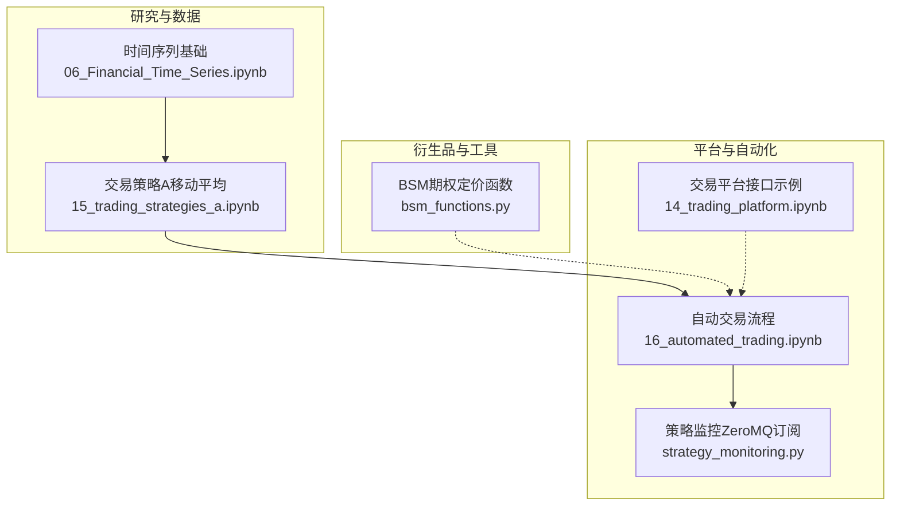
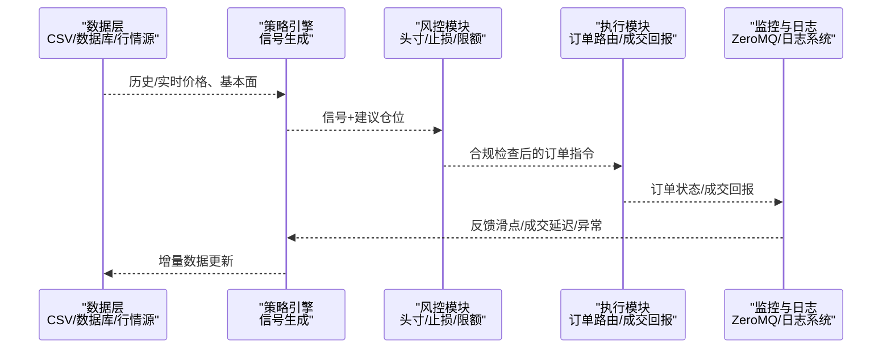
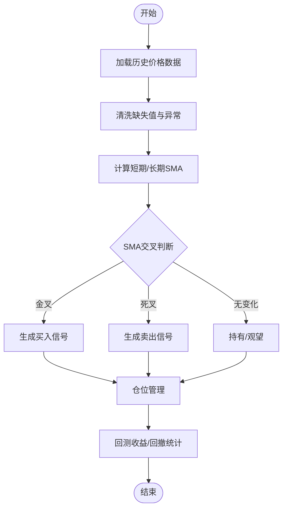
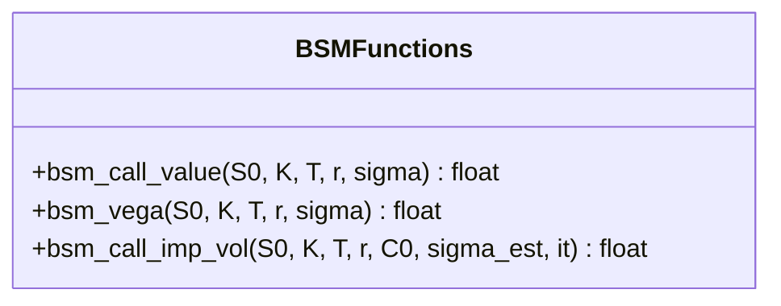
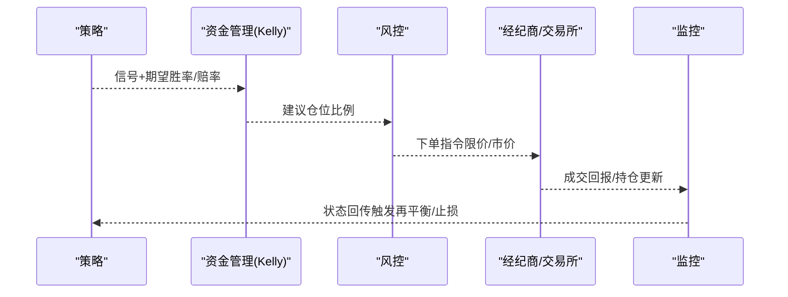
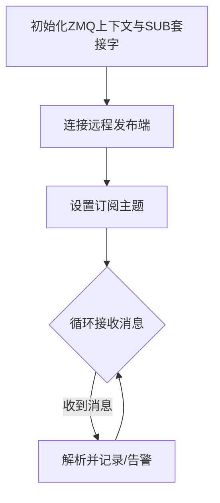
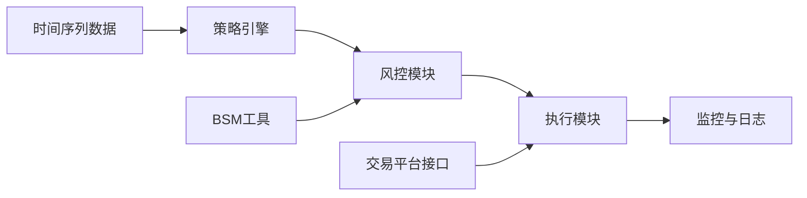

# 交易策略与量化投资

<cite>
**本文引用的文件**   
- [15_trading_strategies_a.ipynb](file://Code/15_trading_strategies_a.ipynb)
- [bsm_functions.py](file://Code/bsm_functions.py)
- [16_automated_trading.ipynb](file://py4fi2nd-master/code/ch16/16_automated_trading.ipynb)
- [strategy_monitoring.py](file://py4fi2nd-master/code/ch16/strategy_monitoring.py)
- [14_trading_platform.ipynb](file://py4fi2nd-master/code/ch14/14_trading_platform.ipynb)
- [06_Financial_Time_Series.ipynb](file://Code/06_Financial_Time_Series.ipynb)
</cite>

## 目录
1. [引言](#引言)
2. [项目结构](#项目结构)
3. [核心组件](#核心组件)
4. [架构总览](#架构总览)
5. [详细组件分析](#详细组件分析)
6. [依赖关系分析](#依赖关系分析)
7. [性能考量](#性能考量)
8. [故障排查指南](#故障排查指南)
9. [结论](#结论)
10. [附录](#附录)

## 引言
本指南面向希望系统化开展量化交易策略开发与实盘落地的工程师与研究者。内容覆盖：
- 策略设计原则与常见类型（趋势跟踪、均值回归、动量等）
- 回测框架使用与绩效评估方法
- 历史数据预处理、信号生成、仓位管理的关键步骤
- 实盘监控与风险管理的技术方案
- 交易成本、滑点与市场冲击的实操处理
- 自动化交易系统构建（订单执行、风险控制、日志记录）

本仓库提供了基于Python的金融时间序列分析与策略实现示例，包括移动平均策略、期权定价工具函数、自动交易与策略监控的代码片段，可作为从研究到生产的参考基线。

## 项目结构
仓库包含多个Jupyter Notebook与少量Python脚本，围绕“数据—策略—回测—监控”的主线组织：
- Code 目录：策略与基础工具示例（移动平均策略、BSM期权定价、时间序列基础）
- py4fi2nd-master/code：更完整的教程代码，涵盖交易平台接口、自动交易、策略监控等

图表来源
- [06_Financial_Time_Series.ipynb](file://Code/06_Financial_Time_Series.ipynb)
- [15_trading_strategies_a.ipynb](file://Code/15_trading_strategies_a.ipynb)
- [bsm_functions.py](file://Code/bsm_functions.py)
- [14_trading_platform.ipynb](file://py4fi2nd-master/code/ch14/14_trading_platform.ipynb)
- [16_automated_trading.ipynb](file://py4fi2nd-master/code/ch16/16_automated_trading.ipynb)
- [strategy_monitoring.py](file://py4fi2nd-master/code/ch16/strategy_monitoring.py)

章节来源
- [15_trading_strategies_a.ipynb](file://Code/15_trading_strategies_a.ipynb)
- [06_Financial_Time_Series.ipynb](file://Code/06_Financial_Time_Series.ipynb)

## 核心组件
- 移动平均趋势策略：通过短周期与长周期SMA交叉产生买卖信号，适合趋势行情；在Notebook中演示了数据导入、清洗与指标计算。
- BSM期权定价工具：提供欧式看涨期权定价、Vega与隐含波动率估计，可用于对冲与风险度量。
- 自动交易与监控：展示资金管理与Kelly准则思路，以及通过ZeroMQ进行策略状态监控的通信模式。
- 交易平台接口示例：演示如何获取Tick数据与标的列表（注意：部分API已停止服务，仅具参考价值）。

章节来源
- [15_trading_strategies_a.ipynb](file://Code/15_trading_strategies_a.ipynb)
- [bsm_functions.py](file://Code/bsm_functions.py)
- [16_automated_trading.ipynb](file://py4fi2nd-master/code/ch16/16_automated_trading.ipynb)
- [strategy_monitoring.py](file://py4fi2nd-master/code/ch16/strategy_monitoring.py)
- [14_trading_platform.ipynb](file://py4fi2nd-master/code/ch14/14_trading_platform.ipynb)

## 架构总览
下图展示了从数据到信号、再到执行与监控的整体流程，强调回测与实盘的衔接点（信号、风控、订单、日志、监控）。

图表来源
- [15_trading_strategies_a.ipynb](file://Code/15_trading_strategies_a.ipynb)
- [16_automated_trading.ipynb](file://py4fi2nd-master/code/ch16/16_automated_trading.ipynb)
- [strategy_monitoring.py](file://py4fi2nd-master/code/ch16/strategy_monitoring.py)

## 详细组件分析

### 移动平均趋势策略（SMA交叉）
- 数据准备：读取日频收盘价，清理缺失值，选择目标标的。
- 指标计算：计算短期与长期SMA，构造交叉信号（金叉买入、死叉卖出）。
- 可视化：绘制价格与两条SMA曲线，辅助观察信号有效性。
- 扩展方向：加入成交量过滤、波动率调整仓位、多标的组合与权重分配。

图表来源
- [15_trading_strategies_a.ipynb](file://Code/15_trading_strategies_a.ipynb)

章节来源
- [15_trading_strategies_a.ipynb](file://Code/15_trading_strategies_a.ipynb)

### BSM期权定价与希腊字母
- 功能要点：欧式看涨期权定价公式、Vega计算、隐含波动率数值求解。
- 应用场景：期权对冲、Delta/Vega中性化、波动率交易策略的风险度量。
- 注意事项：参数输入单位一致性（到期年数、波动率年化）、数值迭代收敛性。

图表来源
- [bsm_functions.py](file://Code/bsm_functions.py)

章节来源
- [bsm_functions.py](file://Code/bsm_functions.py)

### 自动交易与资金管理（Kelly准则示例）
- 资金管理：以二项分布模拟不同下注比例下的资金路径，体现Kelly准则对增长率的优化作用。
- 回测到实盘：将策略信号转化为订单指令，结合风控规则（止损、最大回撤、单笔限额）控制风险。
- 监控与告警：通过消息总线（如ZeroMQ）上报关键事件，便于集中监控与快速响应。

图表来源
- [16_automated_trading.ipynb](file://py4fi2nd-master/code/ch16/16_automated_trading.ipynb)

章节来源
- [16_automated_trading.ipynb](file://py4fi2nd-master/code/ch16/16_automated_trading.ipynb)

### 策略监控（ZeroMQ订阅）
- 通信方式：采用ZeroMQ SUB套接字订阅发布者消息，实现低延迟的状态同步。
- 部署要点：远程IP配置、订阅主题设置、循环接收与打印/入库。
- 扩展能力：接入日志系统、告警通道（邮件/短信/IM）、可视化看板。

图表来源
- [strategy_monitoring.py](file://py4fi2nd-master/code/ch16/strategy_monitoring.py)

章节来源
- [strategy_monitoring.py](file://py4fi2nd-master/code/ch16/strategy_monitoring.py)

### 交易平台接口（Tick数据示例）
- 功能说明：获取可用标的列表、拉取指定区间的Tick数据、转换为DataFrame。
- 注意事项：部分API已停止服务，代码仅作学习参考；生产环境需替换为稳定接口或本地数据源。

章节来源
- [14_trading_platform.ipynb](file://py4fi2nd-master/code/ch14/14_trading_platform.ipynb)

### 金融时间序列基础
- 内容要点：pandas基础操作、DataFrame索引与切片、时间序列数据处理入门。
- 用途：作为策略开发的数据预处理与特征工程基础。

章节来源
- [06_Financial_Time_Series.ipynb](file://Code/06_Financial_Time_Series.ipynb)

## 依赖关系分析
- 策略与数据：移动平均策略依赖时间序列数据与pandas滚动窗口计算。
- 工具与策略：BSM函数可被期权相关策略或对冲模块调用。
- 自动化与监控：自动交易模块与监控模块通过消息总线解耦，提升可扩展性与容错性。
- 平台接口：交易平台示例与自动交易模块存在潜在集成点（订单执行、成交回报）。

图表来源
- [15_trading_strategies_a.ipynb](file://Code/15_trading_strategies_a.ipynb)
- [bsm_functions.py](file://Code/bsm_functions.py)
- [16_automated_trading.ipynb](file://py4fi2nd-master/code/ch16/16_automated_trading.ipynb)
- [strategy_monitoring.py](file://py4fi2nd-master/code/ch16/strategy_monitoring.py)
- [14_trading_platform.ipynb](file://py4fi2nd-master/code/ch14/14_trading_platform.ipynb)

章节来源
- [15_trading_strategies_a.ipynb](file://Code/15_trading_strategies_a.ipynb)
- [bsm_functions.py](file://Code/bsm_functions.py)
- [16_automated_trading.ipynb](file://py4fi2nd-master/code/ch16/16_automated_trading.ipynb)
- [strategy_monitoring.py](file://py4fi2nd-master/code/ch16/strategy_monitoring.py)
- [14_trading_platform.ipynb](file://py4fi2nd-master/code/ch14/14_trading_platform.ipynb)

## 性能考量
- 数据层面：优先使用向量化计算（pandas rolling、numpy），避免逐行循环；合理分块读取大文件。
- 策略层面：减少不必要的重算（缓存指标、增量更新）；信号去噪（滤波、阈值过滤）。
- 执行层面：批量下单、重试机制、超时与熔断；滑点与流动性预估。
- 监控层面：异步日志、采样上报、关键指标阈值告警。

[本节为通用指导，不直接分析具体文件]

## 故障排查指南
- 数据问题：缺失值、重复时间戳、时区不一致；建议使用统一时间索引与校验。
- 策略失效：过拟合、样本外表现差；应做交叉验证、滚动窗口回测、参数稳健性检验。
- 执行异常：网络抖动、API限流、订单拒单；需增加重试、降级与人工接管。
- 监控断连：消息总线不可达、订阅失败；需心跳检测、自动重连与本地缓冲。

章节来源
- [14_trading_platform.ipynb](file://py4fi2nd-master/code/ch14/14_trading_platform.ipynb)
- [strategy_monitoring.py](file://py4fi2nd-master/code/ch16/strategy_monitoring.py)

## 结论
本仓库提供了从数据到策略、从回测到监控的完整实践素材。建议在此基础上：
- 完善回测框架（事件驱动、撮合引擎、成本模型）
- 强化风控体系（头寸限制、止损止盈、VaR/ES）
- 建立生产级监控与日志（审计、追踪、告警）
- 持续迭代策略（因子挖掘、机器学习增强、组合优化）

[本节为总结，不直接分析具体文件]

## 附录

### 常见策略类型与实现要点
- 趋势跟踪：双均线、通道突破、MACD；关注趋势强度与震荡期回撤控制。
- 均值回归：配对交易、协整、布林带；关注价差稳定性与回归速度。
- 动量策略：截面动量、行业轮动；关注换手率与交易成本。
- 波动率策略：波动率曲面、方差互换；关注模型假设与参数敏感性。

[本节为概念性内容，不直接分析具体文件]

### 回测与绩效评估
- 指标：年化收益、夏普比率、最大回撤、Calmar比率、胜率、盈亏比。
- 方法：滚动窗口回测、Walk-Forward、蒙特卡洛扰动、压力测试。
- 偏差防范：幸存者偏差、前视偏差、过度拟合、交易成本忽略。

[本节为概念性内容，不直接分析具体文件]

### 交易成本、滑点与市场冲击
- 成本构成：佣金、印花税、过户费、融资利息。
- 滑点建模：按流动性分层、按订单规模非线性放大。
- 市场冲击：TWAP/VWAP拆单、冰山委托、暗池探索。

[本节为概念性内容，不直接分析具体文件]

### 自动化交易系统构建清单
- 订单执行：路由、拆单、重试、确认与对账。
- 风险控制：事前限额、事中拦截、事后审计。
- 日志记录：结构化日志、链路追踪、审计归档。
- 监控告警：健康检查、阈值告警、应急切换。

[本节为概念性内容，不直接分析具体文件]