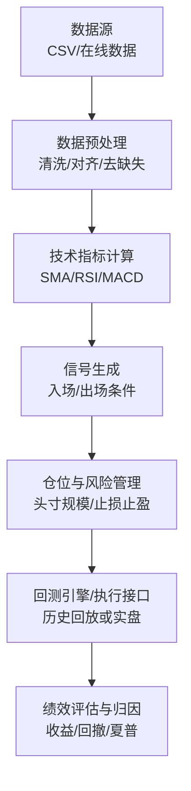
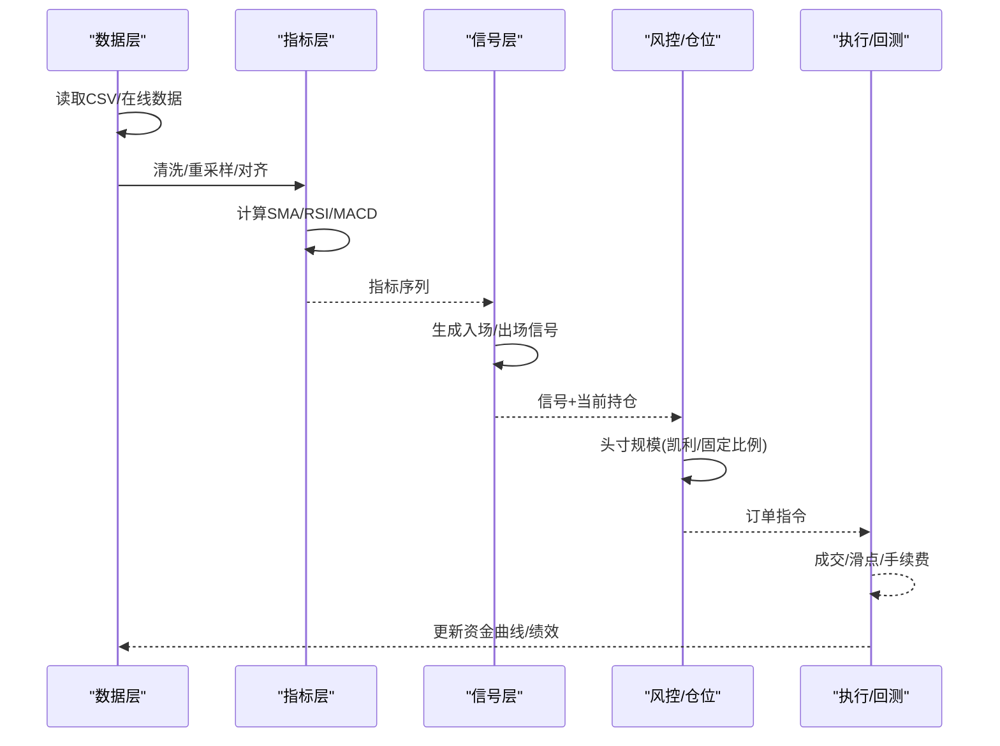
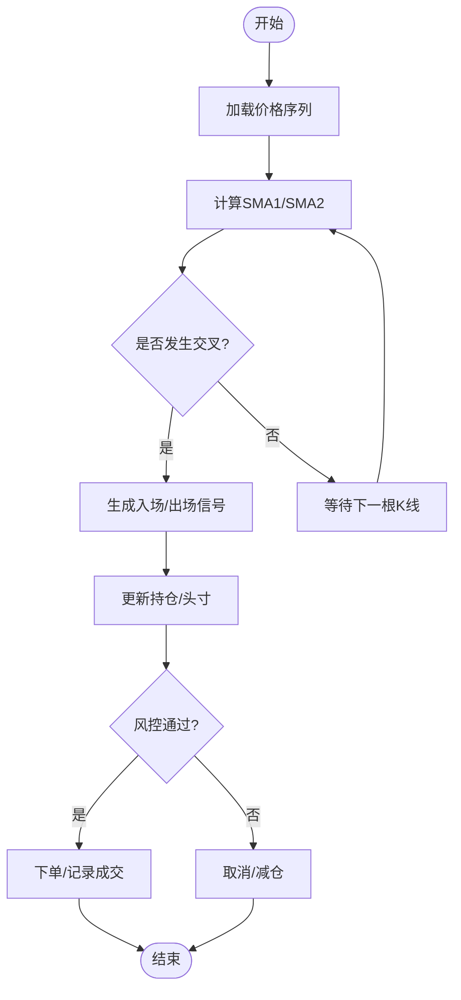
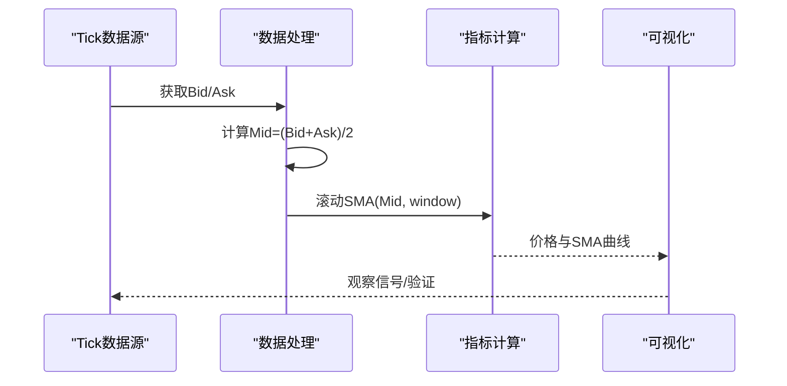
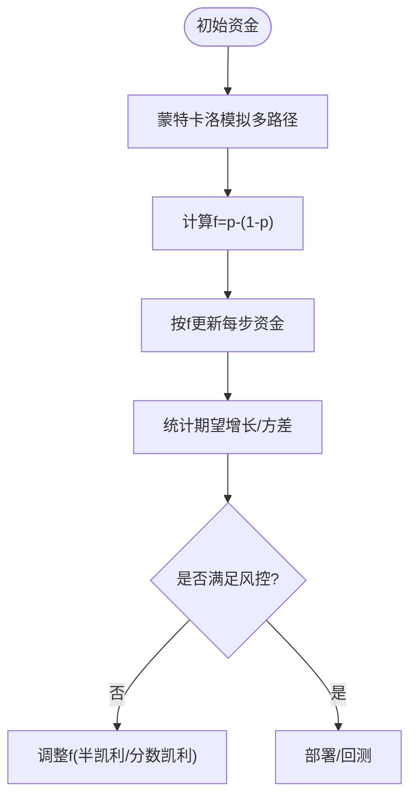
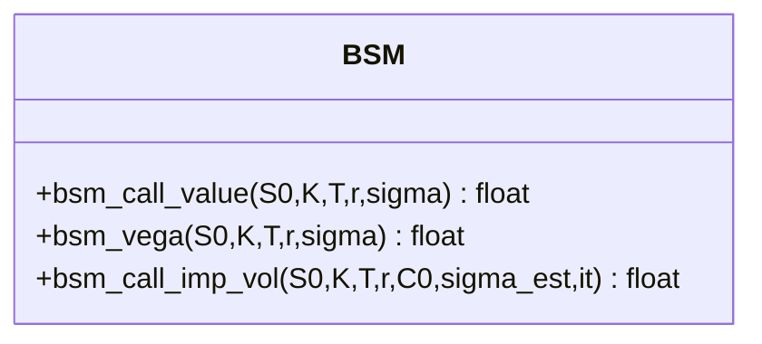

# 交易策略设计原理

<cite>
**本文引用的文件**   
- [15_trading_strategies_a.ipynb](file://Code/15_trading_strategies_a.ipynb)
- [16_automated_trading.ipynb](file://py4fi2nd-master/code/ch16/16_automated_trading.ipynb)
- [14_trading_platform.ipynb](file://py4fi2nd-master/code/ch14/14_trading_platform.ipynb)
- [bsm_functions.py](file://Code/bsm_functions.py)
</cite>

## 目录
1. [引言](#引言)
2. [项目结构](#项目结构)
3. [核心组件](#核心组件)
4. [架构总览](#架构总览)
5. [详细组件分析](#详细组件分析)
6. [依赖关系分析](#依赖关系分析)
7. [性能考虑](#性能考虑)
8. [故障排查指南](#故障排查指南)
9. [结论](#结论)
10. [附录](#附录)

## 引言
本指南面向量化交易初学者与进阶者，系统讲解交易策略的设计范式与工程实现。内容覆盖：
- 经典策略类型：趋势跟踪、均值回归、动量策略等
- 信号生成机制：入场/出场规则、仓位管理（含凯利准则）
- 技术指标构建：移动平均线（SMA）、RSI、MACD等
- 完整Python流程：数据预处理、指标计算、信号生成与回测执行
- 参数优化与过拟合控制：样本外检验、滚动窗口、稳健性测试
- 实战案例：不同市场环境下的表现差异与应对

## 项目结构
仓库包含多个Jupyter Notebook与工具脚本，围绕“数据—指标—信号—交易—风控”的闭环展开：
- 策略示例与回测：15_trading_strategies_a.ipynb（双均线趋势跟踪）
- 自动交易与资金管理：16_automated_trading.ipynb（凯利准则模拟）
- 平台与高频数据接入：14_trading_platform.ipynb（Tick数据获取与SMA示例）
- 期权定价工具：bsm_functions.py（BSM公式、Vega、隐含波动率）

[本图为概念图，不直接映射具体代码文件]

## 核心组件
- 数据层：读取并清洗日频/分钟频/Tick级价格序列，统一时间索引与频率
- 指标层：基于pandas rolling/expanding计算SMA、EMA、RSI、MACD等
- 信号层：将指标转化为可执行的买卖信号（如金叉/死叉、超买超卖阈值）
- 交易层：根据信号生成订单，结合仓位管理与风险约束执行
- 风控层：止损、止盈、最大回撤控制、资金曲线监控
- 评估层：年化收益、最大回撤、夏普比率、胜率、盈亏比等

章节来源
- [15_trading_strategies_a.ipynb](file://Code/15_trading_strategies_a.ipynb)
- [16_automated_trading.ipynb](file://py4fi2nd-master/code/ch16/16_automated_trading.ipynb)
- [14_trading_platform.ipynb](file://py4fi2nd-master/code/ch14/14_trading_platform.ipynb)

## 架构总览
下图展示从数据到信号的端到端流水线，以及资金管理模块如何影响头寸规模与风险暴露。

图表来源
- [15_trading_strategies_a.ipynb](file://Code/15_trading_strategies_a.ipynb)
- [16_automated_trading.ipynb](file://py4fi2nd-master/code/ch16/16_automated_trading.ipynb)
- [14_trading_platform.ipynb](file://py4fi2nd-master/code/ch14/14_trading_platform.ipynb)

## 详细组件分析

### 组件A：双均线趋势跟踪（入门策略）
- 思路：短周期SMA上穿长周期SMA做多，下穿做空；也可仅做多
- 指标：SMA1=短期窗口，SMA2=长期窗口
- 信号：crossover触发入场，反向触发出场
- 仓位：固定比例或按ATR波动调整
- 适用：趋势行情；震荡市易反复止损

图表来源
- [15_trading_strategies_a.ipynb](file://Code/15_trading_strategies_a.ipynb)

章节来源
- [15_trading_strategies_a.ipynb](file://Code/15_trading_strategies_a.ipynb)

### 组件B：Tick级SMA与可视化（高频场景）
- 数据：Bid/Ask Tick流，构造Mid价序列
- 指标：滚动SMA（窗口可调）
- 信号：价格相对SMA偏离度、突破等
- 注意：滑点、手续费、延迟对高频策略影响显著

图表来源
- [14_trading_platform.ipynb](file://py4fi2nd-master/code/ch14/14_trading_platform.ipynb)

章节来源
- [14_trading_platform.ipynb](file://py4fi2nd-master/code/ch14/14_trading_platform.ipynb)

### 组件C：资金管理——凯利准则（二元结果模拟）
- 目标：在已知胜率p与赔率条件下，确定最优投注比例f
- 简化公式：f = p - (1-p)（对称二元博弈）
- 应用：将f映射为头寸比例，结合止损/止盈与账户权益动态调整

图表来源
- [16_automated_trading.ipynb](file://py4fi2nd-master/code/ch16/16_automated_trading.ipynb)

章节来源
- [16_automated_trading.ipynb](file://py4fi2nd-master/code/ch16/16_automated_trading.ipynb)

### 组件D：期权定价工具（辅助风控与对冲）
- 功能：欧式看涨期权定价（BSM）、Vega、隐含波动率数值求解
- 用途：衍生品组合估值、希腊字母敏感性分析、对冲比例估算

图表来源
- [bsm_functions.py](file://Code/bsm_functions.py)

章节来源
- [bsm_functions.py](file://Code/bsm_functions.py)

## 依赖关系分析
- 数据依赖：CSV/在线数据源（日频/分钟频/Tick）
- 库依赖：pandas（时间序列与滚动窗口）、numpy（向量化计算）、matplotlib（可视化）
- 策略依赖：指标库（自定义或第三方），信号规则函数
- 执行依赖：回测引擎或交易平台API（示例中FXCM API已停止支持）

[本图为概念图，不直接映射具体代码文件]

章节来源
- [15_trading_strategies_a.ipynb](file://Code/15_trading_strategies_a.ipynb)
- [14_trading_platform.ipynb](file://py4fi2nd-master/code/ch14/14_trading_platform.ipynb)

## 性能考虑
- 向量化优先：尽量使用pandas rolling/numpy向量化，避免逐行循环
- 内存管理：大文件分块读取、降采样、只保留必要列
- 指标优化：合理选择窗口长度，避免过长导致滞后；必要时用指数加权
- 回测效率：事件驱动 vs 向量化回测；批量计算优于逐条迭代
- 高频注意：Tick级处理需关注延迟、滑点、撮合模型

[本节为通用指导，无需特定文件引用]

## 故障排查指南
- 数据问题：缺失值、非交易日、复权不一致、时区混乱
  - 检查：info()/head()、空值比例、时间戳排序
- 指标异常：NaN前导段、窗口过小、除零错误
  - 检查：rolling最小窗口、fillna方法、边界处理
- 信号逻辑：未来函数（look-ahead bias）、重复信号、未平仓
  - 检查：shift对齐、去重、状态机
- 执行失败：API不可用、权限不足、网络超时
  - 检查：接口可用性、重试机制、日志记录
- 绩效异常：收益为正但回撤过大、夏普过低
  - 检查：手续费/滑点设置、杠杆使用、样本外表现

章节来源
- [14_trading_platform.ipynb](file://py4fi2nd-master/code/ch14/14_trading_platform.ipynb)
- [15_trading_strategies_a.ipynb](file://Code/15_trading_strategies_a.ipynb)

## 结论
- 趋势跟踪适合单边行情，需配合过滤与风控降低震荡损耗
- 均值回归与动量策略在不同市场阶段互补，可组合使用
- 指标只是工具，关键在于信号质量与仓位管理
- 参数优化必须严格样本外检验，避免过拟合
- 高频策略需重视基础设施与成本建模

[本节为总结，无需特定文件引用]

## 附录

### 常用技术指标与信号要点
- SMA/EMA：趋势平滑，短长窗交叉产生信号
- RSI：超买超卖阈值（常见70/30），背离增强信号
- MACD：快慢线差与信号线交叉，零轴上下判断多空
- 波动率：ATR用于止损距离与头寸缩放

### 参数优化与过拟合控制
- 划分训练/验证/测试集，或使用滚动窗口（walk-forward）
- 网格搜索/贝叶斯优化，限制参数空间
- 稳健性检验：参数扰动、样本外一致性、跨品种/跨市场
- 惩罚复杂度：正则化、简化规则、减少自由度

### 实战案例建议
- 牛市趋势：双均线/趋势通道，放宽止损，持有为主
- 震荡市：均值回归（布林带/RSI），高抛低吸，严格止损
- 高波动期：降低仓位、扩大止损、增加对冲（期权/VIX）

[本节为通用指导，无需特定文件引用]