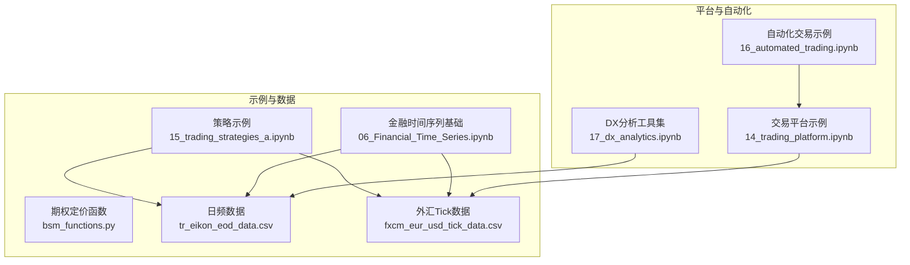
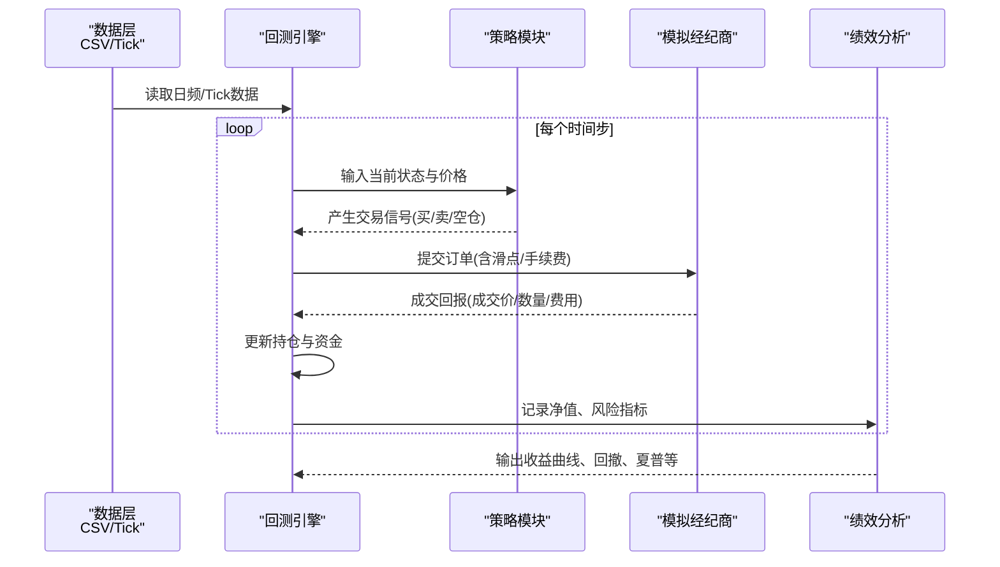
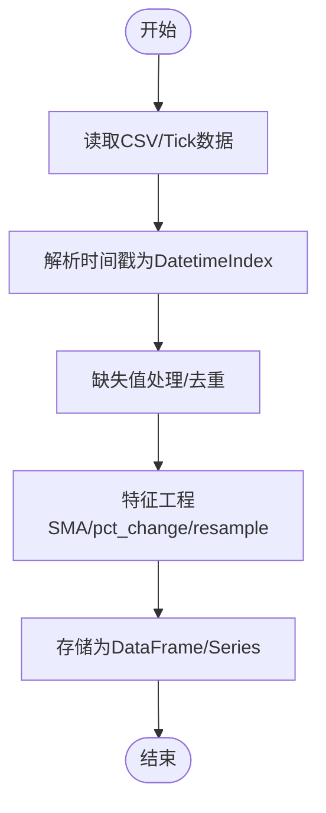
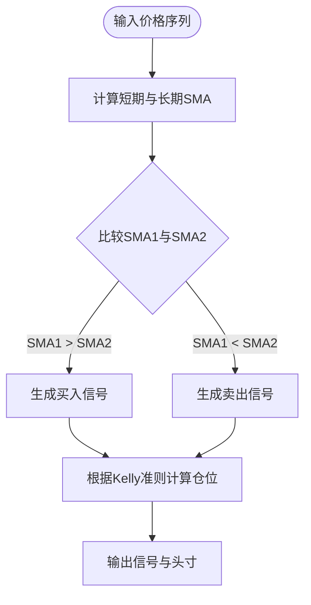
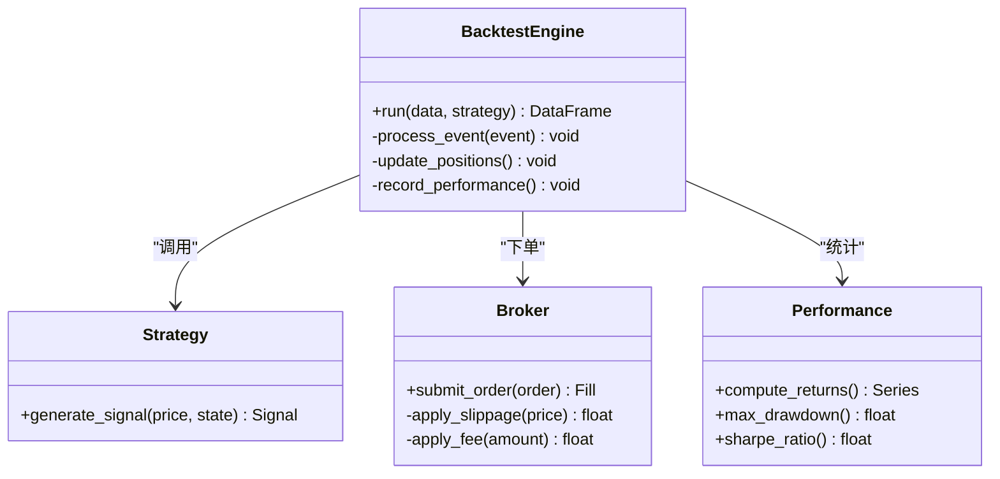
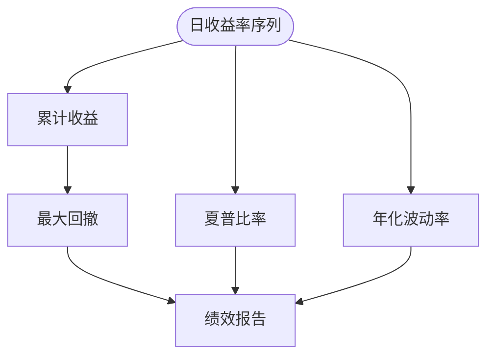
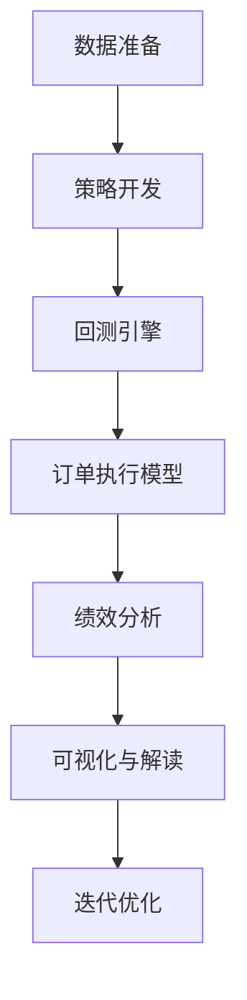
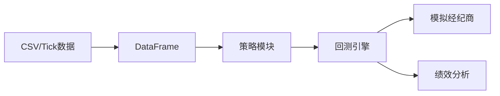

# 回测框架与验证

<cite>
**本文引用的文件**   
- [15_trading_strategies_a.ipynb](file://Code/15_trading_strategies_a.ipynb)
- [06_Financial_Time_Series.ipynb](file://Code/06_Financial_Time_Series.ipynb)
- [bsm_functions.py](file://Code/bsm_functions.py)
- [tr_eikon_eod_data.csv](file://Code/tr_eikon_eod_data.csv)
- [fxcm_eur_usd_tick_data.csv](file://Code/fxcm_eur_usd_tick_data.csv)
- [14_trading_platform.ipynb](file://py4fi2nd-master/code/ch14/14_trading_platform.ipynb)
- [16_automated_trading.ipynb](file://py4fi2nd-master/code/ch16/16_automated_trading.ipynb)
- [17_dx_analytics.ipynb](file://py4fi2nd-master/code/ch17/17_dx_analytics.ipynb)
</cite>

## 目录
1. [引言](#引言)
2. [项目结构](#项目结构)
3. [核心组件](#核心组件)
4. [架构总览](#架构总览)
5. [详细组件分析](#详细组件分析)
6. [依赖关系分析](#依赖关系分析)
7. [性能考量](#性能考量)
8. [故障排查指南](#故障排查指南)
9. [结论](#结论)
10. [附录](#附录)

## 引言
本文件面向量化交易回测与策略验证，系统阐述历史数据准备、模拟交易环境搭建、绩效评估指标与可视化方法。重点展示如何构建事件驱动的回测系统，处理订单执行、滑点与交易成本等实际问题；并给出基于Pandas的高效回测实践（向量化操作与内存优化）。文档同时覆盖股票、外汇、期货等不同市场的数据处理与策略验证思路，并提供结果解读方法与关键指标的可视化建议。

## 项目结构
仓库包含多套教学与示例代码，围绕时间序列、策略实现、平台对接与自动化交易展开：
- Code 目录：提供策略与金融时间序列的Jupyter Notebook以及期权定价函数与样例CSV数据
- py4fi2nd-master 目录：更完整的课程代码，涵盖交易平台、自动化交易与DX分析工具集

**图表来源** 
- [15_trading_strategies_a.ipynb](file://Code/15_trading_strategies_a.ipynb)
- [06_Financial_Time_Series.ipynb](file://Code/06_Financial_Time_Series.ipynb)
- [bsm_functions.py](file://Code/bsm_functions.py)
- [tr_eikon_eod_data.csv](file://Code/tr_eikon_eod_data.csv)
- [fxcm_eur_usd_tick_data.csv](file://Code/fxcm_eur_usd_tick_data.csv)
- [14_trading_platform.ipynb](file://py4fi2nd-master/code/ch14/14_trading_platform.ipynb)
- [16_automated_trading.ipynb](file://py4fi2nd-master/code/ch16/16_automated_trading.ipynb)
- [17_dx_analytics.ipynb](file://py4fi2nd-master/code/ch17/17_dx_analytics.ipynb)

**章节来源**
- [15_trading_strategies_a.ipynb](file://Code/15_trading_strategies_a.ipynb)
- [06_Financial_Time_Series.ipynb](file://Code/06_Financial_Time_Series.ipynb)
- [tr_eikon_eod_data.csv](file://Code/tr_eikon_eod_data.csv)
- [fxcm_eur_usd_tick_data.csv](file://Code/fxcm_eur_usd_tick_data.csv)
- [14_trading_platform.ipynb](file://py4fi2nd-master/code/ch14/14_trading_platform.ipynb)
- [16_automated_trading.ipynb](file://py4fi2nd-master/code/ch16/16_automated_trading.ipynb)
- [17_dx_analytics.ipynb](file://py4fi2nd-master/code/ch17/17_dx_analytics.ipynb)

## 核心组件
- 数据层
  - 日频多资产数据（股票、指数、外汇、商品）：用于策略信号与回测基准
  - Tick级外汇数据：用于高频回测与滑点建模
- 策略层
  - 移动平均交叉策略（SMA）：作为入门策略示例
  - Kelly准则仓位管理：在二项设置下确定最优资金分配比例
- 引擎层
  - 事件驱动回测循环：按时间步推进，生成信号、下单、撮合、记账
  - 订单执行模型：含滑点、手续费、冲击成本等
- 绩效层
  - 收益曲线、最大回撤、夏普比率、波动率、胜率、盈亏比等
  - 可视化：价格与均线、收益曲线、回撤曲线、分布图

**章节来源**
- [15_trading_strategies_a.ipynb](file://Code/15_trading_strategies_a.ipynb)
- [16_automated_trading.ipynb](file://py4fi2nd-master/code/ch16/16_automated_trading.ipynb)

## 架构总览
下图展示从数据到策略、执行与绩效分析的端到端流程，强调事件驱动与向量化计算结合。

**图表来源** 
- [15_trading_strategies_a.ipynb](file://Code/15_trading_strategies_a.ipynb)
- [16_automated_trading.ipynb](file://py4fi2nd-master/code/ch16/16_automated_trading.ipynb)
- [14_trading_platform.ipynb](file://py4fi2nd-master/code/ch14/14_trading_platform.ipynb)

## 详细组件分析

### 数据层：日频与Tick数据处理
- 日频数据
  - 使用pandas读取CSV，解析日期索引，清洗缺失值，构造多资产DataFrame
  - 常用操作：滚动窗口计算均值（SMA）、收益率（pct_change）、重采样（resample）
- Tick数据
  - 外汇tick数据包含Bid/Ask列，适合模拟买卖价差与滑点
  - 通过时间戳排序与去重，确保事件顺序一致

**图表来源** 
- [06_Financial_Time_Series.ipynb](file://Code/06_Financial_Time_Series.ipynb)
- [tr_eikon_eod_data.csv](file://Code/tr_eikon_eod_data.csv)
- [fxcm_eur_usd_tick_data.csv](file://Code/fxcm_eur_usd_tick_data.csv)

**章节来源**
- [06_Financial_Time_Series.ipynb](file://Code/06_Financial_Time_Series.ipynb)
- [tr_eikon_eod_data.csv](file://Code/tr_eikon_eod_data.csv)
- [fxcm_eur_usd_tick_data.csv](file://Code/fxcm_eur_usd_tick_data.csv)

### 策略层：移动平均交叉与Kelly仓位管理
- SMA交叉策略
  - 短周期SMA上穿长周期SMA触发买入，下穿触发卖出
  - 使用rolling窗口计算SMA，避免for循环，提升性能
- Kelly准则
  - 在二项设置下根据胜率与赔率计算最优资金占比
  - 适用于离散交易场景的仓位控制

**图表来源** 
- [15_trading_strategies_a.ipynb](file://Code/15_trading_strategies_a.ipynb)
- [16_automated_trading.ipynb](file://py4fi2nd-master/code/ch16/16_automated_trading.ipynb)

**章节来源**
- [15_trading_strategies_a.ipynb](file://Code/15_trading_strategies_a.ipynb)
- [16_automated_trading.ipynb](file://py4fi2nd-master/code/ch16/16_automated_trading.ipynb)

### 引擎层：事件驱动回测与订单执行
- 事件驱动循环
  - 以时间步或Tick为单位推进，依次处理市场数据、策略信号、订单撮合与账户更新
- 订单执行模型
  - 滑点：按Bid/Ask或随机扰动模拟成交价偏离
  - 手续费：固定或比例费率
  - 冲击成本：大单对价格的瞬时影响（可选）
- 账户记账
  - 实时更新现金、持仓、市值与净值

**图表来源** 
- [14_trading_platform.ipynb](file://py4fi2nd-master/code/ch14/14_trading_platform.ipynb)
- [16_automated_trading.ipynb](file://py4fi2nd-master/code/ch16/16_automated_trading.ipynb)

**章节来源**
- [14_trading_platform.ipynb](file://py4fi2nd-master/code/ch14/14_trading_platform.ipynb)
- [16_automated_trading.ipynb](file://py4fi2nd-master/code/ch16/16_automated_trading.ipynb)

### 绩效层：指标计算与可视化
- 收益曲线：累计净值随时间变化
- 最大回撤：历史最高价到最低价的跌幅
- 夏普比率：超额收益与波动率的比值
- 其他：年化波动率、胜率、盈亏比、月度收益分布
- 可视化：折线图、直方图、热力图等

**图表来源** 
- [17_dx_analytics.ipynb](file://py4fi2nd-master/code/ch17/17_dx_analytics.ipynb)

**章节来源**
- [17_dx_analytics.ipynb](file://py4fi2nd-master/code/ch17/17_dx_analytics.ipynb)

### 概念性总览：回测工作流

[此图为概念性流程图，不直接映射具体源码文件]

## 依赖关系分析
- 数据依赖
  - 日频CSV与TickCSV是策略与回测的基础输入
- 模块依赖
  - 策略模块依赖数据层提供的价格与特征
  - 引擎模块依赖策略与经纪商接口
  - 绩效模块依赖引擎输出的净值与交易记录
- 外部库
  - pandas、numpy、matplotlib等用于数据处理与可视化

**图表来源** 
- [tr_eikon_eod_data.csv](file://Code/tr_eikon_eod_data.csv)
- [fxcm_eur_usd_tick_data.csv](file://Code/fxcm_eur_usd_tick_data.csv)
- [15_trading_strategies_a.ipynb](file://Code/15_trading_strategies_a.ipynb)
- [14_trading_platform.ipynb](file://py4fi2nd-master/code/ch14/14_trading_platform.ipynb)

**章节来源**
- [tr_eikon_eod_data.csv](file://Code/tr_eikon_eod_data.csv)
- [fxcm_eur_usd_tick_data.csv](file://Code/fxcm_eur_usd_tick_data.csv)
- [15_trading_strategies_a.ipynb](file://Code/15_trading_strategies_a.ipynb)
- [14_trading_platform.ipynb](file://py4fi2nd-master/code/ch14/14_trading_platform.ipynb)

## 性能考量
- 向量化优先
  - 使用pandas rolling、pct_change、shift等向量化操作替代for循环
  - 批量计算SMA与收益率，减少Python层开销
- 内存优化
  - 合理选择数据类型（如float32），避免不必要的副本
  - 分块读取与增量计算，降低峰值内存占用
- 并行与加速
  - 对独立资产或参数扫描可使用并行化（如joblib）
  - 对大规模Tick数据考虑使用Dask或PyArrow进行高效读写

[本节为通用指导，不直接分析具体文件]

## 故障排查指南
- 数据问题
  - 日期解析失败：检查CSV格式与时区，确保parse_dates=True
  - 缺失值：使用dropna或ffill处理停牌与未披露数据
- 策略问题
  - 信号滞后：确认滚动窗口长度与对齐方式
  - 过度拟合：使用样本外测试与交叉验证
- 执行问题
  - 滑点过大：调整滑点模型与手续费假设
  - 流动性不足：限制单笔订单规模，加入冲击成本
- 绩效问题
  - 夏普比率异常：检查无风险利率与频率转换
  - 最大回撤过高：增加止损与仓位上限

**章节来源**
- [06_Financial_Time_Series.ipynb](file://Code/06_Financial_Time_Series.ipynb)
- [14_trading_platform.ipynb](file://py4fi2nd-master/code/ch14/14_trading_platform.ipynb)

## 结论
本框架以事件驱动为核心，结合Pandas向量化计算，构建了可扩展的回测系统。通过清晰的数据层、策略层、引擎层与绩效层分工，能够灵活支持股票、外汇、期货等多市场策略验证。实践中应重视数据质量、执行模型与绩效解读，持续迭代优化策略与参数。

[本节为总结性内容，不直接分析具体文件]

## 附录
- 完整回测代码示例路径
  - 策略与数据示例：[15_trading_strategies_a.ipynb](file://Code/15_trading_strategies_a.ipynb)
  - 时间序列基础：[06_Financial_Time_Series.ipynb](file://Code/06_Financial_Time_Series.ipynb)
  - 期权定价函数：[bsm_functions.py](file://Code/bsm_functions.py)
  - 日频数据：[tr_eikon_eod_data.csv](file://Code/tr_eikon_eod_data.csv)
  - 外汇Tick数据：[fxcm_eur_usd_tick_data.csv](file://Code/fxcm_eur_usd_tick_data.csv)
  - 交易平台示例：[14_trading_platform.ipynb](file://py4fi2nd-master/code/ch14/14_trading_platform.ipynb)
  - 自动化交易示例：[16_automated_trading.ipynb](file://py4fi2nd-master/code/ch16/16_automated_trading.ipynb)
  - DX分析工具集：[17_dx_analytics.ipynb](file://py4fi2nd-master/code/ch17/17_dx_analytics.ipynb)

[本节为参考信息，不直接分析具体文件]