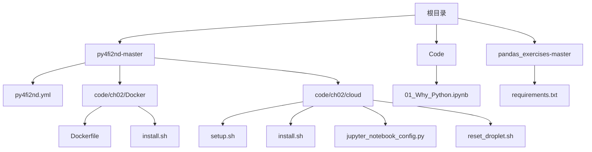
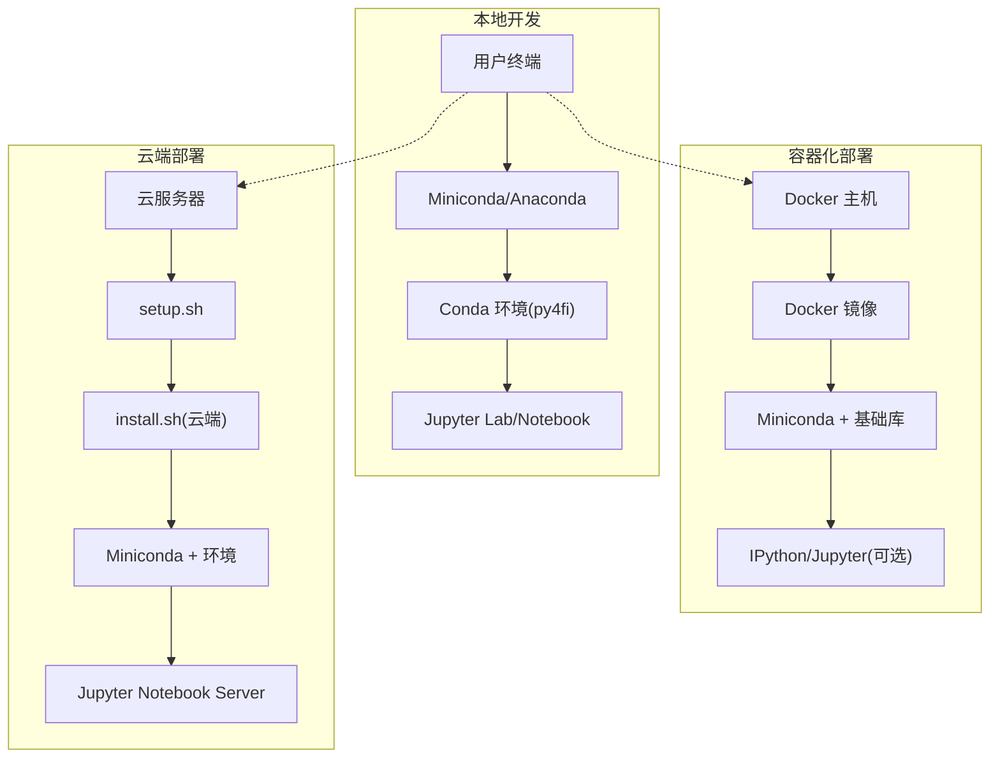
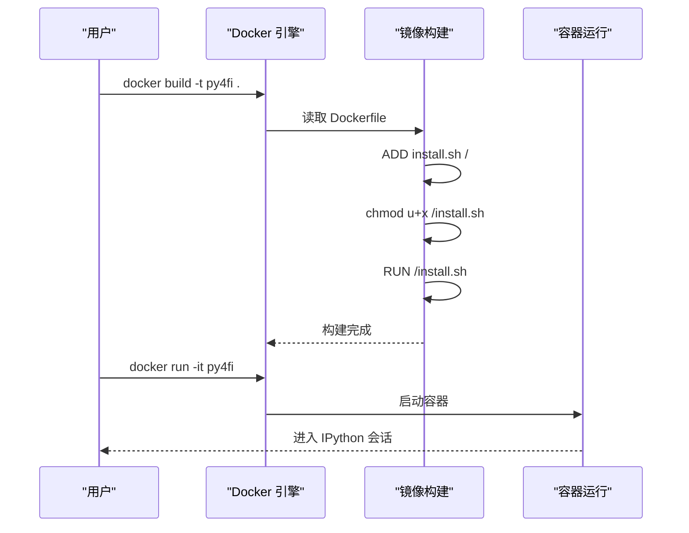
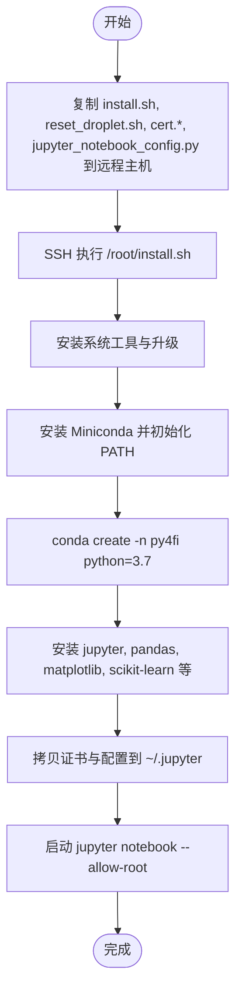
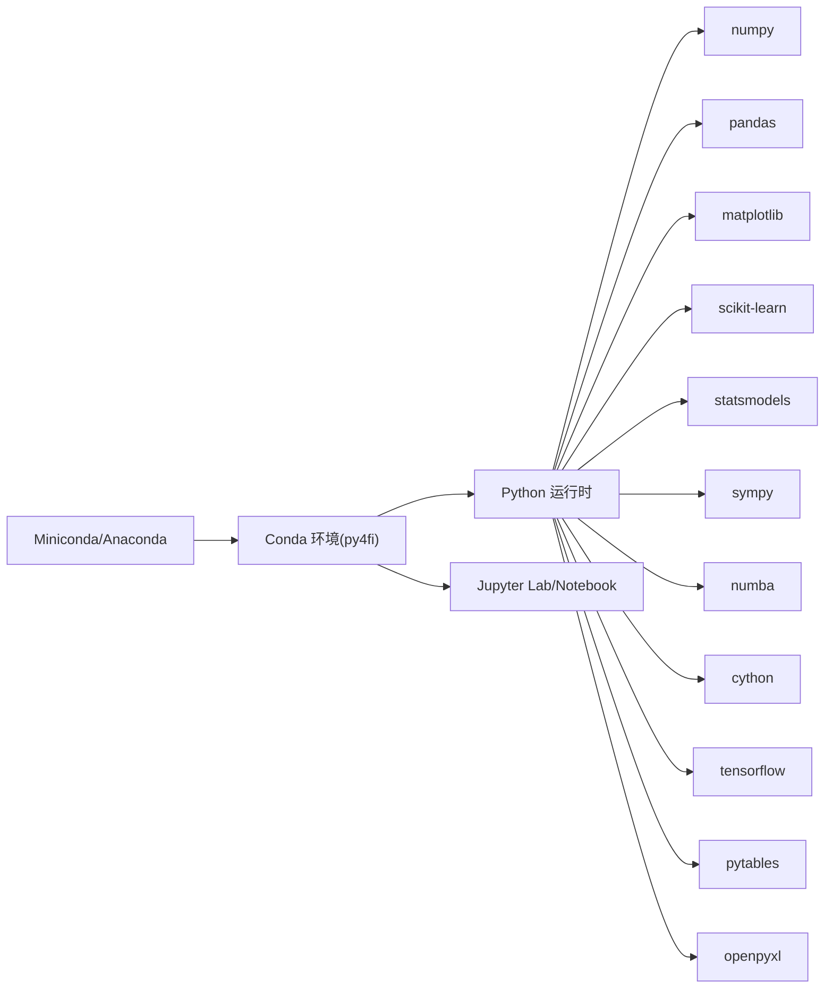

# 快速开始

<cite>
**本文引用的文件**   
- [py4fi2nd.yml](file://py4fi2nd-master/py4fi2nd.yml)
- [README.md](file://py4fi2nd-master/README.md)
- [Dockerfile](file://py4fi2nd-master/code/ch02/Docker/Dockerfile)
- [install.sh（Docker）](file://py4fi2nd-master/code/ch02/Docker/install.sh)
- [setup.sh（云端）](file://py4fi2nd-master/code/ch02/cloud/setup.sh)
- [install.sh（云端）](file://py4fi2nd-master/code/ch02/cloud/install.sh)
- [jupyter_notebook_config.py](file://py4fi2nd-master/code/ch02/cloud/jupyter_notebook_config.py)
- [reset_droplet.sh](file://py4fi2nd-master/code/ch02/cloud/reset_droplet.sh)
- [requirements.txt](file://pandas_exercises-master/requirements.txt)
- [01_Why_Python.ipynb](file://Code/01_Why_Python.ipynb)
</cite>

## 目录
1. [简介](#简介)
2. [项目结构](#项目结构)
3. [核心组件](#核心组件)
4. [架构总览](#架构总览)
5. [详细组件分析](#详细组件分析)
6. [依赖关系分析](#依赖关系分析)
7. [性能与兼容性建议](#性能与兼容性建议)
8. [故障排除指南](#故障排除指南)
9. [结论](#结论)
10. [附录：验证安装与环境测试](#附录验证安装与环境测试)

## 简介
本指南面向初学者，提供从零搭建 Python 金融数据分析环境的完整步骤。内容涵盖 Miniconda/Anaconda 安装、Conda 环境创建与激活、依赖包安装、py4fi2nd.yml 配置文件的作用与使用方法、Docker 部署选项、Quant Platform 在线环境使用、环境变量与 IDE 设置建议，以及常见问题的排查与验证安装的测试步骤。

## 项目结构
仓库包含课程幻灯片、课堂代码、练习集以及 py4fi2nd 源码与配置。关键安装与运行相关文件集中在 py4fi2nd-master 目录下：
- py4fi2nd.yml：Conda 环境定义文件
- code/ch02/Docker：容器化构建与安装脚本
- code/ch02/cloud：云端一键部署脚本与 Jupyter 配置
- README.md：官方安装说明与平台链接

图表来源
- [py4fi2nd.yml](file://py4fi2nd-master/py4fi2nd.yml)
- [Dockerfile](file://py4fi2nd-master/code/ch02/Docker/Dockerfile)
- [install.sh（Docker）](file://py4fi2nd-master/code/ch02/Docker/install.sh)
- [setup.sh（云端）](file://py4fi2nd-master/code/ch02/cloud/setup.sh)
- [install.sh（云端）](file://py4fi2nd-master/code/ch02/cloud/install.sh)
- [jupyter_notebook_config.py](file://py4fi2nd-master/code/ch02/cloud/jupyter_notebook_config.py)
- [reset_droplet.sh](file://py4fi2nd-master/code/ch02/cloud/reset_droplet.sh)
- [requirements.txt](file://pandas_exercises-master/requirements.txt)
- [01_Why_Python.ipynb](file://Code/01_Why_Python.ipynb)

章节来源
- [README.md](file://py4fi2nd-master/README.md)

## 核心组件
- Conda 环境定义文件 py4fi2nd.yml：声明 Python 版本与依赖包，用于一键创建隔离环境
- Docker 镜像构建与安装脚本：在 Linux 容器中自动安装系统工具、Miniconda 与基础库
- 云端部署脚本：一键在云服务器上安装 Miniconda、Jupyter Notebook 并启动服务
- Jupyter 配置文件：启用 SSL、绑定 IP/端口、密码保护等
- 示例 Notebook：验证环境与依赖是否可用

章节来源
- [py4fi2nd.yml](file://py4fi2nd-master/py4fi2nd.yml)
- [Dockerfile](file://py4fi2nd-master/code/ch02/Docker/Dockerfile)
- [install.sh（Docker）](file://py4fi2nd-master/code/ch02/Docker/install.sh)
- [setup.sh（云端）](file://py4fi2nd-master/code/ch02/cloud/setup.sh)
- [install.sh（云端）](file://py4fi2nd-master/code/ch02/cloud/install.sh)
- [jupyter_notebook_config.py](file://py4fi2nd-master/code/ch02/cloud/jupyter_notebook_config.py)
- [01_Why_Python.ipynb](file://Code/01_Why_Python.ipynb)

## 架构总览
下图展示了本地 Conda 环境、Docker 容器与云端服务器三种部署路径的交互关系。

图表来源
- [Dockerfile](file://py4fi2nd-master/code/ch02/Docker/Dockerfile)
- [install.sh（Docker）](file://py4fi2nd-master/code/ch02/Docker/install.sh)
- [setup.sh（云端）](file://py4fi2nd-master/code/ch02/cloud/setup.sh)
- [install.sh（云端）](file://py4fi2nd-master/code/ch02/cloud/install.sh)

## 详细组件分析

### Conda 环境：py4fi2nd.yml
- 作用：定义环境名称、Python 版本、依赖包与通道，确保可复现的环境
- 关键字段：
  - name：环境名
  - channels：包源通道
  - dependencies：Python 及第三方库列表
  - prefix：可选的前缀路径（本地有效）
- 使用方法：
  - 通过 conda env create -f py4fi2nd.yml 创建环境
  - 激活环境后运行 jupyter notebook/lab 即可

章节来源
- [py4fi2nd.yml](file://py4fi2nd-master/py4fi2nd.yml)

### Docker 部署：Dockerfile 与 install.sh
- Dockerfile：基于 Ubuntu 最新镜像，添加安装脚本并执行，设置 PATH，默认启动 IPython
- install.sh（Docker）：更新系统、安装系统工具、下载并安装 Miniconda、更新 conda/python、安装 pandas 与 ipython
- 典型流程：
  - docker build -t py4fi .
  - docker run -it py4fi

图表来源
- [Dockerfile](file://py4fi2nd-master/code/ch02/Docker/Dockerfile)
- [install.sh（Docker）](file://py4fi2nd-master/code/ch02/Docker/install.sh)

章节来源
- [Dockerfile](file://py4fi2nd-master/code/ch02/Docker/Dockerfile)
- [install.sh（Docker）](file://py4fi2nd-master/code/ch02/Docker/install.sh)

### 云端部署：setup.sh 与 install.sh（云端）
- setup.sh：将安装脚本与证书、Jupyter 配置复制到远程主机，并通过 SSH 执行安装
- install.sh（云端）：安装系统工具、Miniconda、创建 py4fi 环境、安装 Jupyter 与常用库，生成证书目录并启动 Jupyter Notebook
- 典型流程：
  - 准备证书 cert.pem/cert.key
  - 运行 setup.sh <MASTER_IP>
  - 浏览器访问 https://<MASTER_IP>:8888

图表来源
- [setup.sh（云端）](file://py4fi2nd-master/code/ch02/cloud/setup.sh)
- [install.sh（云端）](file://py4fi2nd-master/code/ch02/cloud/install.sh)
- [jupyter_notebook_config.py](file://py4fi2nd-master/code/ch02/cloud/jupyter_notebook_config.py)

章节来源
- [setup.sh（云端）](file://py4fi2nd-master/code/ch02/cloud/setup.sh)
- [install.sh（云端）](file://py4fi2nd-master/code/ch02/cloud/install.sh)
- [jupyter_notebook_config.py](file://py4fi2nd-master/code/ch02/cloud/jupyter_notebook_config.py)

### Jupyter 配置：SSL、IP、端口与密码
- SSL：指定 certfile 与 keyfile 路径
- 网络：绑定所有地址 0.0.0.0，默认端口 8888
- 安全：设置密码哈希，禁止自动打开浏览器

章节来源
- [jupyter_notebook_config.py](file://py4fi2nd-master/code/ch02/cloud/jupyter_notebook_config.py)

### 重置与清理：reset_droplet.sh
- 删除 Miniconda、Jupyter 配置与 notebook 目录
- 清理 .bashrc 中追加的行，终止 Jupyter 进程

章节来源
- [reset_droplet.sh](file://py4fi2nd-master/code/ch02/cloud/reset_droplet.sh)

### 备选依赖：requirements.txt
- 适用于不使用 Conda 的场景，列出 numpy、matplotlib、seaborn、pandas 的版本约束

章节来源
- [requirements.txt](file://pandas_exercises-master/requirements.txt)

## 依赖关系分析
- 环境层：Miniconda/Anaconda 提供包管理与隔离环境
- 应用层：Jupyter Lab/Notebook 作为交互式开发界面
- 数据科学栈：numpy、pandas、matplotlib、scikit-learn、statsmodels、sympy、numba、cython、tensorflow、pytables、openpyxl 等
- 容器与云端：Ubuntu 基础镜像、apt 包管理、Miniconda、Jupyter

图表来源
- [py4fi2nd.yml](file://py4fi2nd-master/py4fi2nd.yml)

章节来源
- [py4fi2nd.yml](file://py4fi2nd-master/py4fi2nd.yml)

## 性能与兼容性建议
- Python 版本：py4fi2nd.yml 指定 Python 3.12；若某些包（如 tensorflow）存在兼容性问题，请根据官方文档调整版本或选择替代方案
- 包版本锁定：numpy==1.26.4 已固定，避免依赖冲突
- 加速编译：numba、cython 可用于数值计算加速
- 大数据存储：pytables 适合高效读写大型数据集
- 可视化：matplotlib 为基础绘图库，结合 seaborn 提升美观度（如需）
- 机器学习：scikit-learn 与 tensorflow 覆盖传统 ML 与深度学习场景

[本节为通用建议，不直接分析具体文件]

## 故障排除指南
- 无法创建 Conda 环境
  - 检查网络与通道可达性；尝试更换镜像源
  - 确认磁盘空间充足
  - 查看 py4fi2nd.yml 中的依赖是否存在版本冲突
- Jupyter 无法启动或端口占用
  - 修改 jupyter_notebook_config.py 中的端口号
  - 关闭占用端口的进程
- SSL 证书错误
  - 确保证书文件路径正确且可读
  - 重新生成证书并更新配置
- 云端访问被拒绝
  - 检查防火墙与安全组规则，放行 8888 端口
  - 确认绑定的 IP 为 0.0.0.0
- 容器内缺少系统工具
  - 检查 install.sh（Docker）是否成功执行 apt-get 安装
  - 重新构建镜像

章节来源
- [jupyter_notebook_config.py](file://py4fi2nd-master/code/ch02/cloud/jupyter_notebook_config.py)
- [install.sh（Docker）](file://py4fi2nd-master/code/ch02/Docker/install.sh)
- [install.sh（云端）](file://py4fi2nd-master/code/ch02/cloud/install.sh)
- [reset_droplet.sh](file://py4fi2nd-master/code/ch02/cloud/reset_droplet.sh)

## 结论
通过本指南，您可以选择本地 Conda、Docker 容器或云端服务器三种方式快速搭建 Python 金融数据分析环境。推荐使用 py4fi2nd.yml 统一管理依赖，配合 Jupyter 进行交互式学习与实验。遇到问题时，参考故障排除部分逐步定位与解决。

[本节为总结，不直接分析具体文件]

## 附录：验证安装与环境测试
- 验证 Conda 环境
  - 激活环境后运行 jupyter notebook 或 jupyter lab
  - 在 Notebook 中导入 numpy、pandas、matplotlib 等包，确认无报错
- 验证示例 Notebook
  - 打开 Code/01_Why_Python.ipynb，执行各单元格，观察输出结果
- 验证云端 Jupyter
  - 使用浏览器访问 https://<服务器IP>:8888，输入密码登录
  - 新建 Notebook 并导入依赖包，确认正常运行

章节来源
- [01_Why_Python.ipynb](file://Code/01_Why_Python.ipynb)
- [README.md](file://py4fi2nd-master/README.md)