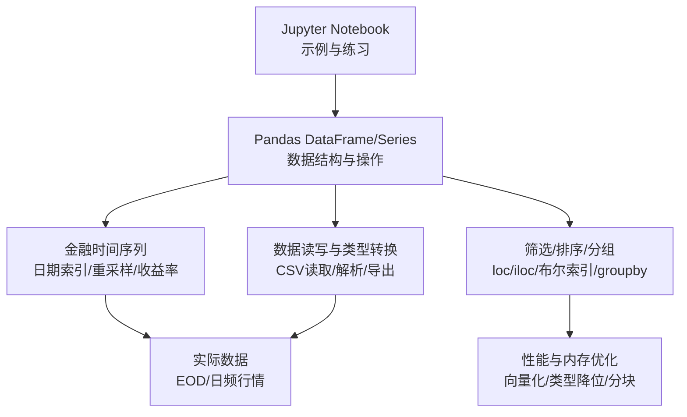
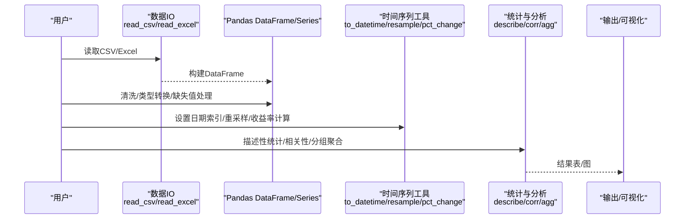
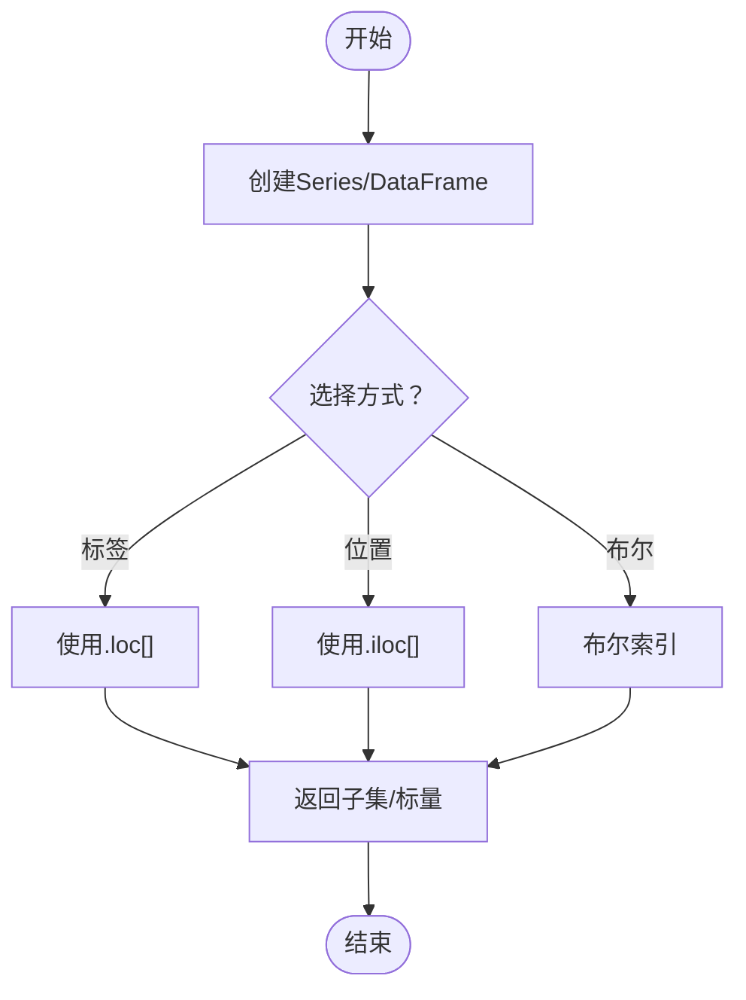
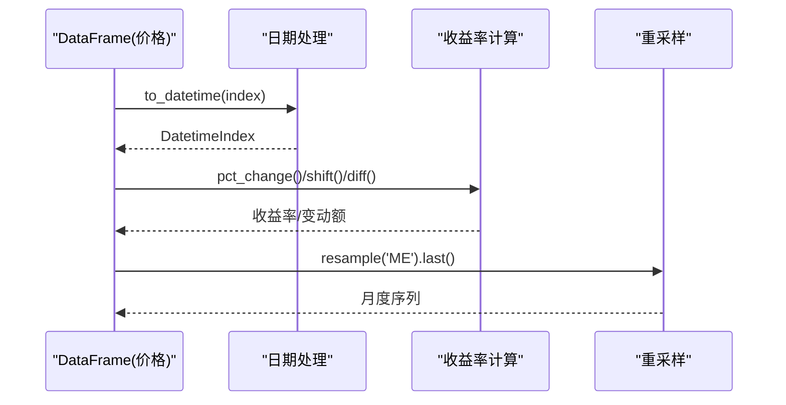

# Pandas数据处理核心

<cite>
**本文引用的文件**   
- [04_Data_Structures.ipynb](file://Code/04_Data_Structures.ipynb)
- [06_Financial_Time_Series.ipynb](file://Code/06_Financial_Time_Series.ipynb)
- [05_pandas.ipynb](file://py4fi2nd-master/code/ch05/05_pandas.ipynb)
- [04_pandas.ipynb](file://章节课堂代码/04_pandas.ipynb)
- [tr_eikon_eod_data.csv](file://Code/tr_eikon_eod_data.csv)
- [appl_1980_2014.csv](file://pandas_exercises-master/09_Time_Series/Apple_Stock/appl_1980_2014.csv)
- [10_performance_python.ipynb](file://py4fi2nd-master/code/ch10/10_performance_python.ipynb)
</cite>

## 目录
1. [简介](#简介)
2. [项目结构](#项目结构)
3. [核心组件](#核心组件)
4. [架构总览](#架构总览)
5. [详细组件分析](#详细组件分析)
6. [依赖关系分析](#依赖关系分析)
7. [性能与内存优化](#性能与内存优化)
8. [故障排查指南](#故障排查指南)
9. [结论](#结论)
10. [附录：实战案例与参考路径](#附录实战案例与参考路径)

## 简介
本教程围绕Pandas在金融数据分析中的核心能力展开，系统讲解Series与DataFrame的数据结构、索引与选取（loc/iloc）、条件筛选、排序与分组、时间序列处理（重采样、收益率计算）、缺失值处理、数据类型转换以及数据读写。教程结合仓库中的真实金融数据（如EOD股票价格、苹果日频行情）和课堂示例，提供从入门到进阶的完整学习路径，并给出大规模数据处理时的内存优化与性能提升建议。

## 项目结构
仓库包含多套教学材料与实践代码，重点涉及以下与Pandas相关的资源：
- 基础数据结构与操作示例：[04_Data_Structures.ipynb](file://Code/04_Data_Structures.ipynb)、[05_pandas.ipynb](file://py4fi2nd-master/code/ch05/05_pandas.ipynb)
- 金融时间序列专题：[06_Financial_Time_Series.ipynb](file://Code/06_Financial_Time_Series.ipynb)
- 课堂讲义与练习：[04_pandas.ipynb](file://章节课堂代码/04_pandas.ipynb)
- 真实金融数据样例：[tr_eikon_eod_data.csv](file://Code/tr_eikon_eod_data.csv)、[appl_1980_2014.csv](file://pandas_exercises-master/09_Time_Series/Apple_Stock/appl_1980_2014.csv)
- 性能与Python基础对比：[10_performance_python.ipynb](file://py4fi2nd-master/code/ch10/10_performance_python.ipynb)

**图表来源** 
- [04_Data_Structures.ipynb:1-120](file://Code/04_Data_Structures.ipynb#L1-L120)
- [06_Financial_Time_Series.ipynb:70-120](file://Code/06_Financial_Time_Series.ipynb#L70-L120)
- [05_pandas.ipynb:40-120](file://py4fi2nd-master/code/ch05/05_pandas.ipynb#L40-L120)
- [04_pandas.ipynb:100-180](file://章节课堂代码/04_pandas.ipynb#L100-L180)
- [tr_eikon_eod_data.csv:1-10](file://Code/tr_eikon_eod_data.csv#L1-L10)
- [appl_1980_2014.csv:1-10](file://pandas_exercises-master/09_Time_Series/Apple_Stock/appl_1980_2014.csv#L1-L10)

**章节来源**
- [04_Data_Structures.ipynb:1-120](file://Code/04_Data_Structures.ipynb#L1-L120)
- [06_Financial_Time_Series.ipynb:70-120](file://Code/06_Financial_Time_Series.ipynb#L70-L120)
- [05_pandas.ipynb:40-120](file://py4fi2nd-master/code/ch05/05_pandas.ipynb#L40-L120)
- [04_pandas.ipynb:100-180](file://章节课堂代码/04_pandas.ipynb#L100-L180)

## 核心组件
- Series：带标签的一维数组，适合单列数据（如某只股票的收盘价序列）。支持按索引对齐、向量化运算与布尔筛选。
- DataFrame：二维表格，行索引通常为日期或交易序号，列为资产或指标。支持列选择、行选择、条件筛选、排序、分组聚合、时间序列重采样等。

关键能力概览：
- 创建与查看：构造、形状、列名、索引、摘要统计
- 索引与选取：loc（标签）、iloc（位置）、布尔索引
- 筛选与组合：多条件组合（&、|）、isin、query
- 排序与分组：sort_values、sort_index、groupby与agg
- 时间序列：to_datetime、date_range、resample、pct_change、shift、diff
- 缺失值处理：isna/dropna/fillna/ffill/bfill
- 数据类型转换：astype、pd.to_numeric、pd.to_datetime
- 数据读写：read_csv/read_excel/to_csv/to_parquet

**章节来源**
- [04_pandas.ipynb:44-120](file://章节课堂代码/04_pandas.ipynb#L44-L120)
- [05_pandas.ipynb:40-120](file://py4fi2nd-master/code/ch05/05_pandas.ipynb#L40-L120)
- [06_Financial_Time_Series.ipynb:70-120](file://Code/06_Financial_Time_Series.ipynb#L70-L120)

## 架构总览
下图展示从数据输入到分析输出的典型流程，强调Pandas在其中的核心作用以及与NumPy、日期处理的协作。

**图表来源** 
- [04_pandas.ipynb:120-220](file://章节课堂代码/04_pandas.ipynb#L120-L220)
- [06_Financial_Time_Series.ipynb:70-120](file://Code/06_Financial_Time_Series.ipynb#L70-L120)
- [05_pandas.ipynb:40-120](file://py4fi2nd-master/code/ch05/05_pandas.ipynb#L40-L120)

## 详细组件分析

### Series与DataFrame：创建、索引与选取
- 创建：通过列表、字典、数组构造；为Series指定index，为DataFrame指定columns与index。
- 索引与选取：
  - loc：基于标签的行/列选择，支持切片与布尔掩码
  - iloc：基于整数位置的行/列选择
  - 布尔索引：使用比较运算符生成掩码进行筛选
- 常见陷阱：df[...]默认针对列；行选择需显式使用loc/iloc或切片

**图表来源** 
- [05_pandas.ipynb:40-120](file://py4fi2nd-master/code/ch05/05_pandas.ipynb#L40-L120)
- [04_pandas.ipynb:150-220](file://章节课堂代码/04_pandas.ipynb#L150-L220)

**章节来源**
- [05_pandas.ipynb:40-120](file://py4fi2nd-master/code/ch05/05_pandas.ipynb#L40-L120)
- [04_pandas.ipynb:150-220](file://章节课堂代码/04_pandas.ipynb#L150-L220)

### 条件筛选技巧
- 单条件：df[df['A'] > x]
- 多条件：(df['A'] > x) & (df['B'] < y)，注意括号与逻辑符
- 集合匹配：df[df['C'].isin(['x','y'])]
- 字符串匹配：str.contains / str.startswith / str.endswith

**章节来源**
- [04_pandas.ipynb:210-260](file://章节课堂代码/04_pandas.ipynb#L210-L260)

### 排序与分组
- 排序：sort_values（按列值）、sort_index（按索引）
- 分组：groupby('列')后对数值列进行mean/sum/max/min/count等聚合，也可用agg一次性计算多个统计量

**章节来源**
- [04_pandas.ipynb:260-330](file://章节课堂代码/04_pandas.ipynb#L260-L330)

### 金融时间序列：日期处理、收益率与重采样
- 日期处理：pd.to_datetime将字符串转为日期；date_range生成规则日期序列；freq='B'表示工作日
- 收益率计算：pct_change()计算百分比变化；shift(1)错位获取“昨日”；diff()计算差值
- 重采样：resample('ME').last()等将高频数据汇总到低频（月/季/年）

**图表来源** 
- [06_Financial_Time_Series.ipynb:70-120](file://Code/06_Financial_Time_Series.ipynb#L70-L120)
- [04_pandas.ipynb:330-410](file://章节课堂代码/04_pandas.ipynb#L330-L410)

**章节来源**
- [06_Financial_Time_Series.ipynb:70-120](file://Code/06_Financial_Time_Series.ipynb#L70-L120)
- [04_pandas.ipynb:330-410](file://章节课堂代码/04_pandas.ipynb#L330-L410)

### 缺失值处理与数据类型转换
- 缺失值：isna()识别、dropna()删除、fillna()填充（均值/前向填充ffill/后向填充bfill）
- 类型转换：astype()统一类型；pd.to_numeric()转换数值；pd.to_datetime()转换日期

**章节来源**
- [04_pandas.ipynb:408-456](file://章节课堂代码/04_pandas.ipynb#L408-L456)

### 数据读写
- 读取：read_csv('file.csv', index_col=0, parse_dates=True)
- 写入：to_csv('file.csv')
- 提示：读取时直接设置日期索引与解析日期，减少后续处理成本

**章节来源**
- [04_pandas.ipynb:430-456](file://章节课堂代码/04_pandas.ipynb#L430-L456)

## 依赖关系分析
- 依赖库：pandas、numpy、datetime（日期处理）
- 数据源：CSV文件（EOD与日频行情）
- 工具链：Jupyter Notebook用于交互式演示与练习

**图表来源** 
- [tr_eikon_eod_data.csv:1-10](file://Code/tr_eikon_eod_data.csv#L1-L10)
- [appl_1980_2014.csv:1-10](file://pandas_exercises-master/09_Time_Series/Apple_Stock/appl_1980_2014.csv#L1-L10)
- [04_pandas.ipynb:430-456](file://章节课堂代码/04_pandas.ipynb#L430-L456)

**章节来源**
- [tr_eikon_eod_data.csv:1-10](file://Code/tr_eikon_eod_data.csv#L1-L10)
- [appl_1980_2014.csv:1-10](file://pandas_exercises-master/09_Time_Series/Apple_Stock/appl_1980_2014.csv#L1-L10)
- [04_pandas.ipynb:430-456](file://章节课堂代码/04_pandas.ipynb#L430-L456)

## 性能与内存优化
- 优先向量化：避免Python级循环，使用Pandas/NumPy内置方法（如pct_change、shift、diff）
- 类型降位：将int64/float64转换为更小的类型（如int32/float32），降低内存占用
- 分块读取：大文件使用chunksize参数分批处理
- 选择合适的存储格式：Parquet比CSV更高效（压缩与列式存储）
- 避免不必要的复制：尽量原地操作或使用视图，减少中间对象

参考对比（Python vs NumPy性能）：
- 循环平均 vs NumPy向量化平均，后者显著更快

**章节来源**
- [10_performance_python.ipynb:160-200](file://py4fi2nd-master/code/ch10/10_performance_python.ipynb#L160-L200)

## 故障排查指南
- 索引错误：确认使用的是loc（标签）还是iloc（位置）；检查索引是否已设置为日期
- 列名冲突：确保列名唯一且正确；使用df.columns查看当前列名
- 缺失值导致NaN：检查pct_change首行为NaN；必要时使用ffill或dropna
- 类型不匹配：读取CSV后检查dtype，必要时用astype或pd.to_numeric转换
- 性能问题：避免循环；使用向量化；考虑分块与类型降位

**章节来源**
- [04_pandas.ipynb:210-260](file://章节课堂代码/04_pandas.ipynb#L210-L260)
- [04_pandas.ipynb:408-456](file://章节课堂代码/04_pandas.ipynb#L408-L456)

## 结论
本教程系统梳理了Pandas在金融数据分析中的核心用法，涵盖数据结构、索引与选取、筛选、排序与分组、时间序列处理、缺失值与类型转换、数据读写，以及性能与内存优化策略。通过真实金融数据与课堂示例，读者可快速掌握从数据导入到分析输出的完整流程，并在大规模数据集上实现高效处理。

## 附录：实战案例与参考路径
- 股票价格数据处理：
  - 读取EOD数据：[tr_eikon_eod_data.csv:1-10](file://Code/tr_eikon_eod_data.csv#L1-L10)
  - 读取苹果日频行情：[appl_1980_2014.csv:1-10](file://pandas_exercises-master/09_Time_Series/Apple_Stock/appl_1980_2014.csv#L1-L10)
- 收益率计算与重采样：
  - 收益率：pct_change、shift、diff
  - 重采样：resample('ME').last()
  - 参考路径：[06_Financial_Time_Series.ipynb:70-120](file://Code/06_Financial_Time_Series.ipynb#L70-L120)、[04_pandas.ipynb:330-410](file://章节课堂代码/04_pandas.ipynb#L330-L410)
- 缺失值处理与类型转换：
  - isna/dropna/fillna/ffill、astype、pd.to_numeric、pd.to_datetime
  - 参考路径：[04_pandas.ipynb:408-456](file://章节课堂代码/04_pandas.ipynb#L408-L456)
- 数据读写：
  - read_csv/to_csv，设置index_col与parse_dates
  - 参考路径：[04_pandas.ipynb:430-456](file://章节课堂代码/04_pandas.ipynb#L430-L456)
- 性能优化：
  - 向量化、类型降位、分块读取、Parquet存储
  - 参考路径：[10_performance_python.ipynb:160-200](file://py4fi2nd-master/code/ch10/10_performance_python.ipynb#L160-L200)