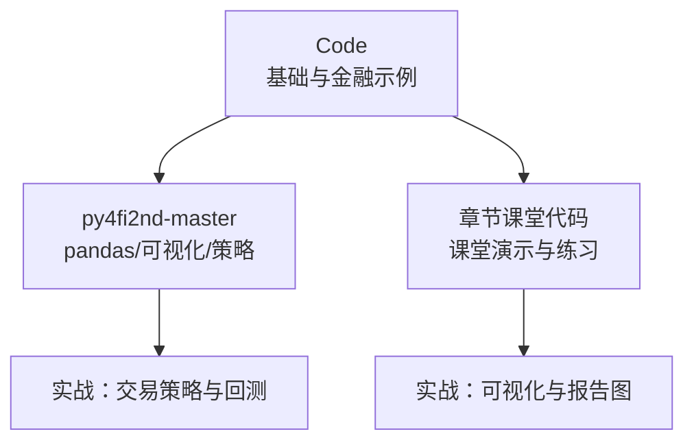
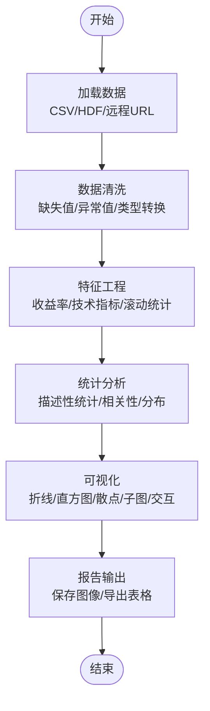
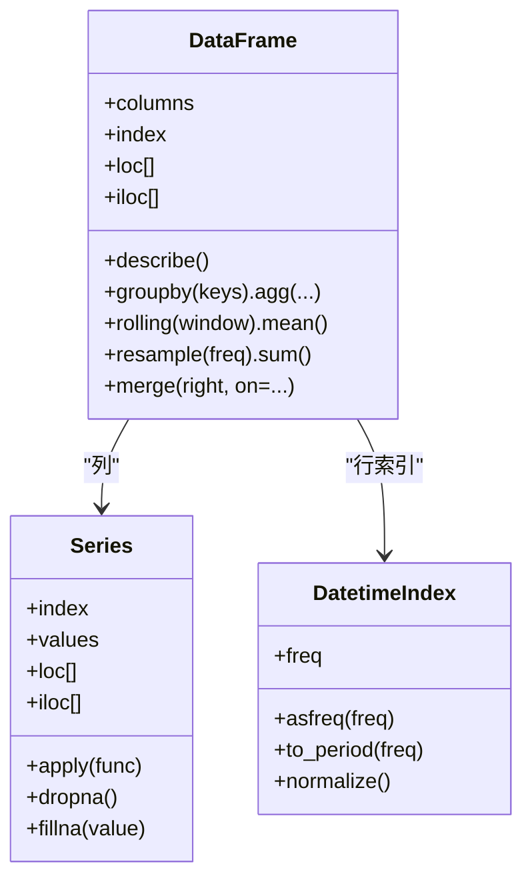
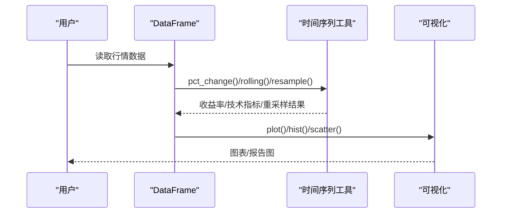
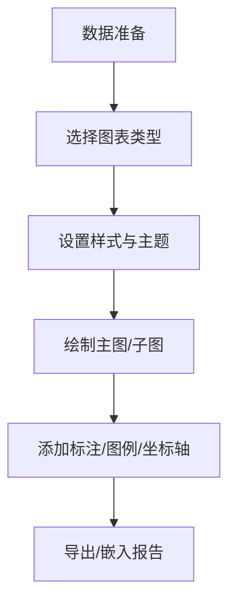
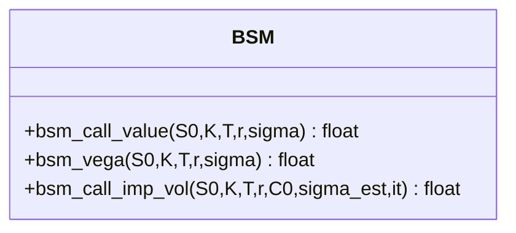
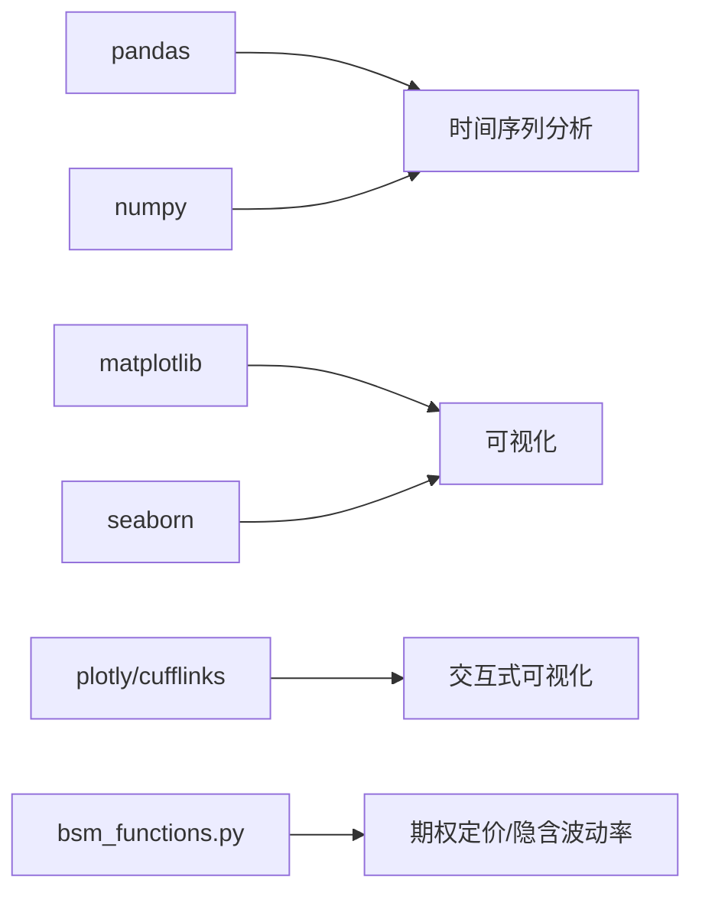

# 数据分析与可视化

<cite>
**本文引用的文件**   
- [Code/06_Financial_Time_Series.ipynb](file://Code/06_Financial_Time_Series.ipynb)
- [Code/04_Data_Structures.ipynb](file://Code/04_Data_Structures.ipynb)
- [Code/bsm_functions.py](file://Code/bsm_functions.py)
- [py4fi2nd-master/code/ch05/05_pandas.ipynb](file://py4fi2nd-master/code/ch05/05_pandas.ipynb)
- [py4fi2nd-master/code/ch07/07_visualization.ipynb](file://py4fi2nd-master/code/ch07/07_visualization.ipynb)
- [章节课堂代码/04_pandas.ipynb](file://章节课堂代码/04_pandas.ipynb)
- [章节课堂代码/05_Visualization.ipynb](file://章节课堂代码/05_Visualization.ipynb)
- [py4fi2nd-master/code/ch15/15_trading_strategies_a.ipynb](file://py4fi2nd-master/code/ch15/15_trading_strategies_a.ipynb)
</cite>

## 目录
1. [引言](#引言)
2. [项目结构](#项目结构)
3. [核心组件](#核心组件)
4. [架构总览](#架构总览)
5. [详细组件分析](#详细组件分析)
6. [依赖关系分析](#依赖关系分析)
7. [性能考虑](#性能考虑)
8. [故障排查指南](#故障排查指南)
9. [结论](#结论)
10. [附录](#附录)

## 引言
本教程面向金融数据分析师与量化初学者，系统讲解如何使用 Python 生态进行金融数据的清洗、分析与可视化。内容覆盖：
- Pandas 核心能力：DataFrame/Series 操作、时间序列处理、数据清洗与转换
- Matplotlib/Seaborn 可视化：图表类型选择、样式定制、交互式可视化（Plotly/Cufflinks）
- 金融时间序列实战：股票价格分析、收益率计算、波动率建模、回撤分析
- 数据质量检查：缺失值处理、异常值检测、稳健统计
- 专业报告图：一页式分析报告布局、导出与排版建议
- 性能优化与内存管理：向量化、分组聚合、I/O 与存储策略

## 项目结构
仓库包含多套教学材料与实践 Notebook，围绕“数据—分析—可视化—交易策略”的完整链路组织：
- Code：基础数据结构、金融时间序列、BSM 期权定价函数等示例
- py4fi2nd-master：pandas 基础、可视化、交易策略等进阶案例
- 章节课堂代码：按章节组织的课堂演示与练习，涵盖 pandas 与可视化实操
- 其他练习集：用于巩固 DataFrame 操作、分组、合并、统计与可视化

**图示来源**
- [Code/06_Financial_Time_Series.ipynb:1-100](file://Code/06_Financial_Time_Series.ipynb#L1-L100)
- [py4fi2nd-master/code/ch05/05_pandas.ipynb:1-120](file://py4fi2nd-master/code/ch05/05_pandas.ipynb#L1-L120)
- [章节课堂代码/04_pandas.ipynb:1-120](file://章节课堂代码/04_pandas.ipynb#L1-L120)

**章节来源**
- [Code/06_Financial_Time_Series.ipynb:1-120](file://Code/06_Financial_Time_Series.ipynb#L1-L120)
- [py4fi2nd-master/code/ch05/05_pandas.ipynb:1-120](file://py4fi2nd-master/code/ch05/05_pandas.ipynb#L1-L120)
- [章节课堂代码/04_pandas.ipynb:1-120](file://章节课堂代码/04_pandas.ipynb#L1-L120)

## 核心组件
- 数据与结构
  - Series/DataFrame：带标签的一维/二维数据容器，支持索引对齐、向量化运算、分组聚合
  - DatetimeIndex：时间序列索引，支持重采样、滚动窗口、频率转换
- 数据处理
  - 缺失值处理：dropna/fillna/isnull/notnull
  - 异常值检测：分位数法、Z-score、IQR
  - 转换与重塑：astype、apply/map、pivot/melt、merge/join
- 金融指标
  - 收益率：pct_change、对数收益率
  - 风险：标准差、年化波动率、最大回撤
  - 相关性：corr/corrwith
- 可视化
  - Matplotlib：静态绘图、子图、双轴、填充区域
  - Seaborn：统计图形、FacetGrid
  - Plotly/Cufflinks：交互式图表

**章节来源**
- [Code/06_Financial_Time_Series.ipynb:1-200](file://Code/06_Financial_Time_Series.ipynb#L1-L200)
- [py4fi2nd-master/code/ch05/05_pandas.ipynb:1-200](file://py4fi2nd-master/code/ch05/05_pandas.ipynb#L1-L200)
- [章节课堂代码/04_pandas.ipynb:1-200](file://章节课堂代码/04_pandas.ipynb#L1-L200)
- [章节课堂代码/05_Visualization.ipynb:1-200](file://章节课堂代码/05_Visualization.ipynb#L1-L200)

## 架构总览
下图展示从数据到分析的典型流程：读取与清洗 → 特征工程 → 指标计算 → 可视化与报告。

[此图为概念流程图，不映射具体源码]

## 详细组件分析

### 组件A：Pandas 数据框架与时间序列
- 关键能力
  - 创建与访问：Series/DataFrame 构造、loc/iloc 选择、布尔筛选
  - 时间序列：DatetimeIndex、重采样 resample、滚动 rolling、频率转换 asfreq
  - 聚合与变换：groupby、agg、transform、apply
  - 缺失值与异常值：isnull/dropna/fillna；分位数/IQR/Z-score
- 实践要点
  - 始终将日期设为索引并排序，确保时间连续性
  - 使用向量化运算替代循环，提升性能
  - 用 rolling/ewm 计算移动平均、指数加权统计

**图示来源**
- [py4fi2nd-master/code/ch05/05_pandas.ipynb:1-200](file://py4fi2nd-master/code/ch05/05_pandas.ipynb#L1-L200)
- [章节课堂代码/04_pandas.ipynb:1-200](file://章节课堂代码/04_pandas.ipynb#L1-L200)

**章节来源**
- [py4fi2nd-master/code/ch05/05_pandas.ipynb:1-200](file://py4fi2nd-master/code/ch05/05_pandas.ipynb#L1-L200)
- [章节课堂代码/04_pandas.ipynb:1-200](file://章节课堂代码/04_pandas.ipynb#L1-L200)

### 组件B：金融时间序列分析
- 收益率与风险
  - 日收益率：pct_change()
  - 对数收益率：np.log(prices / prices.shift(1))
  - 年化波动率：std * sqrt(252)
  - 最大回撤：基于累计最大值计算回撤曲线
- 技术指标
  - 简单移动平均 SMA：rolling(SMA).mean()
  - 指数移动平均 EMA：ewm(span=N).mean()
- 相关性分析
  - 相关矩阵 corr()
  - 滚动相关 rolling(corrwith)

**图示来源**
- [py4fi2nd-master/code/ch15/15_trading_strategies_a.ipynb:1-200](file://py4fi2nd-master/code/ch15/15_trading_strategies_a.ipynb#L1-L200)
- [章节课堂代码/05_Visualization.ipynb:1-200](file://章节课堂代码/05_Visualization.ipynb#L1-L200)

**章节来源**
- [py4fi2nd-master/code/ch15/15_trading_strategies_a.ipynb:1-200](file://py4fi2nd-master/code/ch15/15_trading_strategies_a.ipynb#L1-L200)
- [章节课堂代码/05_Visualization.ipynb:1-200](file://章节课堂代码/05_Visualization.ipynb#L1-L200)

### 组件C：可视化与报告图
- 静态图
  - 折线图、柱状图、直方图、箱线图、散点图
  - 双轴图、子图布局、填充区域（回撤）
- 交互式图
  - Plotly/Cufflinks：iplot、主题、模式配置
- 报告图
  - 四格布局：价格、回撤、收益分布、相关性散点
  - 统一风格：seaborn/matplotlib 样式、字体、SVG 输出

**图示来源**
- [py4fi2nd-master/code/ch07/07_visualization.ipynb:1-200](file://py4fi2nd-master/code/ch07/07_visualization.ipynb#L1-L200)
- [章节课堂代码/05_Visualization.ipynb:200-414](file://章节课堂代码/05_Visualization.ipynb#L200-L414)

**章节来源**
- [py4fi2nd-master/code/ch07/07_visualization.ipynb:1-200](file://py4fi2nd-master/code/ch07/07_visualization.ipynb#L1-L200)
- [章节课堂代码/05_Visualization.ipynb:200-414](file://章节课堂代码/05_Visualization.ipynb#L200-L414)

### 组件D：期权定价与隐含波动率（BSM）
- Black-Scholes-Merton 欧式看涨期权定价
- Vega：对波动率的敏感度
- 隐含波动率估计：牛顿迭代求解

**图示来源**
- [Code/bsm_functions.py:1-108](file://Code/bsm_functions.py#L1-L108)

**章节来源**
- [Code/bsm_functions.py:1-108](file://Code/bsm_functions.py#L1-L108)

## 依赖关系分析
- 模块内依赖
  - 金融时间序列 Notebook 依赖 pandas/numpy/matplotlib
  - 可视化 Notebook 依赖 matplotlib/seaborn/plotly/cufflinks
  - BSM 函数依赖 math/scipy.stats
- 跨模块依赖
  - 课堂代码与 py4fi2nd 系列共享 pandas/NumPy/Matplotlib 生态
  - 交易策略 Notebook 依赖行情数据源（CSV/URL）

**图示来源**
- [py4fi2nd-master/code/ch05/05_pandas.ipynb:1-120](file://py4fi2nd-master/code/ch05/05_pandas.ipynb#L1-L120)
- [py4fi2nd-master/code/ch07/07_visualization.ipynb:1-120](file://py4fi2nd-master/code/ch07/07_visualization.ipynb#L1-L120)
- [Code/bsm_functions.py:1-108](file://Code/bsm_functions.py#L1-L108)

**章节来源**
- [py4fi2nd-master/code/ch05/05_pandas.ipynb:1-120](file://py4fi2nd-master/code/ch05/05_pandas.ipynb#L1-L120)
- [py4fi2nd-master/code/ch07/07_visualization.ipynb:1-120](file://py4fi2nd-master/code/ch07/07_visualization.ipynb#L1-L120)
- [Code/bsm_functions.py:1-108](file://Code/bsm_functions.py#L1-L108)

## 性能考虑
- 向量化优先
  - 使用 NumPy/Pandas 内置函数，避免 Python 循环
  - 利用 rolling/ewm/resample 等高效实现
- 内存管理
  - 合理数据类型：astype 降低内存占用（如 float32、category）
  - 增量处理：chunksize 读取大文件，或 HDFStore/Parquet 压缩存储
- I/O 优化
  - 使用二进制格式（HDF5/Parquet）加速读写
  - 减少中间对象复制，尽量 in-place 操作
- 计算优化
  - groupby().agg 比多次 apply 更高效
  - 使用 numba/numexpr 加速数值计算（可选）

[本节为通用指导，不直接分析具体文件]

## 故障排查指南
- 常见错误
  - 索引未排序导致时间序列操作异常：先 sort_index()
  - 缺失值导致统计失效：检查 isnull().sum()，必要时 dropna/fillna
  - 类型不一致：astype 转换，确保数值型参与计算
  - 绘图坐标轴错乱：确认索引为日期类型，必要时 to_datetime
- 诊断步骤
  - 打印 df.info() 与 describe() 快速体检
  - 使用 head/tail 查看首尾数据
  - 逐步验证中间结果，定位问题单元格

**章节来源**
- [章节课堂代码/04_pandas.ipynb:120-200](file://章节课堂代码/04_pandas.ipynb#L120-L200)
- [py4fi2nd-master/code/ch05/05_pandas.ipynb:120-200](file://py4fi2nd-master/code/ch05/05_pandas.ipynb#L120-L200)

## 结论
本教程通过系统化梳理 Pandas 与可视化工具在金融数据分析中的应用，结合真实场景与课堂代码，帮助读者建立从数据清洗、特征工程、指标计算到可视化报告的完整工作流。建议在实践中遵循“向量化优先、内存友好、可复现”的原则，逐步构建高质量的金融分析管线。

[本节为总结，不直接分析具体文件]

## 附录
- 常用函数速查
  - 数据清洗：isnull/dropna/fillna/astype
  - 时间序列：resample/rolling/ewm/asfreq
  - 统计：describe/corr/pct_change/std/var
  - 可视化：plot/hist/scatter/bar/kde
- 推荐学习路径
  - 先掌握 pandas 基础与时间序列
  - 再学习 Matplotlib/Seaborn 绘图技巧
  - 最后结合交易策略与回测案例深化理解

[本节为补充信息，不直接分析具体文件]