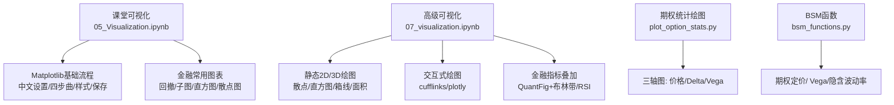
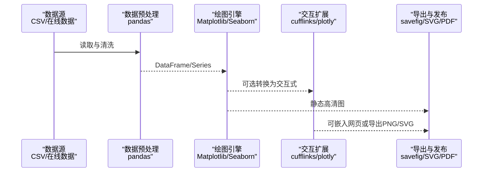
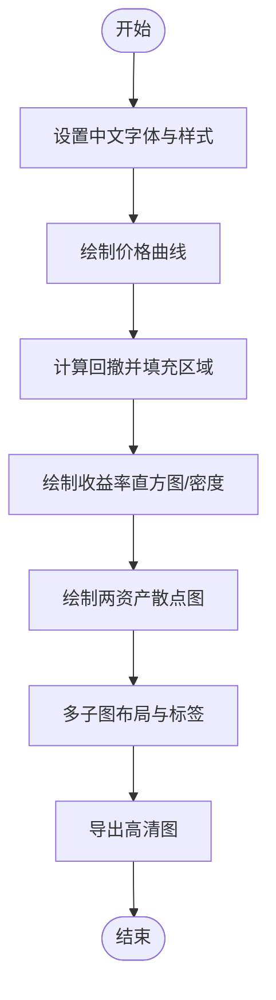
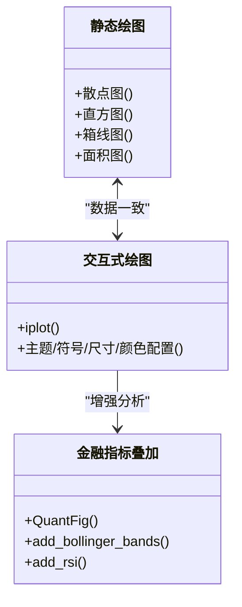
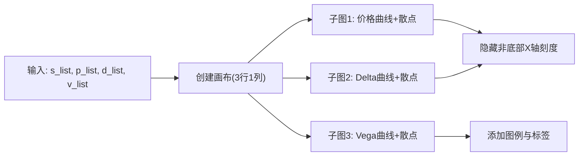
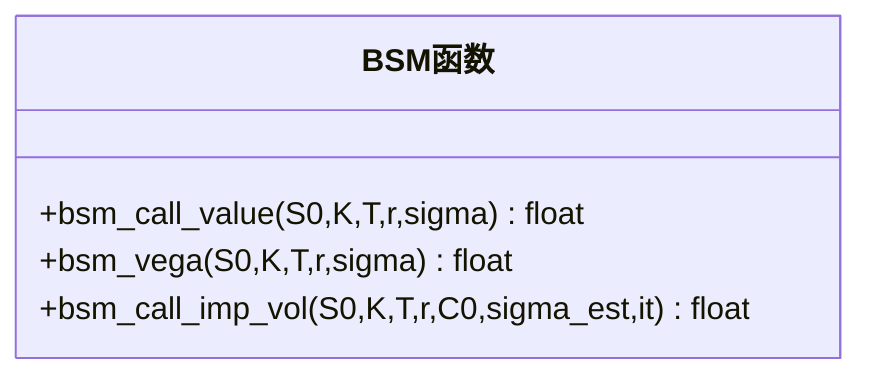
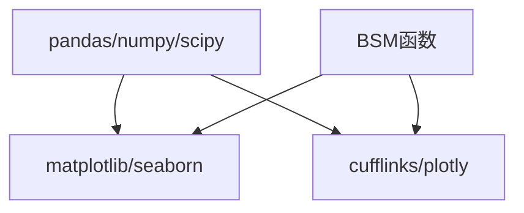

# 金融数据可视化

<cite>
**本文引用的文件**   
- [05_Visualization.ipynb](file://章节课堂代码/05_Visualization.ipynb)
- [07_visualization.ipynb](file://py4fi2nd-master/code/ch07/07_visualization.ipynb)
- [plot_option_stats.py](file://py4fi2nd-master/code/dx/plot_option_stats.py)
- [bsm_functions.py](file://Code/bsm_functions.py)
- [bsm_functions.py](file://py4fi2nd-master/code/ch12/bsm_functions.py)
</cite>

## 目录
1. [简介](#简介)
2. [项目结构](#项目结构)
3. [核心组件](#核心组件)
4. [架构总览](#架构总览)
5. [详细组件分析](#详细组件分析)
6. [依赖关系分析](#依赖关系分析)
7. [性能与输出建议](#性能与输出建议)
8. [故障排查指南](#故障排查指南)
9. [结论](#结论)
10. [附录：常用图表模板与最佳实践](#附录常用图表模板与最佳实践)

## 简介
本指南面向使用Python进行金融数据分析与报告撰写的读者，系统讲解如何使用Matplotlib与Seaborn制作专业级金融图表。内容覆盖折线图、柱状图、散点图、热力图等基础类型，并深入讲解样式定制、颜色配置、标题与标签设置；同时提供K线图、收益曲线、波动率图表、相关性矩阵等金融专用图表的制作技巧，并介绍交互式可视化、高分辨率导出与多子图布局等实战要点，帮助读者快速产出高质量的分析报告图表。

## 项目结构
仓库包含多个Jupyter Notebook与少量Python脚本，围绕金融时间序列与可视化展开。关键资源包括：
- 课堂可视化示例：集中展示Matplotlib在金融场景中的用法（价格曲线、回撤、直方图、散点图、子图布局、保存高清图片等）
- 高级可视化示例：涵盖静态/交互式绘图、3D曲面、金融指标叠加（如布林带、RSI）、以及期权统计的三轴图
- 期权定价函数：用于计算BSM模型下的期权价值、Vega与隐含波动率，便于生成风险指标可视化

**图示来源** 
- [05_Visualization.ipynb](file://章节课堂代码/05_Visualization.ipynb)
- [07_visualization.ipynb](file://py4fi2nd-master/code/ch07/07_visualization.ipynb)
- [plot_option_stats.py](file://py4fi2nd-master/code/dx/plot_option_stats.py)
- [bsm_functions.py](file://Code/bsm_functions.py)
- [bsm_functions.py](file://py4fi2nd-master/code/ch12/bsm_functions.py)

**章节来源**
- [05_Visualization.ipynb](file://章节课堂代码/05_Visualization.ipynb)
- [07_visualization.ipynb](file://py4fi2nd-master/code/ch07/07_visualization.ipynb)

## 核心组件
- Matplotlib基础与风格
  - 通过style与rcParams统一字体、网格、背景等全局样式
  - 使用subplots创建画布与坐标轴，遵循“建画布—画图—装饰—显示”的四步流程
- pandas快捷绘图
  - DataFrame.plot()一键绘制多条曲线、直方图、核密度估计等，适合探索阶段
- Seaborn与热力图
  - 结合pandas.corr()与seaborn.heatmap()快速呈现相关性矩阵
- 金融专用图表
  - 价格曲线、累计收益、回撤（fill_between）、收益率分布（hist/KDE）、散点相关性
  - 技术指标叠加（布林带、RSI），期权统计三轴图（价格、Delta、Vega）
- 交互与导出
  - cufflinks/plotly实现交互式图表
  - savefig高分辨率导出（dpi=300），bbox_inches="tight"裁剪空白

**章节来源**
- [05_Visualization.ipynb](file://章节课堂代码/05_Visualization.ipynb)
- [07_visualization.ipynb](file://py4fi2nd-master/code/ch07/07_visualization.ipynb)

## 架构总览
下图展示了从数据准备到可视化的典型流程，以及各模块之间的协作关系。

[此图为概念性流程图，不直接映射具体源码文件]

## 详细组件分析

### 组件A：Matplotlib金融图表工作流（价格、回撤、分布、散点）
- 目标：用最少步骤完成一套完整的金融分析报告图（价格曲线、回撤、收益率分布、散点相关性）
- 关键点：
  - 中文设置与负号显示
  - 多图布局（sharex共享横轴、tight_layout自动调整）
  - 回撤填充（fill_between）
  - 直方图与理论正态对比（density=True）
  - 散点图观察相关性
  - 保存高清图（dpi=300，bbox_inches="tight"）

**图示来源** 
- [05_Visualization.ipynb](file://章节课堂代码/05_Visualization.ipynb)

**章节来源**
- [05_Visualization.ipynb](file://章节课堂代码/05_Visualization.ipynb)

### 组件B：高级可视化与金融指标叠加
- 目标：在静态绘图基础上，引入3D曲面与交互式图表，叠加技术指标
- 关键点：
  - 静态2D/3D绘图（散点、直方图、箱线图、面积图）
  - 交互式绘图（cufflinks.iplot、plotly）
  - 金融指标叠加（QuantFig + 布林带、RSI）
  - SVG内联格式提升清晰度

**图示来源** 
- [07_visualization.ipynb](file://py4fi2nd-master/code/ch07/07_visualization.ipynb)

**章节来源**
- [07_visualization.ipynb](file://py4fi2nd-master/code/ch07/07_visualization.ipynb)

### 组件C：期权统计三轴图（价格、Delta、Vega）
- 目标：将期权价格及其希腊字母随标的初始值的变化以三轴图形式呈现
- 关键点：
  - 三子图垂直排列，隐藏中间刻度，聚焦趋势
  - 不同系列使用不同标记与颜色区分
  - 统一X轴为标的初始值，Y轴分别为价格、Delta、Vega

**图示来源** 
- [plot_option_stats.py](file://py4fi2nd-master/code/dx/plot_option_stats.py)

**章节来源**
- [plot_option_stats.py](file://py4fi2nd-master/code/dx/plot_option_stats.py)

### 组件D：BSM期权定价与风险指标（支撑可视化）
- 目标：提供期权定价、Vega与隐含波动率的数值计算，作为可视化输入
- 关键点：
  - 解析式BSM定价
  - Vega（对sigma的一阶偏导）
  - 隐含波动率数值求解（牛顿迭代）

**图示来源** 
- [bsm_functions.py](file://Code/bsm_functions.py)
- [bsm_functions.py](file://py4fi2nd-master/code/ch12/bsm_functions.py)

**章节来源**
- [bsm_functions.py](file://Code/bsm_functions.py)
- [bsm_functions.py](file://py4fi2nd-master/code/ch12/bsm_functions.py)

## 依赖关系分析
- 数据层：pandas负责读取、清洗与聚合（例如从CSV或在线数据源获取外汇/股票数据）
- 计算层：numpy/scipy用于数值计算（如正态分布PDF/CDF、累积和、统计量）
- 可视化层：matplotlib/seaborn负责静态绘图；cufflinks/plotly负责交互式
- 业务层：BSM函数提供期权定价与希腊字母，供图表展示风险特征

**图示来源** 
- [05_Visualization.ipynb](file://章节课堂代码/05_Visualization.ipynb)
- [07_visualization.ipynb](file://py4fi2nd-master/code/ch07/07_visualization.ipynb)
- [bsm_functions.py](file://Code/bsm_functions.py)

**章节来源**
- [05_Visualization.ipynb](file://章节课堂代码/05_Visualization.ipynb)
- [07_visualization.ipynb](file://py4fi2nd-master/code/ch07/07_visualization.ipynb)
- [bsm_functions.py](file://Code/bsm_functions.py)

## 性能与输出建议
- 渲染性能
  - 大数据集散点图建议使用alpha透明度降低重叠噪声
  - 直方图bins选择需平衡细节与噪声（经验起步30）
- 输出质量
  - 使用savefig导出png/pdf/svg，dpi≥300，bbox_inches="tight"
  - 内联SVG提升Notebook清晰度
- 布局优化
  - 使用tight_layout避免标题重叠
  - sharex共享横轴减少冗余刻度

[本节为通用指导，不直接分析具体文件]

## 故障排查指南
- 中文显示异常（方块字）
  - 检查是否设置中文字体与负号显示
  - 参考路径：[05_Visualization.ipynb](file://章节课堂代码/05_Visualization.ipynb)
- 多图重叠或标签被遮挡
  - 使用tight_layout或手动调整子图间距
  - 参考路径：[05_Visualization.ipynb](file://章节课堂代码/05_Visualization.ipynb)
- 保存图片模糊
  - 提高dpi至300以上，使用矢量格式svg/pdf
  - 参考路径：[05_Visualization.ipynb](file://章节课堂代码/05_Visualization.ipynb)
- 交互式图表无法显示
  - 确认cufflinks/plotly已正确初始化与离线模式设置
  - 参考路径：[07_visualization.ipynb](file://py4fi2nd-master/code/ch07/07_visualization.ipynb)

**章节来源**
- [05_Visualization.ipynb](file://章节课堂代码/05_Visualization.ipynb)
- [07_visualization.ipynb](file://py4fi2nd-master/code/ch07/07_visualization.ipynb)

## 结论
通过本指南，读者可以掌握Matplotlib与Seaborn在金融可视化中的核心用法，构建从基础图表到金融专用图表的完整能力体系。结合pandas的数据处理优势与cufflinks/plotly的交互能力，能够高效产出专业级的分析报告图表。建议在探索阶段使用pandas.plot快速验证，在报告阶段使用Matplotlib精细打磨，确保图表清晰、信息密度合理且输出质量达标。

[本节为总结性内容，不直接分析具体文件]

## 附录：常用图表模板与最佳实践

### 折线图（价格与累计收益）
- 适用：时间序列价格、累计收益、指数走势
- 要点：日期索引、多序列叠加、图例、网格、标题与轴标签
- 参考路径：[05_Visualization.ipynb](file://章节课堂代码/05_Visualization.ipynb)

### 柱状图（类别对比）
- 适用：年化收益对比、行业PE比较、分组统计
- 要点：类别顺序、颜色一致性、误差棒（如有）
- 参考路径：[05_Visualization.ipynb](file://章节课堂代码/05_Visualization.ipynb)

### 散点图（相关性）
- 适用：双资产收益联动、因子暴露、回归前验
- 要点：透明度、拟合线（可选）、标注离群点
- 参考路径：[05_Visualization.ipynb](file://章节课堂代码/05_Visualization.ipynb)

### 热力图（相关性矩阵）
- 适用：多资产相关性、协方差矩阵、因子相关性
- 要点：使用pandas.corr()与seaborn.heatmap，设置色板与阈值
- 参考路径：[07_visualization.ipynb](file://py4fi2nd-master/code/ch07/07_visualization.ipynb)

### K线图（OHLC）
- 适用：日频行情展示
- 要点：开盘/最高/最低/收盘、涨跌配色、成交量叠加
- 参考路径：[07_visualization.ipynb](file://py4fi2nd-master/code/ch07/07_visualization.ipynb)

### 收益曲线与回撤
- 适用：策略回测、组合表现评估
- 要点：累计收益、最大回撤、回撤区间填充
- 参考路径：[05_Visualization.ipynb](file://章节课堂代码/05_Visualization.ipynb)

### 波动率图表
- 适用：历史波动率、隐含波动率曲面
- 要点：滚动标准差、GARCH拟合、波动率期限结构
- 参考路径：[07_visualization.ipynb](file://py4fi2nd-master/code/ch07/07_visualization.ipynb)

### 相关性矩阵热力图
- 适用：多资产相关性分析
- 要点：对称矩阵、掩码上三角、显著性标注
- 参考路径：[07_visualization.ipynb](file://py4fi2nd-master/code/ch07/07_visualization.ipynb)

### 技术指标叠加（布林带、RSI）
- 适用：趋势与动量分析
- 要点：均线、上下轨、RSI超买超卖区间
- 参考路径：[07_visualization.ipynb](file://py4fi2nd-master/code/ch07/07_visualization.ipynb)

### 期权统计三轴图（价格、Delta、Vega）
- 适用：期权风险敏感度可视化
- 要点：三子图对齐、标记与颜色区分、图例与标签
- 参考路径：[plot_option_stats.py](file://py4fi2nd-master/code/dx/plot_option_stats.py)

### 高分辨率导出与多子图布局
- 适用：报告出版、演示材料
- 要点：dpi≥300、bbox_inches="tight"、tight_layout、sharex
- 参考路径：[05_Visualization.ipynb](file://章节课堂代码/05_Visualization.ipynb)

### 交互式可视化（cufflinks/plotly）
- 适用：探索性分析、动态筛选
- 要点：主题、符号、尺寸、颜色、模式配置
- 参考路径：[07_visualization.ipynb](file://py4fi2nd-master/code/ch07/07_visualization.ipynb)

**章节来源**
- [05_Visualization.ipynb](file://章节课堂代码/05_Visualization.ipynb)
- [07_visualization.ipynb](file://py4fi2nd-master/code/ch07/07_visualization.ipynb)
- [plot_option_stats.py](file://py4fi2nd-master/code/dx/plot_option_stats.py)