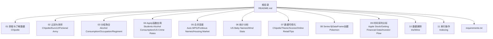
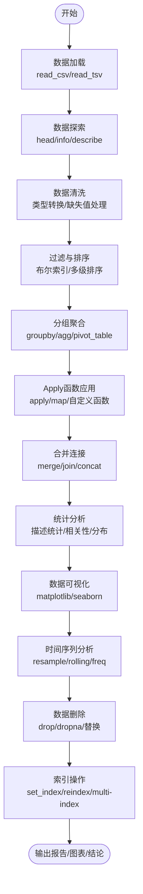
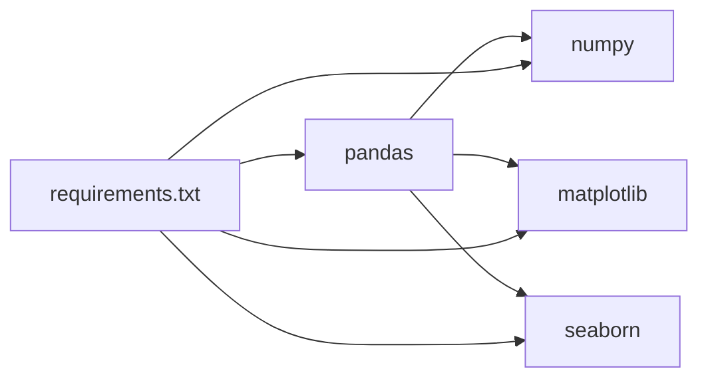

# Pandas专项练习集

<cite>
**本文引用的文件**   
- [README.md](file://pandas_exercises-master/README.md)
- [requirements.txt](file://pandas_exercises-master/requirements.txt)
- [01_Getting_&_Knowing_Your_Data/Chipotle/Exercises.ipynb](file://pandas_exercises-master/01_Getting_&_Knowing_Your_Data/Chipotle/Exercises.ipynb)
- [02_Filtering_&_Sorting/Chipotle/Exercises.ipynb](file://pandas_exercises-master/02_Filtering_&_Sorting/Chipotle/Exercises.ipynb)
- [03_Grouping/Alcohol_Consumption/Exercise.ipynb](file://pandas_exercises-master/03_Grouping/Alcohol_Consumption/Exercise.ipynb)
- [04_Apply/Students_Alcohol_Consumption/Exercises.ipynb](file://pandas_exercises-master/04_Apply/Students_Alcohol_Consumption/Exercises.ipynb)
- [05_Merge/Auto_MPG/Exercises.ipynb](file://pandas_exercises-master/05_Merge/Auto_MPG/Exercises.ipynb)
- [06_Stats/US_Baby_Names/Exercises.ipynb](file://pandas_exercises-master/06_Stats/US_Baby_Names/Exercises.ipynb)
- [07_Visualization/Tips/Exercises.ipynb](file://pandas_exercises-master/07_Visualization/Tips/Exercises.ipynb)
- [08_Creating_Series_and_DataFrames/Pokemon/Exercises.ipynb](file://pandas_exercises-master/08_Creating_Series_and_DataFrames/Pokemon/Exercises.ipynb)
- [09_Time_Series/Apple_Stock/Exercises.ipynb](file://pandas_exercises-master/09_Time_Series/Apple_Stock/Exercises.ipynb)
- [10_Deleting/Iris/Exercises.ipynb](file://pandas_exercises-master/10_Deleting/Iris/Exercises.ipynb)
- [11_Indexing/Exercises.ipynb](file://pandas_exercises-master/11_Indexing/Exercises.ipynb)
- [chipo.csv](file://Excercise/chipo.csv)
- [drinks.csv](file://Excercise/drinks.csv)
</cite>

## 目录
1. [简介](#简介)
2. [项目结构](#项目结构)
3. [核心组件](#核心组件)
4. [架构总览](#架构总览)
5. [详细组件分析](#详细组件分析)
6. [依赖关系分析](#依赖关系分析)
7. [性能注意事项](#性能注意事项)
8. [故障排查指南](#故障排查指南)
9. [结论](#结论)
10. [附录](#附录)

## 简介
本指南面向希望系统掌握Pandas数据处理与分析的学习者，围绕仓库中的11个主要练习模块，提供从“无代码思路”到“带注释的完整实现路径”的分层学习方案。每个模块均包含：
- 学习目标与关键技能点
- 数据集背景与字段说明
- 解题思路（逐步拆解）
- 代码实现步骤（以“步骤+要点”的形式呈现，避免直接粘贴代码）
- 结果分析方法与可视化建议
- 常见陷阱与优化建议

适用人群：初学者、进阶学习者、教师与培训讲师。

## 项目结构
仓库采用“按主题分目录”的组织方式，每个主题对应一个练习模块，内部包含练习题、数据源与参考答案（含无代码版与带代码注释版）。根目录的README提供了模块导航与学习建议；requirements.txt列出了运行所需的核心依赖版本。

图表来源 
- [README.md:16-77](file://pandas_exercises-master/README.md#L16-L77)
- [requirements.txt:1-4](file://pandas_exercises-master/requirements.txt#L1-L4)

章节来源
- [README.md:1-77](file://pandas_exercises-master/README.md#L1-L77)
- [requirements.txt:1-4](file://pandas_exercises-master/requirements.txt#L1-L4)

## 核心组件
- 数据读取与探索：使用read_csv/tsv等读取本地或远程数据，快速查看形状、类型、缺失值与基本统计。
- 过滤与排序：布尔索引、条件组合、多级排序、去重与切片。
- 分组聚合：groupby+agg，多列统计，透视表与交叉表。
- Apply函数应用：自定义函数应用于行/列/元素，结合lambda提升表达力。
- 合并连接：merge/join/concat，处理键不一致、重复键与缺失匹配。
- 统计分析：描述性统计、分布特征、相关性分析与异常值检测。
- 数据可视化：matplotlib/seaborn绘图，子图布局与样式统一。
- 数据结构创建：Series/DataFrame构造、类型转换、列顺序控制。
- 时间序列分析：日期解析、重采样、滚动窗口、频率转换。
- 数据删除：drop/replace/dropna，定位并清理无效数据。
- 索引操作：set_index/reindex/multi-index，层级索引与高级选择。

章节来源
- [01_Getting_&_Knowing_Your_Data/Chipotle/Exercises.ipynb:1-200](file://pandas_exercises-master/01_Getting_&_Knowing_Your_Data/Chipotle/Exercises.ipynb#L1-L200)
- [02_Filtering_&_Sorting/Chipotle/Exercises.ipynb:1-172](file://pandas_exercises-master/02_Filtering_&_Sorting/Chipotle/Exercises.ipynb#L1-L172)
- [03_Grouping/Alcohol_Consumption/Exercise.ipynb:1-146](file://pandas_exercises-master/03_Grouping/Alcohol_Consumption/Exercise.ipynb#L1-L146)
- [04_Apply/Students_Alcohol_Consumption/Exercises.ipynb:1-200](file://pandas_exercises-master/04_Apply/Students_Alcohol_Consumption/Exercises.ipynb#L1-L200)
- [05_Merge/Auto_MPG/Exercises.ipynb:1-157](file://pandas_exercises-master/05_Merge/Auto_MPG/Exercises.ipynb#L1-L157)
- [06_Stats/US_Baby_Names/Exercises.ipynb:1-200](file://pandas_exercises-master/06_Stats/US_Baby_Names/Exercises.ipynb#L1-L200)
- [07_Visualization/Tips/Exercises.ipynb:1-200](file://pandas_exercises-master/07_Visualization/Tips/Exercises.ipynb#L1-L200)
- [08_Creating_Series_and_DataFrames/Pokemon/Exercises.ipynb:1-200](file://pandas_exercises-master/08_Creating_Series_and_DataFrames/Pokemon/Exercises.ipynb#L1-L200)
- [09_Time_Series/Apple_Stock/Exercises.ipynb:1-200](file://pandas_exercises-master/09_Time_Series/Apple_Stock/Exercises.ipynb#L1-L200)
- [10_Deleting/Iris/Exercises.ipynb:1-200](file://pandas_exercises-master/10_Deleting/Iris/Exercises.ipynb#L1-L200)
- [11_Indexing/Exercises.ipynb](file://pandas_exercises-master/11_Indexing/Exercises.ipynb)

## 架构总览
本练习集采用“问题驱动”的模块化架构：每个模块聚焦一个核心能力，通过真实数据集串联“读入—清洗—分析—可视化—结论”的完整流程。下图展示了典型的数据处理流水线与各模块之间的衔接关系。

[本图为概念流程图，不映射具体源码文件]

## 详细组件分析

### 模块一：数据获取与了解（Chipotle餐饮订单）
- 目标
  - 掌握从URL读取TSV/CSV、基础信息探查、字段类型检查与简单统计。
- 数据集
  - Chipotle订单明细（item_name、quantity、choice_description、item_price等）。
- 解题思路
  - 导入库→读取数据→查看前几行→统计行数/列数→打印列名→检查索引→找出最畅销商品→计算总销量→将价格字符串转为浮点→计算总收入与平均客单价→统计商品种类数。
- 代码实现步骤（要点）
  - 使用read_csv指定分隔符与编码；用head()预览；info()查看类型与缺失；value_counts()统计频次；对价格列进行字符串清洗后astype(float)。
- 结果分析方法
  - 关注收入分布、客单价区间、热销品类；可绘制柱状图/直方图辅助解读。
- 常见陷阱
  - 价格字段含货币符号与空格；choice_description为列表字符串需拆分统计。
- 参考路径
  - [01_Getting_&_Knowing_Your_Data/Chipotle/Exercises.ipynb:1-200](file://pandas_exercises-master/01_Getting_&_Knowing_Your_Data/Chipotle/Exercises.ipynb#L1-L200)
  - [chipo.csv:1-200](file://Excercise/chipo.csv#L1-L200)

章节来源
- [01_Getting_&_Knowing_Your_Data/Chipotle/Exercises.ipynb:1-200](file://pandas_exercises-master/01_Getting_&_Knowing_Your_Data/Chipotle/Exercises.ipynb#L1-L200)
- [chipo.csv:1-200](file://Excercise/chipo.csv#L1-L200)

### 模块二：过滤与排序（Chipotle）
- 目标
  - 熟练使用布尔索引、条件组合、排序与切片完成筛选任务。
- 数据集
  - 同上Chipotle订单数据。
- 解题思路
  - 筛选单价>阈值→提取指定列→按名称排序→查找最贵项的销量→统计特定菜品订购次数→统计某饮品数量>1的订单数。
- 代码实现步骤（要点）
  - 使用[]布尔表达式链式过滤；sort_values()多级排序；loc/iloc定位；groupby计数。
- 结果分析方法
  - 关注高价商品占比、热门菜品趋势；可对比不同时间段或渠道。
- 常见陷阱
  - 字符串比较大小写敏感；数值型未转换导致比较失败。
- 参考路径
  - [02_Filtering_&_Sorting/Chipotle/Exercises.ipynb:1-172](file://pandas_exercises-master/02_Filtering_&_Sorting/Chipotle/Exercises.ipynb#L1-L172)

章节来源
- [02_Filtering_&_Sorting/Chipotle/Exercises.ipynb:1-172](file://pandas_exercises-master/02_Filtering_&_Sorting/Chipotle/Exercises.ipynb#L1-L172)

### 模块三：分组聚合（酒精消费模式）
- 目标
  - 掌握groupby+agg、统计汇总与跨组比较。
- 数据集
  - 各国酒精消费（beer/spirit/wine服务量、纯酒精总量、大洲）。
- 解题思路
  - 按大洲分组求啤酒均值→各洲葡萄酒统计摘要→全列均值/中位数→烈酒consumption的均值/最小/最大（返回DataFrame）。
- 代码实现步骤（要点）
  - groupby('continent')后调用mean()/median()/agg({'col':['mean','min','max']})。
- 结果分析方法
  - 对比大洲差异，识别高消费地区；结合地理与文化因素解释。
- 常见陷阱
  - 空值参与聚合；类别变量编码不当。
- 参考路径
  - [03_Grouping/Alcohol_Consumption/Exercise.ipynb:1-146](file://pandas_exercises-master/03_Grouping/Alcohol_Consumption/Exercise.ipynb#L1-L146)
  - [drinks.csv:1-195](file://Excercise/drinks.csv#L1-L195)

章节来源
- [03_Grouping/Alcohol_Consumption/Exercise.ipynb:1-146](file://pandas_exercises-master/03_Grouping/Alcohol_Consumption/Exercise.ipynb#L1-L146)
- [drinks.csv:1-195](file://Excercise/drinks.csv#L1-L195)

### 模块四：Apply函数应用（学生酒精消费）
- 目标
  - 熟练运用apply/applymap/map与lambda，编写自定义逻辑。
- 数据集
  - 学生酒精消费相关特征（学校、父母职业、年龄等）。
- 解题思路
  - 切片列范围→定义首字母大写函数→应用到Mjob/Fjob→新增legal_drinker布尔列→对数值列整体缩放。
- 代码实现步骤（要点）
  - str.upper()/title()；pd.Series.apply或df.apply；np.multiply向量化运算。
- 结果分析方法
  - 观察职业分布变化、法定饮酒比例；可做交叉分析。
- 常见陷阱
  - apply在大数据集上较慢；注意inplace参数与视图/副本警告。
- 参考路径
  - [04_Apply/Students_Alcohol_Consumption/Exercises.ipynb:1-200](file://pandas_exercises-master/04_Apply/Students_Alcohol_Consumption/Exercises.ipynb#L1-L200)

章节来源
- [04_Apply/Students_Alcohol_Consumption/Exercises.ipynb:1-200](file://pandas_exercises-master/04_Apply/Students_Alcohol_Consumption/Exercises.ipynb#L1-L200)

### 模块五：合并连接（汽车燃油效率Auto MPG）
- 目标
  - 掌握merge/join/concat，处理缺失列与随机生成列。
- 数据集
  - cars1与cars2两个片段，拼接后补全owners列。
- 解题思路
  - 读取两表→修复空列名→统计观测数→横向拼接→生成随机整数序列→添加为新列。
- 代码实现步骤（要点）
  - pd.merge(..., how='outer'/'inner')；pd.concat；np.random.randint。
- 结果分析方法
  - 检查键对齐情况、重复键与缺失匹配；评估数据完整性。
- 常见陷阱
  - 键名不一致、数据类型不同导致无法匹配。
- 参考路径
  - [05_Merge/Auto_MPG/Exercises.ipynb:1-157](file://pandas_exercises-master/05_Merge/Auto_MPG/Exercises.ipynb#L1-L157)

章节来源
- [05_Merge/Auto_MPG/Exercises.ipynb:1-157](file://pandas_exercises-master/05_Merge/Auto_MPG/Exercises.ipynb#L1-L157)

### 模块六：统计分析（美国婴儿姓名）
- 目标
  - 掌握描述统计、分组计数、标准差与中位数等指标。
- 数据集
  - 美国婴儿姓名（年份、性别、姓名、出现次数等）。
- 解题思路
  - 删除冗余列→判断男女数量差异→按name分组→统计不同名字数量→找出最多/最少出现名字→计算中位数与标准差。
- 代码实现步骤（要点）
  - drop(columns=...)；value_counts()；groupby('name').size()；describe()。
- 结果分析方法
  - 观察命名流行度分布、长尾效应；可做时间维度趋势分析。
- 常见陷阱
  - 重复记录与权重列混淆；缺失值影响统计。
- 参考路径
  - [06_Stats/US_Baby_Names/Exercises.ipynb:1-200](file://pandas_exercises-master/06_Stats/US_Baby_Names/Exercises.ipynb#L1-L200)

章节来源
- [06_Stats/US_Baby_Names/Exercises.ipynb:1-200](file://pandas_exercises-master/06_Stats/US_Baby_Names/Exercises.ipynb#L1-L200)

### 模块七：数据可视化（Tips小费数据）
- 目标
  - 使用matplotlib/seaborn绘制直方图、散点图、箱线图与分面图。
- 数据集
  - Tips小费数据（total_bill、tip、sex、smoker、day、time等）。
- 解题思路
  - 删除冗余列→绘制total_bill直方图→total_bill与tip散点→三维关系图（含size）→days与total_bill关系→按性别区分散点→按时间与天的箱线图→Dinner/Lunch双直方图→按性别与吸烟状态分面散点。
- 代码实现步骤（要点）
  - plt.figure(figsize=...); sns.histplot/sns.scatterplot/sns.boxplot/sns.FacetGrid。
- 结果分析方法
  - 观察小费与账单的关系、时段差异、性别与吸烟行为的影响。
- 常见陷阱
  - 坐标轴标签与图例缺失；颜色与标记过度拥挤。
- 参考路径
  - [07_Visualization/Tips/Exercises.ipynb:1-200](file://pandas_exercises-master/07_Visualization/Tips/Exercises.ipynb#L1-L200)

章节来源
- [07_Visualization/Tips/Exercises.ipynb:1-200](file://pandas_exercises-master/07_Visualization/Tips/Exercises.ipynb#L1-L200)

### 模块八：Series和DataFrame创建（宝可梦）
- 目标
  - 掌握字典构造DataFrame、列顺序调整、新增列与类型检查。
- 数据集
  - 自拟宝可梦属性（name、type、hp、evolution、pokedex等）。
- 解题思路
  - 构建字典→创建DataFrame→调整列顺序→新增place列→查看dtypes→扩展自定义问题。
- 代码实现步骤（要点）
  - pd.DataFrame(dict)；df[['colA','colB',...]]；df['new_col']=...；df.dtypes。
- 结果分析方法
  - 验证结构与类型正确性；可进行后续查询与统计。
- 常见陷阱
  - 字典键顺序在不同Python版本可能不稳定；需显式重排列。
- 参考路径
  - [08_Creating_Series_and_DataFrames/Pokemon/Exercises.ipynb:1-200](file://pandas_exercises-master/08_Creating_Series_and_DataFrames/Pokemon/Exercises.ipynb#L1-L200)

章节来源
- [08_Creating_Series_and_DataFrames/Pokemon/Exercises.ipynb:1-200](file://pandas_exercises-master/08_Creating_Series_and_DataFrames/Pokemon/Exercises.ipynb#L1-L200)

### 模块九：时间序列分析（苹果股票）
- 目标
  - 掌握日期解析、设置时间索引、去重、重采样与滚动统计。
- 数据集
  - 苹果公司股票历史数据（Date、Open、High、Low、Close、Adj Close等）。
- 解题思路
  - 读取数据→检查列类型→转换Date为datetime→设为索引→检查重复→按时间升序→取每月最后一个交易日→计算首尾日期差→统计月份数→绘制Adj Close折线图。
- 代码实现步骤（要点）
  - pd.to_datetime(); set_index(); df.sort_index(); resample('ME').last(); diff(); plot()。
- 结果分析方法
  - 观察长期趋势、波动性与季节性；可叠加移动平均线。
- 常见陷阱
  - 时区与频率设置错误；非交易日缺失需插值或忽略。
- 参考路径
  - [09_Time_Series/Apple_Stock/Exercises.ipynb:1-200](file://pandas_exercises-master/09_Time_Series/Apple_Stock/Exercises.ipynb#L1-L200)

章节来源
- [09_Time_Series/Apple_Stock/Exercises.ipynb:1-200](file://pandas_exercises-master/09_Time_Series/Apple_Stock/Exercises.ipynb#L1-L200)

### 模块十：数据删除（鸢尾花Iris）
- 目标
  - 掌握缺失值处理、列删除、行删除与索引重置。
- 数据集
  - Iris分类数据（sepal_length/width、petal_length/width、class）。
- 解题思路
  - 读取数据→赋予列名→检查缺失→将部分petal_length置NaN→填充为固定值→删除class列→将前三行置NaN→删除含NaN的行→重置索引。
- 代码实现步骤（要点）
  - pd.read_csv(..., header=None, names=...)；df.isnull().any()；df.fillna()；df.drop(columns=...)；df.dropna()；df.reset_index(drop=True)。
- 结果分析方法
  - 确认缺失值已清理、索引连续；可用于后续建模。
- 常见陷阱
  - inplace参数误用；删除后索引不连续影响后续操作。
- 参考路径
  - [10_Deleting/Iris/Exercises.ipynb:1-200](file://pandas_exercises-master/10_Deleting/Iris/Exercises.ipynb#L1-L200)

章节来源
- [10_Deleting/Iris/Exercises.ipynb:1-200](file://pandas_exercises-master/10_Deleting/Iris/Exercises.ipynb#L1-L200)

### 模块十一：索引操作
- 目标
  - 掌握set_index、reindex、multi-index与高级选择。
- 数据集
  - 通用示例数据（依练习文件而定）。
- 解题思路
  - 设置单列或多列为索引→重建索引→层级索引切片→基于索引的高级选择与赋值。
- 代码实现步骤（要点）
  - df.set_index('col'); df.reindex(new_index); df.loc[(idx1,idx2),:]。
- 结果分析方法
  - 验证索引唯一性与层次结构；确保后续groupby/merge能正确匹配。
- 常见陷阱
  - 索引重复导致歧义；层级顺序影响切片语法。
- 参考路径
  - [11_Indexing/Exercises.ipynb](file://pandas_exercises-master/11_Indexing/Exercises.ipynb)

章节来源
- [11_Indexing/Exercises.ipynb](file://pandas_exercises-master/11_Indexing/Exercises.ipynb)

## 依赖关系分析
- 运行时依赖
  - pandas、numpy、matplotlib、seaborn（见requirements.txt）。
- 模块内依赖
  - 多数练习依赖pandas核心API；可视化模块额外依赖matplotlib/seaborn。
- 外部数据源
  - 多个练习从GitHub raw URL读取数据；本地数据如chipo.csv、drinks.csv用于离线练习。

图表来源 
- [requirements.txt:1-4](file://pandas_exercises-master/requirements.txt#L1-L4)

章节来源
- [requirements.txt:1-4](file://pandas_exercises-master/requirements.txt#L1-L4)

## 性能注意事项
- 优先使用向量化操作（如astype、str方法、np运算），减少apply在大数据集上的开销。
- 合并前确保键类型一致，必要时提前转换dtype以减少内存占用。
- 分组聚合尽量使用内置agg函数，避免循环。
- 时间序列重采样与滚动窗口时，先设置合理的时间索引与频率。
- 可视化时按需降采样或限制点数，避免渲染卡顿。

[本节为通用指导，不引用具体文件]

## 故障排查指南
- 读取失败或乱码
  - 检查分隔符、编码（utf-8/gbk）、URL可达性；必要时下载本地文件。
- 类型错误
  - 价格/金额等字符串需清洗后再转float；日期列需to_datetime。
- 合并结果为空
  - 核对键名、数据类型与缺失值；使用how参数调整匹配策略。
- 索引问题
  - 重复索引会导致选择歧义；使用reset_index或去重。
- 可视化空白或错位
  - 检查数据范围与坐标轴标签；确保figure尺寸与子图布局合理。

[本节为通用指导，不引用具体文件]

## 结论
本练习集以真实数据集为载体，覆盖Pandas核心能力的全链路实践。通过“无代码思路—带注释实现—结果分析”的三段式训练，学习者可以循序渐进地掌握数据获取、清洗、分析、可视化与时间序列处理的完整工作流。建议按模块顺序推进，并结合自身业务场景拓展案例。

[本节为总结性内容，不引用具体文件]

## 附录
- 推荐学习路径
  - 入门：模块一→模块二→模块八→模块十
  - 进阶：模块三→模块四→模块五→模块六→模块七
  - 高阶：模块九→模块十一
- 常用工具与环境
  - Jupyter Notebook、Anaconda环境、pip安装requirements.txt所列依赖。
- 扩展阅读
  - 官方文档与Seaborn教程；Kaggle数据集与UCI仓库。

[本节为补充信息，不引用具体文件]