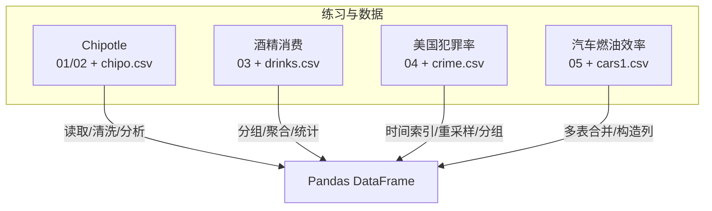
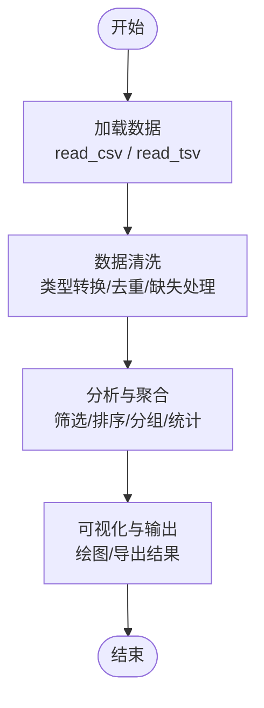
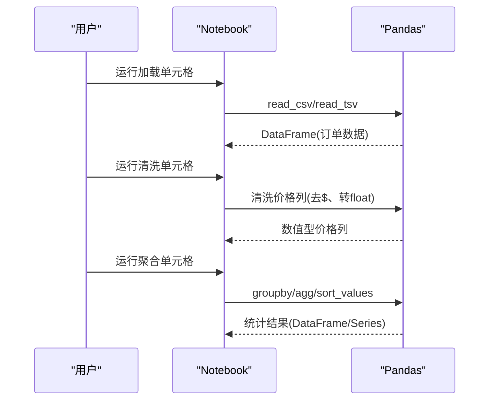
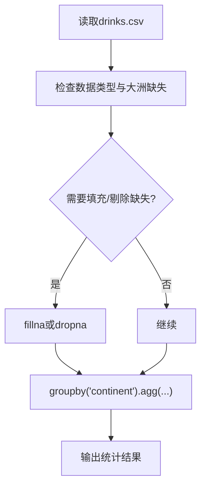
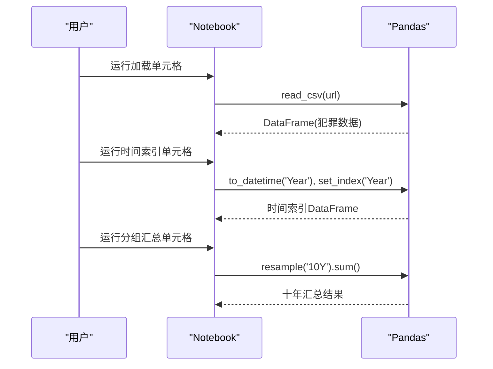
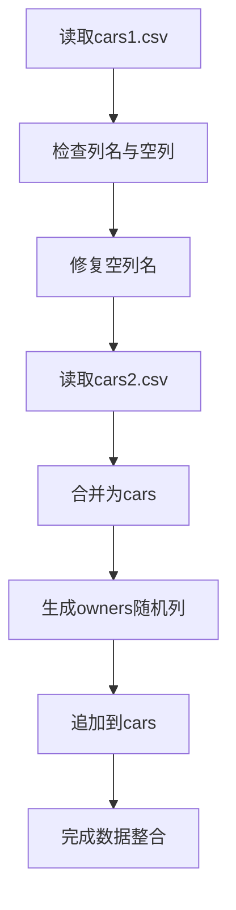
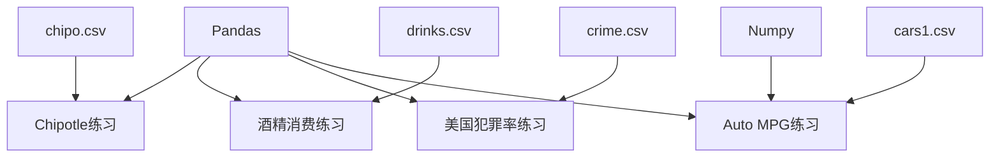

# 精选练习题

<cite>
**本文引用的文件**   
- [01_Chipotle_Exercises.ipynb](file://Excercise\01_Chipotle_Exercises.ipynb)
- [02_Chipotle_Exercises - with solution.ipynb](file://Excercise\02_Chipotle_Exercises - with solution.ipynb)
- [chipo.csv](file://Excercise\chipo.csv)
- [03_Alcohol_comsumption.ipynb](file://Excercise\03_Alcohol_comsumption.ipynb)
- [03_Alcohol_comsumption - with_solutions.ipynb](file://Excercise\03_Alcohol_comsumption - with_solutions.ipynb)
- [drinks.csv](file://Excercise\drinks.csv)
- [04_US_Crime_Exercises.ipynb](file://Excercise\04_US_Crime_Exercises.ipynb)
- [04_US_Crime_Exercises_with_solutions.ipynb](file://Excercise\04_US_Crime_Exercises_with_solutions.ipynb)
- [crime.csv](file://Excercise\crime.csv)
- [05_Auto_MPG\Exercises.ipynb](file://Excercise\05_Auto_MPG\Exercises.ipynb)
- [05_Auto_MPG\cars1.csv](file://Excercise\05_Auto_MPG\cars1.csv)
</cite>

## 目录
1. [简介](#简介)
2. [项目结构](#项目结构)
3. [核心练习概览](#核心练习概览)
4. [架构总览](#架构总览)
5. [详细练习分析](#详细练习分析)
6. [依赖关系分析](#依赖关系分析)
7. [性能与可维护性建议](#性能与可维护性建议)
8. [故障排查指南](#故障排查指南)
9. [结论](#结论)
10. [附录：交互式Jupyter操作步骤](#附录jupyter操作步骤)

## 简介
本文件面向“金融数据分析课程”的精选练习题，围绕四个真实案例展开：Chipotle餐饮订单、美国犯罪统计、全球酒精消费模式、汽车燃油效率（Auto MPG）。每个练习均包含问题描述、数据说明、解题思路与完整实现路径，并提供在Jupyter Notebook中的交互操作指引，帮助学习者将理论知识转化为解决实际问题的能力。

## 项目结构
仓库以“练习主题 + 数据 + Notebook”的方式组织，便于按主题学习与实践。关键目录与文件如下：
- Excercise/01_Chipotle_Exercises.ipynb：Chipotle订单数据探索与分析（无答案版）
- Excercise/02_Chipotle_Exercises - with solution.ipynb：Chipotle过滤与排序（含解答）
- Excercise/chipo.csv：本地化的Chipotle订单数据副本
- Excercise/03_Alcohol_comsumption.ipynb：酒精消费分组聚合（无答案版）
- Excercise/03_Alcohol_comsumption - with_solutions.ipynb：酒精消费分组聚合（含解答）
- Excercise/drinks.csv：本地化的酒精消费数据副本
- Excercise/04_US_Crime_Exercises.ipynb：美国犯罪率时间序列处理（无答案版）
- Excercise/04_US_Crime_Exercises_with_solutions.ipynb：美国犯罪率时间序列处理（含解答）
- Excercise/crime.csv：本地化的美国犯罪率数据副本
- Excercise/05_Auto_MPG/Exercises.ipynb：Auto MPG合并与增强（无答案版）
- Excercise/05_Auto_MPG/cars1.csv：Auto MPG数据集第一部分（含空列）

图表来源
- [01_Chipotle_Exercises.ipynb:1-520](file://Excercise\01_Chipotle_Exercises.ipynb#L1-L520)
- [02_Chipotle_Exercises - with solution.ipynb:1-200](file://Excercise\02_Chipotle_Exercises - with solution.ipynb#L1-L200)
- [chipo.csv:1-200](file://Excercise\chipo.csv#L1-L200)
- [03_Alcohol_comsumption.ipynb:1-268](file://Excercise\03_Alcohol_comsumption.ipynb#L1-L268)
- [03_Alcohol_comsumption - with_solutions.ipynb:1-200](file://Excercise\03_Alcohol_comsumption - with_solutions.ipynb#L1-L200)
- [drinks.csv:1-195](file://Excercise\drinks.csv#L1-L195)
- [04_US_Crime_Exercises.ipynb:1-193](file://Excercise\04_US_Crime_Exercises.ipynb#L1-L193)
- [04_US_Crime_Exercises_with_solutions.ipynb:1-200](file://Excercise\04_US_Crime_Exercises_with_solutions.ipynb#L1-L200)
- [crime.csv:1-57](file://Excercise\crime.csv#L1-L57)
- [05_Auto_MPG\Exercises.ipynb:1-157](file://Excercise\05_Auto_MPG\Exercises.ipynb#L1-L157)
- [05_Auto_MPG\cars1.csv:1-1](file://Excercise\05_Auto_MPG\cars1.csv#L1-L1)

章节来源
- [01_Chipotle_Exercises.ipynb:1-520](file://Excercise\01_Chipotle_Exercises.ipynb#L1-L520)
- [03_Alcohol_comsumption.ipynb:1-268](file://Excercise\03_Alcohol_comsumption.ipynb#L1-L268)
- [04_US_Crime_Exercises.ipynb:1-193](file://Excercise\04_US_Crime_Exercises.ipynb#L1-L193)
- [05_Auto_MPG\Exercises.ipynb:1-157](file://Excercise\05_Auto_MPG\Exercises.ipynb#L1-L157)

## 核心练习概览
- Chipotle餐饮数据分析：从原始订单数据中完成数据加载、价格字段清洗、去重、筛选、排序、聚合与收入计算等基础操作。
- 酒精消费模式分析：基于国家与大洲维度进行分组聚合，计算均值、中位数、最小/最大值等统计量，回答跨地区消费差异问题。
- 美国犯罪数据统计：将年份转换为时间类型并设为索引，删除冗余列，按十年分组汇总，识别最危险年代。
- 汽车燃油效率分析：合并两个CSV片段，修复缺失列名，补充随机列，完成数据整合与初步探索。

章节来源
- [01_Chipotle_Exercises.ipynb:1-520](file://Excercise\01_Chipotle_Exercises.ipynb#L1-L520)
- [03_Alcohol_comsumption.ipynb:1-268](file://Excercise\03_Alcohol_comsumption.ipynb#L1-L268)
- [04_US_Crime_Exercises.ipynb:1-193](file://Excercise\04_US_Crime_Exercises.ipynb#L1-L193)
- [05_Auto_MPG\Exercises.ipynb:1-157](file://Excercise\05_Auto_MPG\Exercises.ipynb#L1-L157)

## 架构总览
所有练习均以Pandas为核心数据处理库，遵循“导入数据 → 清洗与转换 → 分组/筛选/排序 → 统计与可视化”的统一流程。不同练习侧重点不同：
- Chipotle侧重字符串解析与数值化、去重与聚合
- 酒精消费侧重GroupBy与多种聚合函数
- 美国犯罪率侧重时间序列索引与分组汇总
- Auto MPG侧重多表合并与列构造

[此图为概念流程图，不直接映射具体代码文件]

## 详细练习分析

### 练习一：Chipotle餐饮数据分析
- 问题描述
  - 从在线TSV或本地CSV加载订单数据
  - 将价格字段由字符串转为浮点型
  - 统计订单数量、商品种类、总收入、平均客单价
  - 找出最受欢迎的商品及选择项
  - 计算高单价商品数量、排序与筛选
- 数据说明
  - 字段包括订单号、数量、商品名、选择描述、价格（含货币符号）
  - 价格字段为带$符号的字符串，需清洗为数值
- 解题思路
  - 使用pandas读取TSV/CSV，查看前几行确认字段
  - 清洗价格列：去除$和末尾空格，转float
  - 去重：基于商品名、数量、选择描述去重
  - 聚合：按商品名计数、按订单号聚合收入
  - 排序：按价格降序，筛选高价商品
- 关键步骤与参考位置
  - 数据加载与预览：见[01_Chipotle_Exercises.ipynb:20-55](file://Excercise\01_Chipotle_Exercises.ipynb#L20-L55)
  - 价格清洗与类型转换：见[02_Chipotle_Exercises - with solution.ipynb:78-84](file://Excercise\02_Chipotle_Exercises - with solution.ipynb#L78-L84)
  - 去重与筛选：见[02_Chipotle_Exercises - with solution.ipynb:92-103](file://Excercise\02_Chipotle_Exercises - with solution.ipynb#L92-L103)
  - 排序与高价商品统计：见[02_Chipotle_Exercises - with solution.ipynb:126-131](file://Excercise\02_Chipotle_Exercises - with solution.ipynb#L126-L131)
- 可视化建议
  - 商品销量Top N柱状图
  - 价格分布直方图
  - 订单收入随时间的折线图（若有时序字段）

图表来源
- [01_Chipotle_Exercises.ipynb:20-55](file://Excercise\01_Chipotle_Exercises.ipynb#L20-L55)
- [02_Chipotle_Exercises - with solution.ipynb:78-103](file://Excercise\02_Chipotle_Exercises - with solution.ipynb#L78-L103)

章节来源
- [01_Chipotle_Exercises.ipynb:1-520](file://Excercise\01_Chipotle_Exercises.ipynb#L1-L520)
- [02_Chipotle_Exercises - with solution.ipynb:1-200](file://Excercise\02_Chipotle_Exercises - with solution.ipynb#L1-L200)
- [chipo.csv:1-200](file://Excercise\chipo.csv#L1-L200)

### 练习二：酒精消费模式分析
- 问题描述
  - 按大洲分组，比较啤酒、烈酒、葡萄酒的平均消费量
  - 计算各洲纯酒精总量的均值、中位数、最小/最大值
  - 输出DataFrame形式的统计结果
- 数据说明
  - 字段包括国家、啤酒/烈酒/葡萄酒服务量、纯酒精总量、大洲代码
  - 部分大洲代码为空值，需考虑缺失处理
- 解题思路
  - 读取CSV，检查数据类型与大洲缺失
  - 使用groupby('continent')对数值列进行mean/median/min/max
  - 针对啤酒单独回答“哪个大洲平均啤酒消费最高”
  - 输出结构化结果，便于后续可视化
- 关键步骤与参考位置
  - 数据加载与预览：见[03_Alcohol_comsumption.ipynb:48-55](file://Excercise\03_Alcohol_comsumption.ipynb#L48-L55)
  - 分组聚合与统计：见[03_Alcohol_comsumption - with_solutions.ipynb:160-200](file://Excercise\03_Alcohol_comsumption - with_solutions.ipynb#L160-L200)
- 可视化建议
  - 各洲啤酒消费均值条形图
  - 各洲纯酒精总量箱线图
  - 大洲-酒类消费热力图

图表来源
- [03_Alcohol_comsumption.ipynb:48-55](file://Excercise\03_Alcohol_comsumption.ipynb#L48-L55)
- [03_Alcohol_comsumption - with_solutions.ipynb:160-200](file://Excercise\03_Alcohol_comsumption - with_solutions.ipynb#L160-L200)

章节来源
- [03_Alcohol_comsumption.ipynb:1-268](file://Excercise\03_Alcohol_comsumption.ipynb#L1-L268)
- [03_Alcohol_comsumption - with_solutions.ipynb:1-200](file://Excercise\03_Alcohol_comsumption - with_solutions.ipynb#L1-L200)
- [drinks.csv:1-195](file://Excercise\drinks.csv#L1-L195)

### 练习三：美国犯罪数据统计
- 问题描述
  - 将Year列转换为datetime类型并设为索引
  - 删除Total列（避免重复信息）
  - 按十年分组求和（注意Population不应相加）
  - 判断最危险的年代（按暴力犯罪或总犯罪数）
- 数据说明
  - 字段包括年份、人口、总犯罪、暴力犯罪、财产犯罪及细分罪名
  - 时间跨度为1960-2014年
- 解题思路
  - 读取CSV，检查Year类型
  - 转换Year为datetime，设置索引
  - 删除Total列
  - 使用resample或自定义分组键（如year//10*10）进行十年分组
  - 对除Population外的数值列求和，得到十年汇总
  - 根据暴力犯罪或总犯罪指标确定最危险年代
- 关键步骤与参考位置
  - 数据加载与保存本地副本：见[04_US_Crime_Exercises.ipynb:50-66](file://Excercise\04_US_Crime_Exercises.ipynb#L50-L66)
  - 类型转换与索引设置：见[04_US_Crime_Exercises_with_solutions.ipynb:190-200](file://Excercise\04_US_Crime_Exercises_with_solutions.ipynb#L190-L200)
  - 分组汇总与最危险年代判定：见[04_US_Crime_Exercises_with_solutions.ipynb:200-250](file://Excercise\04_US_Crime_Exercises_with_solutions.ipynb#L200-L250)
- 可视化建议
  - 十年暴力犯罪趋势折线图
  - 各年代犯罪构成堆叠面积图

图表来源
- [04_US_Crime_Exercises.ipynb:50-66](file://Excercise\04_US_Crime_Exercises.ipynb#L50-L66)
- [04_US_Crime_Exercises_with_solutions.ipynb:190-250](file://Excercise\04_US_Crime_Exercises_with_solutions.ipynb#L190-L250)

章节来源
- [04_US_Crime_Exercises.ipynb:1-193](file://Excercise\04_US_Crime_Exercises.ipynb#L1-L193)
- [04_US_Crime_Exercises_with_solutions.ipynb:1-200](file://Excercise\04_US_Crime_Exercises_with_solutions.ipynb#L1-L200)
- [crime.csv:1-57](file://Excercise\crime.csv#L1-L57)

### 练习四：汽车燃油效率（Auto MPG）
- 问题描述
  - 读取两个CSV片段（cars1与cars2），修复cars1的空列名
  - 统计观测数，合并为单一DataFrame
  - 生成缺失的owners列（随机数范围）
  - 添加新列到主表
- 数据说明
  - cars1存在未命名空白列，需清理并重命名列
  - 合并后需补充owners列（随机整数）
- 解题思路
  - 读取cars1与cars2，检查列名与缺失列
  - 清理空列名（例如用pd.rename或自动命名策略）
  - 使用concat或merge合并两表
  - 生成随机Series作为owners列，长度匹配
  - 将owners列加入主表
- 关键步骤与参考位置
  - 数据加载与观察：见[05_Auto_MPG\Exercises.ipynb:34-52](file://Excercise\05_Auto_MPG\Exercises.ipynb#L34-L52)
  - 空列修复与合并：见[05_Auto_MPG\Exercises.ipynb:57-100](file://Excercise\05_Auto_MPG\Exercises.ipynb#L57-L100)
  - 生成随机列与追加：见[05_Auto_MPG\Exercises.ipynb:105-132](file://Excercise\05_Auto_MPG\Exercises.ipynb#L105-L132)
- 可视化建议
  - 各origin的mpg分布箱线图
  - horsepower与mpg散点图

图表来源
- [05_Auto_MPG\Exercises.ipynb:34-132](file://Excercise\05_Auto_MPG\Exercises.ipynb#L34-L132)
- [05_Auto_MPG\cars1.csv:1-1](file://Excercise\05_Auto_MPG\cars1.csv#L1-L1)

章节来源
- [05_Auto_MPG\Exercises.ipynb:1-157](file://Excercise\05_Auto_MPG\Exercises.ipynb#L1-L157)
- [05_Auto_MPG\cars1.csv:1-1](file://Excercise\05_Auto_MPG\cars1.csv#L1-L1)

## 依赖关系分析
- 外部依赖
  - pandas：用于数据读取、清洗、分组、聚合、时间序列处理
  - numpy：在部分练习中用于生成随机数（如Auto MPG的owners列）
- 数据依赖
  - chipo.csv、drinks.csv、crime.csv、cars1.csv为本地数据副本，便于离线运行
  - 原始数据来源于公开URL，Notebook中包含读取示例
- 模块耦合
  - 各练习相互独立，通过统一的Pandas接口协作
  - 建议在统一环境中管理依赖版本，确保兼容性

图表来源
- [01_Chipotle_Exercises.ipynb:1-520](file://Excercise\01_Chipotle_Exercises.ipynb#L1-L520)
- [03_Alcohol_comsumption.ipynb:1-268](file://Excercise\03_Alcohol_comsumption.ipynb#L1-L268)
- [04_US_Crime_Exercises.ipynb:1-193](file://Excercise\04_US_Crime_Exercises.ipynb#L1-L193)
- [05_Auto_MPG\Exercises.ipynb:1-157](file://Excercise\05_Auto_MPG\Exercises.ipynb#L1-L157)

章节来源
- [01_Chipotle_Exercises.ipynb:1-520](file://Excercise\01_Chipotle_Exercises.ipynb#L1-L520)
- [03_Alcohol_comsumption.ipynb:1-268](file://Excercise\03_Alcohol_comsumption.ipynb#L1-L268)
- [04_US_Crime_Exercises.ipynb:1-193](file://Excercise\04_US_Crime_Exercises.ipynb#L1-L193)
- [05_Auto_MPG\Exercises.ipynb:1-157](file://Excercise\05_Auto_MPG\Exercises.ipynb#L1-L157)

## 性能与可维护性建议
- 数据规模
  - Chipotle订单数据约数千行，内存占用低；酒精消费与美国犯罪率数据规模适中；Auto MPG数据较小
  - 对于更大规模数据，建议使用分块读取（chunksize）或数据库连接
- 计算优化
  - 优先使用向量化操作（如applymap、str.replace、astype）替代循环
  - 分组聚合尽量使用内置agg方法，减少中间对象创建
- 可维护性
  - 将数据加载与清洗逻辑封装为函数，提高复用性
  - 使用常量定义列名与路径，避免硬编码
  - 在Notebook中添加清晰的注释与步骤标题，便于教学与复现

[本节为通用指导，不直接分析具体文件]

## 故障排查指南
- 常见错误
  - 读取TSV时分隔符设置错误：确保sep='\t'
  - 价格字段清洗失败：检查是否包含$与空格，必要时strip与正则替换
  - 时间索引转换失败：确认Year列格式与to_datetime参数
  - 分组聚合时出现NaN：检查大洲代码缺失，决定fillna或dropna策略
  - 合并表形状不一致：检查索引与列名对齐，必要时reset_index
- 调试技巧
  - 使用head/tail快速查看数据前后段
  - 使用info/dtypes检查数据类型与缺失情况
  - 使用describe进行基本统计，定位异常值
  - 逐步执行单元格，定位错误发生位置

章节来源
- [01_Chipotle_Exercises.ipynb:1-520](file://Excercise\01_Chipotle_Exercises.ipynb#L1-L520)
- [03_Alcohol_comsumption.ipynb:1-268](file://Excercise\03_Alcohol_comsumption.ipynb#L1-L268)
- [04_US_Crime_Exercises.ipynb:1-193](file://Excercise\04_US_Crime_Exercises.ipynb#L1-L193)
- [05_Auto_MPG\Exercises.ipynb:1-157](file://Excercise\05_Auto_MPG\Exercises.ipynb#L1-L157)

## 结论
本套精选练习题覆盖了数据加载、清洗、分组聚合、时间序列处理与多表合并等核心技能，结合真实业务场景，有助于培养实际问题分析与解决能力。通过Jupyter Notebook的交互式环境，学习者可以逐步验证假设、迭代优化，最终形成可复用的分析流程。

[本节为总结性内容，不直接分析具体文件]

## 附录：交互式Jupyter操作步骤
- 环境准备
  - 安装Anaconda或Miniconda，创建Python 3.9+环境
  - 安装依赖：pip install pandas numpy matplotlib seaborn
- 启动Jupyter
  - 命令行进入项目根目录：cd 
  - 运行：jupyter notebook
- 打开练习文件
  - 依次打开Excercise下的各.ipynb文件
  - 按顺序执行单元格，观察输出结果
- 数据加载与本地化
  - 首次可从网络URL读取，随后保存到本地CSV以便离线运行
  - 参考各Notebook中的read_csv/read_tsv与to_csv调用
- 分析与可视化
  - 使用Pandas进行清洗与聚合
  - 使用matplotlib/seaborn绘制图表，嵌入Notebook
- 常见问题
  - 网络访问失败：改用本地CSV副本
  - 编码问题：指定encoding='utf-8'或'latin-1'
  - 内存不足：减少数据规模或分块处理

[本节为操作指导，不直接分析具体文件]