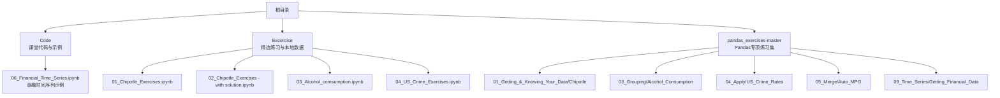
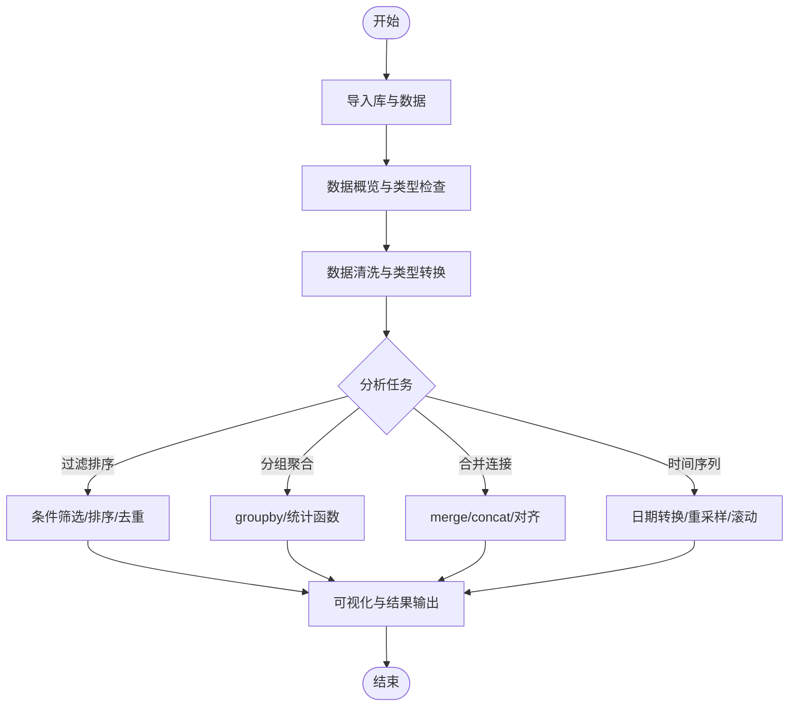
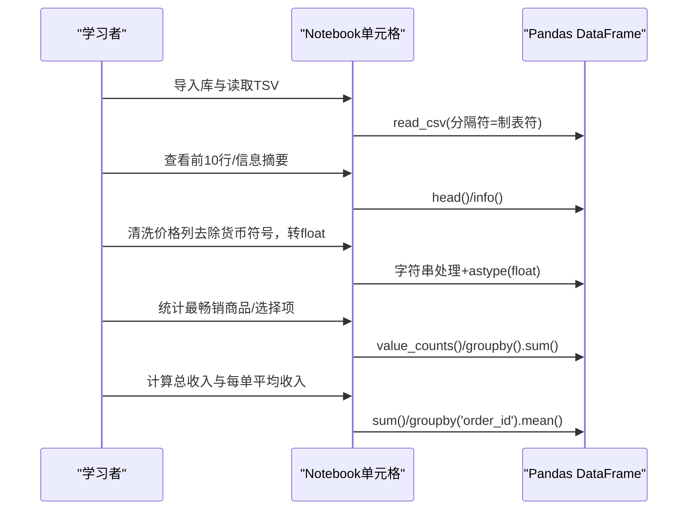
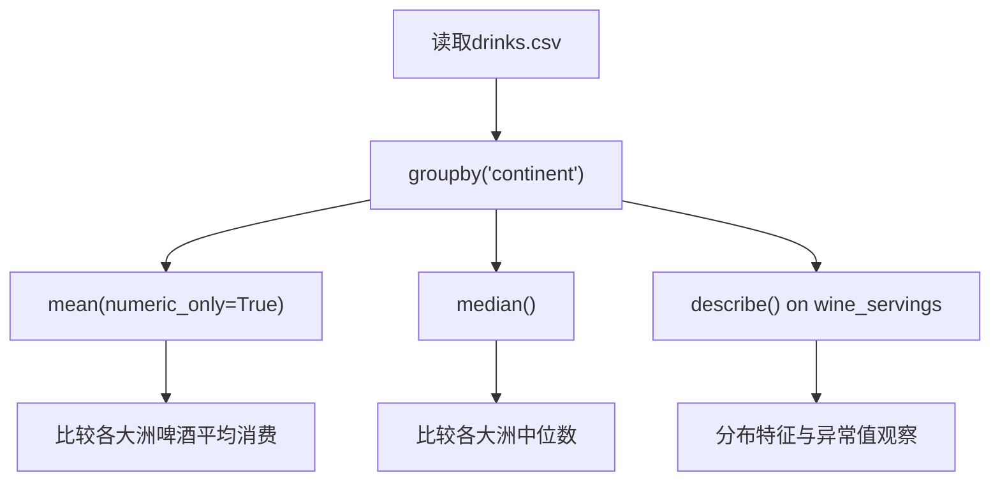
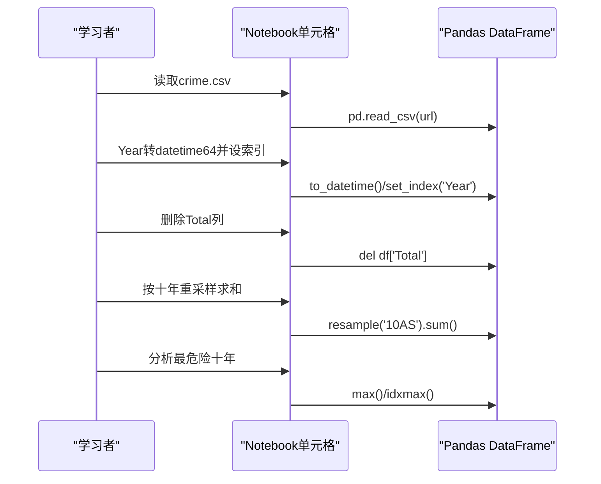
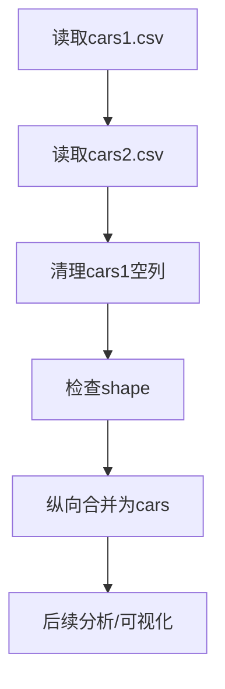
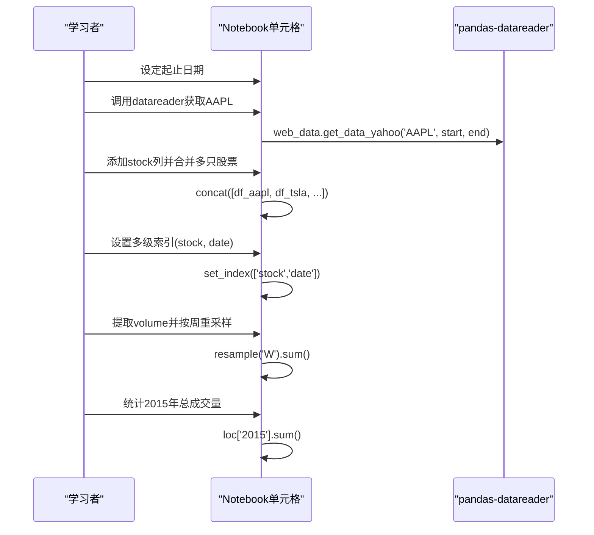
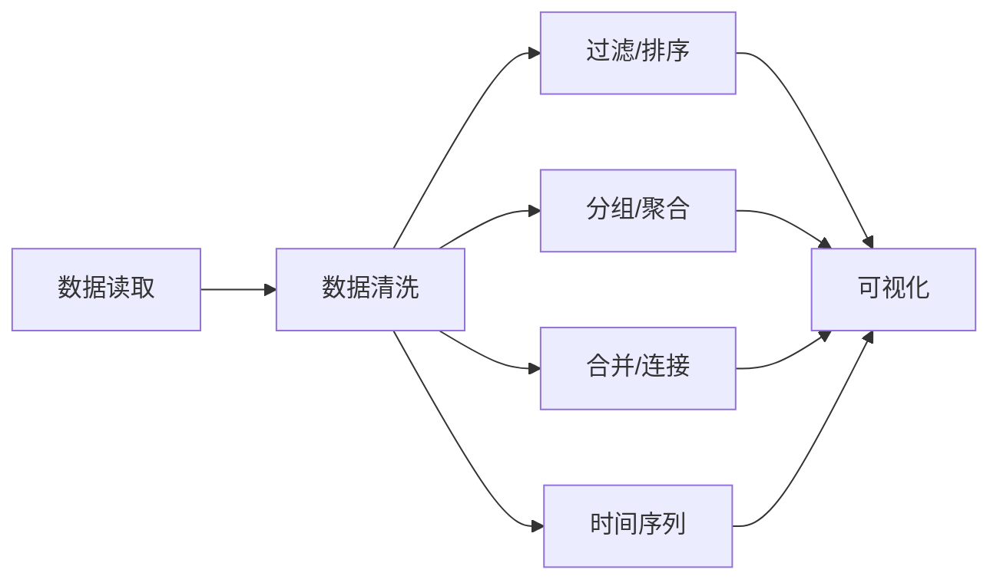

# 练习与实践

<cite>
**本文引用的文件**   
- [pandas_exercises-master/README.md](file://pandas_exercises-master/README.md)
- [Excercise/01_Chipotle_Exercises.ipynb](file://Excercise/01_Chipotle_Exercises.ipynb)
- [Excercise/02_Chipotle_Exercises - with solution.ipynb](file://Excercise/02_Chipotle_Exercises - with solution.ipynb)
- [Excercise/03_Alcohol_comsumption.ipynb](file://Excercise/03_Alcohol_comsumption.ipynb)
- [Excercise/04_US_Crime_Exercises.ipynb](file://Excercise/04_US_Crime_Exercises.ipynb)
- [pandas_exercises-master/01_Getting_&_Knowing_Your_Data/Chipotle/Exercises.ipynb](file://pandas_exercises-master/01_Getting_&_Knowing_Your_Data/Chipotle/Exercises.ipynb)
- [pandas_exercises-master/03_Grouping/Alcohol_Consumption/Exercise_with_solutions.ipynb](file://pandas_exercises-master/03_Grouping/Alcohol_Consumption/Exercise_with_solutions.ipynb)
- [pandas_exercises-master/04_Apply/US_Crime_Rates/Exercises_with_solutions.ipynb](file://pandas_exercises-master/04_Apply/US_Crime_Rates/Exercises_with_solutions.ipynb)
- [pandas_exercises-master/05_Merge/Auto_MPG/Exercises_with_solutions.ipynb](file://pandas_exercises-master/05_Merge/Auto_MPG/Exercises_with_solutions.ipynb)
- [pandas_exercises-master/09_Time_Series/Getting_Financial_Data/Exercises.ipynb](file://pandas_exercises-master/09_Time_Series/Getting_Financial_Data/Exercises.ipynb)
- [Code/06_Financial_Time_Series.ipynb](file://Code/06_Financial_Time_Series.ipynb)
</cite>

## 目录
1. [引言](#引言)
2. [项目结构](#项目结构)
3. [核心组件](#核心组件)
4. [架构总览](#架构总览)
5. [详细组件分析](#详细组件分析)
6. [依赖关系分析](#依赖关系分析)
7. [性能与效率建议](#性能与效率建议)
8. [故障排查指南](#故障排查指南)
9. [结论](#结论)
10. [附录：端到端金融数据分析实战流程](#附录端到端金融数据分析实战流程)

## 引言
本指南面向希望系统掌握Pandas数据处理与分析的学习者，围绕精选练习题与数据集，提供从数据获取、清洗、过滤排序、分组聚合、合并连接，到可视化与时间序列分析的完整实践路径。内容覆盖三大经典案例：
- Chipotle餐饮订单数据分析（入门与进阶）
- 美国犯罪数据统计（时间序列与重采样）
- 酒精消费模式分析（分组统计与描述性统计）

同时配套“Pandas专项练习集”的完整使用指南，并给出解题思路、代码实现位置与结果分析要点，帮助学习者将理论知识转化为实际操作能力。

## 项目结构
仓库包含三类资源：
- 课堂代码与示例Notebook：用于演示基础概念与操作
- 精选练习与解决方案：按主题分目录组织，便于循序渐进学习
- Pandas专项练习集：系统化训练各项技能，含题目、无代码答案、带注释答案

**图表来源** 
- [pandas_exercises-master/README.md:1-77](file://pandas_exercises-master/README.md#L1-L77)

**章节来源**
- [pandas_exercises-master/README.md:1-77](file://pandas_exercises-master/README.md#L1-L77)

## 核心组件
- 数据获取与加载：从CSV、TSV或在线URL读取数据，处理分隔符与编码
- 数据清洗与类型转换：清理价格字符串、转换为数值类型、处理缺失值
- 过滤与排序：条件筛选、去重、排序与Top-N查询
- 分组与聚合：groupby多列分组、均值/中位数/标准差等统计
- 合并与连接：横向拼接、纵向堆叠、键对齐
- 时间序列：日期类型转换、索引设置、重采样与滚动窗口
- 可视化：基于DataFrame/Series的图表输出（配合matplotlib/seaborn）

**章节来源**
- [Excercise/01_Chipotle_Exercises.ipynb:1-520](file://Excercise/01_Chipotle_Exercises.ipynb#L1-L520)
- [Excercise/02_Chipotle_Exercises - with solution.ipynb:1-241](file://Excercise/02_Chipotle_Exercises - with solution.ipynb#L1-L241)
- [Excercise/03_Alcohol_comsumption.ipynb:1-268](file://Excercise/03_Alcohol_comsumption.ipynb#L1-L268)
- [Excercise/04_US_Crime_Exercises.ipynb:1-193](file://Excercise/04_US_Crime_Exercises.ipynb#L1-L193)
- [pandas_exercises-master/05_Merge/Auto_MPG/Exercises_with_solutions.ipynb:1-800](file://pandas_exercises-master/05_Merge/Auto_MPG/Exercises_with_solutions.ipynb#L1-L800)
- [pandas_exercises-master/09_Time_Series/Getting_Financial_Data/Exercises.ipynb:1-190](file://pandas_exercises-master/09_Time_Series/Getting_Financial_Data/Exercises.ipynb#L1-L190)

## 架构总览
以“数据→清洗→分析→可视化”为主线，各练习模块遵循统一工作流：
- 导入库与数据源
- 数据概览与类型检查
- 数据清洗与特征工程
- 问题求解（过滤/分组/合并/时间序列）
- 结果解释与可视化

[此图为概念流程图，不直接映射具体源码文件]

## 详细组件分析

### 组件A：Chipotle餐饮数据分析（入门与进阶）
- 学习目标：数据读取、字段清洗、计数与聚合、价格计算、收入统计
- 关键步骤：
  - 从TSV读取订单数据，查看前若干行
  - 统计观测数、列名、索引类型
  - 识别最畅销商品与选择项
  - 清洗价格字段为浮点数，计算总收入与每单平均收入
  - 统计不同商品数量与订单总数
- 进阶练习：过滤单价高于阈值的商品、排序与Top-N、去重后统计

**图表来源** 
- [Excercise/01_Chipotle_Exercises.ipynb:1-520](file://Excercise/01_Chipotle_Exercises.ipynb#L1-L520)
- [pandas_exercises-master/01_Getting_&_Knowing_Your_Data/Chipotle/Exercises.ipynb:1-370](file://pandas_exercises-master/01_Getting_&_Knowing_Your_Data/Chipotle/Exercises.ipynb#L1-L370)

**章节来源**
- [Excercise/01_Chipotle_Exercises.ipynb:1-520](file://Excercise/01_Chipotle_Exercises.ipynb#L1-L520)
- [pandas_exercises-master/01_Getting_&_Knowing_Your_Data/Chipotle/Exercises.ipynb:1-370](file://pandas_exercises-master/01_Getting_&_Knowing_Your_Data/Chipotle/Exercises.ipynb#L1-L370)

### 组件B：酒精消费模式分析（分组与描述性统计）
- 学习目标：按国家/大洲分组，计算均值、中位数、标准差与分布描述
- 关键步骤：
  - 读取各国酒精消费数据
  - 按continent分组求各类饮品的平均值
  - 对wine_servings进行describe()观察分布
  - 输出每个大洲的median与mean对比
  - 针对spirit_servings输出mean/min/max的多指标结果

**图表来源** 
- [Excercise/03_Alcohol_comsumption.ipynb:1-268](file://Excercise/03_Alcohol_comsumption.ipynb#L1-L268)
- [pandas_exercises-master/03_Grouping/Alcohol_Consumption/Exercise_with_solutions.ipynb:1-800](file://pandas_exercises-master/03_Grouping/Alcohol_Consumption/Exercise_with_solutions.ipynb#L1-L800)

**章节来源**
- [Excercise/03_Alcohol_comsumption.ipynb:1-268](file://Excercise/03_Alcohol_comsumption.ipynb#L1-L268)
- [pandas_exercises-master/03_Grouping/Alcohol_Consumption/Exercise_with_solutions.ipynb:1-800](file://pandas_exercises-master/03_Grouping/Alcohol_Consumption/Exercise_with_solutions.ipynb#L1-L800)

### 组件C：美国犯罪数据统计（时间序列与重采样）
- 学习目标：年份列转为datetime、设置索引、删除冗余列、按十年重采样求和
- 关键步骤：
  - 读取US Crime Rates CSV
  - 将Year列转换为datetime64，设为索引
  - 删除Total列避免重复汇总
  - 使用resample('10AS').sum()按十年聚合
  - 判断哪个十年最危险（暴力犯罪最高）

**图表来源** 
- [Excercise/04_US_Crime_Exercises.ipynb:1-193](file://Excercise/04_US_Crime_Exercises.ipynb#L1-L193)
- [pandas_exercises-master/04_Apply/US_Crime_Rates/Exercises_with_solutions.ipynb:1-800](file://pandas_exercises-master/04_Apply/US_Crime_Rates/Exercises_with_solutions.ipynb#L1-L800)

**章节来源**
- [Excercise/04_US_Crime_Exercises.ipynb:1-193](file://Excercise/04_US_Crime_Exercises.ipynb#L1-L193)
- [pandas_exercises-master/04_Apply/US_Crime_Rates/Exercises_with_solutions.ipynb:1-800](file://pandas_exercises-master/04_Apply/US_Crime_Rates/Exercises_with_solutions.ipynb#L1-L800)

### 组件D：Auto MPG合并与连接（多表整合）
- 学习目标：读取两个汽车数据集，清理空列，纵向合并，形状检查
- 关键步骤：
  - 读取cars1.csv与cars2.csv
  - 清理cars1中的Unnamed列，保留有效字段
  - 检查两表行数
  - 使用concat或append合并为单一DataFrame
  - 后续可进行统计分析或可视化

**图表来源** 
- [pandas_exercises-master/05_Merge/Auto_MPG/Exercises_with_solutions.ipynb:1-800](file://pandas_exercises-master/05_Merge/Auto_MPG/Exercises_with_solutions.ipynb#L1-L800)

**章节来源**
- [pandas_exercises-master/05_Merge/Auto_MPG/Exercises_with_solutions.ipynb:1-800](file://pandas_exercises-master/05_Merge/Auto_MPG/Exercises_with_solutions.ipynb#L1-L800)

### 组件E：金融时间序列与数据获取（端到端实战）
- 学习目标：通过API获取股票日频数据，构建多级别索引，周度聚合，年度统计
- 关键步骤：
  - 定义时间范围（起始与结束）
  - 使用pandas-datareader获取AAPL/TSLA/IBM/MSFT日线数据
  - 添加股票代码列，合并为统一DataFrame
  - 将stock列移入索引形成多级索引（ticker, date）
  - 提取成交量vol，按周重采样聚合
  - 统计2015年总成交量

**图表来源** 
- [pandas_exercises-master/09_Time_Series/Getting_Financial_Data/Exercises.ipynb:1-190](file://pandas_exercises-master/09_Time_Series/Getting_Financial_Data/Exercises.ipynb#L1-L190)
- [Code/06_Financial_Time_Series.ipynb:1-800](file://Code/06_Financial_Time_Series.ipynb#L1-L800)

**章节来源**
- [pandas_exercises-master/09_Time_Series/Getting_Financial_Data/Exercises.ipynb:1-190](file://pandas_exercises-master/09_Time_Series/Getting_Financial_Data/Exercises.ipynb#L1-L190)
- [Code/06_Financial_Time_Series.ipynb:1-800](file://Code/06_Financial_Time_Series.ipynb#L1-L800)

## 依赖关系分析
- Notebook间存在主题依赖：例如“分组聚合”练习依赖于基础的“数据读取与清洗”；“时间序列”练习依赖于“日期类型转换与索引设置”
- 数据源依赖：部分练习直接从外部URL读取数据，需保证网络可达与API可用
- 工具链依赖：pandas、numpy、matplotlib/seaborn（可视化）、pandas-datareader（金融数据）

[此图为概念依赖图，不直接映射具体源码文件]

**章节来源**
- [pandas_exercises-master/README.md:1-77](file://pandas_exercises-master/README.md#L1-L77)

## 性能与效率建议
- 优先使用向量化操作（如astype、str.replace、apply较少的场景）
- 大数据量时避免逐行循环，改用groupby与agg组合
- 合理设置索引与列类型，减少内存占用
- 时间序列重采样时使用合适的频率（如'10AS'、'W'），避免不必要的中间对象
- 合并连接前先确认键的唯一性与一致性，必要时先做去重与类型对齐

[本节为通用建议，不直接引用具体文件]

## 故障排查指南
- 读取失败或乱码：检查分隔符、编码格式与URL可达性
- 类型错误：确保价格等字符串已正确转换为数值类型
- 分组结果为空或NaN：检查分组键是否存在缺失值，必要时填充或删除
- 时间序列重采样异常：确认索引为datetime类型且单调递增
- 合并结果出现大量NaN：检查键是否匹配，必要时使用how参数调整连接方式

**章节来源**
- [Excercise/01_Chipotle_Exercises.ipynb:1-520](file://Excercise/01_Chipotle_Exercises.ipynb#L1-L520)
- [Excercise/04_US_Crime_Exercises.ipynb:1-193](file://Excercise/04_US_Crime_Exercises.ipynb#L1-L193)

## 结论
本指南通过三大经典案例与Pandas专项练习集，构建了从基础到进阶的完整学习路径。学习者可在真实数据上反复演练数据获取、清洗、分析与可视化的全流程，逐步提升解决实际问题的能力。建议结合“无代码答案”与“带注释答案”两种版本进行自我检验与对照学习，并在团队中开展协作式项目实践，强化沟通与分工能力。

[本节为总结性内容，不直接引用具体文件]

## 附录：端到端金融数据分析实战流程
- 目标：完成一次完整的金融数据分析项目，涵盖数据获取、清洗、分析、可视化与报告
- 步骤：
  1) 明确业务问题（如某股票波动性分析、多股收益对比）
  2) 数据获取（pandas-datareader或本地CSV）
  3) 数据清洗（缺失值处理、类型转换、异常值检测）
  4) 特征工程（收益率、波动率、移动平均等）
  5) 分析建模（分组统计、时间序列分解、相关性分析）
  6) 可视化与报告（图表输出、结论与建议）
- 参考练习：
  - 金融时间序列与数据获取：[pandas_exercises-master/09_Time_Series/Getting_Financial_Data/Exercises.ipynb:1-190](file://pandas_exercises-master/09_Time_Series/Getting_Financial_Data/Exercises.ipynb#L1-L190)
  - 课堂示例：[Code/06_Financial_Time_Series.ipynb:1-800](file://Code/06_Financial_Time_Series.ipynb#L1-L800)

**章节来源**
- [pandas_exercises-master/09_Time_Series/Getting_Financial_Data/Exercises.ipynb:1-190](file://pandas_exercises-master/09_Time_Series/Getting_Financial_Data/Exercises.ipynb#L1-L190)
- [Code/06_Financial_Time_Series.ipynb:1-800](file://Code/06_Financial_Time_Series.ipynb#L1-L800)