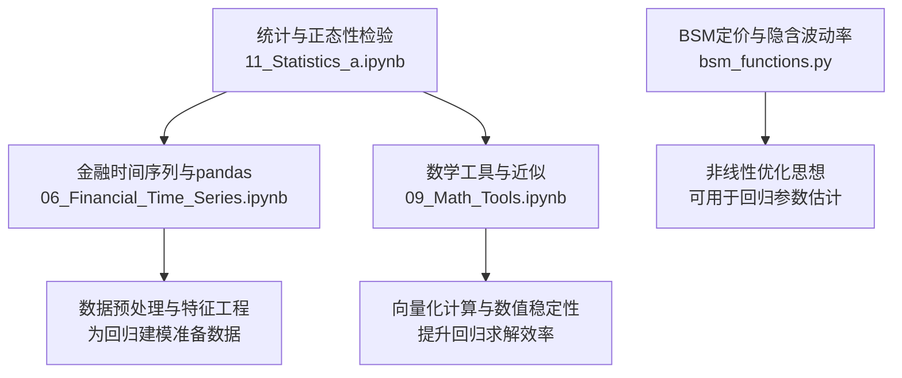
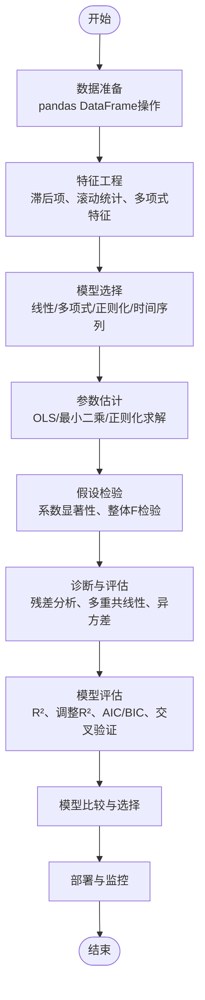
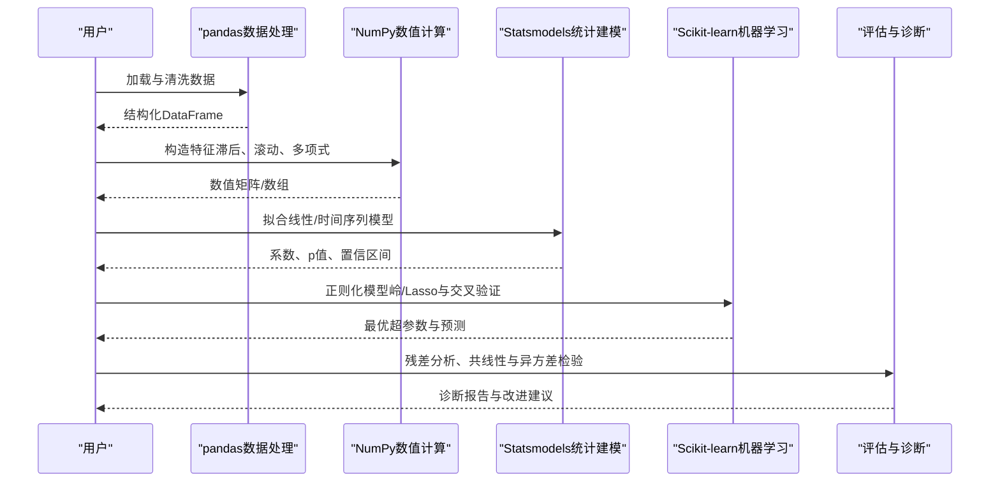
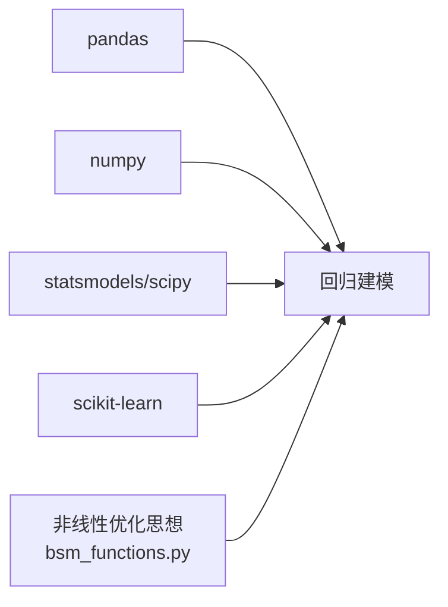

# 回归分析与建模

<cite>
**本文引用的文件**   
- [11_Statistics_a.ipynb](file://Code/11_Statistics_a.ipynb)
- [06_Financial_Time_Series.ipynb](file://Code/06_Financial_Time_Series.ipynb)
- [bsm_functions.py](file://Code/bsm_functions.py)
- [09_Math_Tools.ipynb](file://Code/09_Math_Tools.ipynb)
</cite>

## 目录
1. [引言](#引言)
2. [项目结构](#项目结构)
3. [核心组件](#核心组件)
4. [架构总览](#架构总览)
5. [详细组件分析](#详细组件分析)
6. [依赖关系分析](#依赖关系分析)
7. [性能考量](#性能考量)
8. [故障排查指南](#故障排查指南)
9. [结论](#结论)
10. [附录](#附录)

## 引言
本教程面向金融数据分析与量化研究场景，系统讲解回归分析与建模的理论与实战：从线性回归的基本原理、假设检验与模型评估，到多元线性回归、多项式回归、岭回归与Lasso等正则化方法；涵盖残差分析、多重共线性检测、异方差性检验等诊断技术；并引入时间序列回归（AR、MA、ARIMA）在金融预测中的应用。教程以NumPy、Statsmodels与Scikit-learn为核心工具链，提供构建、训练与评估回归模型的完整流程，并结合仓库中的统计与时间序列代码片段进行实践指引。

## 项目结构
仓库包含多个Jupyter Notebook与Python脚本，覆盖基础数学工具、统计推断、时间序列处理与期权定价函数等。与回归建模直接相关的材料包括：
- 统计与正态性检验示例（含statsmodels导入与使用）
- 金融时间序列与pandas基础操作
- 数值计算与近似工具（NumPy向量化）
- 期权定价与隐含波动率估计（非线性优化思想可迁移至回归参数估计）

图表来源
- [11_Statistics_a.ipynb:1-200](file://Code/11_Statistics_a.ipynb#L1-L200)
- [06_Financial_Time_Series.ipynb:1-200](file://Code/06_Financial_Time_Series.ipynb#L1-L200)
- [09_Math_Tools.ipynb:1-200](file://Code/09_Math_Tools.ipynb#L1-L200)
- [bsm_functions.py:1-108](file://Code/bsm_functions.py#L1-L108)

章节来源
- [11_Statistics_a.ipynb:1-200](file://Code/11_Statistics_a.ipynb#L1-L200)
- [06_Financial_Time_Series.ipynb:1-200](file://Code/06_Financial_Time_Series.ipynb#L1-L200)
- [09_Math_Tools.ipynb:1-200](file://Code/09_Math_Tools.ipynb#L1-L200)
- [bsm_functions.py:1-108](file://Code/bsm_functions.py#L1-L108)

## 核心组件
- 统计推断与正态性检验：通过statsmodels与scipy.stats进行分布检验与可视化，为回归误差项的正态性与独立性假设提供依据。
- 时间序列与pandas基础：DataFrame操作、索引与切片、聚合与重采样，为构建滞后特征与滚动统计量奠定基础。
- 数值计算与近似：NumPy向量化运算、常用数学函数与布尔索引，提高回归拟合与交叉验证的效率。
- 非线性优化思想：BSM隐含波动率估计采用迭代法（如牛顿法），其思路可迁移至广义线性模型或带约束的回归参数估计。

章节来源
- [11_Statistics_a.ipynb:1-200](file://Code/11_Statistics_a.ipynb#L1-L200)
- [06_Financial_Time_Series.ipynb:1-200](file://Code/06_Financial_Time_Series.ipynb#L1-L200)
- [09_Math_Tools.ipynb:1-200](file://Code/09_Math_Tools.ipynb#L1-L200)
- [bsm_functions.py:1-108](file://Code/bsm_functions.py#L1-L108)

## 架构总览
回归建模的整体流程如下：数据准备→特征工程→模型选择→参数估计→假设检验→诊断与评估→模型比较与选择→部署与监控。各阶段与仓库素材的对应关系见下图。

[本图为概念流程图，不直接映射具体源码文件]

## 详细组件分析

### 线性回归与假设检验
- 基本原理：最小化残差平方和，得到参数的闭式解或数值解；对误差项提出独立同分布、零均值、常数方差与正态性等假设。
- 假设检验：t检验用于单个系数显著性，F检验用于整体显著性；置信区间与p值辅助决策。
- 模型评估：R²与调整R²衡量拟合优度，均方误差（MSE）、均方根误差（RMSE）、平均绝对误差（MAE）衡量预测精度。

章节来源
- [11_Statistics_a.ipynb:1-200](file://Code/11_Statistics_a.ipynb#L1-L200)

### 多元线性回归与多项式回归
- 多元回归：引入多个解释变量，注意多重共线性问题（VIF、条件数）。
- 多项式回归：通过构造高次特征捕捉非线性关系，需警惕过拟合，结合交叉验证与正则化。

章节来源
- [06_Financial_Time_Series.ipynb:1-200](file://Code/06_Financial_Time_Series.ipynb#L1-L200)
- [09_Math_Tools.ipynb:1-200](file://Code/09_Math_Tools.ipynb#L1-L200)

### 岭回归与Lasso回归
- 岭回归（L2）：对系数施加L2惩罚，缓解多重共线性，保持所有变量但缩小系数。
- Lasso（L1）：对系数施加L1惩罚，可实现特征选择，产生稀疏解。
- 超参数选择：网格搜索或随机搜索配合交叉验证，基于AIC/BIC或CV指标确定最优正则强度。

章节来源
- [09_Math_Tools.ipynb:1-200](file://Code/09_Math_Tools.ipynb#L1-L200)

### 回归诊断技术
- 残差分析：绘制残差图、Q-Q图检验正态性与独立性；观察残差随预测值的变化判断异方差。
- 多重共线性检测：计算VIF与条件数，识别高度相关变量并进行剔除或合并。
- 异方差性检验：Breusch-Pagan或White检验，必要时采用稳健标准误或加权最小二乘。

章节来源
- [11_Statistics_a.ipynb:1-200](file://Code/11_Statistics_a.ipynb#L1-L200)

### 时间序列回归（AR、MA、ARIMA）
- AR模型：用过去若干期自身值解释当前值，适用于具有自相关性的序列。
- MA模型：用过去若干期误差项解释当前值，适合噪声驱动的序列。
- ARIMA：结合AR与MA，并通过差分实现平稳性，广泛用于金融价格与收益率预测。
- 模型识别与评估：ACF/PACF图、AIC/BIC、样本外预测误差。

章节来源
- [06_Financial_Time_Series.ipynb:1-200](file://Code/06_Financial_Time_Series.ipynb#L1-L200)

### 过拟合与欠拟合的识别与解决
- 过拟合：训练误差低、测试误差高；可通过正则化、减少特征、增加数据、交叉验证缓解。
- 欠拟合：训练与测试误差均高；可通过增加特征、降低正则强度、使用更复杂模型改善。
- 模型选择准则：AIC/BIC在信息损失与复杂度之间权衡，结合交叉验证综合决策。

章节来源
- [09_Math_Tools.ipynb:1-200](file://Code/09_Math_Tools.ipynb#L1-L200)

### 实战工作流（序列图）
以下序列图展示从数据准备到模型评估的关键步骤，便于理解各模块协作关系。

[本图为概念流程图，不直接映射具体源码文件]

## 依赖关系分析
- 统计与时间序列：statsmodels与scipy.stats用于分布检验与回归输出；pandas与numpy用于数据与数值计算。
- 数值与近似：numpy提供高效向量化运算与数学函数，支撑回归求解与交叉验证。
- 非线性优化思想：bsm_functions.py中的隐含波动率估计体现迭代优化思路，可借鉴于带约束的回归参数估计。

图表来源
- [06_Financial_Time_Series.ipynb:1-200](file://Code/06_Financial_Time_Series.ipynb#L1-L200)
- [09_Math_Tools.ipynb:1-200](file://Code/09_Math_Tools.ipynb#L1-L200)
- [11_Statistics_a.ipynb:1-200](file://Code/11_Statistics_a.ipynb#L1-L200)
- [bsm_functions.py:1-108](file://Code/bsm_functions.py#L1-L108)

章节来源
- [06_Financial_Time_Series.ipynb:1-200](file://Code/06_Financial_Time_Series.ipynb#L1-L200)
- [09_Math_Tools.ipynb:1-200](file://Code/09_Math_Tools.ipynb#L1-L200)
- [11_Statistics_a.ipynb:1-200](file://Code/11_Statistics_a.ipynb#L1-L200)
- [bsm_functions.py:1-108](file://Code/bsm_functions.py#L1-L108)

## 性能考量
- 向量化优先：尽量使用NumPy向量化运算替代循环，显著提升特征构造与模型评估速度。
- 内存管理：大数据集下避免不必要的副本，合理使用视图与就地操作。
- 数值稳定性：对高维或多共线性数据，考虑标准化/中心化与正则化，避免病态矩阵。
- 并行与批处理：交叉验证与网格搜索可采用并行策略，缩短调参时间。

[本节为通用指导，不直接分析具体文件]

## 故障排查指南
- 数据问题：缺失值、异常值与不一致的时间戳会导致回归结果失真；需进行清洗与对齐。
- 共线性问题：高VIF或条件数表明存在多重共线性，应剔除冗余变量或使用正则化。
- 异方差问题：残差图显示非恒定方差时，采用稳健标准误或加权最小二乘。
- 过拟合/欠拟合：通过交叉验证与学习曲线诊断，调整模型复杂度与正则强度。
- 时间序列平稳性：ARIMA前需确保序列平稳，必要时进行差分或对数变换。

章节来源
- [06_Financial_Time_Series.ipynb:1-200](file://Code/06_Financial_Time_Series.ipynb#L1-L200)
- [11_Statistics_a.ipynb:1-200](file://Code/11_Statistics_a.ipynb#L1-L200)

## 结论
回归分析与建模是金融数据分析的核心技能。通过系统掌握线性与非线性回归、正则化方法与时间序列模型，并结合严谨的假设检验与诊断技术，可在复杂市场环境中构建稳健的预测与解释模型。实践中应重视数据质量、数值稳定性与模型可解释性，利用AIC/BIC与交叉验证进行科学选择，持续提升模型泛化能力与业务价值。

[本节为总结性内容，不直接分析具体文件]

## 附录
- 常用库与函数路径参考：
  - 统计与正态性检验：[11_Statistics_a.ipynb](file://Code/11_Statistics_a.ipynb)
  - 时间序列与pandas基础：[06_Financial_Time_Series.ipynb](file://Code/06_Financial_Time_Series.ipynb)
  - 数值计算与近似：[09_Math_Tools.ipynb](file://Code/09_Math_Tools.ipynb)
  - 非线性优化思想（隐含波动率）：[bsm_functions.py](file://Code/bsm_functions.py)

[本节为补充说明，不直接分析具体文件]