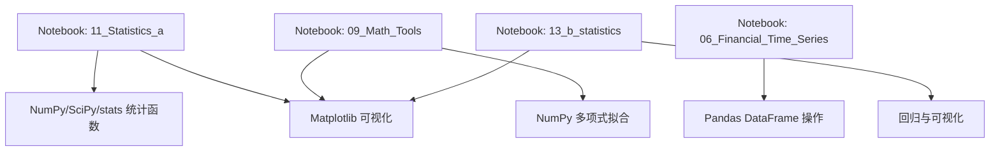
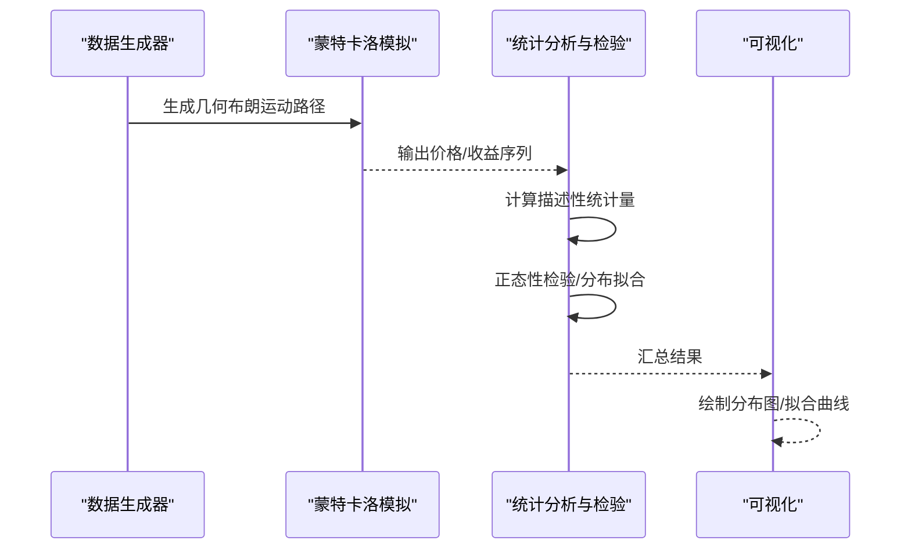
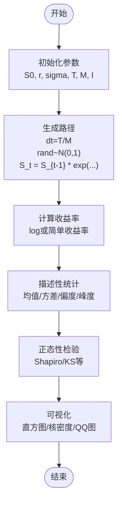
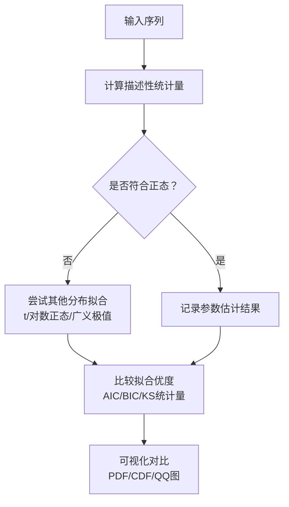
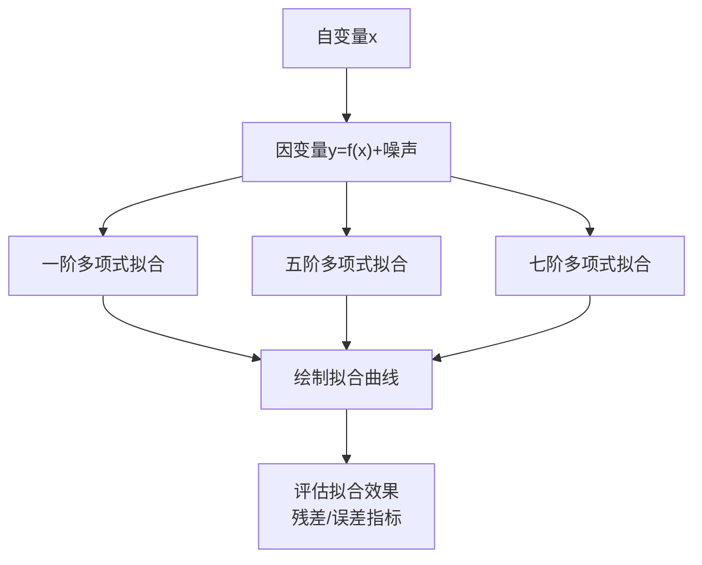
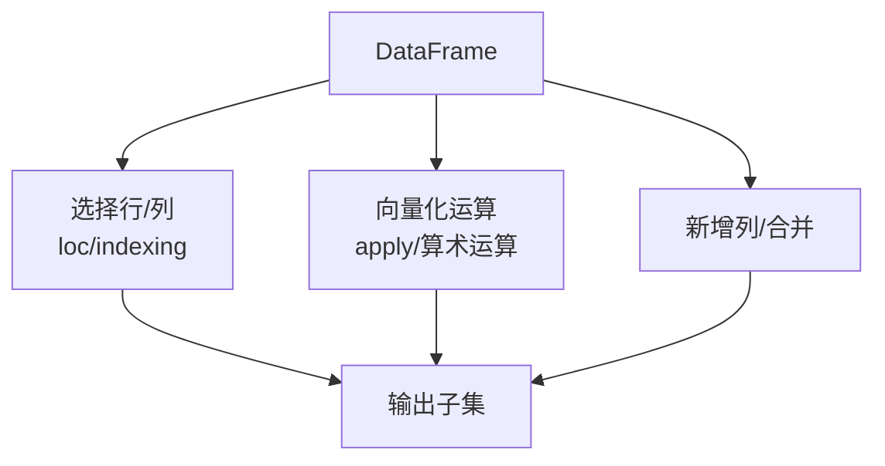
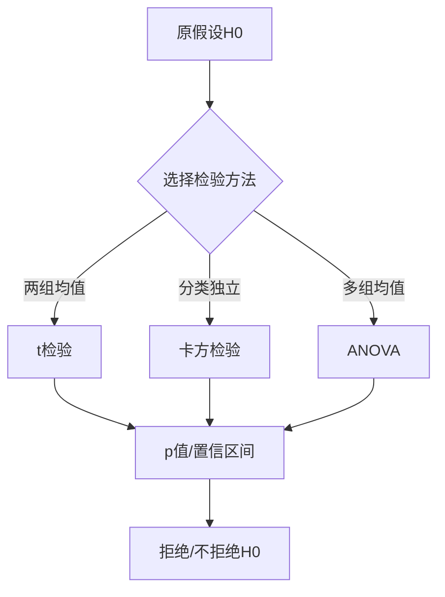
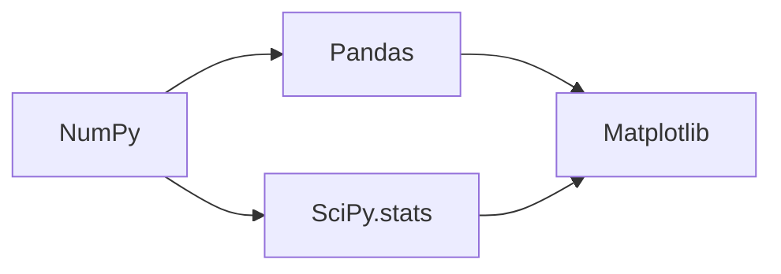

# 概率论与统计学基础

<cite>
**本文引用的文件**   
- [11_Statistics_a.ipynb](file://Code/11_Statistics_a.ipynb)
- [09_Math_Tools.ipynb](file://Code/09_Math_Tools.ipynb)
- [06_Financial_Time_Series.ipynb](file://Code/06_Financial_Time_Series.ipynb)
- [13_b_statistics.ipynb](file://py4fi2nd-master/code/ch13/13_b_statistics.ipynb)
</cite>

## 目录
1. [引言](#引言)
2. [项目结构](#项目结构)
3. [核心组件](#核心组件)
4. [架构总览](#架构总览)
5. [详细组件分析](#详细组件分析)
6. [依赖关系分析](#依赖关系分析)
7. [性能考量](#性能考量)
8. [故障排查指南](#故障排查指南)
9. [结论](#结论)
10. [附录](#附录)

## 引言
本教程面向金融数据分析场景，系统讲解概率论与统计学基础：随机变量、期望值、方差、常见分布；描述性统计（均值、中位数、标准差、偏度、峰度）；假设检验（t检验、卡方检验、ANOVA）；以及SciPy.stats在分布拟合、参数估计与统计测试中的实践。同时结合金融时间序列的收益率分布、波动率聚类等现象进行统计检验与分析。内容基于仓库中的Jupyter Notebook示例，提供可复现的分析流程与可视化思路。

## 项目结构
仓库包含多套课程材料与实践代码，其中与本主题直接相关的核心文件如下：
- Code/11_Statistics_a.ipynb：正态性检验、几何布朗运动路径模拟、统计工具使用等
- Code/09_Math_Tools.ipynb：数学工具与回归示例（多项式拟合、可视化）
- Code/06_Financial_Time_Series.ipynb：pandas基础与时间序列数据处理入门
- py4fi2nd-master/code/ch13/13_b_statistics.ipynb：统计进阶（含回归与可视化）

**图表来源** 
- [11_Statistics_a.ipynb](file://Code/11_Statistics_a.ipynb)
- [09_Math_Tools.ipynb](file://Code/09_Math_Tools.ipynb)
- [06_Financial_Time_Series.ipynb](file://Code/06_Financial_Time_Series.ipynb)
- [13_b_statistics.ipynb](file://py4fi2nd-master/code/ch13/13_b_statistics.ipynb)

**章节来源**
- [11_Statistics_a.ipynb](file://Code/11_Statistics_a.ipynb)
- [09_Math_Tools.ipynb](file://Code/09_Math_Tools.ipynb)
- [06_Financial_Time_Series.ipynb](file://Code/06_Financial_Time_Series.ipynb)
- [13_b_statistics.ipynb](file://py4fi2nd-master/code/ch13/13_b_statistics.ipynb)

## 核心组件
- 随机过程与蒙特卡洛模拟：几何布朗运动路径生成，用于模拟资产价格路径并构造收益分布样本。
- 描述性统计与分布拟合：使用SciPy.stats计算均值、方差、偏度、峰度，并进行正态性检验与分布拟合。
- 回归与近似：多项式拟合展示不同阶数对拟合效果的影响，帮助理解过拟合与欠拟合。
- 时间序列基础：pandas DataFrame操作、索引与列选择、向量化运算，为后续收益率与波动率分析打基础。

**章节来源**
- [11_Statistics_a.ipynb](file://Code/11_Statistics_a.ipynb)
- [09_Math_Tools.ipynb](file://Code/09_Math_Tools.ipynb)
- [06_Financial_Time_Series.ipynb](file://Code/06_Financial_Time_Series.ipynb)

## 架构总览
下图展示了从数据生成到统计分析再到可视化的整体流程，适用于金融时间序列与统计建模任务。

**图表来源** 
- [11_Statistics_a.ipynb](file://Code/11_Statistics_a.ipynb)
- [09_Math_Tools.ipynb](file://Code/09_Math_Tools.ipynb)
- [06_Financial_Time_Series.ipynb](file://Code/06_Financial_Time_Series.ipynb)

## 详细组件分析

### 几何布朗运动与收益分布
- 目标：通过几何布朗运动生成多条价格路径，进而构造收益率样本，观察其分布特征。
- 关键点：
  - 路径生成：按时间步迭代，使用标准正态随机数驱动，考虑漂移与波动率。
  - 收益计算：对相邻价格取对数或简单收益率，得到时间序列。
  - 分布特性：观察均值、方差、偏度、峰度，评估是否接近正态分布。
- 适用场景：期权定价、风险度量（VaR）、蒙特卡洛估值。

**图表来源** 
- [11_Statistics_a.ipynb](file://Code/11_Statistics_a.ipynb)

**章节来源**
- [11_Statistics_a.ipynb](file://Code/11_Statistics_a.ipynb)

### 描述性统计与分布拟合
- 目标：对金融时间序列进行描述性统计与分布拟合，识别厚尾、偏态等特征。
- 关键点：
  - 统计量：均值、中位数、标准差、偏度、峰度。
  - 分布拟合：尝试正态、学生t、对数正态等，比较拟合优度。
  - 正态性检验：Shapiro、Kolmogorov-Smirnov、Anderson-Darling等。
- 适用场景：风险建模、资产配置、压力测试。

**图表来源** 
- [11_Statistics_a.ipynb](file://Code/11_Statistics_a.ipynb)

**章节来源**
- [11_Statistics_a.ipynb](file://Code/11_Statistics_a.ipynb)

### 回归与近似（多项式拟合）
- 目标：通过不同阶数的多项式拟合展示模型复杂度对拟合效果的影响。
- 关键点：
  - 低阶拟合：欠拟合，偏差大。
  - 高阶拟合：过拟合，方差大。
  - 可视化：对比真实函数与拟合曲线，直观理解偏差-方差权衡。
- 适用场景：趋势建模、信号平滑、特征工程。

**图表来源** 
- [09_Math_Tools.ipynb](file://Code/09_Math_Tools.ipynb)

**章节来源**
- [09_Math_Tools.ipynb](file://Code/09_Math_Tools.ipynb)

### 时间序列基础（pandas）
- 目标：掌握DataFrame的基本操作，为时间序列分析奠定基础。
- 关键点：
  - 创建与索引：行索引、列名、loc选择、切片。
  - 向量化运算：apply、逐元素运算、新增列。
  - 数据类型与对齐：数值型与字符串混合时的处理。
- 适用场景：清洗、聚合、重采样、滚动窗口统计。

**图表来源** 
- [06_Financial_Time_Series.ipynb](file://Code/06_Financial_Time_Series.ipynb)

**章节来源**
- [06_Financial_Time_Series.ipynb](file://Code/06_Financial_Time_Series.ipynb)

### 假设检验与统计推断
- 目标：在金融数据验证中使用t检验、卡方检验、ANOVA等方法。
- 关键点：
  - t检验：比较两组均值差异（如策略前后收益）。
  - 卡方检验：分类变量的独立性检验（如涨跌与事件关联）。
  - ANOVA：多组均值差异（如不同市场状态下的收益差异）。
- 适用场景：回测验证、因子有效性检验、分组比较。

**图表来源** 
- [11_Statistics_a.ipynb](file://Code/11_Statistics_a.ipynb)
- [13_b_statistics.ipynb](file://py4fi2nd-master/code/ch13/13_b_statistics.ipynb)

**章节来源**
- [11_Statistics_a.ipynb](file://Code/11_Statistics_a.ipynb)
- [13_b_statistics.ipynb](file://py4fi2nd-master/code/ch13/13_b_statistics.ipynb)

### SciPy.stats实战要点
- 分布拟合：scipy.stats.norm.fit、scipy.stats.t.fit等，返回参数估计。
- 统计检验：scipy.stats.shapiro、scipy.stats.kstest、scipy.stats.anderson等。
- 描述性统计：numpy.mean/std/skew/kurtosis与pandas.Series.describe组合使用。
- 可视化：matplotlib绘制直方图、核密度估计、QQ图，辅助判断分布形态。

**章节来源**
- [11_Statistics_a.ipynb](file://Code/11_Statistics_a.ipynb)
- [09_Math_Tools.ipynb](file://Code/09_Math_Tools.ipynb)

## 依赖关系分析
- NumPy：数值计算、随机数生成、多项式拟合。
- SciPy.stats：分布拟合与统计检验。
- Pandas：时间序列数据结构与操作。
- Matplotlib：可视化与绘图。

**图表来源** 
- [11_Statistics_a.ipynb](file://Code/11_Statistics_a.ipynb)
- [09_Math_Tools.ipynb](file://Code/09_Math_Tools.ipynb)
- [06_Financial_Time_Series.ipynb](file://Code/06_Financial_Time_Series.ipynb)

**章节来源**
- [11_Statistics_a.ipynb](file://Code/11_Statistics_a.ipynb)
- [09_Math_Tools.ipynb](file://Code/09_Math_Tools.ipynb)
- [06_Financial_Time_Series.ipynb](file://Code/06_Financial_Time_Series.ipynb)

## 性能考量
- 蒙特卡洛模拟：路径数量I较大时注意内存与计算开销，可采用向量化与并行化优化。
- 描述性统计：大数据集上使用pandas内置方法更高效。
- 分布拟合：复杂分布拟合耗时较长，建议先做初步筛选再精细拟合。
- 可视化：大量数据点时适当降采样或使用更高效的绘图后端。

[本节为通用指导，无需列出具体文件来源]

## 故障排查指南
- 随机数种子：确保np.random.seed设置一致以保证可重复性。
- 数据缺失：时间序列中存在NaN时需插值或删除，避免统计量计算异常。
- 检验前提：t检验要求近似正态，卡方检验需满足期望频数条件，ANOVA需满足方差齐性与正态性。
- 拟合收敛：某些分布拟合可能不收敛，需调整初始值或更换分布族。

**章节来源**
- [11_Statistics_a.ipynb](file://Code/11_Statistics_a.ipynb)
- [09_Math_Tools.ipynb](file://Code/09_Math_Tools.ipynb)

## 结论
通过几何布朗运动模拟、描述性统计、分布拟合与假设检验，能够有效刻画金融时间序列的统计特性，并为风险管理、策略回测与资产定价提供科学依据。结合SciPy.stats与pandas生态，可在Python环境中完成端到端的统计分析流程。

[本节为总结性内容，无需列出具体文件来源]

## 附录
- 常用统计量公式与解释：均值、中位数、标准差、偏度、峰度的定义与金融含义。
- 假设检验步骤：提出假设、选择检验、计算统计量与p值、做出决策。
- 时间序列分析流程：数据清洗、平稳性检验、ARIMA/GARCH建模、预测与评估。

[本节为概念性内容，无需列出具体文件来源]