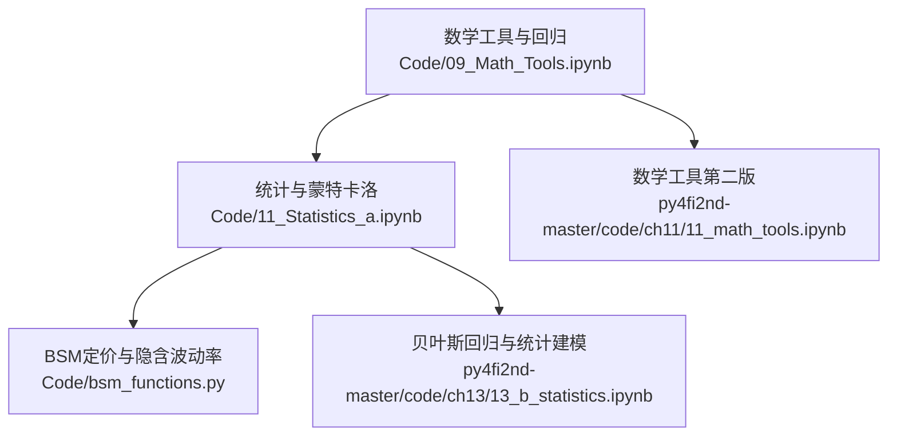
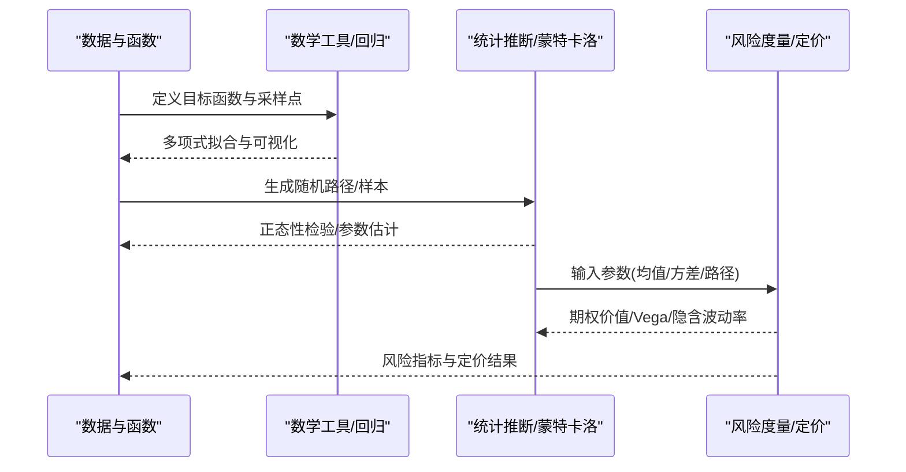
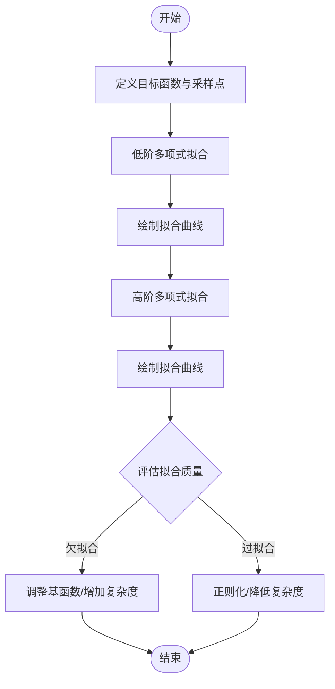
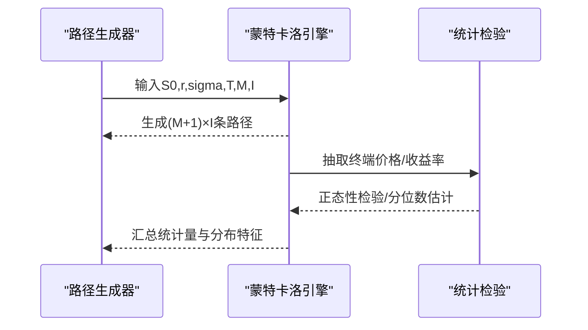
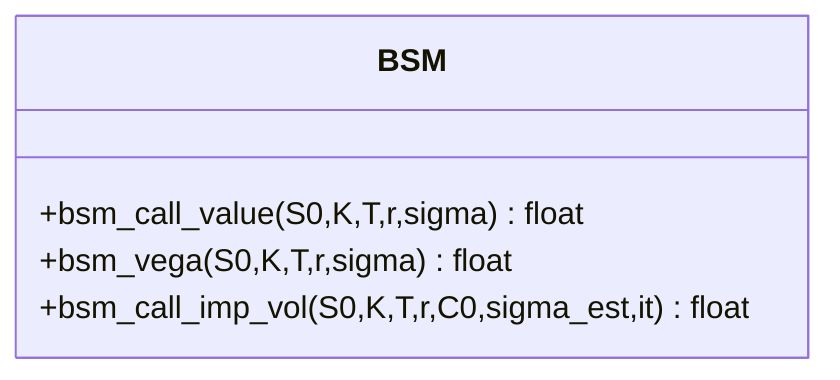
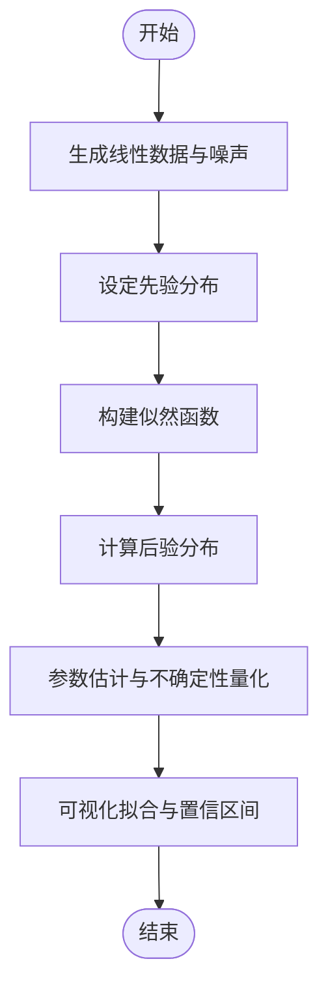
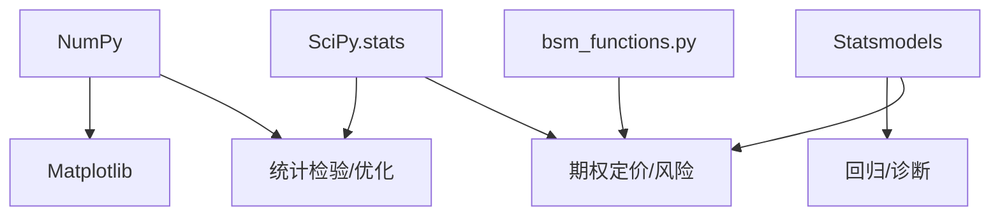

# 统计分析与数学工具

<cite>
**本文引用的文件**   
- [Code/09_Math_Tools.ipynb](file://Code/09_Math_Tools.ipynb)
- [Code/11_Statistics_a.ipynb](file://Code/11_Statistics_a.ipynb)
- [Code/bsm_functions.py](file://Code/bsm_functions.py)
- [py4fi2nd-master/code/ch11/11_math_tools.ipynb](file://py4fi2nd-master/code/ch11/11_math_tools.ipynb)
- [py4fi2nd-master/code/ch13/13_b_statistics.ipynb](file://py4fi2nd-master/code/ch13/13_b_statistics.ipynb)
</cite>

## 目录
1. [引言](#引言)
2. [项目结构](#项目结构)
3. [核心组件](#核心组件)
4. [架构总览](#架构总览)
5. [详细组件分析](#详细组件分析)
6. [依赖关系分析](#依赖关系分析)
7. [性能考虑](#性能考虑)
8. [故障排查指南](#故障排查指南)
9. [结论](#结论)
10. [附录](#附录)

## 引言
本教程面向金融数据分析与量化研究，系统讲解概率论与统计学在金融中的实际应用，涵盖描述性统计、假设检验、回归分析、相关性分析等基础方法；深入演示SciPy与Statsmodels的使用，包括分布函数、数值积分、优化算法等数学工具；并结合时间序列分析、蒙特卡洛模拟、随机过程等建模手段，给出风险度量、资产定价与投资组合优化的实践路径。同时介绍机器学习基础概念与Scikit-learn的应用要点，帮助读者将统计方法与工程实现结合，形成从数据到决策的完整闭环。

## 项目结构
仓库包含多套课程幻灯片与配套代码Notebook，以及一个独立的期权定价函数库。与本教程直接相关的核心材料如下：
- 数学工具与近似、回归示例：Code/09_Math_Tools.ipynb 与 py4fi2nd-master/code/ch11/11_math_tools.ipynb
- 统计与正态性检验、蒙特卡洛路径生成：Code/11_Statistics_a.ipynb
- Black-Scholes-Merton解析定价、Vega与隐含波动率估计：Code/bsm_functions.py
- 贝叶斯回归与统计建模示例：py4fi2nd-master/code/ch13/13_b_statistics.ipynb

**图表来源** 
- [Code/09_Math_Tools.ipynb:1-300](file://Code/09_Math_Tools.ipynb#L1-L300)
- [Code/11_Statistics_a.ipynb:1-200](file://Code/11_Statistics_a.ipynb#L1-L200)
- [Code/bsm_functions.py:1-108](file://Code/bsm_functions.py#L1-L108)
- [py4fi2nd-master/code/ch11/11_math_tools.ipynb:1-120](file://py4fi2nd-master/code/ch11/11_math_tools.ipynb#L1-L120)
- [py4fi2nd-master/code/ch13/13_b_statistics.ipynb:1-120](file://py4fi2nd-master/code/ch13/13_b_statistics.ipynb#L1-L120)

**章节来源**
- [Code/09_Math_Tools.ipynb:1-300](file://Code/09_Math_Tools.ipynb#L1-L300)
- [py4fi2nd-master/code/ch11/11_math_tools.ipynb:1-120](file://py4fi2nd-master/code/ch11/11_math_tools.ipynb#L1-L120)

## 核心组件
- 数学工具与回归拟合：使用NumPy进行函数逼近与多项式回归，展示基函数选择与过拟合现象。
- 统计推断与蒙特卡洛：基于SciPy.stats与Statsmodels进行正态性检验、参数估计与模型诊断；通过几何布朗运动生成价格路径。
- 期权定价与风险管理：Black-Scholes-Merton解析公式、Vega敏感度与牛顿法求解隐含波动率。
- 贝叶斯回归与建模：线性回归的贝叶斯视角与后验推断思路。

**章节来源**
- [Code/09_Math_Tools.ipynb:150-300](file://Code/09_Math_Tools.ipynb#L150-L300)
- [Code/11_Statistics_a.ipynb:70-200](file://Code/11_Statistics_a.ipynb#L70-L200)
- [Code/bsm_functions.py:10-108](file://Code/bsm_functions.py#L10-L108)
- [py4fi2nd-master/code/ch13/13_b_statistics.ipynb:30-120](file://py4fi2nd-master/code/ch13/13_b_statistics.ipynb#L30-L120)

## 架构总览
下图展示了从数学工具到统计建模再到期权定价的整体流程，体现“数据—模型—风险”的闭环。

**图表来源** 
- [Code/09_Math_Tools.ipynb:150-300](file://Code/09_Math_Tools.ipynb#L150-L300)
- [Code/11_Statistics_a.ipynb:100-200](file://Code/11_Statistics_a.ipynb#L100-L200)
- [Code/bsm_functions.py:10-108](file://Code/bsm_functions.py#L10-L108)

## 详细组件分析

### 数学工具与回归分析
- 目标函数与可视化：构造非线性函数并绘制曲线，作为后续回归逼近的基准。
- 多项式回归：使用不同阶数拟合，观察低阶欠拟合与高阶过拟合的差异。
- 关键实现要点：
  - 使用NumPy的多项式拟合与求值函数完成基函数展开与预测。
  - 通过可视化对比真实函数与拟合曲线，评估拟合质量。

**图表来源** 
- [Code/09_Math_Tools.ipynb:150-300](file://Code/09_Math_Tools.ipynb#L150-L300)
- [py4fi2nd-master/code/ch11/11_math_tools.ipynb:700-800](file://py4fi2nd-master/code/ch11/11_math_tools.ipynb#L700-L800)

**章节来源**
- [Code/09_Math_Tools.ipynb:150-300](file://Code/09_Math_Tools.ipynb#L150-L300)
- [py4fi2nd-master/code/ch11/11_math_tools.ipynb:700-800](file://py4fi2nd-master/code/ch11/11_math_tools.ipynb#L700-L800)

### 统计推断与蒙特卡洛模拟
- 正态性检验：使用SciPy.stats与Statsmodels对样本分布进行检验，验证几何布朗运动的增量性质。
- 蒙特卡洛路径生成：基于GBM公式生成股票或指数价格路径，用于期权定价与风险评估。
- 关键实现要点：
  - 标准化随机扰动，确保路径生成的稳定性。
  - 大样本下利用中心极限定理与经验分布进行统计推断。

**图表来源** 
- [Code/11_Statistics_a.ipynb:100-200](file://Code/11_Statistics_a.ipynb#L100-L200)

**章节来源**
- [Code/11_Statistics_a.ipynb:70-200](file://Code/11_Statistics_a.ipynb#L70-L200)

### Black-Scholes-Merton定价与风险管理
- 解析定价：欧式看涨期权的BSM公式，使用标准正态累积分布函数计算理论价格。
- Vega敏感度：衡量期权价格对波动率的敏感度，用于对冲与风险管理。
- 隐含波动率：通过牛顿迭代法反解市场报价对应的波动率。
- 关键实现要点：
  - d1/d2的计算需严格处理边界条件与数值精度。
  - 牛顿法收敛性与初始值选择影响求解效率与稳定性。

**图表来源** 
- [Code/bsm_functions.py:10-108](file://Code/bsm_functions.py#L10-L108)

**章节来源**
- [Code/bsm_functions.py:10-108](file://Code/bsm_functions.py#L10-L108)

### 贝叶斯回归与统计建模
- 贝叶斯视角：将回归系数视为随机变量，通过后验分布进行不确定性量化。
- 线性回归示例：生成带噪声的线性数据，使用多项式拟合与可视化展示参数估计。
- 关键实现要点：
  - 先验选择与似然函数设定影响后验形态。
  - MCMC或变分推断可用于高维参数空间的后验采样。

**图表来源** 
- [py4fi2nd-master/code/ch13/13_b_statistics.ipynb:80-120](file://py4fi2nd-master/code/ch13/13_b_statistics.ipynb#L80-L120)

**章节来源**
- [py4fi2nd-master/code/ch13/13_b_statistics.ipynb:30-120](file://py4fi2nd-master/code/ch13/13_b_statistics.ipynb#L30-L120)

## 依赖关系分析
- NumPy：数组运算、随机数生成、多项式拟合与求值。
- SciPy.stats：分布函数、统计检验与数值优化。
- Statsmodels：统计建模与回归诊断。
- Matplotlib：数据可视化与图表输出。
- bsm_functions.py：独立模块，提供BSM解析定价、Vega与隐含波动率求解。

**图表来源** 
- [Code/09_Math_Tools.ipynb:1-120](file://Code/09_Math_Tools.ipynb#L1-L120)
- [Code/11_Statistics_a.ipynb:1-120](file://Code/11_Statistics_a.ipynb#L1-L120)
- [Code/bsm_functions.py:1-108](file://Code/bsm_functions.py#L1-L108)

**章节来源**
- [Code/09_Math_Tools.ipynb:1-120](file://Code/09_Math_Tools.ipynb#L1-L120)
- [Code/11_Statistics_a.ipynb:1-120](file://Code/11_Statistics_a.ipynb#L1-L120)
- [Code/bsm_functions.py:1-108](file://Code/bsm_functions.py#L1-L108)

## 性能考虑
- 蒙特卡洛模拟：路径数量I与步数M的权衡，I越大估计越稳定但计算成本越高；可采用方差缩减技术（如对偶变量、控制变量）。
- 多项式回归：高阶多项式易导致数值不稳定与过拟合，建议使用正则化或基函数变换。
- 牛顿法求解隐含波动率：初始值选择与迭代次数it影响收敛速度与精度，必要时引入阻尼或截断策略。
- 向量化与并行：优先使用NumPy向量化操作，避免显式循环；大规模模拟可结合多线程或分布式框架。

[本节为通用指导，不直接分析具体文件]

## 故障排查指南
- 正态性检验失败：检查样本是否满足独立同分布假设，或是否存在异常值与结构性断点。
- 蒙特卡洛路径发散：确认随机扰动标准化是否正确，检查漂移与波动率参数的合理性。
- 隐含波动率不收敛：调整初始波动率估计，增加迭代次数或改用稳健优化算法。
- 回归过拟合：降低多项式阶数、引入正则化或交叉验证选择模型复杂度。

**章节来源**
- [Code/11_Statistics_a.ipynb:70-200](file://Code/11_Statistics_a.ipynb#L70-L200)
- [Code/bsm_functions.py:80-108](file://Code/bsm_functions.py#L80-L108)

## 结论
本教程以代码为基础，系统梳理了金融统计分析的核心数学工具与统计方法，覆盖从基础回归到高级蒙特卡洛模拟与期权定价的完整链条。通过SciPy、Statsmodels与自定义模块的结合，读者可在实际金融场景中有效应用统计方法进行风险度量、资产定价与投资组合优化。建议在实践中注重数据质量、模型选择与数值稳定性，持续迭代优化以提升决策可靠性。

[本节为总结性内容，不直接分析具体文件]

## 附录
- 常用函数与库速查：
  - NumPy：polyfit/polyval、random、linspace
  - SciPy.stats：norm.cdf/pdf、stats检验函数
  - Statsmodels：OLS、回归诊断
  - Matplotlib：plot、legend、grid
- 扩展阅读：
  - 时间序列分析：ARIMA、GARCH模型
  - 机器学习基础：Scikit-learn的线性模型、集成学习与超参调优
  - 投资组合优化：均值-方差模型、风险平价与Black-Litterman

[本节为补充信息，不直接分析具体文件]