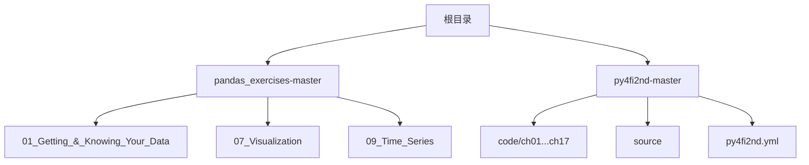
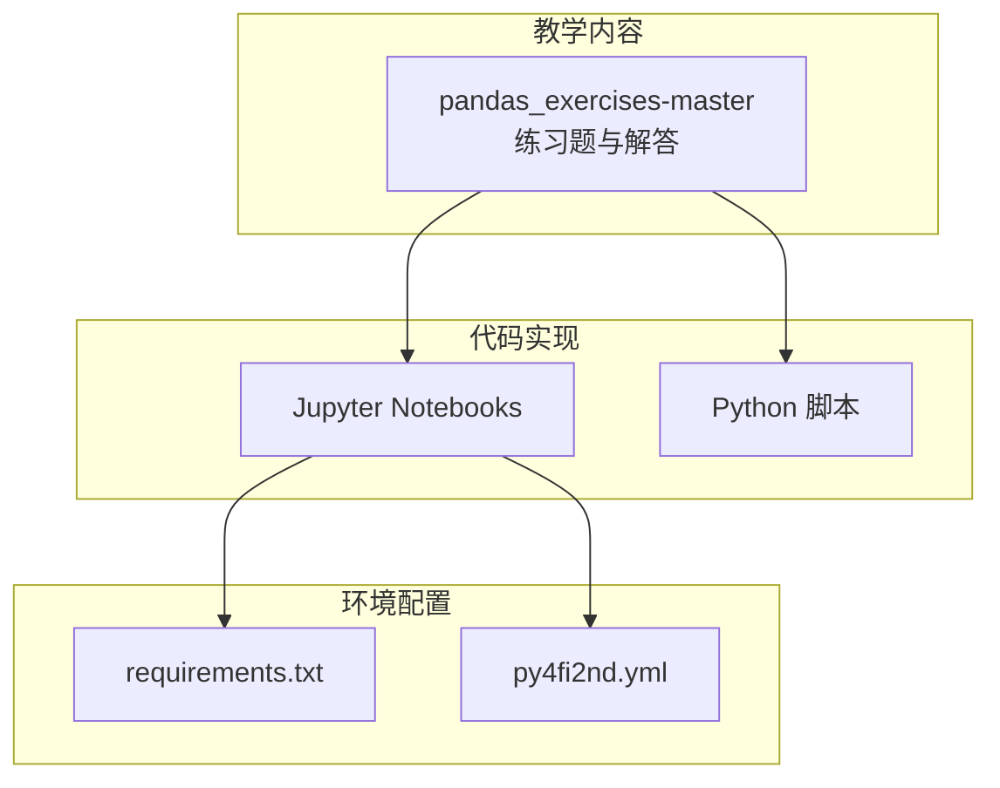
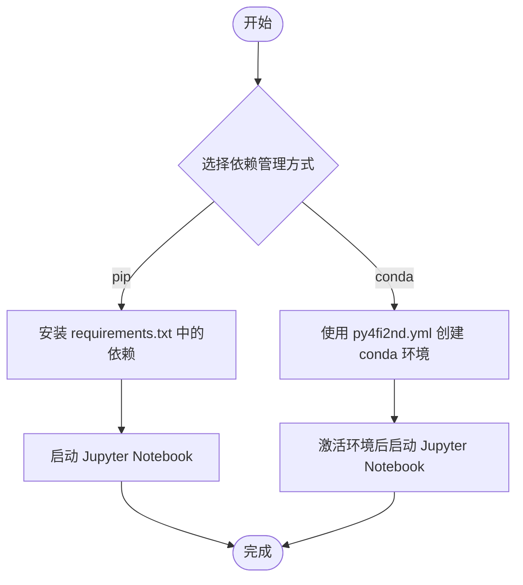
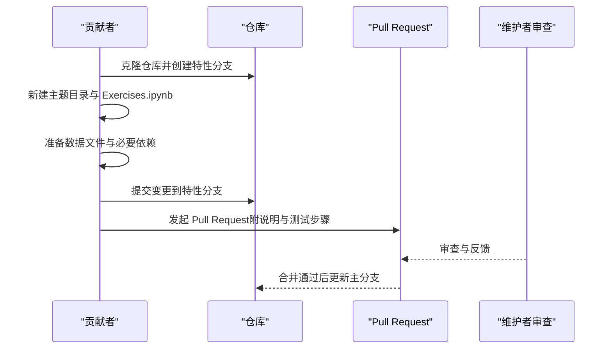
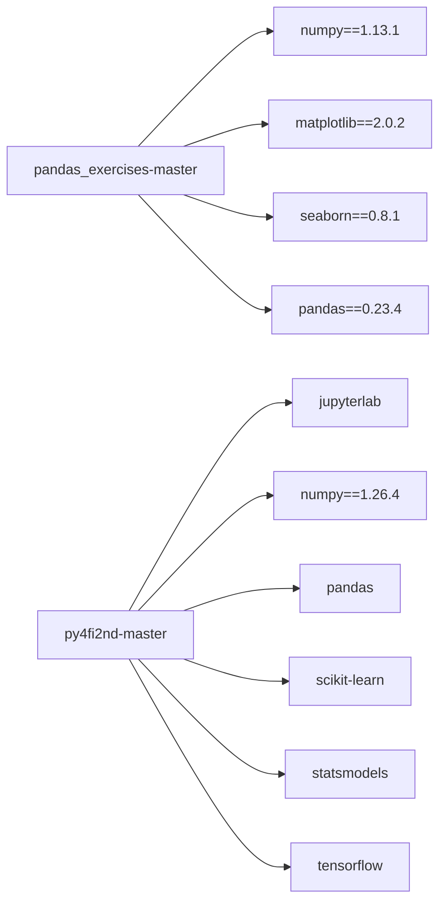

# 贡献指南

<cite>
**本文引用的文件**   
- [pandas_exercises-master/README.md](file://pandas_exercises-master/README.md)
- [pandas_exercises-master/CODE_OF_CONDUCT.md](file://pandas_exercises-master/CODE_OF_CONDUCT.md)
- [pandas_exercises-master/requirements.txt](file://pandas_exercises-master/requirements.txt)
- [py4fi2nd-master/README.md](file://py4fi2nd-master/README.md)
- [py4fi2nd-master/py4fi2nd.yml](file://py4fi2nd-master/py4fi2nd.yml)
- [py4fi2nd-master/LICENSE.txt](file://py4fi2nd-master/LICENSE.txt)
- [pandas_exercises-master/.github/FUNDING.yml](file://pandas_exercises-master/.github/FUNDING.yml)
</cite>

## 目录
1. [简介](#简介)
2. [项目结构](#项目结构)
3. [核心组件](#核心组件)
4. [架构总览](#架构总览)
5. [详细组件分析](#详细组件分析)
6. [依赖关系分析](#依赖关系分析)
7. [性能与质量建议](#性能与质量建议)
8. [故障排查指南](#故障排查指南)
9. [结论](#结论)
10. [附录](#附录)

## 简介
本贡献指南面向希望参与本金融数据分析教学与练习项目的开发者，目标是帮助新贡献者快速上手、规范协作、高效交付。内容涵盖：
- 代码规范与提交流程
- 分支管理策略
- 开发环境搭建（依赖包管理、Jupyter 使用）
- 测试与代码质量检查建议
- 如何添加练习题、示例代码与文档
- Pull Request 提交规范与审查流程
- 问题报告与功能请求的标准格式

本项目由多个子仓库组成，主要包括：
- pandas_exercises-master：Pandas 练习题与解答集合
- py4fi2nd-master：《Python for Finance》第二版配套代码与 Jupyter Notebook

## 项目结构
仓库采用“按主题/章节组织”的结构，便于查找与维护：
- pandas_exercises-master：以主题分目录（如 01_Getting_&_Knowing_Your_Data、07_Visualization 等），每个主题下包含 Exercises.ipynb、Solutions.ipynb 及数据文件
- py4fi2nd-master：按章节组织 code/chXX，并包含环境配置文件与说明文档

图表来源 
- [pandas_exercises-master/README.md:1-77](file://pandas_exercises-master/README.md#L1-L77)
- [py4fi2nd-master/README.md:1-59](file://py4fi2nd-master/README.md#L1-L59)

章节来源
- [pandas_exercises-master/README.md:1-77](file://pandas_exercises-master/README.md#L1-L77)
- [py4fi2nd-master/README.md:1-59](file://py4fi2nd-master/README.md#L1-L59)

## 核心组件
- 练习题与解答体系（pandas_exercises-master）
  - 三类文件：练习说明、无代码解答、含代码与注释的解答
  - 主题化组织，覆盖数据获取、筛选排序、分组、可视化、时间序列等
- 课程代码与环境配置（py4fi2nd-master）
  - 基于 Python 3.x 与 Jupyter Notebook
  - 提供 conda 环境文件，便于一键创建运行环境

章节来源
- [pandas_exercises-master/README.md:1-77](file://pandas_exercises-master/README.md#L1-L77)
- [py4fi2nd-master/README.md:1-59](file://py4fi2nd-master/README.md#L1-L59)

## 架构总览
从贡献视角看，项目由“教学内容 + 代码实现 + 环境配置”三部分构成：
- 教学内容：各主题的 Exercises/Solutions 文档与数据
- 代码实现：Jupyter Notebook 与少量 Python 脚本
- 环境配置：requirements.txt 与 py4fi2nd.yml

图表来源 
- [pandas_exercises-master/README.md:1-77](file://pandas_exercises-master/README.md#L1-L77)
- [pandas_exercises-master/requirements.txt:1-4](file://pandas_exercises-master/requirements.txt#L1-L4)
- [py4fi2nd-master/py4fi2nd.yml:1-19](file://py4fi2nd-master/py4fi2nd.yml#L1-L19)

## 详细组件分析

### 环境与依赖管理
- pip 依赖（pandas_exercises-master）
  - 通过 requirements.txt 固定版本，确保可复现性
- conda 环境（py4fi2nd-master）
  - 通过 py4fi2nd.yml 声明 Python 版本与常用科学计算库
  - README 提供了创建环境、激活与启动 Jupyter 的步骤

图表来源 
- [pandas_exercises-master/requirements.txt:1-4](file://pandas_exercises-master/requirements.txt#L1-L4)
- [py4fi2nd-master/py4fi2nd.yml:1-19](file://py4fi2nd-master/py4fi2nd.yml#L1-L19)
- [py4fi2nd-master/README.md:11-22](file://py4fi2nd-master/README.md#L11-L22)

章节来源
- [pandas_exercises-master/requirements.txt:1-4](file://pandas_exercises-master/requirements.txt#L1-L4)
- [py4fi2nd-master/py4fi2nd.yml:1-19](file://py4fi2nd-master/py4fi2nd.yml#L1-L19)
- [py4fi2nd-master/README.md:11-22](file://py4fi2nd-master/README.md#L11-L22)

### 代码与文档规范
- 文件命名与组织
  - 练习题与解答统一放在对应主题目录下，保持 Exercises.ipynb / Solutions.ipynb 的命名约定
  - 数据文件与 Notebook 同目录或就近存放，避免路径混乱
- 代码风格
  - 遵循 Python 通用风格（PEP 8），变量与函数名清晰可读
  - Notebook 中单元格顺序：导入库 → 加载数据 → 处理与分析 → 可视化 → 结果说明
- 文档与引用
  - 在 Notebook 开头简要说明数据来源与用途
  - 引用外部数据集时保留原始链接，便于复现

章节来源
- [pandas_exercises-master/README.md:6-14](file://pandas_exercises-master/README.md#L6-L14)

### 新增练习题与示例代码的流程

图表来源 
- [pandas_exercises-master/README.md:14-14](file://pandas_exercises-master/README.md#L14-L14)

章节来源
- [pandas_exercises-master/README.md:14-14](file://pandas_exercises-master/README.md#L14-L14)

### 分支管理与提交流程
- 分支策略
  - 主分支（main/master）保持稳定
  - 特性分支（feature/*）用于新功能或练习题
  - 修复分支（fix/*）用于 bug 修复
- 提交流程
  - 小步提交，commit 信息简洁明确
  - 提交前自检：Notebook 可执行、数据可加载、依赖已满足
  - 发起 PR 时附上变更说明、影响范围与验证方法

章节来源
- [pandas_exercises-master/README.md:14-14](file://pandas_exercises-master/README.md#L14-L14)

### 代码质量与测试建议
- 代码质量
  - 建议使用 linter（如 flake8）与格式化器（如 black）进行静态检查
  - Notebook 可使用 nbqa 或 papermill 进行自动化检查与批量执行
- 测试建议
  - 单元测试：对关键数据处理逻辑编写 pytest 用例
  - 集成测试：使用 papermill 执行 Notebook 并断言输出
  - 性能测试：对大数据集处理脚本进行基准测试（如 timeit、line_profiler）

[本节为通用建议，不直接分析具体文件]

### 行为准则与社区协作
- 行为准则
  - 遵循 Contributor Covenant 的行为准则，营造开放包容的社区氛围
  - 遇到不当行为可通过指定邮箱联系项目团队
- 赞助与支持
  - 支持平台信息见 .github/FUNDING.yml

章节来源
- [pandas_exercises-master/CODE_OF_CONDUCT.md:1-77](file://pandas_exercises-master/CODE_OF_CONDUCT.md#L1-L77)
- [pandas_exercises-master/.github/FUNDING.yml:1-13](file://pandas_exercises-master/.github/FUNDING.yml#L1-L13)

### 许可与版权
- 许可说明
  - py4fi2nd-master 的内容仅供个人学习使用，未经许可不得分享或分发
  - 所有材料不提供任何担保，且不构成投资建议

章节来源
- [py4fi2nd-master/LICENSE.txt:1-12](file://py4fi2nd-master/LICENSE.txt#L1-L12)

## 依赖关系分析
- pandas_exercises-master
  - 依赖 numpy、matplotlib、seaborn、pandas，版本固定于 requirements.txt
- py4fi2nd-master
  - 依赖 jupyterlab、matplotlib、numpy、pandas、scikit-learn、statsmodels、tensorflow 等，通过 py4fi2nd.yml 管理

图表来源 
- [pandas_exercises-master/requirements.txt:1-4](file://pandas_exercises-master/requirements.txt#L1-L4)
- [py4fi2nd-master/py4fi2nd.yml:1-19](file://py4fi2nd-master/py4fi2nd.yml#L1-L19)

章节来源
- [pandas_exercises-master/requirements.txt:1-4](file://pandas_exercises-master/requirements.txt#L1-L4)
- [py4fi2nd-master/py4fi2nd.yml:1-19](file://py4fi2nd-master/py4fi2nd.yml#L1-L19)

## 性能与质量建议
- Notebook 性能
  - 尽量向量化操作，减少循环；合理使用内存优化（如 astype、category）
  - 大文件读取时使用分块或增量处理
- 代码质量
  - 引入 lint 与格式化规则，保证一致性
  - 对复杂逻辑增加注释与示例，提升可维护性
- 可复现性
  - 锁定依赖版本，提供环境构建脚本
  - 数据下载与预处理步骤记录在 Notebook 中

[本节为通用建议，不直接分析具体文件]

## 故障排查指南
- 依赖冲突
  - 优先使用 conda 环境隔离依赖；必要时回退到 requirements.txt 指定版本
- Notebook 无法运行
  - 检查数据路径是否正确；确认依赖是否安装；清理缓存后重试
- 环境问题
  - 重新创建 conda 环境；核对 Python 版本与依赖兼容性

章节来源
- [py4fi2nd-master/README.md:11-22](file://py4fi2nd-master/README.md#L11-L22)
- [pandas_exercises-master/requirements.txt:1-4](file://pandas_exercises-master/requirements.txt#L1-L4)

## 结论
通过统一的依赖管理、清晰的目录结构与规范的提交流程，贡献者可以高效地参与本项目。建议在新贡献前先熟悉现有练习题的组织方式与代码风格，并在提交前进行本地自测与文档完善。遇到问题时，参考行为准则与许可说明，保持良好沟通与协作。

[本节为总结性内容，不直接分析具体文件]

## 附录
- 常见问题与模板
  - 问题报告模板：描述背景、复现步骤、期望行为与实际行为、环境信息
  - 功能请求模板：需求背景、目标与收益、实现思路、验收标准
- 资源链接
  - pandas_exercises 主题导航与视频教程链接见 README
  - py4fi2nd 的环境创建与 Jupyter 使用说明见 README

章节来源
- [pandas_exercises-master/README.md:16-77](file://pandas_exercises-master/README.md#L16-L77)
- [py4fi2nd-master/README.md:11-22](file://py4fi2nd-master/README.md#L11-L22)