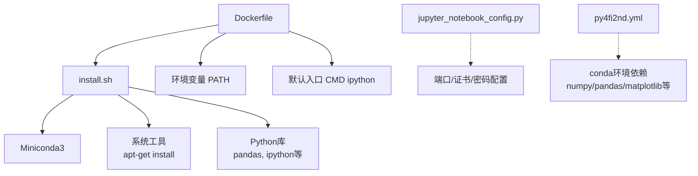
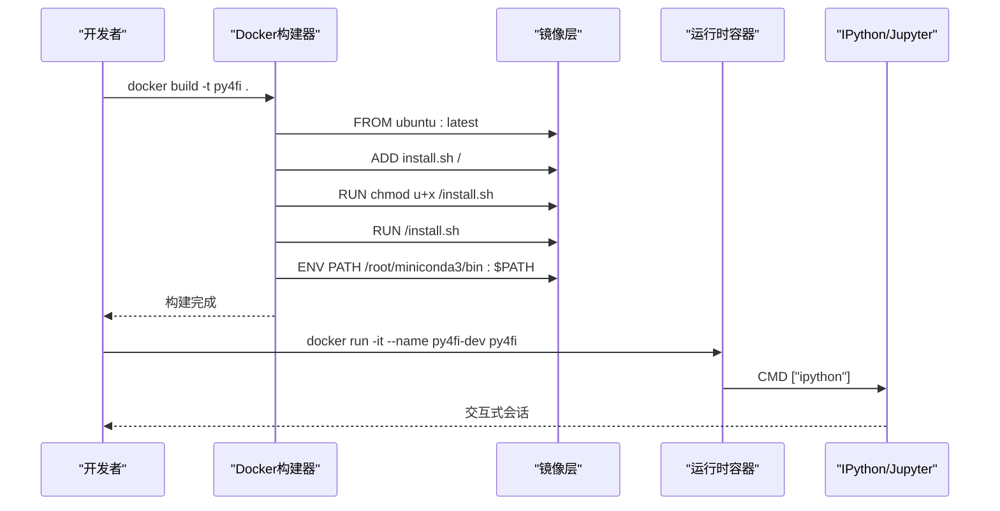
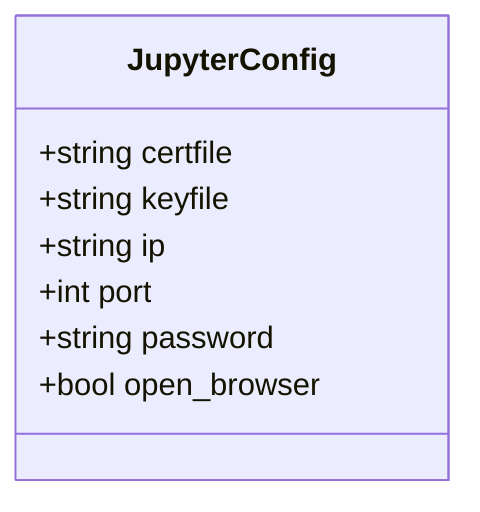
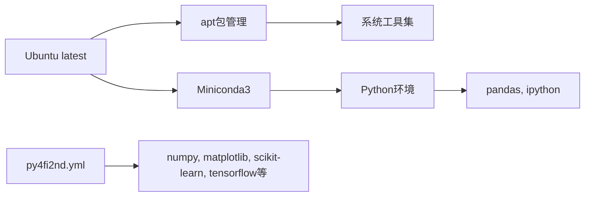

# Docker容器化部署

<cite>
**本文引用的文件**   
- [Dockerfile](file://py4fi2nd-master/code/ch02/Docker/Dockerfile)
- [install.sh](file://py4fi2nd-master/code/ch02/Docker/install.sh)
- [jupyter_notebook_config.py](file://py4fi2nd-master/code/ch02/cloud/jupyter_notebook_config.py)
- [setup.sh](file://py4fi2nd-master/code/ch02/cloud/setup.sh)
- [reset_droplet.sh](file://py4fi2nd-master/code/ch02/cloud/reset_droplet.sh)
- [py4fi2nd.yml](file://py4fi2nd-master/py4fi2nd.yml)
</cite>

## 目录
1. [简介](#简介)
2. [项目结构](#项目结构)
3. [核心组件](#核心组件)
4. [架构总览](#架构总览)
5. [详细组件分析](#详细组件分析)
6. [依赖关系分析](#依赖关系分析)
7. [性能与资源优化](#性能与资源优化)
8. [故障排查指南](#故障排查指南)
9. [结论](#结论)
10. [附录：常用命令与最佳实践](#附录常用命令与最佳实践)

## 简介
本指南基于仓库中的Dockerfile与install.sh脚本，系统讲解如何构建面向金融数据分析的Docker镜像。内容涵盖Ubuntu基础镜像选择、Python环境配置（Miniconda）、关键依赖安装、镜像构建与容器运行、数据卷与端口映射、以及容器编排与安全优化的最佳实践。同时结合Jupyter Notebook的配置示例，给出生产可用的网络与安全建议。

## 项目结构
与容器化直接相关的核心文件位于以下路径：
- Docker镜像定义：py4fi2nd-master/code/ch02/Docker/Dockerfile
- 安装脚本：py4fi2nd-master/code/ch02/Docker/install.sh
- Jupyter配置（云部署参考）：py4fi2nd-master/code/ch02/cloud/jupyter_notebook_config.py
- 云端初始化脚本（参考）：py4fi2nd-master/code/ch02/cloud/setup.sh、reset_droplet.sh
- Python环境清单（conda环境）：py4fi2nd-master/py4fi2nd.yml



图表来源
- [Dockerfile:1-30](file://py4fi2nd-master/code/ch02/Docker/Dockerfile#L1-L30)
- [install.sh:1-29](file://py4fi2nd-master/code/ch02/Docker/install.sh#L1-L29)
- [jupyter_notebook_config.py:1-25](file://py4fi2nd-master/code/ch02/cloud/jupyter_notebook_config.py#L1-L25)
- [py4fi2nd.yml:1-19](file://py4fi2nd-master/py4fi2nd.yml#L1-L19)

章节来源
- [Dockerfile:1-30](file://py4fi2nd-master/code/ch02/Docker/Dockerfile#L1-L30)
- [install.sh:1-29](file://py4fi2nd-master/code/ch02/Docker/install.sh#L1-L29)
- [jupyter_notebook_config.py:1-25](file://py4fi2nd-master/code/ch02/cloud/jupyter_notebook_config.py#L1-L25)
- [py4fi2nd.yml:1-19](file://py4fi2nd-master/py4fi2nd.yml#L1-L19)

## 核心组件
- 基础镜像：Ubuntu latest
- 安装脚本：install.sh负责系统更新、工具安装、Miniconda安装与Python库安装
- 环境变量：PATH指向Miniconda bin目录，确保conda/ipython可用
- 默认命令：容器启动后进入IPython交互环境
- Jupyter配置：提供端口、证书、密码等安全与访问控制参数（用于云部署参考）

章节来源
- [Dockerfile:10-29](file://py4fi2nd-master/code/ch02/Docker/Dockerfile#L10-L29)
- [install.sh:10-29](file://py4fi2nd-master/code/ch02/Docker/install.sh#L10-L29)
- [jupyter_notebook_config.py:8-25](file://py4fi2nd-master/code/ch02/cloud/jupyter_notebook_config.py#L8-L25)

## 架构总览
下图展示了从镜像构建到容器运行的整体流程，包括系统层、Python环境与Jupyter服务的装配顺序。



图表来源
- [Dockerfile:10-29](file://py4fi2nd-master/code/ch02/Docker/Dockerfile#L10-L29)
- [install.sh:10-29](file://py4fi2nd-master/code/ch02/Docker/install.sh#L10-L29)

## 详细组件分析

### 镜像构建与安装流程（Dockerfile + install.sh）
- 基础镜像：使用Ubuntu latest作为系统基线
- 维护者信息：MAINTAINER字段
- 安装脚本注入：ADD install.sh /，并赋予执行权限
- 系统工具安装：通过apt-get安装bzip2、gcc、git、htop、screen、vim、wget等
- Miniconda安装：下载并静默安装Miniconda3，清理安装包，设置PATH
- Python库安装：通过conda更新并安装pandas、ipython等
- 环境变量：将Miniconda的bin目录加入PATH
- 默认入口：容器启动即进入IPython

```mermaid
flowchart TD
Start(["开始"]) --> Base["FROM ubuntu:latest"]
Base --> AddScript["ADD install.sh /"]
AddScript --> Chmod["chmod u+x /install.sh"]
Chmod --> InstallSys["apt-get update/upgrade<br/>安装系统工具"]
InstallSys --> InstallConda["下载并安装Miniconda3"]
InstallConda --> CleanInstaller["删除安装包"]
CleanInstaller --> SetPath["export PATH=/root/miniconda3/bin:$PATH"]
SetPath --> InstallPyLibs["conda update & install pandas, ipython"]
InstallPyLibs --> EnvPath["ENV PATH /root/miniconda3/bin:$PATH"]
EnvPath --> Cmd["CMD [\"ipython\"]"]
Cmd --> End(["结束"])
```

图表来源
- [Dockerfile:10-29](file://py4fi2nd-master/code/ch02/Docker/Dockerfile#L10-L29)
- [install.sh:10-29](file://py4fi2nd-master/code/ch02/Docker/install.sh#L10-L29)

章节来源
- [Dockerfile:10-29](file://py4fi2nd-master/code/ch02/Docker/Dockerfile#L10-L29)
- [install.sh:10-29](file://py4fi2nd-master/code/ch02/Docker/install.sh#L10-L29)

### Jupyter服务配置（云部署参考）
- 绑定地址与端口：监听所有接口，默认端口8888
- SSL证书：支持cert.pem与keyfile配置
- 密码保护：配置哈希密码
- 禁止自动打开浏览器：open_browser=False



图表来源
- [jupyter_notebook_config.py:8-25](file://py4fi2nd-master/code/ch02/cloud/jupyter_notebook_config.py#L8-L25)

章节来源
- [jupyter_notebook_config.py:8-25](file://py4fi2nd-master/code/ch02/cloud/jupyter_notebook_config.py#L8-L25)

### 云端初始化与重置脚本（参考）
- setup.sh：将安装脚本与配置文件复制到目标主机，并通过SSH执行安装
- reset_droplet.sh：清理Miniconda、Jupyter配置与笔记目录，重置bashrc，终止Jupyter进程

章节来源
- [setup.sh:1-21](file://py4fi2nd-master/code/ch02/cloud/setup.sh#L1-L21)
- [reset_droplet.sh:1-27](file://py4fi2nd-master/code/ch02/cloud/reset_droplet.sh#L1-L27)

## 依赖关系分析
- 系统依赖：Ubuntu latest提供的包管理器apt
- 工具依赖：bzip2、gcc、git、htop、screen、vim、wget
- 运行时依赖：Miniconda3（包含Python与conda）
- Python库依赖：pandas、ipython；项目yml中还包括matplotlib、numpy、scikit-learn、tensorflow等



图表来源
- [install.sh:10-29](file://py4fi2nd-master/code/ch02/Docker/install.sh#L10-L29)
- [py4fi2nd.yml:1-19](file://py4fi2nd-master/py4fi2nd.yml#L1-L19)

章节来源
- [install.sh:10-29](file://py4fi2nd-master/code/ch02/Docker/install.sh#L10-L29)
- [py4fi2nd.yml:1-19](file://py4fi2nd-master/py4fi2nd.yml#L1-L19)

## 性能与资源优化
- 镜像分层优化
  - 将apt-get update/upgrade与install合并为单RUN指令，减少层数
  - 在install.sh末尾执行apt-get clean以减小镜像体积
- 缓存利用
  - 固定Miniconda版本URL，避免频繁重新下载
  - 将不常变化的依赖安装放在前面，提高构建缓存命中率
- 运行时资源限制
  - 使用docker run的--memory、--cpus、--pids-limit限制容器资源
  - 对计算密集型任务启用多进程时注意CPU亲和性与内存上限
- 网络与I/O
  - 仅暴露必要端口（如Jupyter 8888），其他服务通过内部网络通信
  - 使用只读根文件系统（--read-only）配合tmpfs提升安全性与稳定性

[本节为通用指导，不直接分析具体文件]

## 故障排查指南
- 构建失败
  - 检查网络是否可访问Miniconda下载源
  - 确认apt源可达，必要时更换镜像源
- 运行时找不到ipython或conda
  - 确认PATH已正确设置为/root/miniconda3/bin
  - 检查容器内是否存在Miniconda安装目录
- Jupyter无法访问
  - 核对端口映射是否正确（宿主机端口:容器端口）
  - 检查SSL证书路径与权限
  - 确认防火墙规则允许入站连接
- 权限问题
  - 数据卷挂载目录需具备读写权限
  - 避免以root用户写入敏感目录，建议使用非特权用户

章节来源
- [jupyter_notebook_config.py:8-25](file://py4fi2nd-master/code/ch02/cloud/jupyter_notebook_config.py#L8-L25)

## 结论
本指南基于仓库中的Dockerfile与install.sh，完整阐述了金融数据分析环境的容器化构建与运行方法。通过合理的镜像分层、依赖管理与安全配置，可在本地或云端快速搭建一致的Python数据分析环境。结合Jupyter配置与资源限制策略，可实现稳定、安全且高效的容器化部署。

[本节为总结性内容，不直接分析具体文件]

## 附录：常用命令与最佳实践

- 构建镜像
  - 在Dockerfile所在目录执行构建命令，指定镜像名称与标签
- 运行容器
  - 交互式运行：分配TTY以便调试
  - 后台运行：适合长期服务（如Jupyter）
- 数据持久化
  - 使用-v或--mount将宿主目录挂载到容器，保证数据持久化
- 端口映射
  - 将容器内服务端口映射到宿主机，便于外部访问
- 环境变量
  - 通过-e传入密钥、配置项等敏感信息
- 资源限制
  - 使用--memory、--cpus、--pids-limit限制资源占用
- 日志与监控
  - 使用docker logs查看输出，结合外部监控系统收集指标
- 多容器编排（概念性建议）
  - 使用Docker Compose编排Jupyter、数据服务与后端分析服务
  - 通过自定义网络隔离不同服务，仅暴露必要端口
  - 使用命名卷管理数据，避免数据丢失

[本节为通用指导，不直接分析具体文件]