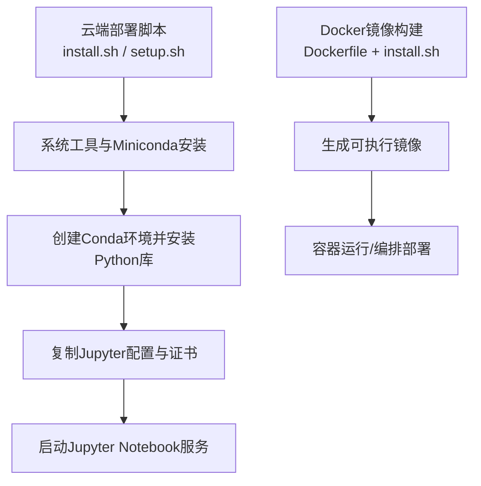
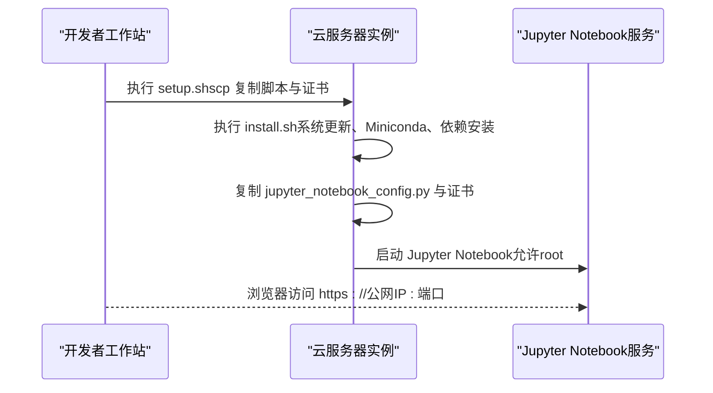
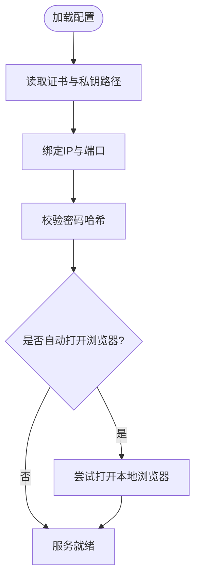
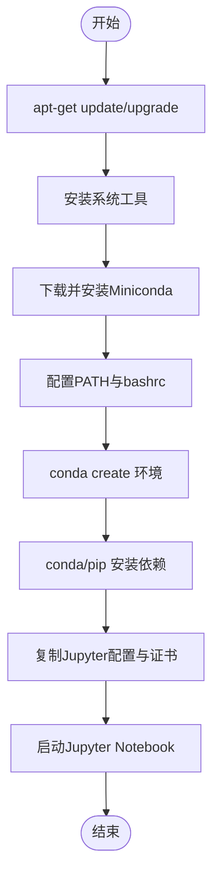
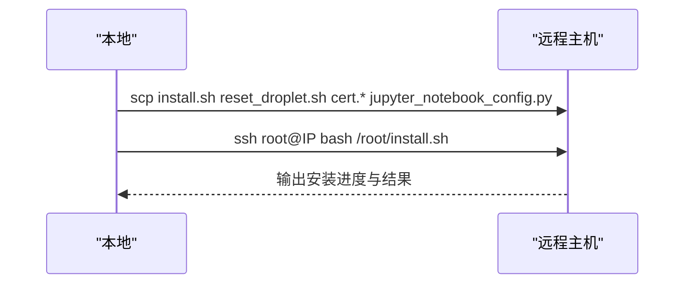
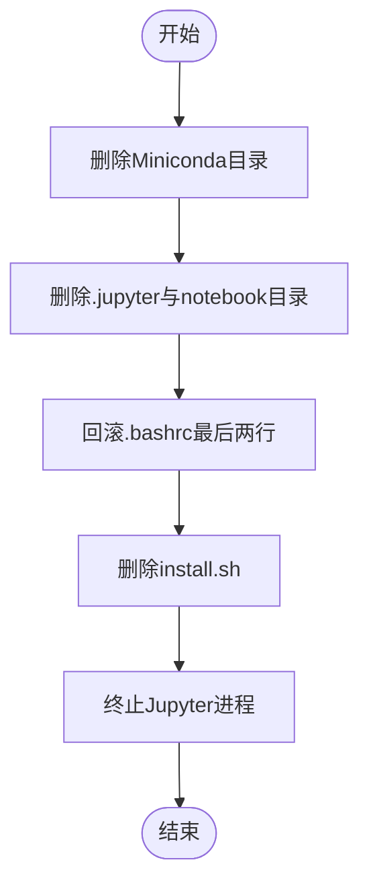
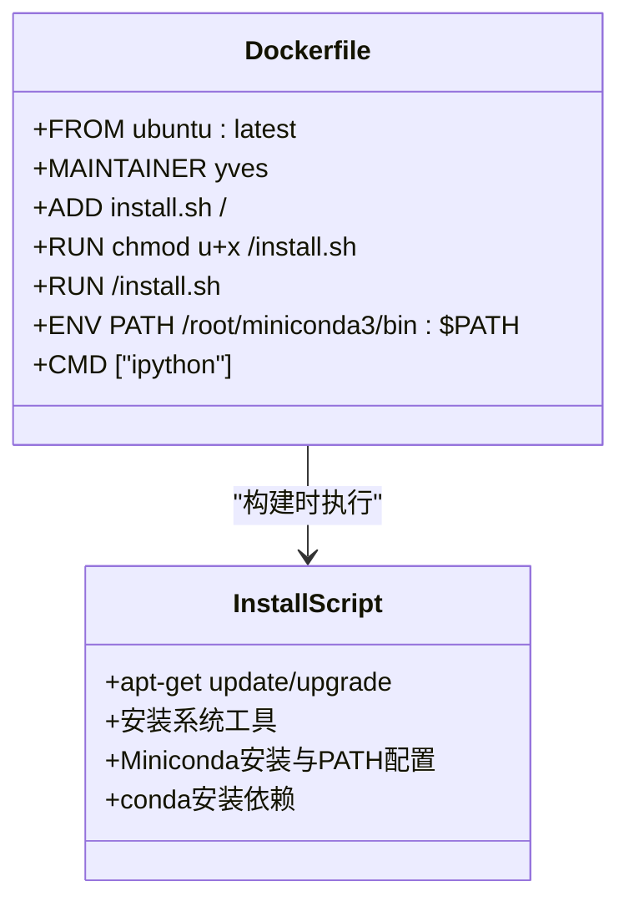
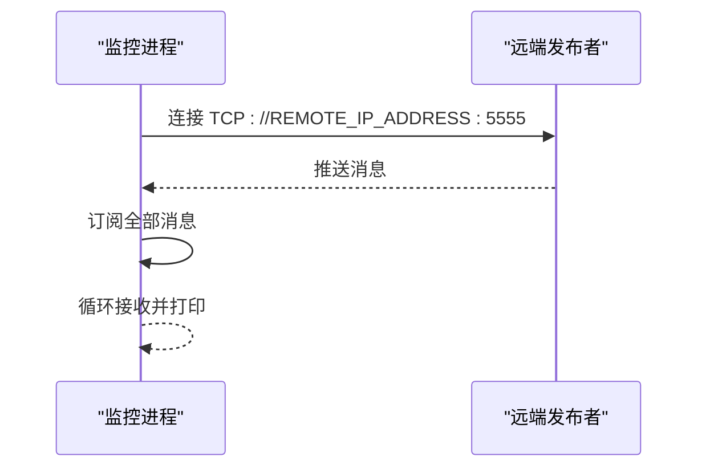
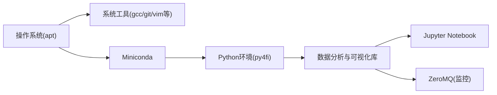

# 云平台部署

<cite>
**本文引用的文件**   
- [jupyter_notebook_config.py](file://py4fi2nd-master/code/ch02/cloud/jupyter_notebook_config.py)
- [install.sh（云端安装脚本）](file://py4fi2nd-master/code/ch02/cloud/install.sh)
- [setup.sh（远程初始化脚本）](file://py4fi2nd-master/code/ch02/cloud/setup.sh)
- [reset_droplet.sh（重置脚本）](file://py4fi2nd-master/code/ch02/cloud/reset_droplet.sh)
- [Dockerfile](file://py4fi2nd-master/code/ch02/Docker/Dockerfile)
- [install.sh（Docker镜像内安装脚本）](file://py4fi2nd-master/code/ch02/Docker/install.sh)
- [py4fi2nd.yml（Conda环境定义）](file://py4fi2nd-master/py4fi2nd.yml)
- [requirements.txt（Python依赖清单）](file://pandas_exercises-master/requirements.txt)
- [strategy_monitoring.py（策略监控示例）](file://py4fi2nd-master/code/ch16/strategy_monitoring.py)
</cite>

## 目录
1. [简介](#简介)
2. [项目结构](#项目结构)
3. [核心组件](#核心组件)
4. [架构总览](#架构总览)
5. [详细组件分析](#详细组件分析)
6. [依赖关系分析](#依赖关系分析)
7. [性能与成本优化](#性能与成本优化)
8. [故障排查指南](#故障排查指南)
9. [结论](#结论)
10. [附录](#附录)

## 简介
本指南面向在主流云平台（Quant Platform、AWS、Azure 等）上部署金融数据分析项目的工程实践。基于仓库中的 Jupyter Notebook 配置与自动化脚本，提供云端环境初始化、安全加固、服务启动流程，以及容器化与云原生部署建议；同时给出资源管理、成本优化、监控日志与故障恢复的最佳实践。

## 项目结构
本项目包含两类关键部署资产：
- 云端一键部署脚本与Jupyter配置：用于在Linux云服务器上快速搭建Jupyter Notebook环境并启动服务。
- Docker构建与运行：用于将环境打包为可移植镜像，便于在容器平台或Kubernetes中部署。

**图示来源** 
- [install.sh（云端安装脚本）:1-59](file://py4fi2nd-master/code/ch02/cloud/install.sh#L1-L59)
- [setup.sh（远程初始化脚本）:1-21](file://py4fi2nd-master/code/ch02/cloud/setup.sh#L1-L21)
- [Dockerfile:1-30](file://py4fi2nd-master/code/ch02/Docker/Dockerfile#L1-L30)
- [install.sh（Docker镜像内安装脚本）:1-29](file://py4fi2nd-master/code/ch02/Docker/install.sh#L1-L29)

**章节来源**
- [install.sh（云端安装脚本）:1-59](file://py4fi2nd-master/code/ch02/cloud/install.sh#L1-L59)
- [setup.sh（远程初始化脚本）:1-21](file://py4fi2nd-master/code/ch02/cloud/setup.sh#L1-L21)
- [Dockerfile:1-30](file://py4fi2nd-master/code/ch02/Docker/Dockerfile#L1-L30)
- [install.sh（Docker镜像内安装脚本）:1-29](file://py4fi2nd-master/code/ch02/Docker/install.sh#L1-L29)

## 核心组件
- Jupyter Notebook 配置：启用SSL、绑定公网IP、固定端口、密码保护、禁止本地浏览器自动打开。
- 云端安装脚本：更新系统包、安装Miniconda、创建Conda环境、安装数据分析与可视化库、拷贝配置文件、启动Jupyter。
- 远程初始化脚本：通过scp将安装脚本与证书、配置文件复制到目标主机，并通过ssh执行安装。
- Docker镜像构建：以Ubuntu为基础镜像，内置安装脚本，构建后运行ipython作为默认命令。
- Conda环境定义：集中声明Python版本与常用数据科学依赖。
- 策略监控示例：使用ZeroMQ订阅消息，便于在云端进行实时指标收集与告警。

**章节来源**
- [jupyter_notebook_config.py:1-26](file://py4fi2nd-master/code/ch02/cloud/jupyter_notebook_config.py#L1-L26)
- [install.sh（云端安装脚本）:1-59](file://py4fi2nd-master/code/ch02/cloud/install.sh#L1-L59)
- [setup.sh（远程初始化脚本）:1-21](file://py4fi2nd-master/code/ch02/cloud/setup.sh#L1-L21)
- [Dockerfile:1-30](file://py4fi2nd-master/code/ch02/Docker/Dockerfile#L1-L30)
- [install.sh（Docker镜像内安装脚本）:1-29](file://py4fi2nd-master/code/ch02/Docker/install.sh#L1-L29)
- [py4fi2nd.yml:1-19](file://py4fi2nd-master/py4fi2nd.yml#L1-L19)
- [strategy_monitoring.py:1-22](file://py4fi2nd-master/code/ch16/strategy_monitoring.py#L1-L22)

## 架构总览
下图展示了从本地到云端的典型部署流程，包括远程初始化、环境准备、依赖安装、服务启动与访问入口。

**图示来源** 
- [setup.sh（远程初始化脚本）:1-21](file://py4fi2nd-master/code/ch02/cloud/setup.sh#L1-L21)
- [install.sh（云端安装脚本）:1-59](file://py4fi2nd-master/code/ch02/cloud/install.sh#L1-L59)
- [jupyter_notebook_config.py:1-26](file://py4fi2nd-master/code/ch02/cloud/jupyter_notebook_config.py#L1-L26)

## 详细组件分析

### Jupyter Notebook 配置与安全设置
- SSL加密：指定证书与私钥路径，确保HTTPS访问。
- 网络绑定：绑定所有接口以便公网访问；固定端口便于防火墙规则配置。
- 认证保护：设置密码哈希，避免未授权访问。
- 行为控制：禁止自动打开本地浏览器，适合服务器端运行。

**图示来源** 
- [jupyter_notebook_config.py:1-26](file://py4fi2nd-master/code/ch02/cloud/jupyter_notebook_config.py#L1-L26)

**章节来源**
- [jupyter_notebook_config.py:1-26](file://py4fi2nd-master/code/ch02/cloud/jupyter_notebook_config.py#L1-L26)

### 云端安装脚本（install.sh）
- 系统层：更新包索引、升级系统、安装基础工具（如gcc、git、vim等）。
- Python环境：下载并静默安装Miniconda，配置PATH与bashrc，创建独立环境。
- 依赖安装：安装Jupyter、Pandas、Matplotlib、Scikit-learn、Openpyxl、PyYAML等。
- 配置与启动：创建.jupyter目录，复制配置文件与证书，启动Jupyter服务。

**图示来源** 
- [install.sh（云端安装脚本）:1-59](file://py4fi2nd-master/code/ch02/cloud/install.sh#L1-L59)

**章节来源**
- [install.sh（云端安装脚本）:1-59](file://py4fi2nd-master/code/ch02/cloud/install.sh#L1-L59)

### 远程初始化脚本（setup.sh）
- 接收目标主机IP参数。
- 通过scp将安装脚本、重置脚本、证书与Jupyter配置复制到目标主机。
- 通过ssh远程执行安装脚本，完成环境初始化与服务启动。

**图示来源** 
- [setup.sh（远程初始化脚本）:1-21](file://py4fi2nd-master/code/ch02/cloud/setup.sh#L1-L21)

**章节来源**
- [setup.sh（远程初始化脚本）:1-21](file://py4fi2nd-master/code/ch02/cloud/setup.sh#L1-L21)

### 重置脚本（reset_droplet.sh）
- 清理Miniconda、Jupyter配置与notebook目录。
- 回滚.bashrc修改，删除安装脚本，终止Jupyter进程。
- 提供查看与批量终止Jupyter进程的提示命令。

**图示来源** 
- [reset_droplet.sh:1-27](file://py4fi2nd-master/code/ch02/cloud/reset_droplet.sh#L1-L27)

**章节来源**
- [reset_droplet.sh:1-27](file://py4fi2nd-master/code/ch02/cloud/reset_droplet.sh#L1-L27)

### Docker镜像构建（Dockerfile + install.sh）
- 基础镜像：Ubuntu最新稳定版。
- 安装阶段：复制并执行install.sh，安装系统工具与Miniconda，安装必要Python库。
- 运行阶段：设置PATH，默认命令为ipython，便于交互式调试。

**图示来源** 
- [Dockerfile:1-30](file://py4fi2nd-master/code/ch02/Docker/Dockerfile#L1-L30)
- [install.sh（Docker镜像内安装脚本）:1-29](file://py4fi2nd-master/code/ch02/Docker/install.sh#L1-L29)

**章节来源**
- [Dockerfile:1-30](file://py4fi2nd-master/code/ch02/Docker/Dockerfile#L1-L30)
- [install.sh（Docker镜像内安装脚本）:1-29](file://py4fi2nd-master/code/ch02/Docker/install.sh#L1-L29)

### Conda环境定义（py4fi2nd.yml）
- 集中声明Python版本与数据科学依赖（如numpy、pandas、matplotlib、scikit-learn、statsmodels、tensorflow等）。
- 适用于跨平台环境复现与CI/CD流水线。

**章节来源**
- [py4fi2nd.yml:1-19](file://py4fi2nd-master/py4fi2nd.yml#L1-L19)

### 策略监控示例（strategy_monitoring.py）
- 使用ZeroMQ建立订阅端，连接远端发布端，持续接收并打印消息。
- 可用于云端实时采集策略指标、触发告警或写入日志。

**图示来源** 
- [strategy_monitoring.py:1-22](file://py4fi2nd-master/code/ch16/strategy_monitoring.py#L1-L22)

**章节来源**
- [strategy_monitoring.py:1-22](file://py4fi2nd-master/code/ch16/strategy_monitoring.py#L1-L22)

## 依赖关系分析
- 系统依赖：apt包管理器、Miniconda、基础开发工具链。
- Python依赖：Jupyter、Pandas、Matplotlib、Scikit-learn、Openpyxl、PyYAML、Cufflinks等。
- 运行时依赖：ZeroMQ（用于监控通信）、HDF5（通过pytables）。
- 环境管理：Conda环境隔离与pip升级。

**图示来源** 
- [install.sh（云端安装脚本）:1-59](file://py4fi2nd-master/code/ch02/cloud/install.sh#L1-L59)
- [install.sh（Docker镜像内安装脚本）:1-29](file://py4fi2nd-master/code/ch02/Docker/install.sh#L1-L29)
- [py4fi2nd.yml:1-19](file://py4fi2nd-master/py4fi2nd.yml#L1-L19)
- [strategy_monitoring.py:1-22](file://py4fi2nd-master/code/ch16/strategy_monitoring.py#L1-L22)

**章节来源**
- [install.sh（云端安装脚本）:1-59](file://py4fi2nd-master/code/ch02/cloud/install.sh#L1-L59)
- [install.sh（Docker镜像内安装脚本）:1-29](file://py4fi2nd-master/code/ch02/Docker/install.sh#L1-L29)
- [py4fi2nd.yml:1-19](file://py4fi2nd-master/py4fi2nd.yml#L1-L19)
- [strategy_monitoring.py:1-22](file://py4fi2nd-master/code/ch16/strategy_monitoring.py#L1-L22)

## 性能与成本优化
- 实例规格选择：根据任务类型（CPU密集型计算 vs I/O密集型数据处理）选择合适的实例族；批处理任务可使用抢占式实例降低成本。
- 存储优化：使用高性能磁盘（SSD）加速数据读写；冷数据归档至对象存储并按需拉取。
- 缓存与并行：利用内存缓存中间结果；对可并行任务采用多进程或多线程提升吞吐。
- 镜像分层与复用：Docker镜像分层缓存减少构建时间；公共基础镜像统一维护。
- 资源配额与弹性：设置自动扩缩容策略，按负载动态调整实例数量；空闲时段自动释放资源。
- 网络优化：将Jupyter服务置于私有子网，通过反向代理或跳板机访问；限制入站端口仅开放必要服务。

[本节为通用指导，不直接分析具体文件]

## 故障排查指南
- 无法访问Jupyter：
  - 检查防火墙与安全组是否放行HTTPS端口。
  - 确认Jupyter服务已启动且监听正确端口。
  - 验证证书路径与权限是否正确。
- 依赖安装失败：
  - 检查网络连通性与镜像源可用性。
  - 查看apt与conda日志定位缺失包或冲突。
- 进程异常退出：
  - 使用系统监控工具查看CPU、内存与磁盘占用。
  - 通过进程列表与日志定位崩溃原因。
- 重置环境：
  - 使用重置脚本清理Miniconda与Jupyter配置，回滚.bashrc修改，终止相关进程。

**章节来源**
- [reset_droplet.sh:1-27](file://py4fi2nd-master/code/ch02/cloud/reset_droplet.sh#L1-L27)
- [install.sh（云端安装脚本）:1-59](file://py4fi2nd-master/code/ch02/cloud/install.sh#L1-L59)

## 结论
通过仓库提供的Jupyter配置与自动化脚本，可在主流云平台上快速搭建安全、可复用的金融数据分析环境。结合容器化与云原生能力，可实现高效部署、弹性伸缩与成本优化。配合监控与日志体系，能够保障服务稳定性与可观测性。

[本节为总结性内容，不直接分析具体文件]

## 附录
- 云平台适配要点：
  - AWS/Azure/GCP：使用用户数据脚本或基础设施即代码（Terraform/CloudFormation/Bicep）执行install.sh与setup.sh。
  - Quant Platform：将Jupyter配置与依赖清单纳入工作空间初始化流程。
- 安全最佳实践：
  - 强制HTTPS与强密码策略；定期轮换证书。
  - 最小权限原则：仅开放必要端口，限制SSH访问来源。
- 监控与日志：
  - 集成云平台日志服务与指标监控；对Jupyter访问与错误进行审计。
  - 使用ZeroMQ订阅策略指标，实现实时告警与可视化。

[本节为补充信息，不直接分析具体文件]