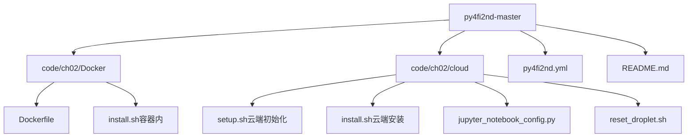
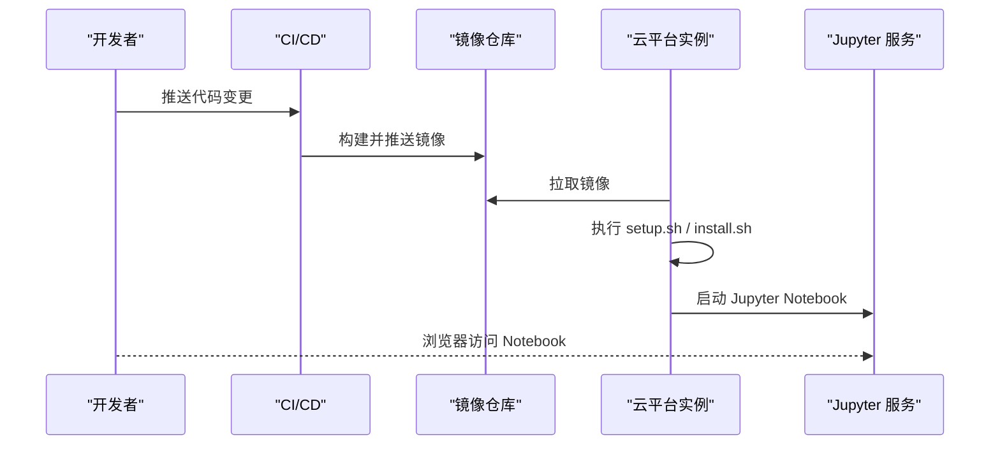
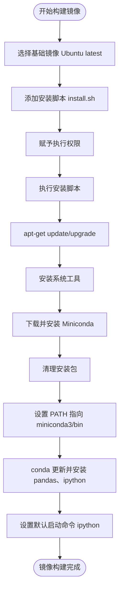
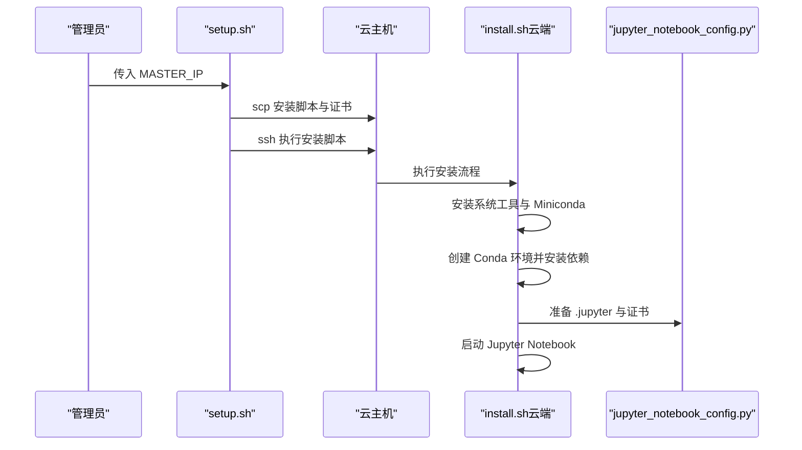
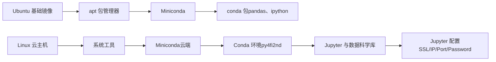

# 部署与运维

<cite>
**本文引用的文件**   
- [Dockerfile](file://py4fi2nd-master/code/ch02/Docker/Dockerfile)
- [install.sh（容器内）](file://py4fi2nd-master/code/ch02/Docker/install.sh)
- [jupyter_notebook_config.py](file://py4fi2nd-master/code/ch02/cloud/jupyter_notebook_config.py)
- [setup.sh（云端初始化）](file://py4fi2nd-master/code/ch02/cloud/setup.sh)
- [install.sh（云端安装）](file://py4fi2nd-master/code/ch02/cloud/install.sh)
- [reset_droplet.sh（重置实例）](file://py4fi2nd-master/code/ch02/cloud/reset_droplet.sh)
- [py4fi2nd.yml（环境定义）](file://py4fi2nd-master/py4fi2nd.yml)
- [README.md（项目说明）](file://py4fi2nd-master/README.md)
</cite>

## 目录
1. [简介](#简介)
2. [项目结构](#项目结构)
3. [核心组件](#核心组件)
4. [架构总览](#架构总览)
5. [详细组件分析](#详细组件分析)
6. [依赖关系分析](#依赖关系分析)
7. [性能考虑](#性能考虑)
8. [故障排查指南](#故障排查指南)
9. [结论](#结论)
10. [附录](#附录)

## 简介
本指南面向金融数据分析项目的生产化部署与运维，重点覆盖：
- Docker 容器化镜像构建、环境配置与服务编排
- 云平台（Quant Platform、AWS、Azure）集成与最佳实践
- Jupyter Notebook 的云端部署与安全配置
- 监控、日志、告警等运维基础设施搭建
- 性能调优、资源管理、安全加固与高可用设计
- 自动化流水线与持续交付

本项目包含基于 Ubuntu + Miniconda 的容器镜像构建脚本、Jupyter Notebook 的云端安装与配置脚本，以及 Conda 环境定义文件，为快速落地提供基础。

## 项目结构
仓库中与部署运维相关的核心内容集中在 py4fi2nd-master 子目录下：
- code/ch02/Docker：容器镜像构建相关（Dockerfile、install.sh）
- code/ch02/cloud：云端一键安装与配置（setup.sh、install.sh、jupyter_notebook_config.py、reset_droplet.sh）
- py4fi2nd.yml：Conda 环境定义（Python、Jupyter、数据科学库）
- README.md：项目说明与 Quant Platform 使用指引

**图表来源** 
- [Dockerfile:1-30](file://py4fi2nd-master/code/ch02/Docker/Dockerfile#L1-L30)
- [install.sh（容器内）:1-29](file://py4fi2nd-master/code/ch02/Docker/install.sh#L1-L29)
- [setup.sh（云端初始化）:1-21](file://py4fi2nd-master/code/ch02/cloud/setup.sh#L1-L21)
- [install.sh（云端安装）:1-59](file://py4fi2nd-master/code/ch02/cloud/install.sh#L1-L59)
- [jupyter_notebook_config.py:1-26](file://py4fi2nd-master/code/ch02/cloud/jupyter_notebook_config.py#L1-L26)
- [reset_droplet.sh（重置实例）:1-27](file://py4fi2nd-master/code/ch02/cloud/reset_droplet.sh#L1-L27)
- [py4fi2nd.yml（环境定义）:1-19](file://py4fi2nd-master/py4fi2nd.yml#L1-L19)
- [README.md（项目说明）:1-59](file://py4fi2nd-master/README.md#L1-L59)

**章节来源**
- [Dockerfile:1-30](file://py4fi2nd-master/code/ch02/Docker/Dockerfile#L1-L30)
- [install.sh（容器内）:1-29](file://py4fi2nd-master/code/ch02/Docker/install.sh#L1-L29)
- [setup.sh（云端初始化）:1-21](file://py4fi2nd-master/code/ch02/cloud/setup.sh#L1-L21)
- [install.sh（云端安装）:1-59](file://py4fi2nd-master/code/ch02/cloud/install.sh#L1-L59)
- [jupyter_notebook_config.py:1-26](file://py4fi2nd-master/code/ch02/cloud/jupyter_notebook_config.py#L1-L26)
- [reset_droplet.sh（重置实例）:1-27](file://py4fi2nd-master/code/ch02/cloud/reset_droplet.sh#L1-L27)
- [py4fi2nd.yml（环境定义）:1-19](file://py4fi2nd-master/py4fi2nd.yml#L1-L19)
- [README.md（项目说明）:1-59](file://py4fi2nd-master/README.md#L1-L59)

## 核心组件
- 容器镜像构建（Dockerfile + install.sh）：以 Ubuntu 为基础镜像，安装系统工具、Miniconda 及 Python 数据科学库，设置 PATH 并默认启动 IPython。
- 云端安装与配置（setup.sh + install.sh + jupyter_notebook_config.py）：在云主机上复制脚本与证书，执行安装脚本，创建 Conda 环境，安装 Jupyter 及相关库，生成配置文件并启动服务。
- 环境定义（py4fi2nd.yml）：声明 Python 版本与常用数据科学库，便于本地或 CI 环境复现。
- 项目说明（README.md）：提供 Conda 环境创建与 Jupyter 启动步骤，以及 Quant Platform 的使用入口。

**章节来源**
- [Dockerfile:1-30](file://py4fi2nd-master/code/ch02/Docker/Dockerfile#L1-L30)
- [install.sh（容器内）:1-29](file://py4fi2nd-master/code/ch02/Docker/install.sh#L1-L29)
- [setup.sh（云端初始化）:1-21](file://py4fi2nd-master/code/ch02/cloud/setup.sh#L1-L21)
- [install.sh（云端安装）:1-59](file://py4fi2nd-master/code/ch02/cloud/install.sh#L1-L59)
- [jupyter_notebook_config.py:1-26](file://py4fi2nd-master/code/ch02/cloud/jupyter_notebook_config.py#L1-L26)
- [py4fi2nd.yml（环境定义）:1-19](file://py4fi2nd-master/py4fi2nd.yml#L1-L19)
- [README.md（项目说明）:1-59](file://py4fi2nd-master/README.md#L1-L59)

## 架构总览
下图展示从代码到运行环境的整体流程：开发者提交代码后，通过 CI/CD 触发镜像构建；镜像用于本地调试或部署至云平台；云平台通过脚本完成环境初始化、Jupyter 配置与启动；用户通过浏览器访问 Notebook 进行数据分析。

[该图为概念性流程图，不直接映射具体源码文件]

## 详细组件分析

### 容器镜像构建（Dockerfile + install.sh）
- 基础镜像：Ubuntu latest
- 安装步骤：更新包索引、升级系统、安装系统工具、下载并静默安装 Miniconda、清理安装包、更新 conda/python、安装 pandas 与 ipython
- 环境变量：将 Miniconda 的 bin 目录加入 PATH
- 启动命令：默认执行 ipython

**图表来源** 
- [Dockerfile:1-30](file://py4fi2nd-master/code/ch02/Docker/Dockerfile#L1-L30)
- [install.sh（容器内）:1-29](file://py4fi2nd-master/code/ch02/Docker/install.sh#L1-L29)

**章节来源**
- [Dockerfile:1-30](file://py4fi2nd-master/code/ch02/Docker/Dockerfile#L1-L30)
- [install.sh（容器内）:1-29](file://py4fi2nd-master/code/ch02/Docker/install.sh#L1-L29)

### 云端部署与 Jupyter 配置（setup.sh + install.sh + jupyter_notebook_config.py）
- setup.sh：接收主节点 IP，通过 scp 拷贝安装脚本与证书，再通过 ssh 远程执行安装脚本
- install.sh（云端）：安装系统工具、Miniconda、创建 Conda 环境（py4fi2nd）、安装 Jupyter 与数据科学库、准备 .jupyter 目录与证书、创建 notebook 目录并启动 Jupyter
- jupyter_notebook_config.py：配置 SSL 证书路径、绑定所有 IP、固定端口、密码保护、禁止自动打开浏览器

**图表来源** 
- [setup.sh（云端初始化）:1-21](file://py4fi2nd-master/code/ch02/cloud/setup.sh#L1-L21)
- [install.sh（云端安装）:1-59](file://py4fi2nd-master/code/ch02/cloud/install.sh#L1-L59)
- [jupyter_notebook_config.py:1-26](file://py4fi2nd-master/code/ch02/cloud/jupyter_notebook_config.py#L1-L26)

**章节来源**
- [setup.sh（云端初始化）:1-21](file://py4fi2nd-master/code/ch02/cloud/setup.sh#L1-L21)
- [install.sh（云端安装）:1-59](file://py4fi2nd-master/code/ch02/cloud/install.sh#L1-L59)
- [jupyter_notebook_config.py:1-26](file://py4fi2nd-master/code/ch02/cloud/jupyter_notebook_config.py#L1-L26)

### 环境定义与本地/CI 复现（py4fi2nd.yml）
- 指定 Python 版本与常用库（如 numpy、pandas、matplotlib、scikit-learn、tensorflow 等）
- 可用于本地环境与 CI 环境的一致性保障

**章节来源**
- [py4fi2nd.yml（环境定义）:1-19](file://py4fi2nd-master/py4fi2nd.yml#L1-L19)

### 项目说明与快速上手（README.md）
- 提供 Conda 环境创建与 Jupyter 启动步骤
- 提供 Quant Platform 使用入口

**章节来源**
- [README.md（项目说明）:1-59](file://py4fi2nd-master/README.md#L1-L59)

## 依赖关系分析
- 容器层依赖：Ubuntu -> apt 包 -> Miniconda -> conda 包（pandas、ipython）
- 云端层依赖：Linux 系统工具 -> Miniconda -> Conda 环境（py4fi2nd）-> Jupyter 与数据科学库
- 配置依赖：Jupyter 配置文件（SSL、IP、端口、密码）
- 环境依赖：py4fi2nd.yml 声明的 Python 与库版本

**图表来源** 
- [Dockerfile:1-30](file://py4fi2nd-master/code/ch02/Docker/Dockerfile#L1-L30)
- [install.sh（容器内）:1-29](file://py4fi2nd-master/code/ch02/Docker/install.sh#L1-L29)
- [install.sh（云端安装）:1-59](file://py4fi2nd-master/code/ch02/cloud/install.sh#L1-L59)
- [jupyter_notebook_config.py:1-26](file://py4fi2nd-master/code/ch02/cloud/jupyter_notebook_config.py#L1-L26)
- [py4fi2nd.yml（环境定义）:1-19](file://py4fi2nd-master/py4fi2nd.yml#L1-L19)

**章节来源**
- [Dockerfile:1-30](file://py4fi2nd-master/code/ch02/Docker/Dockerfile#L1-L30)
- [install.sh（容器内）:1-29](file://py4fi2nd-master/code/ch02/Docker/install.sh#L1-L29)
- [install.sh（云端安装）:1-59](file://py4fi2nd-master/code/ch02/cloud/install.sh#L1-L59)
- [jupyter_notebook_config.py:1-26](file://py4fi2nd-master/code/ch02/cloud/jupyter_notebook_config.py#L1-L26)
- [py4fi2nd.yml（环境定义）:1-19](file://py4fi2nd-master/py4fi2nd.yml#L1-L19)

## 性能考虑
- 镜像分层优化：将频繁变化的依赖安装放在下层，减少重建时间
- 多阶段构建：分离构建期与运行期依赖，减小最终镜像体积
- 缓存策略：利用 Docker 缓存与 Conda 缓存加速构建
- 资源限制：为容器与云实例设置 CPU/内存上限，避免争用
- I/O 优化：使用高性能磁盘与网络，合理配置 Jupyter 工作目录与数据源位置
- 并行计算：根据任务特性启用多线程或多进程，注意 GIL 影响

[本节为通用指导，不直接分析具体文件]

## 故障排查指南
- 容器无法启动：检查 Dockerfile 中的 CMD 与 install.sh 的执行结果，确认 PATH 是否正确
- Jupyter 无法访问：核对 jupyter_notebook_config.py 的 IP、端口、证书路径与密码配置
- 权限问题：确保脚本具有执行权限，必要时使用 --allow-root 启动（仅测试环境）
- 环境不一致：使用 py4fi2nd.yml 重新创建环境，确保库版本一致
- 实例状态异常：使用 reset_droplet.sh 清理残留进程与环境，重新执行安装脚本

**章节来源**
- [Dockerfile:1-30](file://py4fi2nd-master/code/ch02/Docker/Dockerfile#L1-L30)
- [install.sh（容器内）:1-29](file://py4fi2nd-master/code/ch02/Docker/install.sh#L1-L29)
- [install.sh（云端安装）:1-59](file://py4fi2nd-master/code/ch02/cloud/install.sh#L1-L59)
- [jupyter_notebook_config.py:1-26](file://py4fi2nd-master/code/ch02/cloud/jupyter_notebook_config.py#L1-L26)
- [reset_droplet.sh（重置实例）:1-27](file://py4fi2nd-master/code/ch02/cloud/reset_droplet.sh#L1-L27)

## 结论
本项目提供了从容器镜像构建到云端部署的一整套脚本与配置，能够快速搭建可复用的数据分析环境。结合本文的部署与运维建议，可在生产环境中实现安全、稳定、高效的 Jupyter 服务与数据分析流水线。

[本节为总结性内容，不直接分析具体文件]

## 附录
- 量化平台（Quant Platform）：可通过 README 提供的链接注册并使用预置环境
- 云平台集成建议：
  - AWS：使用 EC2 实例 + 安全组放行端口，配合 IAM 最小权限原则
  - Azure：使用 VM 或 AKS（若容器化），配置 NSG 与 Key Vault 管理密钥
  - DigitalOcean：参考现有脚本快速初始化 Droplet
- 监控与日志：
  - 系统监控：Prometheus + Node Exporter
  - 应用日志：集中收集到 ELK/EFK 栈
  - 告警：基于阈值与事件规则配置通知渠道
- 安全加固：
  - 强制 HTTPS 与强密码策略
  - 定期更新系统与依赖
  - 最小权限与网络隔离

[本节为通用指导，不直接分析具体文件]