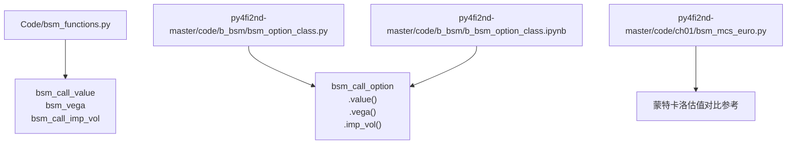
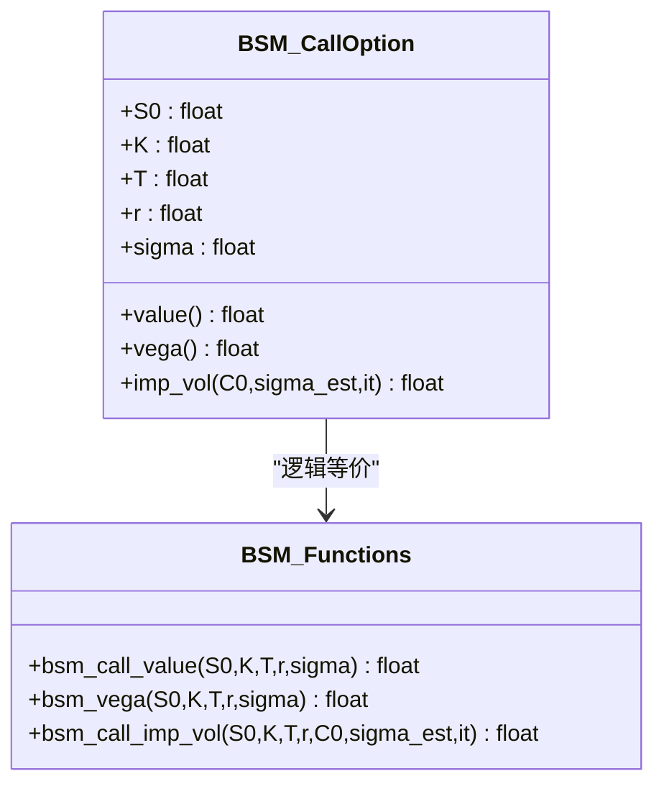
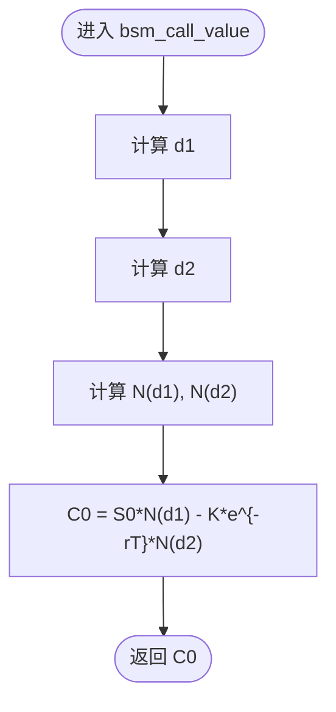
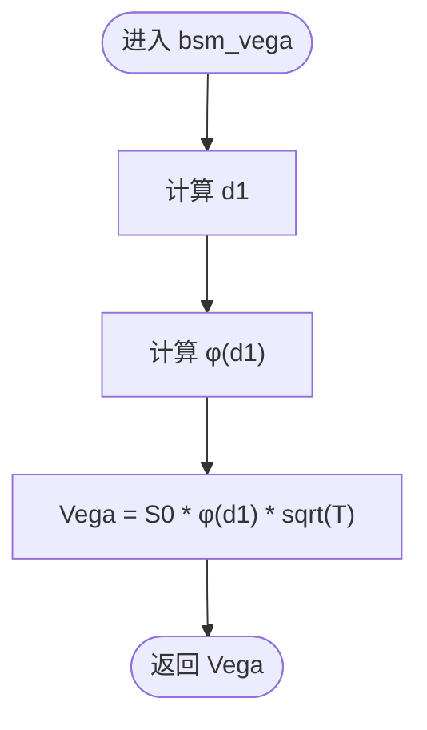
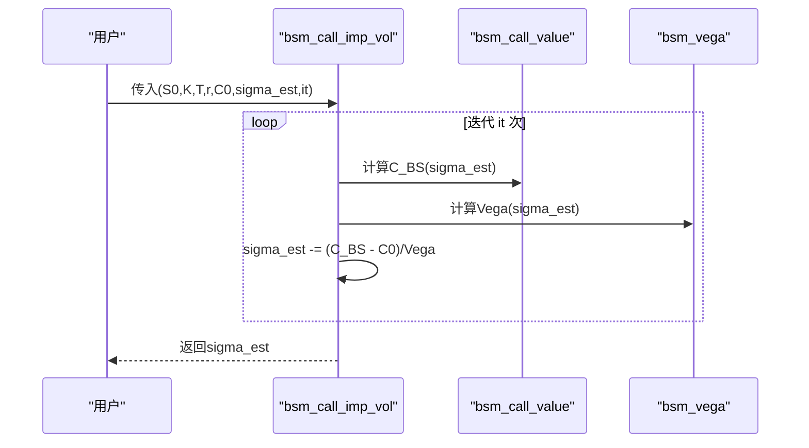
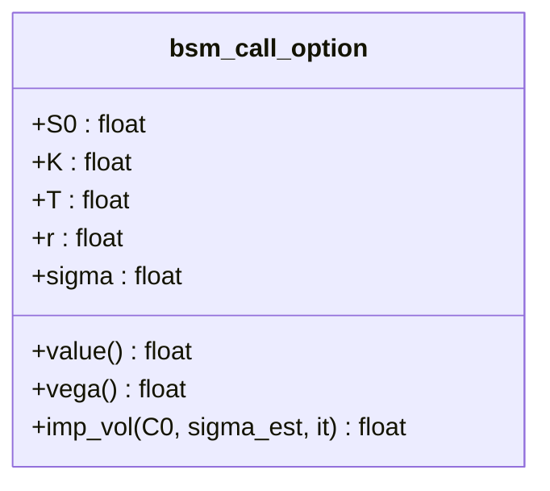
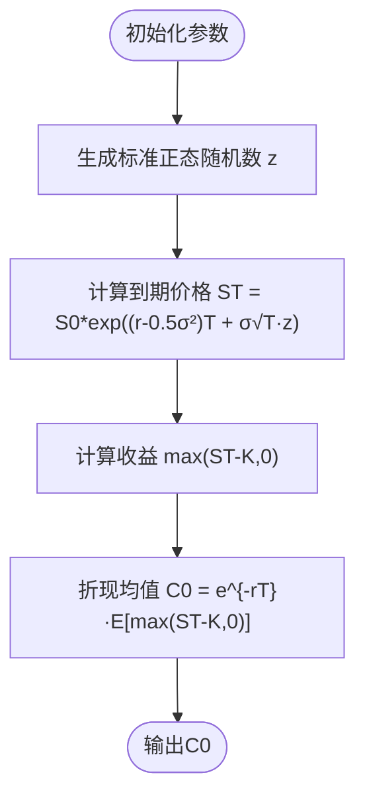
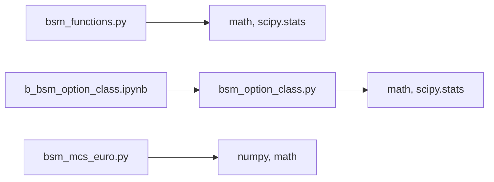

# Black-Scholes-Merton模型

<cite>
**本文引用的文件**   
- [bsm_functions.py](file://Code/bsm_functions.py)
- [bsm_option_class.py](file://py4fi2nd-master/code/b_bsm/bsm_option_class.py)
- [b_bsm_option_class.ipynb](file://py4fi2nd-master/code/b_bsm/b_bsm_option_class.ipynb)
- [bsm_mcs_euro.py](file://py4fi2nd-master/code/ch01/bsm_mcs_euro.py)
</cite>

## 目录
1. [引言](#引言)
2. [项目结构](#项目结构)
3. [核心组件](#核心组件)
4. [架构总览](#架构总览)
5. [详细组件分析](#详细组件分析)
6. [依赖关系分析](#依赖关系分析)
7. [性能与数值稳定性](#性能与数值稳定性)
8. [故障排查指南](#故障排查指南)
9. [结论](#结论)
10. [附录：使用示例与参数说明](#附录使用示例与参数说明)

## 引言
本文件围绕Black-Scholes-Merton（BSM）期权定价模型，系统阐述其理论基础、假设条件、数学推导要点，并给出欧式看涨期权的解析定价公式与d1/d2计算。文档同时提供完整的Python实现路径，包括bsm_call_value函数、Vega计算以及隐含波动率的牛顿-拉夫逊求解流程，并结合仓库中的Jupyter Notebook和Monte Carlo示例，演示如何使用该模型进行期权定价与风险管理。最后总结模型的局限性与适用条件。

## 项目结构
仓库中与BSM相关的代码主要分布在以下位置：
- Code/bsm_functions.py：函数式实现的欧式看涨期权定价、Vega与隐含波动率求解
- py4fi2nd-master/code/b_bsm/bsm_option_class.py：面向对象封装的BSM看涨期权类（value、vega、imp_vol）
- py4fi2nd-master/code/b_bsm/b_bsm_option_class.ipynb：对bsm_option_class的使用示例与可视化
- py4fi2nd-master/code/ch01/bsm_mcs_euro.py：基于蒙特卡洛的欧式看涨期权定价示例

图表来源
- [bsm_functions.py:1-108](file://Code/bsm_functions.py#L1-L108)
- [bsm_option_class.py:1-75](file://py4fi2nd-master/code/b_bsm/bsm_option_class.py#L1-L75)
- [b_bsm_option_class.ipynb:1-150](file://py4fi2nd-master/code/b_bsm/b_bsm_option_class.ipynb#L1-L150)
- [bsm_mcs_euro.py:1-30](file://py4fi2nd-master/code/ch01/bsm_mcs_euro.py#L1-L30)

章节来源
- [bsm_functions.py:1-108](file://Code/bsm_functions.py#L1-L108)
- [bsm_option_class.py:1-75](file://py4fi2nd-master/code/b_bsm/bsm_option_class.py#L1-L75)
- [b_bsm_option_class.ipynb:1-150](file://py4fi2nd-master/code/b_bsm/b_bsm_option_class.ipynb#L1-L150)
- [bsm_mcs_euro.py:1-30](file://py4fi2nd-master/code/ch01/bsm_mcs_euro.py#L1-L30)

## 核心组件
- bsm_call_value(S0, K, T, r, sigma)：BSM欧式看涨期权解析定价
- bsm_vega(S0, K, T, r, sigma)：期权价格对波动率的敏感度（Vega）
- bsm_call_imp_vol(S0, K, T, r, C0, sigma_est, it=100)：基于牛顿-拉夫逊法的隐含波动率求解
- bsm_call_option类：封装value、vega、imp_vol方法，便于对象化调用与批量实验

章节来源
- [bsm_functions.py:10-42](file://Code/bsm_functions.py#L10-L42)
- [bsm_functions.py:47-76](file://Code/bsm_functions.py#L47-L76)
- [bsm_functions.py:81-107](file://Code/bsm_functions.py#L81-L107)
- [bsm_option_class.py:13-74](file://py4fi2nd-master/code/b_bsm/bsm_option_class.py#L13-L74)

## 架构总览
BSM模块由“函数式实现”和“面向对象实现”两条路径组成，二者在数学上等价；后者更适合构建期权对象并进行批量分析与可视化。蒙特卡洛示例用于验证与对比。

图表来源
- [bsm_functions.py:10-107](file://Code/bsm_functions.py#L10-L107)
- [bsm_option_class.py:13-74](file://py4fi2nd-master/code/b_bsm/bsm_option_class.py#L13-L74)

## 详细组件分析

### 欧式看涨期权定价（bsm_call_value）
- 输入参数：
  - S0：标的初始价格
  - K：行权价
  - T：到期时间（年）
  - r：无风险利率（连续复利）
  - sigma：波动率
- 关键中间变量：
  - d1 = (ln(S0/K) + (r + 0.5*sigma^2)*T) / (sigma*sqrt(T))
  - d2 = (ln(S0/K) + (r - 0.5*sigma^2)*T) / (sigma*sqrt(T))
- 输出：欧式看涨期权现值

图表来源
- [bsm_functions.py:32-42](file://Code/bsm_functions.py#L32-L42)

章节来源
- [bsm_functions.py:10-42](file://Code/bsm_functions.py#L10-L42)

### Vega计算（bsm_vega）
- Vega衡量期权价格对波动率的敏感度
- 公式：Vega = S0 * φ(d1) * sqrt(T)，其中φ为标准正态密度

图表来源
- [bsm_functions.py:70-76](file://Code/bsm_functions.py#L70-L76)

章节来源
- [bsm_functions.py:47-76](file://Code/bsm_functions.py#L47-L76)

### 隐含波动率求解（牛顿-拉夫逊法）
- 目标：给定市场期权价格C0，反推sigma使得BSM理论价等于C0
- 迭代更新：sigma_{n+1} = sigma_n - (C_BS(sigma_n) - C0) / Vega(sigma_n)
- 终止：固定迭代次数it或达到收敛阈值

图表来源
- [bsm_functions.py:81-107](file://Code/bsm_functions.py#L81-L107)

章节来源
- [bsm_functions.py:81-107](file://Code/bsm_functions.py#L81-L107)

### 面向对象封装（bsm_call_option）
- 属性：S0, K, T, r, sigma
- 方法：
  - value()：BSM看涨期权定价
  - vega()：Vega
  - imp_vol(C0, sigma_est=0.2, it=100)：隐含波动率求解

图表来源
- [bsm_option_class.py:13-74](file://py4fi2nd-master/code/b_bsm/bsm_option_class.py#L13-L74)

章节来源
- [bsm_option_class.py:13-74](file://py4fi2nd-master/code/b_bsm/bsm_option_class.py#L13-L74)

### 蒙特卡洛对比（bsm_mcs_euro）
- 通过模拟标的资产路径，计算到期收益期望并折现，得到欧式看涨期权近似价格
- 可用于验证解析解的正确性

图表来源
- [bsm_mcs_euro.py:21-26](file://py4fi2nd-master/code/ch01/bsm_mcs_euro.py#L21-L26)

章节来源
- [bsm_mcs_euro.py:1-30](file://py4fi2nd-master/code/ch01/bsm_mcs_euro.py#L1-L30)

## 依赖关系分析
- bsm_functions.py：仅依赖math与scipy.stats（正态分布CDF/PDF）
- bsm_option_class.py：同样依赖math与scipy.stats，封装为类接口
- Jupyter Notebook：导入上述模块进行实例化、批量计算与可视化
- Monte Carlo脚本：依赖numpy与math，独立于BSM解析模块，用于交叉验证

图表来源
- [bsm_functions.py:1-108](file://Code/bsm_functions.py#L1-L108)
- [bsm_option_class.py:1-75](file://py4fi2nd-master/code/b_bsm/bsm_option_class.py#L1-L75)
- [b_bsm_option_class.ipynb:1-150](file://py4fi2nd-master/code/b_bsm/b_bsm_option_class.ipynb#L1-L150)
- [bsm_mcs_euro.py:1-30](file://py4fi2nd-master/code/ch01/bsm_mcs_euro.py#L1-L30)

章节来源
- [bsm_functions.py:1-108](file://Code/bsm_functions.py#L1-L108)
- [bsm_option_class.py:1-75](file://py4fi2nd-master/code/b_bsm/bsm_option_class.py#L1-L75)
- [b_bsm_option_class.ipynb:1-150](file://py4fi2nd-master/code/b_bsm/b_bsm_option_class.ipynb#L1-L150)
- [bsm_mcs_euro.py:1-30](file://py4fi2nd-master/code/ch01/bsm_mcs_euro.py#L1-L30)

## 性能与数值稳定性
- 解析解（bsm_call_value）：O(1)复杂度，适合大规模批处理与实时定价
- Vega计算：O(1)，用于风险管理与希腊字母分析
- 隐含波动率求解：牛顿-拉夫逊迭代，通常收敛快；建议设置最大迭代次数与收敛阈值，避免发散
- 蒙特卡洛：误差随样本量I增大而减小，收敛速度约为O(1/√I)，适合复杂衍生品但计算成本较高
- 数值稳定性建议：
  - 当T接近0时，注意除零与数值精度问题
  - 对极端虚值/实值期权，CDF/PDF可能接近0或1，需保证浮点精度
  - 隐含波动率初值sigma_est建议取合理范围（如0.1~0.5），必要时加入边界裁剪

[本节为通用指导，不直接分析具体文件]

## 故障排查指南
- 报错：导入失败或模块缺失
  - 检查是否安装scipy与numpy
- 结果异常：C0为负或NaN
  - 检查输入参数是否为正数（S0>0, K>0, T>0, sigma>0）
  - 确认T的单位为年，r为连续复利
- 隐含波动率不收敛
  - 调整迭代次数it
  - 改进初值sigma_est
  - 检查市场报价C0是否在理论可行区间内
- 蒙特卡洛结果与解析解差异大
  - 增加样本量I
  - 检查随机数生成与折现因子

章节来源
- [bsm_functions.py:10-107](file://Code/bsm_functions.py#L10-L107)
- [bsm_option_class.py:13-74](file://py4fi2nd-master/code/b_bsm/bsm_option_class.py#L13-L74)
- [bsm_mcs_euro.py:1-30](file://py4fi2nd-master/code/ch01/bsm_mcs_euro.py#L1-L30)

## 结论
本仓库提供了BSM模型的完整实现路径：函数式与面向对象两种风格，覆盖欧式看涨期权定价、Vega与隐含波动率求解，并通过蒙特卡洛示例进行交叉验证。这些工具可用于期权定价、风险度量与交易策略回测。实际应用中需注意模型假设与数值稳定性，结合市场数据与经验判断进行校准与风控。

[本节为总结性内容，不直接分析具体文件]

## 附录：使用示例与参数说明

### bsm_call_value函数参数说明
- 参数：
  - S0：标的初始价格（float）
  - K：行权价（float）
  - T：到期时间（年，float）
  - r：无风险利率（连续复利，float）
  - sigma：波动率（float）
- 返回值：
  - value：欧式看涨期权现值（float）

章节来源
- [bsm_functions.py:10-42](file://Code/bsm_functions.py#L10-L42)

### 使用示例（基于Jupyter Notebook）
- 创建bsm_call_option对象，调用value()获取期权价格
- 调用vega()获取波动率敏感度
- 调用imp_vol(C0)反求隐含波动率

章节来源
- [b_bsm_option_class.ipynb:36-128](file://py4fi2nd-master/code/b_bsm/b_bsm_option_class.ipynb#L36-L128)
- [bsm_option_class.py:39-74](file://py4fi2nd-master/code/b_bsm/bsm_option_class.py#L39-L74)

### 蒙特卡洛示例
- 设置S0、K、T、r、sigma与模拟次数I
- 生成随机数，计算到期价格ST与收益，折现均值得到C0

章节来源
- [bsm_mcs_euro.py:12-26](file://py4fi2nd-master/code/ch01/bsm_mcs_euro.py#L12-L26)

### 隐含波动率求解流程
- 输入市场期权价格C0与初值sigma_est
- 迭代更新sigma_est直至收敛
- 返回隐含波动率估计

章节来源
- [bsm_functions.py:81-107](file://Code/bsm_functions.py#L81-L107)