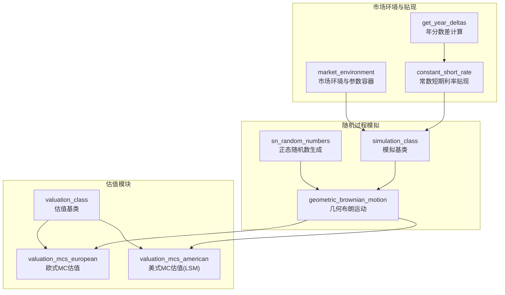
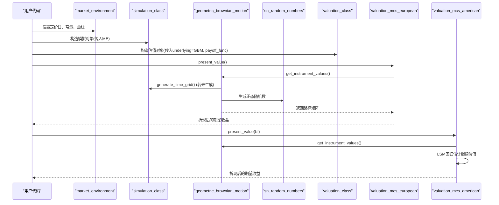
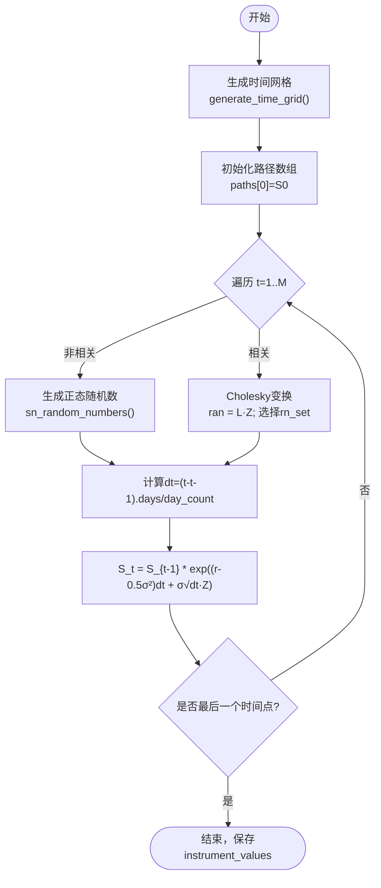
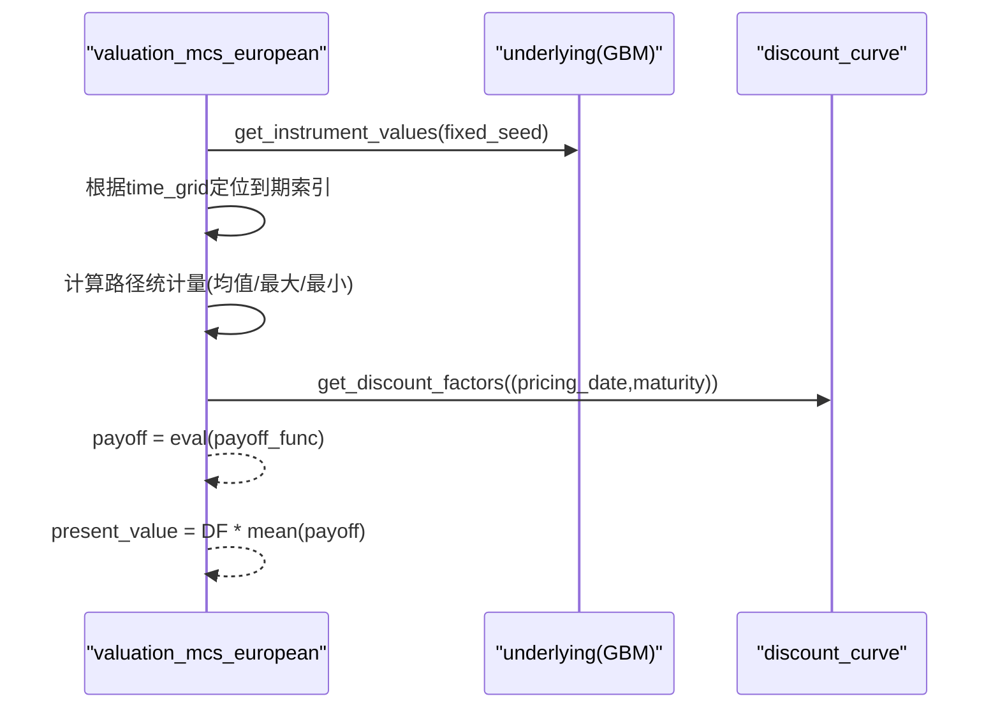
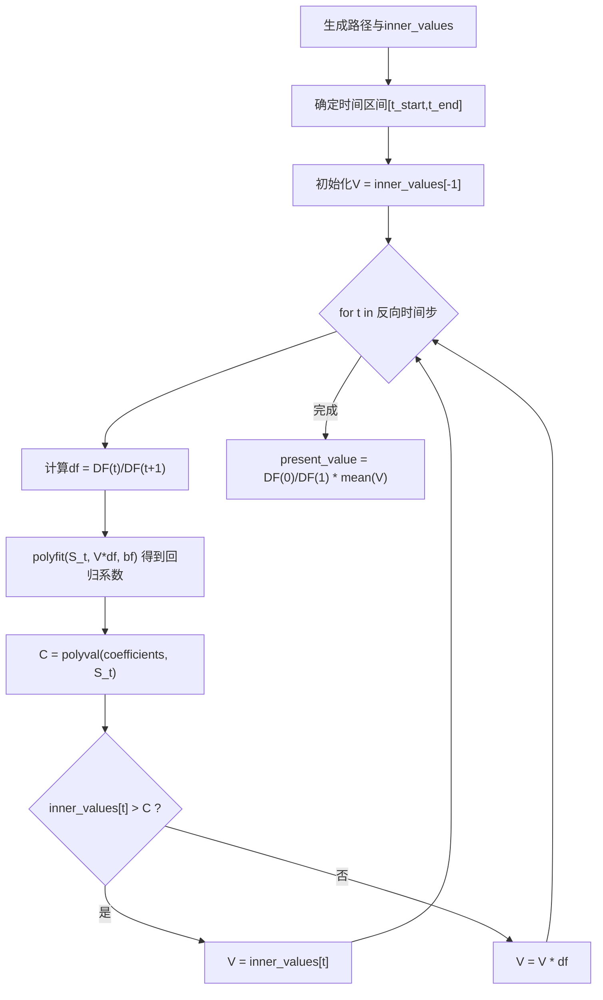
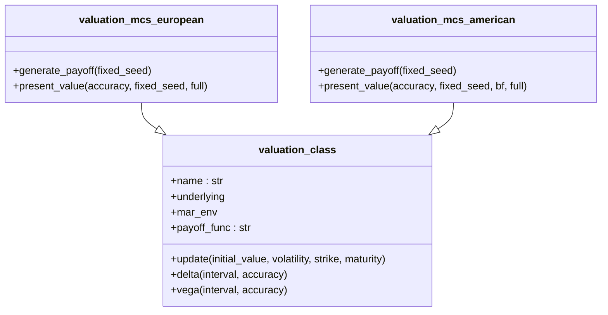
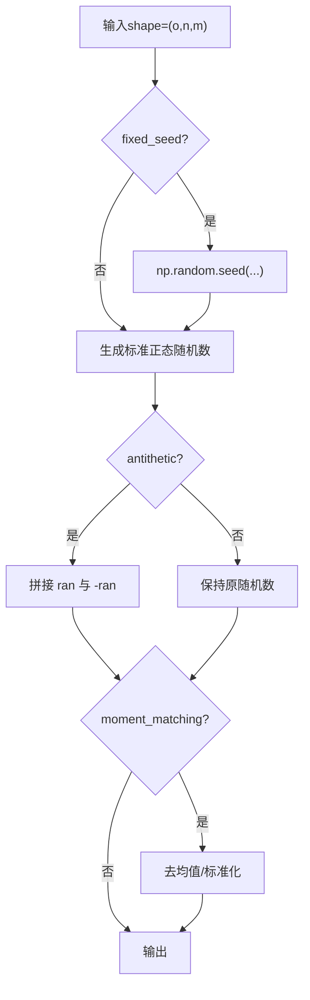
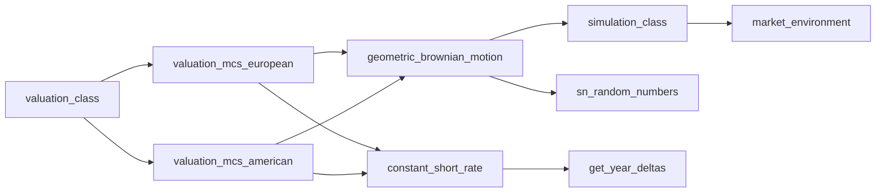

# 蒙特卡洛模拟

<cite>
**本文引用的文件**   
- [simulation_class.py](file://py4fi2nd-master/code/dx/simulation_class.py)
- [geometric_brownian_motion.py](file://py4fi2nd-master/code/dx/geometric_brownian_motion.py)
- [valuation_mcs_european.py](file://py4fi2nd-master/code/dx/valuation_mcs_european.py)
- [valuation_mcs_american.py](file://py4fi2nd-master/code/dx/valuation_mcs_american.py)
- [valuation_class.py](file://py4fi2nd-master/code/dx/valuation_class.py)
- [sn_random_numbers.py](file://py4fi2nd-master/code/dx/sn_random_numbers.py)
- [market_environment.py](file://py4fi2nd-master/code/dx/market_environment.py)
- [constant_short_rate.py](file://py4fi2nd-master/code/dx/constant_short_rate.py)
- [get_year_deltas.py](file://py4fi2nd-master/code/dx/get_year_deltas.py)
- [bsm_mcs_euro.py](file://py4fi2nd-master/code/ch01/bsm_mcs_euro.py)
</cite>

## 目录
1. [引言](#引言)
2. [项目结构](#项目结构)
3. [核心组件](#核心组件)
4. [架构总览](#架构总览)
5. [详细组件分析](#详细组件分析)
6. [依赖关系分析](#依赖关系分析)
7. [性能与收敛性](#性能与收敛性)
8. [故障排查指南](#故障排查指南)
9. [结论](#结论)
10. [附录：使用示例与参数配置](#附录使用示例与参数配置)

## 引言
本文件面向金融工程与量化实践，系统阐述如何使用蒙特卡洛（Monte Carlo, MC）方法对衍生品进行定价。重点包括：
- 几何布朗运动（GBM）的随机微分方程及其数值解法（欧拉-马鲁耶玛离散化）
- 路径生成算法：时间离散化、随机数生成、相关性与方差减少技术
- 完整的模拟框架实现与使用方式，尤其是 simulation_class 基类与 GBM 子类
- 欧式与美式期权的蒙特卡洛定价流程（含 Longstaff-Schwartz 回归法）
- 收敛性分析、标准误差估计与置信区间计算
- 性能优化技巧：并行计算、方差减少、向量化与内存管理

## 项目结构
代码库采用模块化设计，围绕“市场环境与贴现曲线—随机过程模拟—估值器”三层组织：
- 市场环境与贴现曲线：market_environment、constant_short_rate、get_year_deltas
- 随机过程模拟：simulation_class（基类）、geometric_brownian_motion（GBM 子类）、sn_random_numbers（随机数）
- 估值模块：valuation_class（基类）、valuation_mcs_european（欧式）、valuation_mcs_american（美式）
- 入门示例：bsm_mcs_euro（单步欧式看涨期权 MC 定价）

**图表来源** 
- [market_environment.py:12-71](file://py4fi2nd-master/code/dx/market_environment.py#L12-L71)
- [constant_short_rate.py:14-45](file://py4fi2nd-master/code/dx/constant_short_rate.py#L14-L45)
- [get_year_deltas.py:14-36](file://py4fi2nd-master/code/dx/get_year_deltas.py#L14-L36)
- [simulation_class.py:15-98](file://py4fi2nd-master/code/dx/simulation_class.py#L15-L98)
- [geometric_brownian_motion.py:17-87](file://py4fi2nd-master/code/dx/geometric_brownian_motion.py#L17-L87)
- [sn_random_numbers.py:14-49](file://py4fi2nd-master/code/dx/sn_random_numbers.py#L14-L49)
- [valuation_class.py:13-116](file://py4fi2nd-master/code/dx/valuation_class.py#L13-L116)
- [valuation_mcs_european.py:16-79](file://py4fi2nd-master/code/dx/valuation_mcs_european.py#L16-L79)
- [valuation_mcs_american.py:16-86](file://py4fi2nd-master/code/dx/valuation_mcs_american.py#L16-L86)

**章节来源**
- [market_environment.py:12-71](file://py4fi2nd-master/code/dx/market_environment.py#L12-L71)
- [constant_short_rate.py:14-45](file://py4fi2nd-master/code/dx/constant_short_rate.py#L14-L45)
- [get_year_deltas.py:14-36](file://py4fi2nd-master/code/dx/get_year_deltas.py#L14-L36)
- [simulation_class.py:15-98](file://py4fi2nd-master/code/dx/simulation_class.py#L15-L98)
- [geometric_brownian_motion.py:17-87](file://py4fi2nd-master/code/dx/geometric_brownian_motion.py#L17-L87)
- [sn_random_numbers.py:14-49](file://py4fi2nd-master/code/dx/sn_random_numbers.py#L14-L49)
- [valuation_class.py:13-116](file://py4fi2nd-master/code/dx/valuation_class.py#L13-L116)
- [valuation_mcs_european.py:16-79](file://py4fi2nd-master/code/dx/valuation_mcs_european.py#L16-L79)
- [valuation_mcs_american.py:16-86](file://py4fi2nd-master/code/dx/valuation_mcs_american.py#L16-L86)

## 核心组件
- market_environment：集中管理定价日、常量参数（如初始价格、波动率、到期日、路径数等）、列表与曲线（如贴现曲线）。为模拟与估值提供统一上下文。
- constant_short_rate：基于常数短期利率的贴现因子计算，支持日期对象或年分数输入。
- get_year_deltas：将日期序列转换为以年为单位的相对时间差，便于 SDE 离散化中的 dt 计算。
- simulation_class：模拟基类，负责时间网格生成、路径缓存与通用属性管理；派生类需实现 generate_paths。
- geometric_brownian_motion：基于 GBM 的 Monte Carlo 路径生成，支持独立与相关随机源（Cholesky 分解），内置固定种子与矩匹配选项。
- sn_random_numbers：标准正态随机数生成器，支持反变量（antithetic variates）与矩匹配（moment matching）以降低方差。
- valuation_class：估值基类，封装 payoff_func 字符串表达式、希腊字母数值近似（Delta/Vega）与更新接口。
- valuation_mcs_european：欧式期权 MC 估值，按到期日或路径统计量计算收益并折现。
- valuation_mcs_american：美式期权 MC 估值，采用 Longstaff-Schwartz 回归法估计继续价值并进行最优行权决策。

**章节来源**
- [market_environment.py:12-71](file://py4fi2nd-master/code/dx/market_environment.py#L12-L71)
- [constant_short_rate.py:14-45](file://py4fi2nd-master/code/dx/constant_short_rate.py#L14-L45)
- [get_year_deltas.py:14-36](file://py4fi2nd-master/code/dx/get_year_deltas.py#L14-L36)
- [simulation_class.py:15-98](file://py4fi2nd-master/code/dx/simulation_class.py#L15-L98)
- [geometric_brownian_motion.py:17-87](file://py4fi2nd-master/code/dx/geometric_brownian_motion.py#L17-L87)
- [sn_random_numbers.py:14-49](file://py4fi2nd-master/code/dx/sn_random_numbers.py#L14-L49)
- [valuation_class.py:13-116](file://py4fi2nd-master/code/dx/valuation_class.py#L13-L116)
- [valuation_mcs_european.py:16-79](file://py4fi2nd-master/code/dx/valuation_mcs_european.py#L16-L79)
- [valuation_mcs_american.py:16-86](file://py4fi2nd-master/code/dx/valuation_mcs_american.py#L16-L86)

## 架构总览
下图展示从市场环境到路径生成再到估值的整体数据流与控制流。

**图表来源** 
- [market_environment.py:12-71](file://py4fi2nd-master/code/dx/market_environment.py#L12-L71)
- [simulation_class.py:65-98](file://py4fi2nd-master/code/dx/simulation_class.py#L65-L98)
- [geometric_brownian_motion.py:50-87](file://py4fi2nd-master/code/dx/geometric_brownian_motion.py#L50-L87)
- [sn_random_numbers.py:14-49](file://py4fi2nd-master/code/dx/sn_random_numbers.py#L14-L49)
- [valuation_class.py:43-77](file://py4fi2nd-master/code/dx/valuation_class.py#L43-L77)
- [valuation_mcs_european.py:28-79](file://py4fi2nd-master/code/dx/valuation_mcs_european.py#L28-L79)
- [valuation_mcs_american.py:29-86](file://py4fi2nd-master/code/dx/valuation_mcs_american.py#L29-L86)

## 详细组件分析

### 几何布朗运动（GBM）与数值解法
- 随机微分方程（SDE）：dS_t = r·S_t·dt + σ·S_t·dW_t
- 数值解（欧拉-马鲁耶玛）：S_{t+Δt} = S_t · exp((r - 0.5σ^2)Δt + σ√Δt·Z)，其中 Z ~ N(0,1)
- 时间离散化：由 pd.date_range 生成交易日/周/月等频率的时间网格，dt 按实际天数/年计数换算
- 随机数生成：sn_random_numbers 支持 antithetic variates 与 moment matching，提升收敛速度
- 相关性：通过 Cholesky 分解与 rn_set 选择，支持多资产联合模拟

**图表来源** 
- [geometric_brownian_motion.py:50-87](file://py4fi2nd-master/code/dx/geometric_brownian_motion.py#L50-L87)
- [sn_random_numbers.py:14-49](file://py4fi2nd-master/code/dx/sn_random_numbers.py#L14-L49)
- [simulation_class.py:65-88](file://py4fi2nd-master/code/dx/simulation_class.py#L65-L88)

**章节来源**
- [geometric_brownian_motion.py:17-87](file://py4fi2nd-master/code/dx/geometric_brownian_motion.py#L17-L87)
- [sn_random_numbers.py:14-49](file://py4fi2nd-master/code/dx/sn_random_numbers.py#L14-L49)
- [simulation_class.py:65-88](file://py4fi2nd-master/code/dx/simulation_class.py#L65-L88)

### 欧式期权蒙特卡洛估值
- 收益函数：payoff_func 字符串表达式，例如基于到期值 maturity_value 或路径统计量（均值、最大、最小）
- 折现：使用 discount_curve.get_discount_factors 获取到期折现因子
- 估计量：C0 = DF × mean(payoff)

**图表来源** 
- [valuation_mcs_european.py:28-79](file://py4fi2nd-master/code/dx/valuation_mcs_european.py#L28-L79)

**章节来源**
- [valuation_mcs_european.py:16-79](file://py4fi2nd-master/code/dx/valuation_mcs_european.py#L16-L79)

### 美式期权蒙特卡洛估值（Longstaff-Schwartz）
- 步骤：
  1) 生成路径与即时收益 inner_values
  2) 从到期向前回溯，在每个时间点用多项式回归拟合继续价值 C(S_t)
  3) 比较立即行权收益与继续价值，决定最优策略并更新 V
  4) 最终折现得到估值
- 关键参数：bf（基函数个数，通常低阶多项式）

**图表来源** 
- [valuation_mcs_american.py:29-86](file://py4fi2nd-master/code/dx/valuation_mcs_american.py#L29-L86)

**章节来源**
- [valuation_mcs_american.py:16-86](file://py4fi2nd-master/code/dx/valuation_mcs_american.py#L16-L86)

### 估值基类与希腊字母数值近似
- update：允许动态调整初始价格、波动率、行权价、到期日，并自动维护 time_grid
- delta：前向差分近似 Δ ≈ (V(S+ΔS) - V(S))/ΔS
- vega：前向差分近似 ν ≈ (V(σ+Δσ) - V(σ))/Δσ

**图表来源** 
- [valuation_class.py:13-116](file://py4fi2nd-master/code/dx/valuation_class.py#L13-L116)
- [valuation_mcs_european.py:16-79](file://py4fi2nd-master/code/dx/valuation_mcs_european.py#L16-L79)
- [valuation_mcs_american.py:16-86](file://py4fi2nd-master/code/dx/valuation_mcs_american.py#L16-L86)

**章节来源**
- [valuation_class.py:13-116](file://py4fi2nd-master/code/dx/valuation_class.py#L13-L116)

### 随机数生成与方差减少
- antithetic variates：同时生成 Z 与 -Z，配对平均降低方差
- moment_matching：对样本进行零均值和单位方差标准化，提高稳定性
- fixed_seed：固定随机种子，保证结果可复现

**图表来源** 
- [sn_random_numbers.py:14-49](file://py4fi2nd-master/code/dx/sn_random_numbers.py#L14-L49)

**章节来源**
- [sn_random_numbers.py:14-49](file://py4fi2nd-master/code/dx/sn_random_numbers.py#L14-L49)

### 基础示例：欧式看涨期权 MC 定价
- 该示例直接演示 GBM 的单步 MC 定价流程：生成随机数、计算到期价格、计算收益、折现求均值

**章节来源**
- [bsm_mcs_euro.py:1-30](file://py4fi2nd-master/code/ch01/bsm_mcs_euro.py#L1-L30)

## 依赖关系分析
- 耦合度：
  - valuation_* 依赖 underlying（GBM）与 discount_curve（constant_short_rate）
  - GBM 依赖 simulation_class 与 sn_random_numbers
  - market_environment 作为参数容器被广泛使用
- 外部依赖：numpy、pandas（时间网格与数组运算）

**图表来源** 
- [valuation_class.py:13-116](file://py4fi2nd-master/code/dx/valuation_class.py#L13-L116)
- [valuation_mcs_european.py:16-79](file://py4fi2nd-master/code/dx/valuation_mcs_european.py#L16-L79)
- [valuation_mcs_american.py:16-86](file://py4fi2nd-master/code/dx/valuation_mcs_american.py#L16-L86)
- [geometric_brownian_motion.py:17-87](file://py4fi2nd-master/code/dx/geometric_brownian_motion.py#L17-L87)
- [simulation_class.py:15-98](file://py4fi2nd-master/code/dx/simulation_class.py#L15-L98)
- [sn_random_numbers.py:14-49](file://py4fi2nd-master/code/dx/sn_random_numbers.py#L14-L49)
- [constant_short_rate.py:14-45](file://py4fi2nd-master/code/dx/constant_short_rate.py#L14-L45)
- [get_year_deltas.py:14-36](file://py4fi2nd-master/code/dx/get_year_deltas.py#L14-L36)
- [market_environment.py:12-71](file://py4fi2nd-master/code/dx/market_environment.py#L12-L71)

**章节来源**
- [valuation_class.py:13-116](file://py4fi2nd-master/code/dx/valuation_class.py#L13-L116)
- [geometric_brownian_motion.py:17-87](file://py4fi2nd-master/code/dx/geometric_brownian_motion.py#L17-L87)
- [sn_random_numbers.py:14-49](file://py4fi2nd-master/code/dx/sn_random_numbers.py#L14-L49)
- [valuation_mcs_european.py:16-79](file://py4fi2nd-master/code/dx/valuation_mcs_european.py#L16-L79)
- [valuation_mcs_american.py:16-86](file://py4fi2nd-master/code/dx/valuation_mcs_american.py#L16-L86)
- [market_environment.py:12-71](file://py4fi2nd-master/code/dx/market_environment.py#L12-L71)
- [constant_short_rate.py:14-45](file://py4fi2nd-master/code/dx/constant_short_rate.py#L14-L45)
- [get_year_deltas.py:14-36](file://py4fi2nd-master/code/dx/get_year_deltas.py#L14-L36)

## 性能与收敛性
- 收敛性理论：MC 估计量的标准误差 SE = σ_payoff / √I，随路径数 I 增大以 1/√I 速率下降
- 标准误差估计：可使用样本标准差除以 √I 估算；或使用批处理（batching）方法
- 置信区间：在中心极限定理下，95% CI ≈ mean ± 1.96×SE
- 方差减少技术：
  - 反变量（antithetic variates）：成对路径平均，显著降低方差
  - 矩匹配（moment matching）：标准化随机数，提升数值稳定性
  - 控制变量（control variate）：利用已知解析解的对冲变量（可扩展）
- 并行计算：
  - 将路径批量拆分至多进程/多线程，分别生成路径后聚合收益
  - 注意随机数种子分配以避免重复路径
- 向量化与内存：
  - 优先使用 NumPy 向量化操作，避免 Python 循环
  - 合理设置路径维度与时间步长，避免内存溢出
- 时间网格与 dt：
  - 使用业务日历（工作日）更贴近真实交易
  - day_count 可按市场惯例调整（如 365 或 360）

[本节为通用指导，不直接分析具体文件]

## 故障排查指南
- 到期日不在时间网格：当 maturity 未包含在 underlying.time_grid 时，估值会报错提示。需在 market_environment 中确保添加特殊日期或扩展 time_grid。
- payoff_func 评估错误：检查字符串表达式语法与变量名（如 maturity_value、instrument_values）是否正确。
- 负利率校验：constant_short_rate 构造函数对 short_rate < 0 抛出异常（尽管现实市场可能出现负利率，此处为约束）。
- 随机数可复现：如需结果稳定，设置 fixed_seed=True 并使用相同种子。
- 回归不稳定（美式）：增加路径数 I、调整基函数个数 bf，或尝试更高阶多项式但注意过拟合风险。

**章节来源**
- [valuation_mcs_european.py:42-58](file://py4fi2nd-master/code/dx/valuation_mcs_european.py#L42-L58)
- [constant_short_rate.py:31-36](file://py4fi2nd-master/code/dx/constant_short_rate.py#L31-L36)
- [valuation_mcs_american.py:49-86](file://py4fi2nd-master/code/dx/valuation_mcs_american.py#L49-L86)

## 结论
本仓库提供了完整的蒙特卡洛模拟与衍生品定价框架：以 GBM 为核心随机过程，结合灵活的估值器与方差减少技术，能够高效地对欧式与美式期权进行定价。通过合理配置时间网格、随机数生成与回归参数，可在精度与性能之间取得良好平衡。建议在实际应用中结合批处理与并行计算，并持续监控收敛性与标准误差，以确保结果的稳健性。

[本节为总结，不直接分析具体文件]

## 附录：使用示例与参数配置
- 市场环境与贴现曲线
  - 使用 market_environment 添加常量（initial_value、volatility、final_date、frequency、paths、strike、maturity 等）与曲线（discount_curve）
  - 使用 constant_short_rate 提供短利率与折现因子计算
- 模拟对象
  - 继承 simulation_class 的 geometric_brownian_motion 用于生成 GBM 路径
  - 调用 get_instrument_values(fixed_seed) 触发路径生成与缓存
- 估值对象
  - 欧式：valuation_mcs_european，设置 payoff_func 字符串表达式，调用 present_value()
  - 美式：valuation_mcs_american，设置 payoff_func 与 bf（基函数个数），调用 present_value()
- 收敛性与误差
  - 逐步增加 paths 数量，观察估值变化与标准误差下降
  - 使用 antithetic variates 与 moment_matching 加速收敛

**章节来源**
- [market_environment.py:12-71](file://py4fi2nd-master/code/dx/market_environment.py#L12-L71)
- [constant_short_rate.py:14-45](file://py4fi2nd-master/code/dx/constant_short_rate.py#L14-L45)
- [simulation_class.py:15-98](file://py4fi2nd-master/code/dx/simulation_class.py#L15-L98)
- [geometric_brownian_motion.py:17-87](file://py4fi2nd-master/code/dx/geometric_brownian_motion.py#L17-L87)
- [valuation_mcs_european.py:16-79](file://py4fi2nd-master/code/dx/valuation_mcs_european.py#L16-L79)
- [valuation_mcs_american.py:16-86](file://py4fi2nd-master/code/dx/valuation_mcs_american.py#L16-L86)
- [sn_random_numbers.py:14-49](file://py4fi2nd-master/code/dx/sn_random_numbers.py#L14-L49)