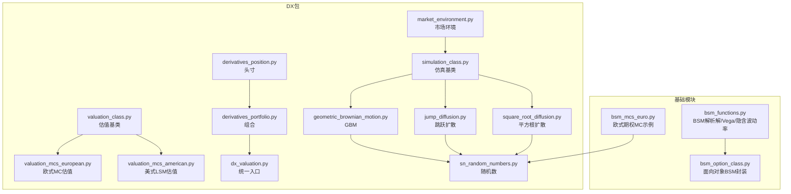
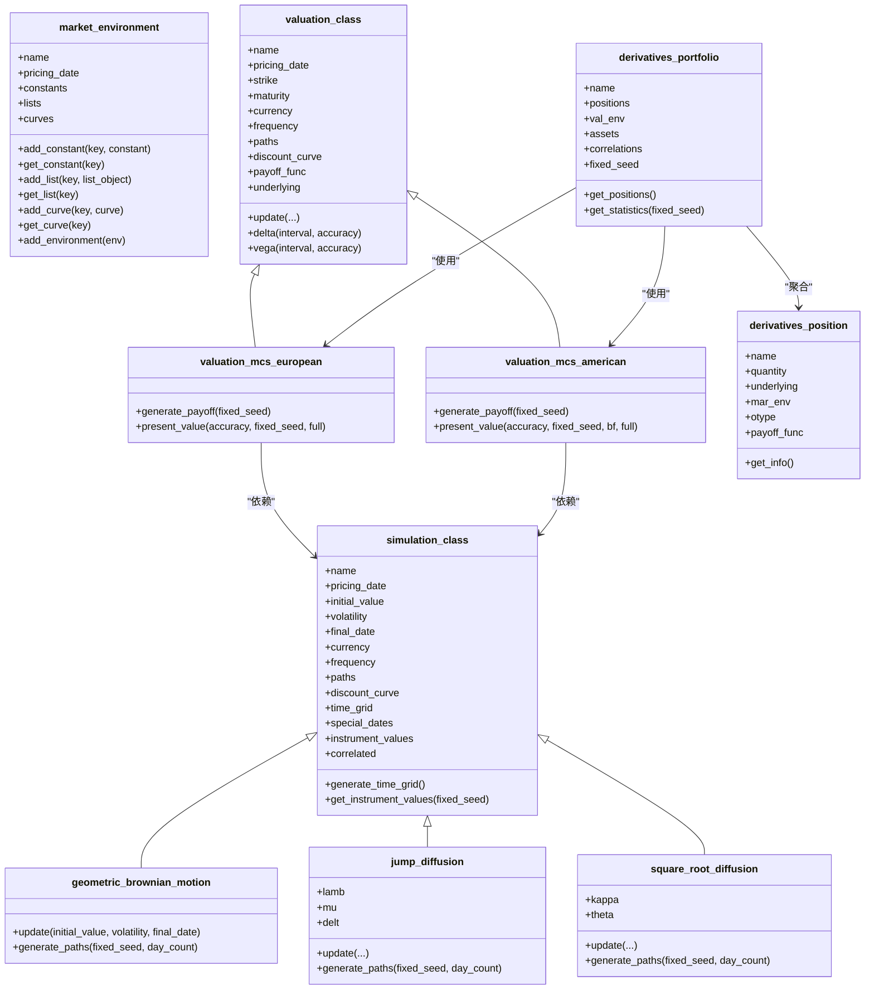
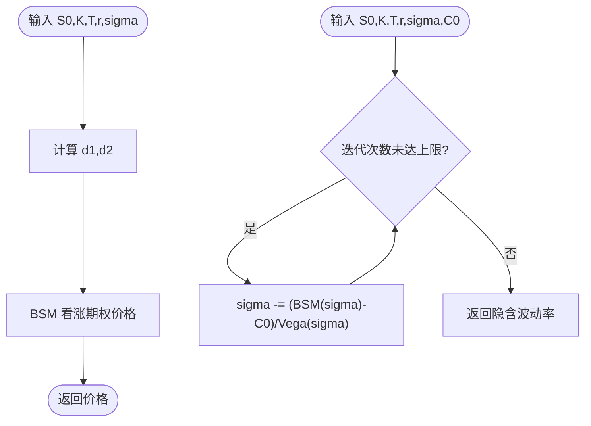
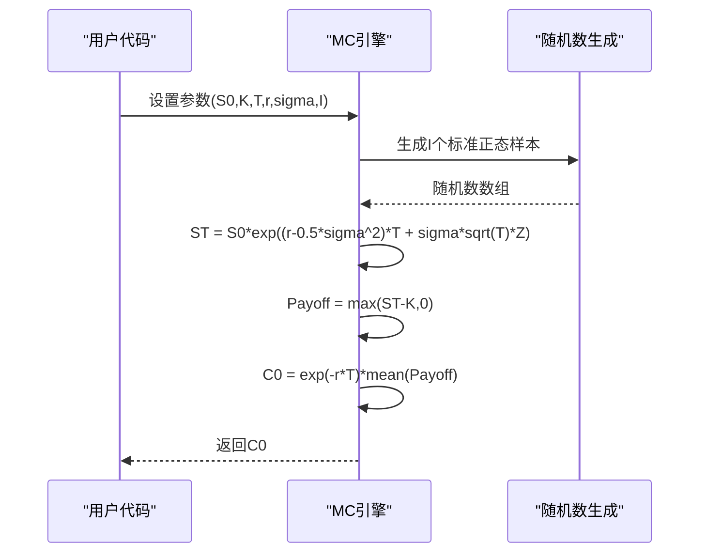
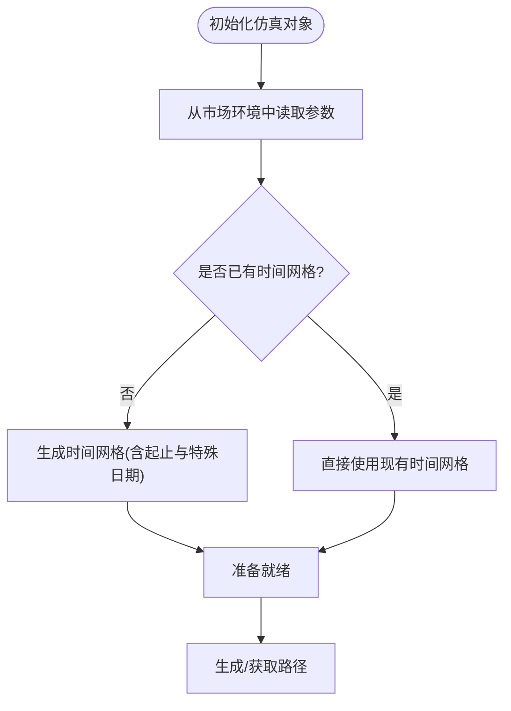
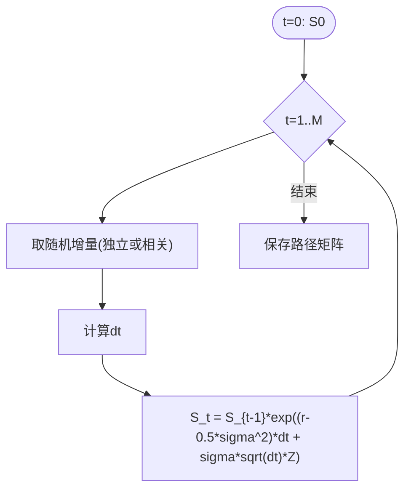
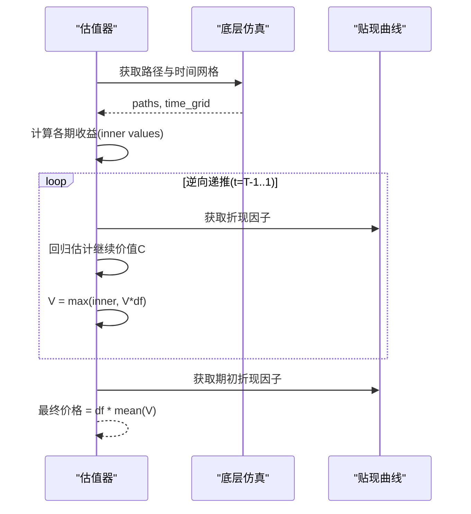
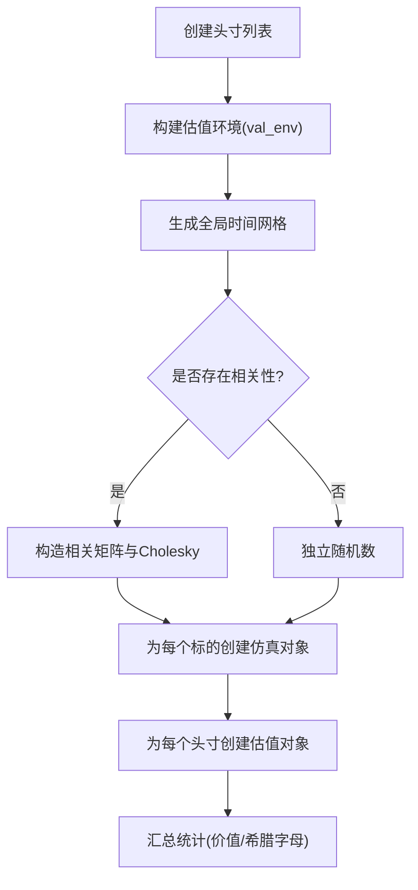
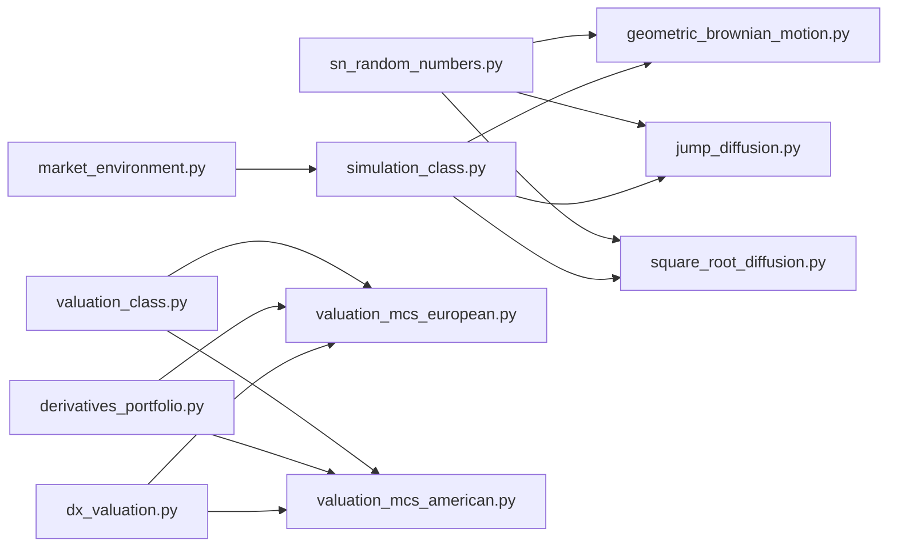

# 金融建模与衍生品定价

<cite>
**本文引用的文件**   
- [bsm_functions.py](file://Code/bsm_functions.py)
- [bsm_mcs_euro.py](file://py4fi2nd-master/code/ch01/bsm_mcs_euro.py)
- [bsm_option_class.py](file://py4fi2nd-master/code/b_bsm/bsm_option_class.py)
- [market_environment.py](file://py4fi2nd-master/code/dx/market_environment.py)
- [simulation_class.py](file://py4fi2nd-master/code/dx/simulation_class.py)
- [geometric_brownian_motion.py](file://py4fi2nd-master/code/dx/geometric_brownian_motion.py)
- [jump_diffusion.py](file://py4fi2nd-master/code/dx/jump_diffusion.py)
- [square_root_diffusion.py](file://py4fi2nd-master/code/dx/square_root_diffusion.py)
- [valuation_class.py](file://py4fi2nd-master/code/dx/valuation_class.py)
- [valuation_mcs_european.py](file://py4fi2nd-master/code/dx/valuation_mcs_european.py)
- [valuation_mcs_american.py](file://py4fi2nd-master/code/dx/valuation_mcs_american.py)
- [derivatives_position.py](file://py4fi2nd-master/code/dx/derivatives_position.py)
- [derivatives_portfolio.py](file://py4fi2nd-master/code/dx/derivatives_portfolio.py)
- [dx_valuation.py](file://py4fi2nd-master/code/dx/dx_valuation.py)
- [sn_random_numbers.py](file://py4fi2nd-master/code/dx/sn_random_numbers.py)
</cite>

## 目录
1. [引言](#引言)
2. [项目结构](#项目结构)
3. [核心组件](#核心组件)
4. [架构总览](#架构总览)
5. [详细组件分析](#详细组件分析)
6. [依赖关系分析](#依赖关系分析)
7. [性能考虑](#性能考虑)
8. [故障排查指南](#故障排查指南)
9. [结论](#结论)
10. [附录](#附录)

## 引言
本教程面向金融工程与量化实践者，系统讲解Black-Scholes-Merton（BSM）模型的理论基础与Python实现，涵盖欧式期权定价、希腊字母计算、隐含波动率估计；深入阐述蒙特卡洛模拟在衍生品定价中的应用，包括几何布朗运动路径生成、收敛性分析与方差缩减技术；并提供完整的衍生品分析框架：市场环境配置、头寸管理、投资组合估值、风险指标计算、压力测试与情景分析。教程强调面向对象设计，构建可复用、可扩展的金融模型库，并给出性能优化与并行计算的实践建议。

## 项目结构
仓库包含三部分关键内容：
- 基础函数与类：BSM解析解、Vega与隐含波动率、欧式期权MC示例、面向对象封装
- DX包：市场环境与仿真/估值基类、多种随机过程（GBM、跳跃扩散、平方根扩散）、欧式/美式期权MC估值、组合与头寸管理
- 数据与练习：时间序列、统计与可视化等辅助材料（本教程聚焦建模与定价）

图表来源 
- [bsm_functions.py:1-108](file://Code/bsm_functions.py#L1-L108)
- [bsm_mcs_euro.py:1-30](file://py4fi2nd-master/code/ch01/bsm_mcs_euro.py#L1-L30)
- [bsm_option_class.py:1-75](file://py4fi2nd-master/code/b_bsm/bsm_option_class.py#L1-L75)
- [market_environment.py:1-71](file://py4fi2nd-master/code/dx/market_environment.py#L1-L71)
- [simulation_class.py:1-98](file://py4fi2nd-master/code/dx/simulation_class.py#L1-L98)
- [geometric_brownian_motion.py:1-87](file://py4fi2nd-master/code/dx/geometric_brownian_motion.py#L1-L87)
- [jump_diffusion.py:1-109](file://py4fi2nd-master/code/dx/jump_diffusion.py#L1-L109)
- [square_root_diffusion.py:1-88](file://py4fi2nd-master/code/dx/square_root_diffusion.py#L1-L88)
- [valuation_class.py:1-116](file://py4fi2nd-master/code/dx/valuation_class.py#L1-L116)
- [valuation_mcs_european.py:1-79](file://py4fi2nd-master/code/dx/valuation_mcs_european.py#L1-L79)
- [valuation_mcs_american.py:1-86](file://py4fi2nd-master/code/dx/valuation_mcs_american.py#L1-L86)
- [derivatives_position.py:1-68](file://py4fi2nd-master/code/dx/derivatives_position.py#L1-L68)
- [derivatives_portfolio.py:1-198](file://py4fi2nd-master/code/dx/derivatives_portfolio.py#L1-L198)
- [dx_valuation.py:1-17](file://py4fi2nd-master/code/dx/dx_valuation.py#L1-L17)
- [sn_random_numbers.py:1-49](file://py4fi2nd-master/code/dx/sn_random_numbers.py#L1-L49)

章节来源
- [bsm_functions.py:1-108](file://Code/bsm_functions.py#L1-L108)
- [bsm_mcs_euro.py:1-30](file://py4fi2nd-master/code/ch01/bsm_mcs_euro.py#L1-L30)
- [bsm_option_class.py:1-75](file://py4fi2nd-master/code/b_bsm/bsm_option_class.py#L1-L75)
- [market_environment.py:1-71](file://py4fi2nd-master/code/dx/market_environment.py#L1-L71)
- [simulation_class.py:1-98](file://py4fi2nd-master/code/dx/simulation_class.py#L1-L98)
- [geometric_brownian_motion.py:1-87](file://py4fi2nd-master/code/dx/geometric_brownian_motion.py#L1-L87)
- [jump_diffusion.py:1-109](file://py4fi2nd-master/code/dx/jump_diffusion.py#L1-L109)
- [square_root_diffusion.py:1-88](file://py4fi2nd-master/code/dx/square_root_diffusion.py#L1-L88)
- [valuation_class.py:1-116](file://py4fi2nd-master/code/dx/valuation_class.py#L1-L116)
- [valuation_mcs_european.py:1-79](file://py4fi2nd-master/code/dx/valuation_mcs_european.py#L1-L79)
- [valuation_mcs_american.py:1-86](file://py4fi2nd-master/code/dx/valuation_mcs_american.py#L1-L86)
- [derivatives_position.py:1-68](file://py4fi2nd-master/code/dx/derivatives_position.py#L1-L68)
- [derivatives_portfolio.py:1-198](file://py4fi2nd-master/code/dx/derivatives_portfolio.py#L1-L198)
- [dx_valuation.py:1-17](file://py4fi2nd-master/code/dx/dx_valuation.py#L1-L17)
- [sn_random_numbers.py:1-49](file://py4fi2nd-master/code/dx/sn_random_numbers.py#L1-L49)

## 核心组件
- BSM解析解与希腊字母
  - 欧式看涨期权价格、Vega、隐含波动率数值求解
  - 面向对象封装便于扩展与重用
- 蒙特卡洛模拟
  - 几何布朗运动路径生成、欧式/美式期权MC估值
  - 反变异量与矩匹配提升收敛速度
- 市场环境与仿真基类
  - 统一管理参数、曲线、时间网格与随机数
- 多因子与相关性
  - Cholesky分解与共享随机数组，支持资产间相关性
- 组合与头寸管理
  - 头寸对象、组合对象、统计输出（价值、Delta、Vega）

章节来源
- [bsm_functions.py:1-108](file://Code/bsm_functions.py#L1-L108)
- [bsm_option_class.py:1-75](file://py4fi2nd-master/code/b_bsm/bsm_option_class.py#L1-L75)
- [bsm_mcs_euro.py:1-30](file://py4fi2nd-master/code/ch01/bsm_mcs_euro.py#L1-L30)
- [geometric_brownian_motion.py:1-87](file://py4fi2nd-master/code/dx/geometric_brownian_motion.py#L1-L87)
- [valuation_mcs_european.py:1-79](file://py4fi2nd-master/code/dx/valuation_mcs_european.py#L1-L79)
- [valuation_mcs_american.py:1-86](file://py4fi2nd-master/code/dx/valuation_mcs_american.py#L1-L86)
- [derivatives_portfolio.py:1-198](file://py4fi2nd-master/code/dx/derivatives_portfolio.py#L1-L198)
- [sn_random_numbers.py:1-49](file://py4fi2nd-master/code/dx/sn_random_numbers.py#L1-L49)

## 架构总览
整体采用“环境-仿真-估值-组合”的分层架构：
- 市场环境（market_environment）集中管理常量、列表与曲线
- 仿真基类（simulation_class）提供时间网格与通用接口
- 具体随机过程（GBM、跳跃扩散、平方根扩散）继承基类实现路径生成
- 估值基类（valuation_class）定义希腊字母数值方法与通用流程
- 欧式/美式估值器基于MC或LSM实现具体定价
- 组合（derivatives_portfolio）聚合头寸、处理相关性、输出统计

图表来源 
- [market_environment.py:1-71](file://py4fi2nd-master/code/dx/market_environment.py#L1-L71)
- [simulation_class.py:1-98](file://py4fi2nd-master/code/dx/simulation_class.py#L1-L98)
- [geometric_brownian_motion.py:1-87](file://py4fi2nd-master/code/dx/geometric_brownian_motion.py#L1-L87)
- [jump_diffusion.py:1-109](file://py4fi2nd-master/code/dx/jump_diffusion.py#L1-L109)
- [square_root_diffusion.py:1-88](file://py4fi2nd-master/code/dx/square_root_diffusion.py#L1-L88)
- [valuation_class.py:1-116](file://py4fi2nd-master/code/dx/valuation_class.py#L1-L116)
- [valuation_mcs_european.py:1-79](file://py4fi2nd-master/code/dx/valuation_mcs_european.py#L1-L79)
- [valuation_mcs_american.py:1-86](file://py4fi2nd-master/code/dx/valuation_mcs_american.py#L1-L86)
- [derivatives_position.py:1-68](file://py4fi2nd-master/code/dx/derivatives_position.py#L1-L68)
- [derivatives_portfolio.py:1-198](file://py4fi2nd-master/code/dx/derivatives_portfolio.py#L1-L198)

## 详细组件分析

### Black-Scholes-Merton 解析解与希腊字母
- 功能要点
  - 欧式看涨期权价格公式
  - Vega解析式
  - 隐含波动率牛顿迭代求解
- 复杂度与数值稳定性
  - 正态分布CDF/PDF调用开销低
  - 牛顿法对初始猜测敏感，需合理步长与迭代上限
- 面向对象封装
  - 将参数与方法封装为类，便于批量估值与敏感性分析

图表来源 
- [bsm_functions.py:1-108](file://Code/bsm_functions.py#L1-L108)
- [bsm_option_class.py:1-75](file://py4fi2nd-master/code/b_bsm/bsm_option_class.py#L1-L75)

章节来源
- [bsm_functions.py:1-108](file://Code/bsm_functions.py#L1-L108)
- [bsm_option_class.py:1-75](file://py4fi2nd-master/code/b_bsm/bsm_option_class.py#L1-L75)

### 蒙特卡洛模拟：欧式期权
- 算法流程
  - 生成标准正态随机数
  - 按几何布朗运动生成到期价格
  - 计算收益并按无风险利率折现求均值
- 收敛性与方差缩减
  - 大样本均值收敛于理论值
  - 反变异量与矩匹配可降低方差、加速收敛

图表来源 
- [bsm_mcs_euro.py:1-30](file://py4fi2nd-master/code/ch01/bsm_mcs_euro.py#L1-L30)
- [sn_random_numbers.py:1-49](file://py4fi2nd-master/code/dx/sn_random_numbers.py#L1-L49)

章节来源
- [bsm_mcs_euro.py:1-30](file://py4fi2nd-master/code/ch01/bsm_mcs_euro.py#L1-L30)
- [sn_random_numbers.py:1-49](file://py4fi2nd-master/code/dx/sn_random_numbers.py#L1-L49)

### 市场环境与仿真基类
- 职责划分
  - 市场环境：集中存储常量、列表、曲线，支持合并覆盖
  - 仿真基类：时间网格生成、参数读取、路径缓存与重算控制
- 关键点
  - 频率与特殊日期处理确保估值时间点完整
  - 固定种子保证结果可复现

图表来源 
- [market_environment.py:1-71](file://py4fi2nd-master/code/dx/market_environment.py#L1-L71)
- [simulation_class.py:1-98](file://py4fi2nd-master/code/dx/simulation_class.py#L1-L98)

章节来源
- [market_environment.py:1-71](file://py4fi2nd-master/code/dx/market_environment.py#L1-L71)
- [simulation_class.py:1-98](file://py4fi2nd-master/code/dx/simulation_class.py#L1-L98)

### 几何布朗运动（GBM）路径生成
- 数学模型
  - dS = r*S*dt + sigma*S*dW
- 离散化与实现
  - 指数形式更新，避免负值
  - 支持相关路径（Cholesky变换）
- 性能
  - NumPy向量化路径生成，内存布局(M,I)高效

图表来源 
- [geometric_brownian_motion.py:1-87](file://py4fi2nd-master/code/dx/geometric_brownian_motion.py#L1-L87)
- [sn_random_numbers.py:1-49](file://py4fi2nd-master/code/dx/sn_random_numbers.py#L1-L49)

章节来源
- [geometric_brownian_motion.py:1-87](file://py4fi2nd-master/code/dx/geometric_brownian_motion.py#L1-L87)

### 跳跃扩散与平方根扩散
- 跳跃扩散（Merton）
  - 连续扩散+泊松跳跃，调整漂移以补偿跳跃期望
  - 双随机源：正态与泊松
- 平方根扩散（CIR）
  - 均值回归与方差项非负约束
  - 全截断欧拉离散化保证非负

```mermaid
flowchart TD
StartJ["初始化路径"] --> JumpStep{"t=1..M"}
JumpStep --> SN["生成正态随机数"]
SN --> Poisson["生成泊松跳跃计数"]
Poisson --> UpdateJ["更新路径(扩散+跳跃)"]
UpdateJ --> JumpStep
JumpStep --> |结束| SaveJ["保存路径"]
StartR["初始化路径"] --> RootStep{"t=1..M"}
RootStep --> SN2["生成正态随机数"]
SN2 --> CIRUpdate["CIR更新(全截断Euler)"]
CIRUpdate --> NonNeg["投影到非负域"]
NonNeg --> RootStep
RootStep --> |结束| SaveR["保存路径"]
```

图表来源 
- [jump_diffusion.py:1-109](file://py4fi2nd-master/code/dx/jump_diffusion.py#L1-L109)
- [square_root_diffusion.py:1-88](file://py4fi2nd-master/code/dx/square_root_diffusion.py#L1-L88)

章节来源
- [jump_diffusion.py:1-109](file://py4fi2nd-master/code/dx/jump_diffusion.py#L1-L109)
- [square_root_diffusion.py:1-88](file://py4fi2nd-master/code/dx/square_root_diffusion.py#L1-L88)

### 欧式与美式期权估值（MC/LSM）
- 欧式估值
  - 到期收益函数eval执行，折现均值
  - 支持路径型（平均、最大、最小）
- 美式估值（Longstaff-Schwartz）
  - 反向递推：在每个时点比较立即行权与继续持有价值
  - 多项式基函数回归估计继续价值

图表来源 
- [valuation_mcs_european.py:1-79](file://py4fi2nd-master/code/dx/valuation_mcs_european.py#L1-L79)
- [valuation_mcs_american.py:1-86](file://py4fi2nd-master/code/dx/valuation_mcs_american.py#L1-L86)
- [valuation_class.py:1-116](file://py4fi2nd-master/code/dx/valuation_class.py#L1-L116)

章节来源
- [valuation_mcs_european.py:1-79](file://py4fi2nd-master/code/dx/valuation_mcs_european.py#L1-L79)
- [valuation_mcs_american.py:1-86](file://py4fi2nd-master/code/dx/valuation_mcs_american.py#L1-L86)
- [valuation_class.py:1-116](file://py4fi2nd-master/code/dx/valuation_class.py#L1-L116)

### 头寸与组合管理
- 头寸对象
  - 名称、数量、标的、市场环境、行权类型、收益函数
- 组合对象
  - 自动构建全局时间网格
  - 处理相关性（Cholesky与共享随机数组）
  - 统一实例化估值器并汇总统计（价值、Delta、Vega）

图表来源 
- [derivatives_position.py:1-68](file://py4fi2nd-master/code/dx/derivatives_position.py#L1-L68)
- [derivatives_portfolio.py:1-198](file://py4fi2nd-master/code/dx/derivatives_portfolio.py#L1-L198)
- [dx_valuation.py:1-17](file://py4fi2nd-master/code/dx/dx_valuation.py#L1-L17)

章节来源
- [derivatives_position.py:1-68](file://py4fi2nd-master/code/dx/derivatives_position.py#L1-L68)
- [derivatives_portfolio.py:1-198](file://py4fi2nd-master/code/dx/derivatives_portfolio.py#L1-L198)
- [dx_valuation.py:1-17](file://py4fi2nd-master/code/dx/dx_valuation.py#L1-L17)

## 依赖关系分析
- 模块耦合
  - 估值器依赖仿真器与市场环境
  - 组合依赖头寸与估值器，间接依赖随机数生成
- 外部依赖
  - NumPy/Pandas用于数值与时间序列
  - SciPy用于正态分布函数
- 潜在循环依赖
  - dx_valuation作为统一入口导入估值类，避免直接循环

图表来源 
- [sn_random_numbers.py:1-49](file://py4fi2nd-master/code/dx/sn_random_numbers.py#L1-L49)
- [geometric_brownian_motion.py:1-87](file://py4fi2nd-master/code/dx/geometric_brownian_motion.py#L1-L87)
- [jump_diffusion.py:1-109](file://py4fi2nd-master/code/dx/jump_diffusion.py#L1-L109)
- [square_root_diffusion.py:1-88](file://py4fi2nd-master/code/dx/square_root_diffusion.py#L1-L88)
- [market_environment.py:1-71](file://py4fi2nd-master/code/dx/market_environment.py#L1-L71)
- [simulation_class.py:1-98](file://py4fi2nd-master/code/dx/simulation_class.py#L1-L98)
- [valuation_class.py:1-116](file://py4fi2nd-master/code/dx/valuation_class.py#L1-L116)
- [valuation_mcs_european.py:1-79](file://py4fi2nd-master/code/dx/valuation_mcs_european.py#L1-L79)
- [valuation_mcs_american.py:1-86](file://py4fi2nd-master/code/dx/valuation_mcs_american.py#L1-L86)
- [derivatives_portfolio.py:1-198](file://py4fi2nd-master/code/dx/derivatives_portfolio.py#L1-L198)
- [dx_valuation.py:1-17](file://py4fi2nd-master/code/dx/dx_valuation.py#L1-L17)

章节来源
- [dx_valuation.py:1-17](file://py4fi2nd-master/code/dx/dx_valuation.py#L1-L17)
- [derivatives_portfolio.py:1-198](file://py4fi2nd-master/code/dx/derivatives_portfolio.py#L1-L198)

## 性能考虑
- 随机数生成
  - 反变异量与矩匹配显著降低方差，减少所需路径数
  - 固定种子提高可复现性
- 向量化与内存
  - 路径矩阵(M,I)一次性生成，避免逐条循环
  - 注意内存占用，必要时分块计算
- 相关性处理
  - Cholesky分解一次完成，后续仅矩阵乘法切片
- 数值方法
  - 隐含波动率牛顿迭代需设定合理迭代上限与步长
  - 美式LSM回归阶数bf影响偏差与方差平衡
- 并行与分布式
  - 路径生成天然可并行：按路径分片或使用进程池
  - 组合估值可并行不同头寸或不同情景

[本节为通用指导，不直接分析具体文件]

## 故障排查指南
- 到期日不在时间网格
  - 现象：欧式估值提示到期日缺失
  - 解决：确保估值环境加入起始与到期日，或手动插入特殊日期
- 收益函数评估错误
  - 现象：eval执行失败
  - 解决：检查payoff_func语法与变量名（如maturity_value、instrument_values）
- 相关性导致维度不匹配
  - 现象：Cholesky或矩阵乘法报错
  - 解决：确认相关矩阵对称半正定，rn_set索引正确
- 数值不稳定
  - 现象：Delta/Vega异常或超出[-1,1]
  - 解决：调整区间大小与精度，限制边界值

章节来源
- [valuation_mcs_european.py:1-79](file://py4fi2nd-master/code/dx/valuation_mcs_european.py#L1-L79)
- [valuation_mcs_american.py:1-86](file://py4fi2nd-master/code/dx/valuation_mcs_american.py#L1-L86)
- [derivatives_portfolio.py:1-198](file://py4fi2nd-master/code/dx/derivatives_portfolio.py#L1-L198)

## 结论
本教程基于仓库中的模块化实现，构建了从BSM解析解到蒙特卡洛与LSM估值的完整体系，并通过市场环境与仿真基类实现了高内聚、低耦合的可扩展架构。结合头寸与组合管理，能够支撑复杂衍生品的定价、风险度量与压力测试。通过方差缩减、向量化与并行化策略，可在保证精度的前提下显著提升性能。

[本节为总结，不直接分析具体文件]

## 附录
- 常用场景
  - 欧式看涨/看跌期权定价与希腊字母
  - 路径依赖期权（亚式、障碍）通过payoff_func灵活表达
  - 多资产组合与相关性情景分析
- 扩展建议
  - 增加更多随机过程（Heston、局部波动率）
  - 引入更稳健的隐含波动率求解（Brent法）
  - 集成实时数据与在线估值流水线

[本节为概念性内容，不直接分析具体文件]