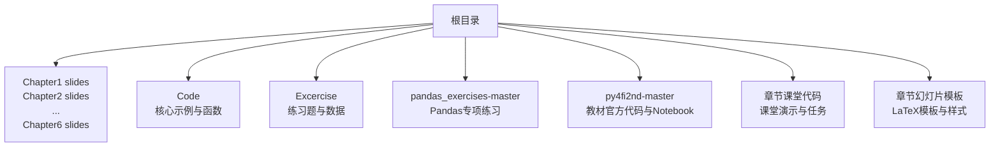
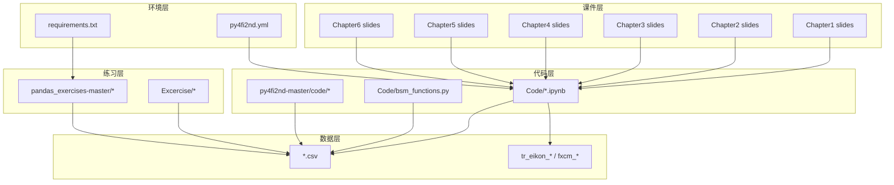
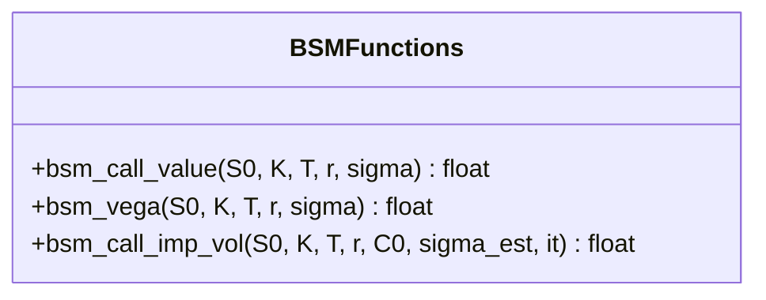
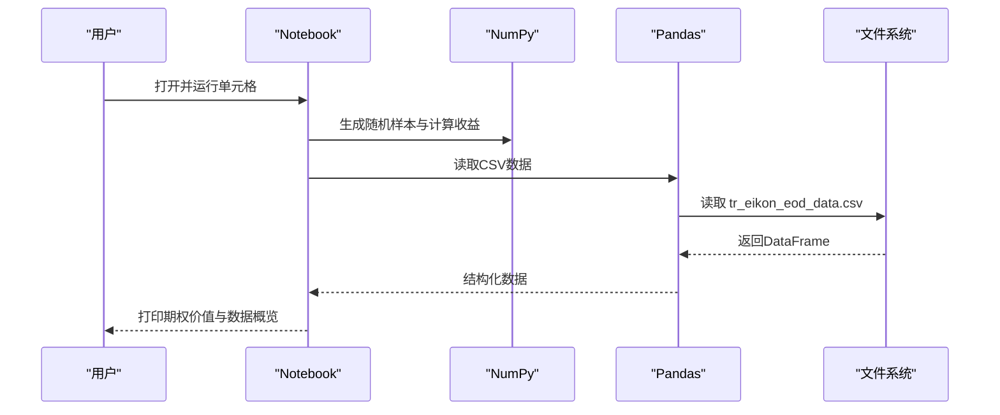
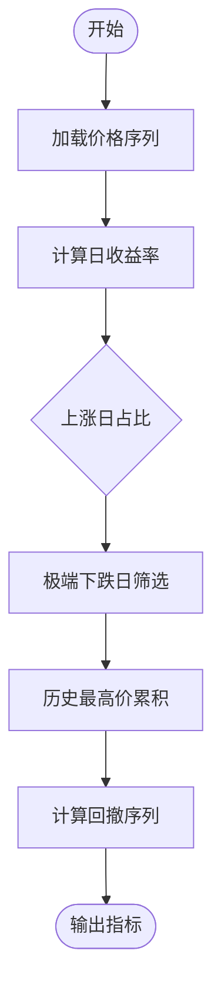
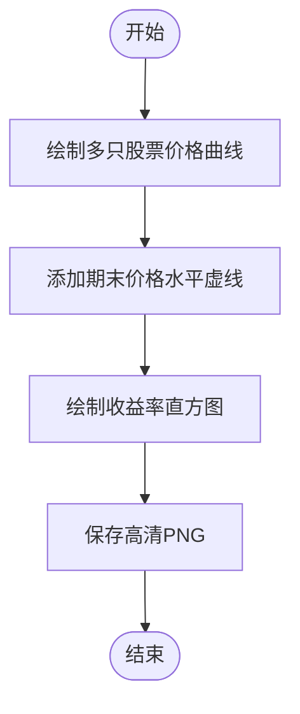
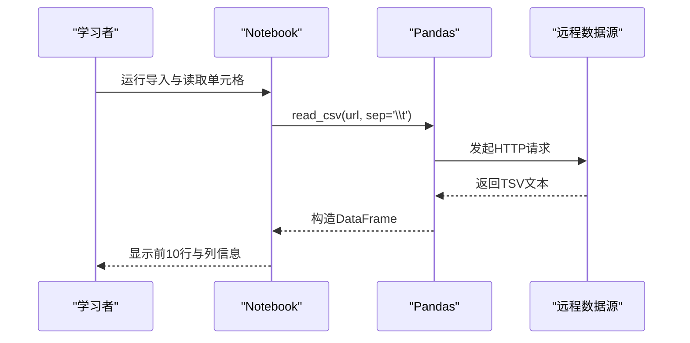
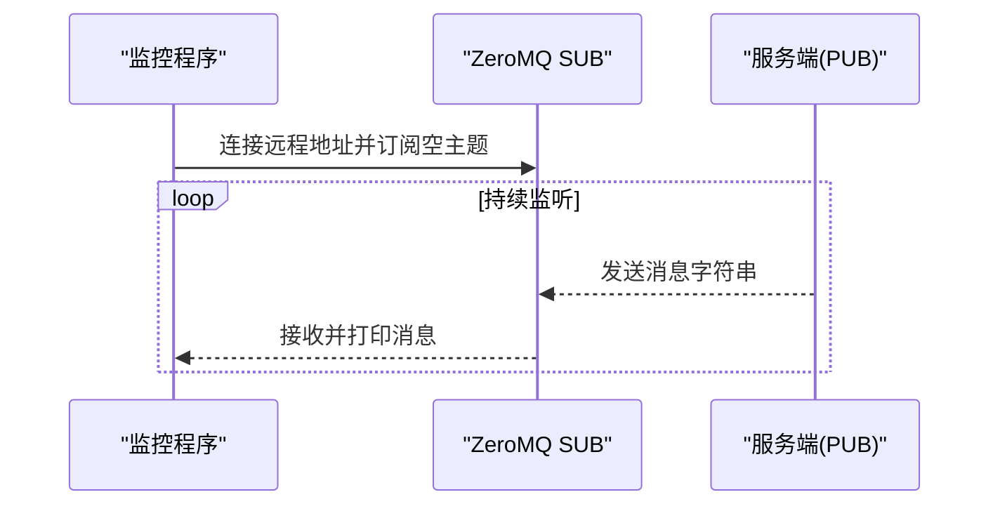
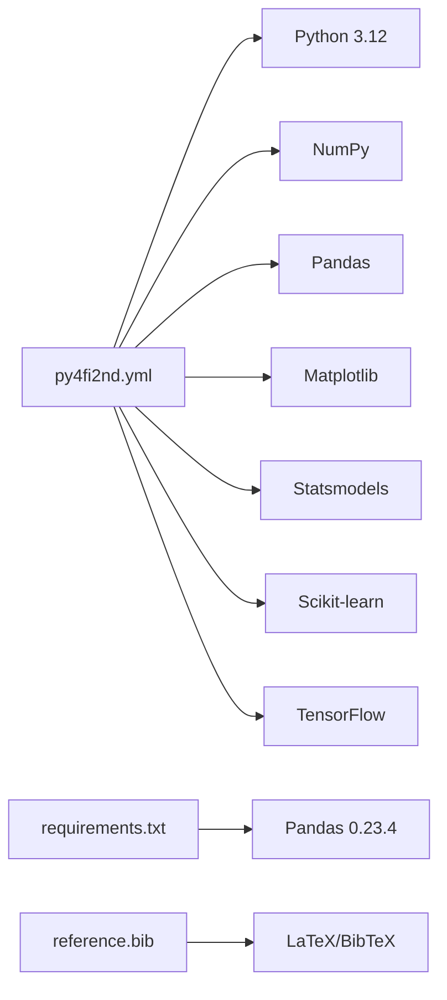

# 项目概述

<cite>
**本文引用的文件**   
- [README.md](file://py4fi2nd-master/README.md)
- [py4fi2nd.yml](file://py4fi2nd-master/py4fi2nd.yml)
- [01_Why_Python.ipynb](file://Code/01_Why_Python.ipynb)
- [bsm_functions.py](file://Code/bsm_functions.py)
- [03_NumPy.ipynb](file://章节课堂代码/03_NumPy.ipynb)
- [05_Visualization.ipynb](file://章节课堂代码/05_Visualization.ipynb)
- [01_Chipotle_Exercises.ipynb](file://Excercise/01_Chipotle_Exercises.ipynb)
- [requirements.txt](file://pandas_exercises-master/requirements.txt)
- [strategy_monitoring.py](file://py4fi2nd-master/code/ch16/strategy_monitoring.py)
- [reference.bib](file://Chapter1 slides/reference.bib)
</cite>

## 目录
1. [简介](#简介)
2. [项目结构](#项目结构)
3. [核心组件](#核心组件)
4. [架构总览](#架构总览)
5. [详细组件分析](#详细组件分析)
6. [依赖关系分析](#依赖关系分析)
7. [性能与可维护性](#性能与可维护性)
8. [故障排查指南](#故障排查指南)
9. [结论](#结论)
10. [附录：学习路径与使用示例](#附录学习路径与使用示例)

## 简介
本项目围绕《Python for Finance》第二版教材，构建了一套“从Python基础到高级金融建模”的完整教学体系。内容涵盖六章幻灯片、配套Jupyter Notebook代码示例、练习题与实战案例，覆盖数据获取与清洗、数值计算、统计分析、可视化、期权定价与蒙特卡洛模拟、交易策略与自动化监控等主题。技术栈以Python 3.12为核心，结合Jupyter Notebook进行交互式学习与实验，LaTeX用于高质量课件排版，并通过conda环境管理依赖包，确保可复现性与跨平台一致性。

本项目的目标：
- 为初学者提供循序渐进的学习路径与可运行的示例；
- 为有经验的开发者提供深入的技术细节与扩展点；
- 通过真实数据集与金融场景，强化“学以致用”的能力。

**章节来源**
- [README.md:1-22](file://py4fi2nd-master/README.md#L1-L22)

## 项目结构
仓库采用“按主题分目录”的组织方式，便于按需学习与扩展：
- ChapterN slides：每章的LaTeX Beamer课件（含样式、图表与参考文献）
- Code：课程核心代码与示例Notebook（如Python入门、数据结构、时间序列、数学工具、统计、交易策略等），以及期权定价函数
- Excercise：练习题与数据集，包含多种Pandas练习与解决方案
- pandas_exercises-master：外部精选Pandas练习集（按主题分类）
- py4fi2nd-master：教材官方代码与Notebook（按章节组织，含衍生品分析模块dx）
- 章节课堂代码：本地化课堂演示与课后任务
- 章节幻灯片模板：统一的LaTeX模板与样式

**图示来源**
- [README.md:1-22](file://py4fi2nd-master/README.md#L1-L22)

**章节来源**
- [README.md:1-22](file://py4fi2nd-master/README.md#L1-L22)

## 核心组件
- 教学课件（LaTeX Beamer）：统一风格、引用规范，支撑六章系统化讲解
- Jupyter Notebook示例：贯穿Python基础、NumPy/pandas、可视化、统计与机器学习、交易策略与自动化
- 金融函数库：Black-Scholes-Merton期权定价、Vega与隐含波动率估算
- 练习与数据集：覆盖数据读取、清洗、分组、合并、统计、可视化与时间序列
- 环境配置：conda环境定义与requirements清单，保证可复现实验

关键要点：
- 使用Python 3.12作为主运行环境，配合Jupyter Lab/Notebook进行交互开发
- 通过conda集中管理科学计算与机器学习依赖（numpy、pandas、matplotlib、statsmodels、scikit-learn、tensorflow等）
- 通过LaTeX与BibTeX管理课件与参考文献，提升学术规范性

**章节来源**
- [py4fi2nd.yml:1-19](file://py4fi2nd-master/py4fi2nd.yml#L1-L19)
- [requirements.txt:1-4](file://pandas_exercises-master/requirements.txt#L1-L4)
- [reference.bib:1-49](file://Chapter1 slides/reference.bib#L1-L49)

## 架构总览
项目整体由“课件—代码—练习—数据—环境”五层构成，形成闭环学习体验：
- 课件层：提供概念框架与推导过程
- 代码层：将理论落地为可执行脚本与Notebook
- 练习层：通过问题驱动巩固技能
- 数据层：提供真实或仿真数据集支持端到端实践
- 环境层：统一依赖与环境，保障可复现性

**图示来源**
- [py4fi2nd.yml:1-19](file://py4fi2nd-master/py4fi2nd.yml#L1-L19)
- [requirements.txt:1-4](file://pandas_exercises-master/requirements.txt#L1-L4)

## 详细组件分析

### 组件A：期权定价与希腊值（BSM函数库）
- 功能：实现Black-Scholes-Merton欧式看涨期权定价、Vega计算与隐含波动率数值估计
- 复杂度：定价公式O(1)，隐含波动率迭代收敛（默认100次迭代），每次调用O(1)
- 依赖：math、scipy.stats
- 适用场景：期权估值、风险敏感度分析、波动率校准

**图示来源**
- [bsm_functions.py:10-42](file://Code/bsm_functions.py#L10-L42)
- [bsm_functions.py:47-76](file://Code/bsm_functions.py#L47-L76)
- [bsm_functions.py:81-107](file://Code/bsm_functions.py#L81-L107)

**章节来源**
- [bsm_functions.py:1-108](file://Code/bsm_functions.py#L1-L108)

### 组件B：Python入门与金融语法（Why Python）
- 功能：展示Python在金融中的简洁语法、快速原型能力与生态优势
- 流程：导入库→参数初始化→随机抽样→收益计算→期权定价→结果输出
- 数据：Eikon日频数据CSV，用于后续时间序列分析

**图示来源**
- [01_Why_Python.ipynb:1-200](file://Code/01_Why_Python.ipynb#L1-L200)

**章节来源**
- [01_Why_Python.ipynb:1-200](file://Code/01_Why_Python.ipynb#L1-L200)

### 组件C：NumPy数组计算（课堂代码）
- 功能：对比循环与向量化计算，强调NumPy的性能优势
- 指标：上涨日占比、极端下跌日、最大回撤
- 方法：np.maximum.accumulate、布尔索引、向量化运算

**图示来源**
- [03_NumPy.ipynb:531-582](file://章节课堂代码/03_NumPy.ipynb#L531-L582)

**章节来源**
- [03_NumPy.ipynb:1-44](file://章节课堂代码/03_NumPy.ipynb#L1-L44)
- [03_NumPy.ipynb:531-582](file://章节课堂代码/03_NumPy.ipynb#L531-L582)

### 组件D：可视化（课堂代码）
- 功能：绘制价格走势、直方图分布，掌握Matplotlib常用技巧
- 练习：导出高分辨率图片、添加参考线、调整bins观察分布稳定性

**图示来源**
- [05_Visualization.ipynb:359-414](file://章节课堂代码/05_Visualization.ipynb#L359-L414)

**章节来源**
- [05_Visualization.ipynb:359-414](file://章节课堂代码/05_Visualization.ipynb#L359-L414)

### 组件E：Pandas练习（Chipotle）
- 功能：从网络读取TSV数据，完成数据探索与基础操作
- 步骤：导入库→读取数据→查看前10行→字段类型检查→缺失值处理

**图示来源**
- [01_Chipotle_Exercises.ipynb:1-200](file://Excercise/01_Chipotle_Exercises.ipynb#L1-L200)

**章节来源**
- [01_Chipotle_Exercises.ipynb:1-200](file://Excercise/01_Chipotle_Exercises.ipynb#L1-L200)

### 组件F：自动化交易策略监控（ZeroMQ）
- 功能：通过ZeroMQ订阅消息，实现策略信号与状态监控
- 场景：FXCM外汇数据流、策略信号推送、实时日志采集

**图示来源**
- [strategy_monitoring.py:1-22](file://py4fi2nd-master/code/ch16/strategy_monitoring.py#L1-L22)

**章节来源**
- [strategy_monitoring.py:1-22](file://py4fi2nd-master/code/ch16/strategy_monitoring.py#L1-L22)

## 依赖关系分析
- conda环境（py4fi2nd.yml）：定义Python版本与核心科学计算库，确保跨平台一致
- requirements.txt：Pandas练习集的轻量依赖，便于独立运行
- 课件引用（reference.bib）：统一管理参考文献，支持LaTeX编译

**图示来源**
- [py4fi2nd.yml:1-19](file://py4fi2nd-master/py4fi2nd.yml#L1-L19)
- [requirements.txt:1-4](file://pandas_exercises-master/requirements.txt#L1-L4)
- [reference.bib:1-49](file://Chapter1 slides/reference.bib#L1-L49)

**章节来源**
- [py4fi2nd.yml:1-19](file://py4fi2nd-master/py4fi2nd.yml#L1-L19)
- [requirements.txt:1-4](file://pandas_exercises-master/requirements.txt#L1-L4)
- [reference.bib:1-49](file://Chapter1 slides/reference.bib#L1-L49)

## 性能与可维护性
- 向量化优先：用NumPy替代循环，显著提升大规模数据处理速度
- 模块化设计：将期权定价与希腊值封装为独立函数，便于复用与测试
- 环境隔离：conda环境避免依赖冲突，提高可复现性
- 可扩展性：基于Jupyter的可插拔单元，便于逐步叠加新模型与策略

[本节为通用指导，不直接分析具体文件]

## 故障排查指南
- 环境安装失败：确认已安装Miniconda/Anaconda，并使用conda env create -f py4fi2nd.yml创建环境
- 依赖版本冲突：优先使用conda安装指定版本，必要时降级或升级相关包
- 数据读取错误：检查CSV/TSV编码与分隔符，确保路径正确
- 绘图异常：确认matplotlib后端与字体设置，必要时切换样式
- 网络数据不可达：检查代理与防火墙设置，或使用本地缓存数据

**章节来源**
- [README.md:11-22](file://py4fi2nd-master/README.md#L11-L22)

## 结论
本项目以《Python for Finance》第二版为核心，构建了“课件—代码—练习—数据—环境”一体化的教学体系。通过系统化的学习路径与丰富的实战案例，帮助学习者从Python基础稳步过渡到高级金融建模与自动化交易监控。建议初学者按章节顺序推进，有经验的开发者可直接定位所需模块进行深度定制与扩展。

[本节为总结，不直接分析具体文件]

## 附录：学习路径与使用示例
- 初学者路径
  - 第1步：阅读第一章幻灯片，理解Python在金融中的优势与生态
  - 第2步：运行Code/01_Why_Python.ipynb，熟悉基本语法与数据读取
  - 第3步：完成Excercise/01_Chipotle_Exercises.ipynb，掌握Pandas基础
  - 第4步：学习章节课堂代码03_NumPy.ipynb与05_Visualization.ipynb，掌握数值计算与可视化
  - 第5步：使用Code/bsm_functions.py进行期权定价与希腊值分析
  - 第6步：进阶至py4fi2nd-master中ch16策略监控，了解ZeroMQ通信

- 有经验开发者
  - 直接定位Chapters对应Notebook，扩展模型与策略
  - 基于bsm_functions.py封装自定义定价器与风险度量
  - 利用py4fi2nd.yml环境快速搭建研究平台

- 使用场景示例
  - 金融时间序列分析：读取Eikon日频数据，计算收益率与波动率
  - 期权定价与校准：使用BSM公式与隐含波动率估计
  - 可视化报告：生成高清图表，辅助研究与汇报
  - 自动化监控：通过ZeroMQ订阅策略信号，实现实时跟踪

**章节来源**
- [README.md:1-22](file://py4fi2nd-master/README.md#L1-L22)
- [01_Why_Python.ipynb:1-200](file://Code/01_Why_Python.ipynb#L1-L200)
- [01_Chipotle_Exercises.ipynb:1-200](file://Excercise/01_Chipotle_Exercises.ipynb#L1-L200)
- [03_NumPy.ipynb:1-44](file://章节课堂代码/03_NumPy.ipynb#L1-L44)
- [05_Visualization.ipynb:359-414](file://章节课堂代码/05_Visualization.ipynb#L359-L414)
- [bsm_functions.py:1-108](file://Code/bsm_functions.py#L1-L108)
- [strategy_monitoring.py:1-22](file://py4fi2nd-master/code/ch16/strategy_monitoring.py#L1-L22)