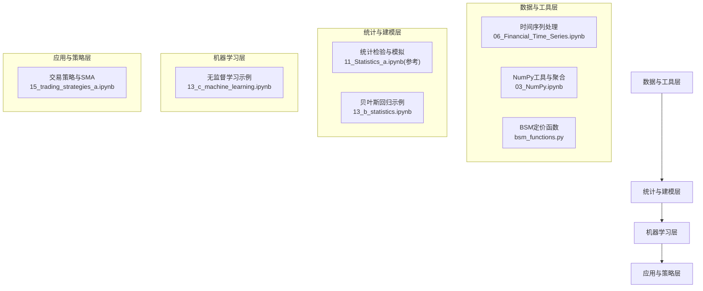
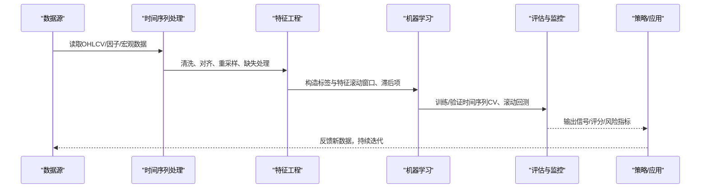
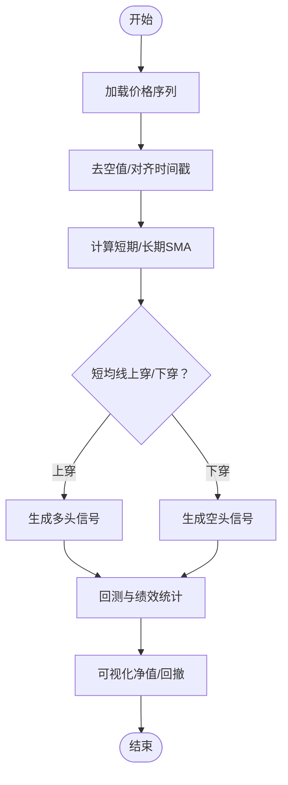
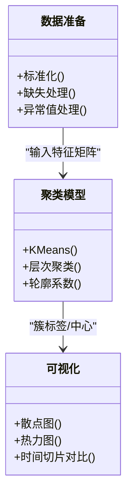
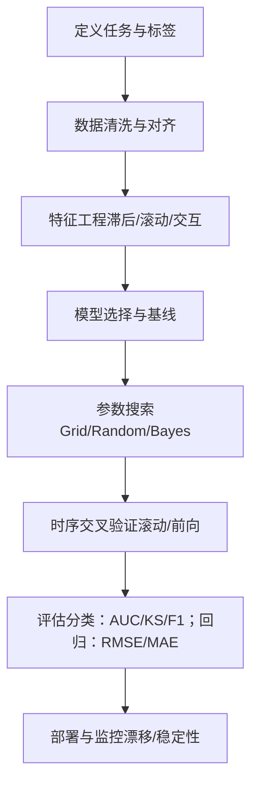
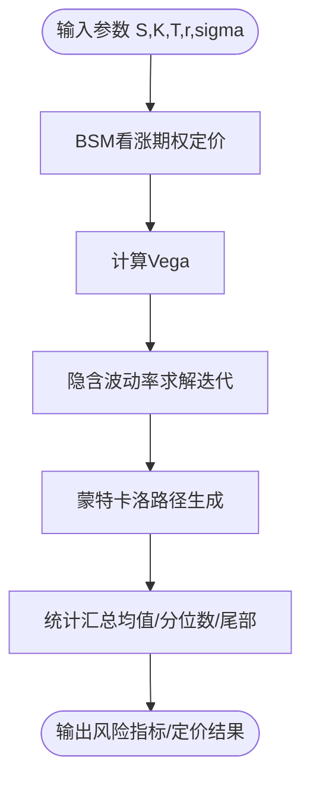
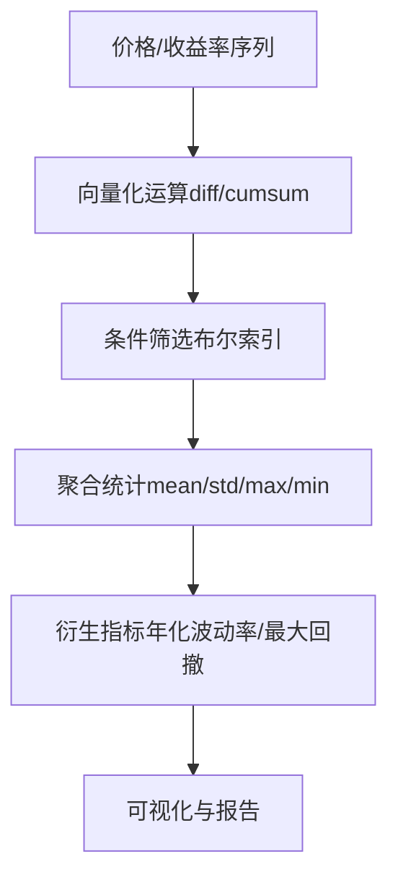
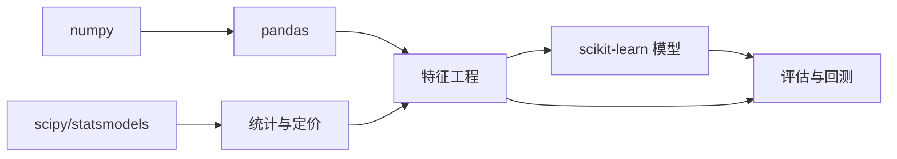

# 机器学习在金融中的应用

<cite>
**本文引用的文件**   
- [15_trading_strategies_a.ipynb](file://Code/15_trading_strategies_a.ipynb)
- [06_Financial_Time_Series.ipynb](file://Code/06_Financial_Time_Series.ipynb)
- [13_c_machine_learning.ipynb](file://py4fi2nd-master/code/ch13/13_c_machine_learning.ipynb)
- [13_b_statistics.ipynb](file://py4fi2nd-master/code/ch13/13_b_statistics.ipynb)
- [bsm_functions.py](file://Code/bsm_functions.py)
- [03_NumPy.ipynb](file://章节课堂代码/03_NumPy.ipynb)
</cite>

## 目录
1. [引言](#引言)
2. [项目结构](#项目结构)
3. [核心组件](#核心组件)
4. [架构总览](#架构总览)
5. [详细组件分析](#详细组件分析)
6. [依赖分析](#依赖分析)
7. [性能考虑](#性能考虑)
8. [故障排查指南](#故障排查指南)
9. [结论](#结论)
10. [附录](#附录)

## 引言
本文件面向金融数据分析与量化实践，系统梳理监督学习（分类、回归）与无监督学习（聚类、降维）在信用评分、风险评估、市场预测、异常检测等场景中的落地方法。结合仓库中的时间序列处理、统计建模与机器学习示例，给出从数据预处理、特征工程、模型选择、参数调优到性能评估的完整流程，并配套Python实现要点与可视化建议，帮助读者快速搭建可复现的金融机器学习工作流。

## 项目结构
仓库包含多类材料：
- 代码笔记本：涵盖交易策略、时间序列基础、统计与机器学习示例、NumPy工具集等
- 数学与定价函数：Black-Scholes-Merton期权定价与隐含波动率估计
- 练习与幻灯片：辅助理解与教学

图表来源 
- [06_Financial_Time_Series.ipynb](file://Code/06_Financial_Time_Series.ipynb)
- [03_NumPy.ipynb](file://章节课堂代码/03_NumPy.ipynb)
- [bsm_functions.py](file://Code/bsm_functions.py)
- [13_b_statistics.ipynb](file://py4fi2nd-master/code/ch13/13_b_statistics.ipynb)
- [13_c_machine_learning.ipynb](file://py4fi2nd-master/code/ch13/13_c_machine_learning.ipynb)
- [15_trading_strategies_a.ipynb](file://Code/15_trading_strategies_a.ipynb)

章节来源
- [06_Financial_Time_Series.ipynb](file://Code/06_Financial_Time_Series.ipynb)
- [03_NumPy.ipynb](file://章节课堂代码/03_NumPy.ipynb)
- [bsm_functions.py](file://Code/bsm_functions.py)
- [13_b_statistics.ipynb](file://py4fi2nd-master/code/ch13/13_b_statistics.ipynb)
- [13_c_machine_learning.ipynb](file://py4fi2nd-master/code/ch13/13_c_machine_learning.ipynb)
- [15_trading_strategies_a.ipynb](file://Code/15_trading_strategies_a.ipynb)

## 核心组件
- 时间序列与数据处理
  - 使用pandas进行数据读取、清洗、重采样与缺失值处理，构建收益率、波动率等技术指标
  - 利用NumPy进行向量化计算、条件筛选与聚合统计，支撑特征工程与回测
- 统计与定价
  - Black-Scholes-Merton解析定价、Vega与隐含波动率数值求解，为风险度量与衍生品定价提供基准
  - 正态性检验与蒙特卡洛路径生成，用于压力测试与情景分析
- 机器学习
  - 无监督学习示例（聚类），演示数据探索与分组；可扩展至降维（PCA）与异常检测（Isolation Forest）
  - 监督学习（分类/回归）框架：以信用评分（分类）、风险暴露或收益预测（回归）为例，贯穿数据准备、训练、验证与评估

章节来源
- [06_Financial_Time_Series.ipynb](file://Code/06_Financial_Time_Series.ipynb)
- [03_NumPy.ipynb](file://章节课堂代码/03_NumPy.ipynb)
- [bsm_functions.py](file://Code/bsm_functions.py)
- [13_c_machine_learning.ipynb](file://py4fi2nd-master/code/ch13/13_c_machine_learning.ipynb)

## 架构总览
下图展示从原始数据到模型落地的端到端流程，强调时间序列特性与金融约束（如避免未来函数、滚动窗口与交叉验证）。

[该图为概念流程图，不直接映射具体源码文件]

## 详细组件分析

### 组件A：时间序列与特征工程（交易策略与SMA）
- 目标：基于价格序列构建技术指标（如短期/长期移动平均线），形成交易信号
- 关键步骤
  - 数据导入与清洗：读取日频数据、去空值、统一索引
  - 指标计算：滚动均值、比率、差值等
  - 信号生成：短均线穿越长均线产生买卖信号
  - 回测与可视化：净值曲线、回撤、胜率等
- 适用场景：趋势跟踪、动量策略、风控阈值触发

图表来源 
- [15_trading_strategies_a.ipynb](file://Code/15_trading_strategies_a.ipynb)

章节来源
- [15_trading_strategies_a.ipynb](file://Code/15_trading_strategies_a.ipynb)

### 组件B：无监督学习（聚类）与数据探索
- 目标：对多维金融数据进行分组与模式发现，支持客户分群、资产类别划分、异常点识别
- 关键步骤
  - 数据标准化与降维（可选PCA）
  - 聚类算法（KMeans/层次聚类）与轮廓系数评估
  - 可视化（散点图、热力图）与业务解读
- 扩展：结合异常检测（如Isolation Forest）识别极端行情或可疑交易

图表来源 
- [13_c_machine_learning.ipynb](file://py4fi2nd-master/code/ch13/13_c_machine_learning.ipynb)

章节来源
- [13_c_machine_learning.ipynb](file://py4fi2nd-master/code/ch13/13_c_machine_learning.ipynb)

### 组件C：监督学习（分类/回归）框架
- 目标：信用评分（二分类）、风险暴露或收益预测（回归）
- 关键步骤
  - 标签定义：违约/非违约、涨跌方向、未来收益区间
  - 特征工程：财务比率、技术面指标、宏观因子、滞后与滚动统计
  - 模型选择：逻辑回归、树模型（随机森林/XGBoost）、线性回归、正则化模型
  - 参数调优：网格/随机搜索、贝叶斯优化
  - 评估指标：AUC/PR、KS、F1、RMSE/MAE、夏普比率（策略层面）
  - 时间序列验证：滚动窗口/前向链式交叉验证，避免未来函数
- 适用场景：信贷审批、欺诈检测、波动率预测、资产配置权重

[该图为通用流程示意，不直接映射具体源码文件]

### 组件D：统计与定价（BSM与蒙特卡洛）
- 目标：为风险度量与衍生品定价提供基准，辅助特征构建（如隐含波动率、希腊字母）
- 关键步骤
  - 解析公式：欧式期权定价、Vega计算
  - 数值方法：隐含波动率牛顿迭代
  - 蒙特卡洛：几何布朗运动路径生成，分布与尾部风险统计
- 应用场景：期权对冲、VaR/CVaR估算、压力测试

图表来源 
- [bsm_functions.py](file://Code/bsm_functions.py)

章节来源
- [bsm_functions.py](file://Code/bsm_functions.py)

### 组件E：NumPy工具与聚合统计
- 目标：高效完成金融数据的向量化计算、条件筛选与聚合统计
- 关键步骤
  - 数组切片与布尔索引：筛选涨跌日、极端波动日
  - 聚合函数：均值、标准差、最大值/最小值、累计和
  - 综合案例：模拟股价、年化波动率、最大回撤等
- 应用场景：因子计算、回测引擎、风险指标快速估算

图表来源 
- [03_NumPy.ipynb](file://章节课堂代码/03_NumPy.ipynb)

章节来源
- [03_NumPy.ipynb](file://章节课堂代码/03_NumPy.ipynb)

## 依赖分析
- 模块耦合关系
  - 时间序列处理依赖pandas/numpy，为特征工程提供基础
  - 统计与定价模块独立性强，可作为特征来源或基准模型
  - 机器学习模块依赖特征矩阵与标签，需严格时序分割
- 外部依赖
  - scikit-learn（聚类、回归、分类、交叉验证）
  - numpy/pandas（数据处理与计算）
  - matplotlib（可视化）
  - scipy/statsmodels（统计检验与拟合）

[该图为概念依赖图，不直接映射具体源码文件]

## 性能考虑
- 数据规模与内存管理：大表分块处理、稀疏矩阵、增量更新
- 计算加速：向量化优先、并行化（joblib/multiprocessing）、GPU（可选）
- 模型复杂度：树模型与正则化平衡过拟合；早停与剪枝
- 时序特性：滚动窗口长度选择、避免未来函数、减少重计算
- 评估稳健性：多次随机种子、不同时间段验证、稳定性监控

[本节为通用指导，不直接分析具体文件]

## 故障排查指南
- 常见错误
  - 时间戳不一致导致对齐失败：检查时区、频率与缺失日期填充
  - 未来函数泄露：确保特征仅使用历史窗口
  - 过拟合：训练/验证差距过大，采用正则化、简化模型、更多样本
  - 聚类不稳定：标准化不足、K选择不当，尝试多种初始化与评估指标
- 调试建议
  - 逐步打印中间变量形状与统计摘要
  - 可视化关键指标（价格、信号、残差分布）
  - 使用小样本子集快速验证流程

章节来源
- [06_Financial_Time_Series.ipynb](file://Code/06_Financial_Time_Series.ipynb)
- [03_NumPy.ipynb](file://章节课堂代码/03_NumPy.ipynb)
- [13_c_machine_learning.ipynb](file://py4fi2nd-master/code/ch13/13_c_machine_learning.ipynb)

## 结论
本文件围绕金融数据的时间序列特性与风险管理需求，构建了从数据到模型的完整闭环。通过时间序列处理、统计与定价、机器学习三大模块的协同，可实现信用评分、风险评估、市场预测与异常检测等典型场景。实践中应重视时序交叉验证、特征工程质量与模型稳健性，结合可视化与监控，持续提升模型在真实环境中的表现。

[本节为总结，不直接分析具体文件]

## 附录
- 推荐工作流清单
  - 数据：清洗、对齐、缺失处理、异常值处理
  - 特征：滞后、滚动统计、比率、宏观因子融合
  - 模型：基线（线性/树）、正则化、集成
  - 验证：滚动/前向交叉验证、时间外样本
  - 评估：分类（AUC/KS/F1）、回归（RMSE/MAE）、策略（夏普/回撤）
  - 部署：监控漂移、定期重训、回滚机制

[本节为补充信息，不直接分析具体文件]