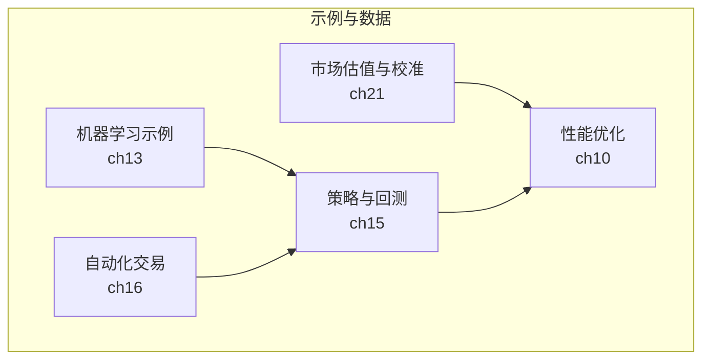
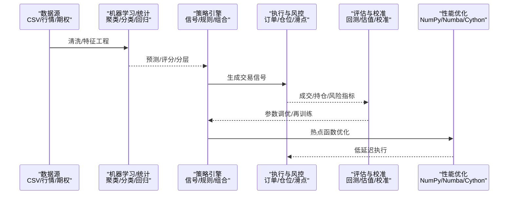
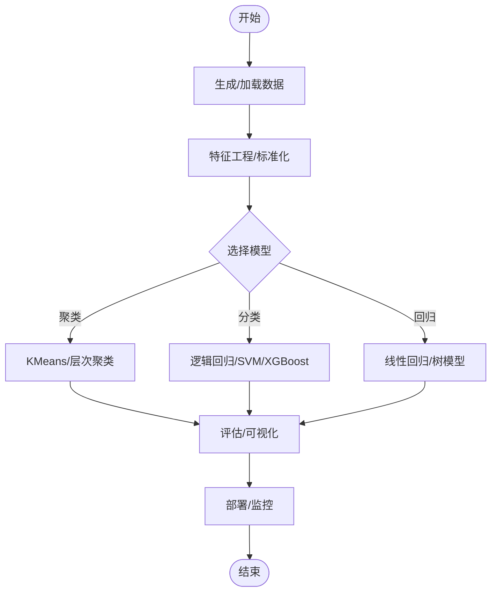
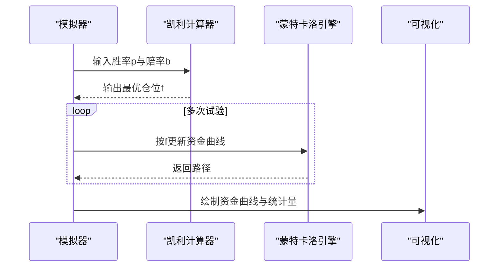
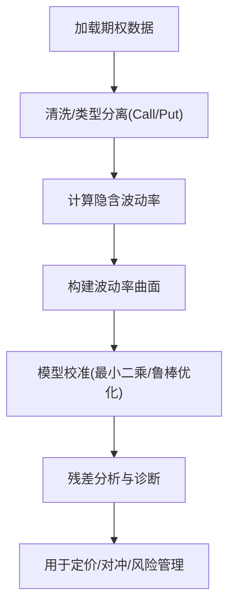
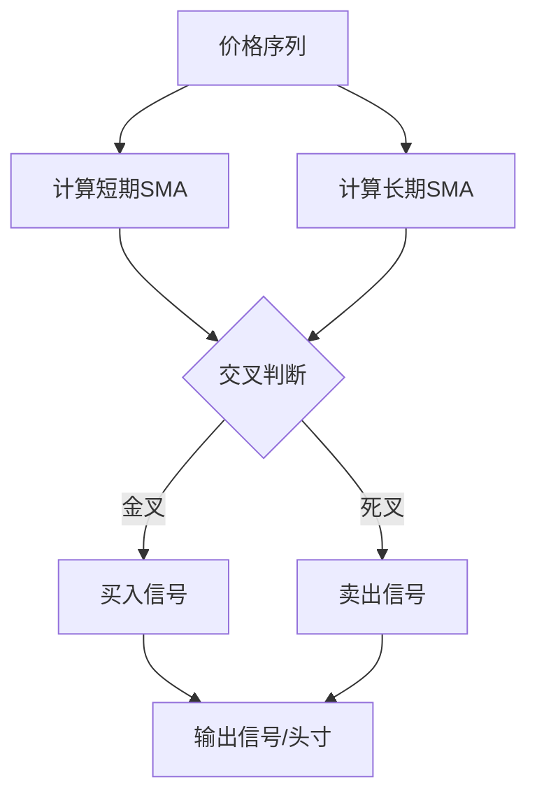
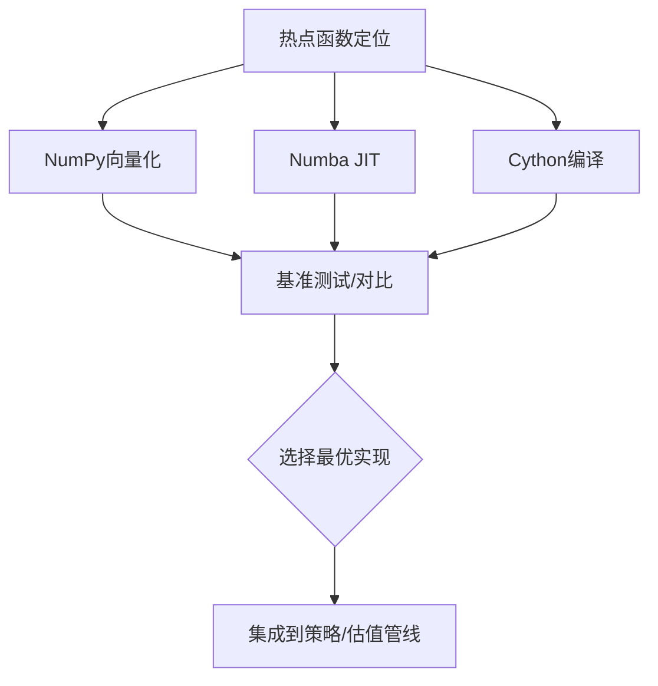
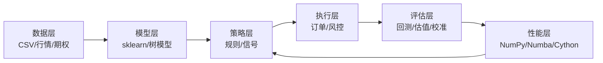
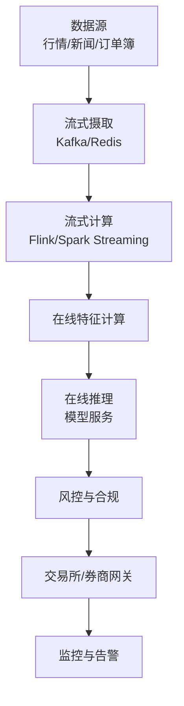

# 高级主题与扩展

<cite>
**本文引用的文件**   
- [13_c_machine_learning.ipynb](file://py4fi2nd-master/code/ch13/13_c_machine_learning.ipynb)
- [16_automated_trading.ipynb](file://py4fi2nd-master/code/ch16/16_automated_trading.ipynb)
- [21_market_valuation.ipynb](file://py4fi2nd-master/code/ch21/21_market_valuation.ipynb)
- [15_trading_strategies_a.ipynb](file://Code/15_trading_strategies_a.ipynb)
- [10_performance_python.ipynb](file://py4fi2nd-master/code/ch10/10_performance_python.ipynb)
</cite>

## 目录
1. [引言](#引言)
2. [项目结构](#项目结构)
3. [核心组件](#核心组件)
4. [架构总览](#架构总览)
5. [详细组件分析](#详细组件分析)
6. [依赖分析](#依赖分析)
7. [性能考虑](#性能考虑)
8. [故障排查指南](#故障排查指南)
9. [结论](#结论)
10. [附录](#附录)

## 引言
本文件围绕“金融数据分析的高级主题与扩展”展开，聚焦机器学习在风控、信用评分与市场预测中的应用；深度学习在高频与算法交易中的实践；文本挖掘与自然语言处理在金融新闻分析中的落地；以及市场估值与投资组合优化的先进方法。同时，结合仓库中的实战代码，系统阐述性能优化、并行计算与分布式处理等工程技巧，并给出可扩展的金融分析系统与实时数据处理管道的构建思路。

## 项目结构
仓库包含多套课程幻灯片与大量Jupyter Notebook示例，覆盖数据科学基础、时间序列、统计与机器学习、交易策略、自动化交易、市场估值与性能优化等主题。关键代码集中在：
- 机器学习与无监督学习示例（聚类、分类、回归）
- 自动化交易与资金管理（凯利准则、模拟）
- 期权与波动率曲面校准（市场估值）
- 交易策略（移动平均交叉）
- Python性能优化（NumPy、Numba、Cython对比）

**图表来源** 
- [13_c_machine_learning.ipynb](file://py4fi2nd-master/code/ch13/13_c_machine_learning.ipynb)
- [16_automated_trading.ipynb](file://py4fi2nd-master/code/ch16/16_automated_trading.ipynb)
- [21_market_valuation.ipynb](file://py4fi2nd-master/code/ch21/21_market_valuation.ipynb)
- [15_trading_strategies_a.ipynb](file://Code/15_trading_strategies_a.ipynb)
- [10_performance_python.ipynb](file://py4fi2nd-master/code/ch10/10_performance_python.ipynb)

**章节来源**
- [13_c_machine_learning.ipynb](file://py4fi2nd-master/code/ch13/13_c_machine_learning.ipynb)
- [16_automated_trading.ipynb](file://py4fi2nd-master/code/ch16/16_automated_trading.ipynb)
- [21_market_valuation.ipynb](file://py4fi2nd-master/code/ch21/21_market_valuation.ipynb)
- [15_trading_strategies_a.ipynb](file://Code/15_trading_strategies_a.ipynb)
- [10_performance_python.ipynb](file://py4fi2nd-master/code/ch10/10_performance_python.ipynb)

## 核心组件
- 机器学习与无监督学习：使用sklearn生成合成数据，演示聚类与特征空间可视化，为风险分层、客户分群提供基础能力。
- 自动化交易与资金管理：基于二元场景的凯利准则模拟资金曲线，展示仓位管理与复利效应。
- 市场估值与模型校准：读取DAX指数及期权数据，分离看涨/看跌，构建波动率曲面并进行模型校准。
- 交易策略：以双均线交叉为例，演示信号生成与可视化。
- 性能优化：对比纯Python循环、NumPy向量化、Numba JIT与Cython编译，量化加速收益。

**章节来源**
- [13_c_machine_learning.ipynb](file://py4fi2nd-master/code/ch13/13_c_machine_learning.ipynb)
- [16_automated_trading.ipynb](file://py4fi2nd-master/code/ch16/16_automated_trading.ipynb)
- [21_market_valuation.ipynb](file://py4fi2nd-master/code/ch21/21_market_valuation.ipynb)
- [15_trading_strategies_a.ipynb](file://Code/15_trading_strategies_a.ipynb)
- [10_performance_python.ipynb](file://py4fi2nd-master/code/ch10/10_performance_python.ipynb)

## 架构总览
下图将各模块串联成一条从数据到决策再到执行的流水线，体现“研究—建模—策略—执行—评估—优化”的闭环。

**图表来源** 
- [13_c_machine_learning.ipynb](file://py4fi2nd-master/code/ch13/13_c_machine_learning.ipynb)
- [16_automated_trading.ipynb](file://py4fi2nd-master/code/ch16/16_automated_trading.ipynb)
- [21_market_valuation.ipynb](file://py4fi2nd-master/code/ch21/21_market_valuation.ipynb)
- [15_trading_strategies_a.ipynb](file://Code/15_trading_strategies_a.ipynb)
- [10_performance_python.ipynb](file://py4fi2nd-master/code/ch10/10_performance_python.ipynb)

## 详细组件分析

### 机器学习与无监督学习（聚类/分类/回归）
- 目标：通过聚类进行风险分层、客户分群；通过分类/回归做违约概率估计或收益预测。
- 要点：
  - 使用合成数据快速验证算法稳定性与可视化效果。
  - 特征工程与标准化对模型表现至关重要。
  - 评估指标需贴合业务（如KS、AUC、PSI、RMSE等）。

**图表来源** 
- [13_c_machine_learning.ipynb](file://py4fi2nd-master/code/ch13/13_c_machine_learning.ipynb)

**章节来源**
- [13_c_machine_learning.ipynb](file://py4fi2nd-master/code/ch13/13_c_machine_learning.ipynb)

### 自动化交易与资金管理（凯利准则）
- 目标：在二元结果场景中，依据胜率与赔率确定最优下注比例，控制回撤与提升长期增长。
- 要点：
  - 凯利公式 f = p − (1−p)/b（此处简化为对称赔率情形）。
  - 蒙特卡洛模拟多条资金曲线，观察分布与尾部风险。
  - 实际应用中需考虑交易成本、滑点与流动性约束。

**图表来源** 
- [16_automated_trading.ipynb](file://py4fi2nd-master/code/ch16/16_automated_trading.ipynb)

**章节来源**
- [16_automated_trading.ipynb](file://py4fi2nd-master/code/ch16/16_automated_trading.ipynb)

### 市场估值与模型校准（波动率曲面）
- 目标：基于DAX指数与期权报价，分离看涨/看跌，构建隐含波动率曲面，校准定价模型。
- 要点：
  - 数据清洗与日期解析，区分Call/Put。
  - 波动率曲面插值与平滑，避免套利机会。
  - 校准过程最小化定价误差，关注残差分布与稳健性。

**图表来源** 
- [21_market_valuation.ipynb](file://py4fi2nd-master/code/ch21/21_market_valuation.ipynb)

**章节来源**
- [21_market_valuation.ipynb](file://py4fi2nd-master/code/ch21/21_market_valuation.ipynb)

### 交易策略（双均线交叉）
- 目标：基于短期与长期简单移动平均线交叉产生买卖信号，作为策略基线。
- 要点：
  - 滚动窗口计算SMA，设置阈值过滤噪音。
  - 结合成交量与波动率可增强信号质量。
  - 回测需考虑交易成本与滑点。

**图表来源** 
- [15_trading_strategies_a.ipynb](file://Code/15_trading_strategies_a.ipynb)

**章节来源**
- [15_trading_strategies_a.ipynb](file://Code/15_trading_strategies_a.ipynb)

### 性能优化（NumPy/Numba/Cython）
- 目标：识别热点函数，采用向量化、JIT与编译技术显著降低时延。
- 要点：
  - 优先使用NumPy向量化替代Python循环。
  - Numba对数值密集循环提供即时编译。
  - Cython对复杂逻辑与外部库调用有更高上限。
  - 基准测试应稳定、重复多次取中位数。

**图表来源** 
- [10_performance_python.ipynb](file://py4fi2nd-master/code/ch10/10_performance_python.ipynb)

**章节来源**
- [10_performance_python.ipynb](file://py4fi2nd-master/code/ch10/10_performance_python.ipynb)

## 依赖分析
- 数据层：CSV行情与期权数据，时间戳与字段一致性是关键。
- 模型层：sklearn用于无监督学习与基线模型；可选XGBoost/LightGBM用于分类/回归。
- 策略层：基于规则（均线）或模型信号（预测/评分）。
- 执行层：订单路由、风控与仓位管理。
- 评估层：回测、估值与模型校准。
- 性能层：NumPy/Numba/Cython加速，必要时引入并行与分布式。

**图表来源** 
- [13_c_machine_learning.ipynb](file://py4fi2nd-master/code/ch13/13_c_machine_learning.ipynb)
- [16_automated_trading.ipynb](file://py4fi2nd-master/code/ch16/16_automated_trading.ipynb)
- [21_market_valuation.ipynb](file://py4fi2nd-master/code/ch21/21_market_valuation.ipynb)
- [15_trading_strategies_a.ipynb](file://Code/15_trading_strategies_a.ipynb)
- [10_performance_python.ipynb](file://py4fi2nd-master/code/ch10/10_performance_python.ipynb)

**章节来源**
- [13_c_machine_learning.ipynb](file://py4fi2nd-master/code/ch13/13_c_machine_learning.ipynb)
- [16_automated_trading.ipynb](file://py4fi2nd-master/code/ch16/16_automated_trading.ipynb)
- [21_market_valuation.ipynb](file://py4fi2nd-master/code/ch21/21_market_valuation.ipynb)
- [15_trading_strategies_a.ipynb](file://Code/15_trading_strategies_a.ipynb)
- [10_performance_python.ipynb](file://py4fi2nd-master/code/ch10/10_performance_python.ipynb)

## 性能考虑
- 向量化优先：用NumPy数组运算替代Python for循环，减少解释器开销。
- JIT加速：Numba对数值密集型循环进行即时编译，适合蒙特卡洛与路径模拟。
- 编译优化：Cython对复杂逻辑与外部接口进行编译，获得接近C的性能。
- 基准与监控：使用%timeit与多次运行统计，避免冷启动与缓存干扰。
- 内存与IO：合理分块读取大文件，避免全量加载导致OOM。

[本节为通用指导，不直接分析具体文件]

## 故障排查指南
- 数据问题：检查日期解析、缺失值与异常值，确保Call/Put标识一致。
- 模型问题：过拟合/欠拟合可通过正则化、交叉验证与特征选择缓解。
- 策略问题：信号噪声过大需引入过滤条件（波动率、成交量、趋势强度）。
- 执行问题：滑点与手续费会显著影响回测与实际收益，需在评估中显式建模。
- 性能瓶颈：热点函数定位后优先向量化，其次JIT/编译，最后考虑并行。

**章节来源**
- [21_market_valuation.ipynb](file://py4fi2nd-master/code/ch21/21_market_valuation.ipynb)
- [16_automated_trading.ipynb](file://py4fi2nd-master/code/ch16/16_automated_trading.ipynb)
- [15_trading_strategies_a.ipynb](file://Code/15_trading_strategies_a.ipynb)
- [10_performance_python.ipynb](file://py4fi2nd-master/code/ch10/10_performance_python.ipynb)

## 结论
本仓库提供了从机器学习、策略开发到估值校准与性能优化的完整实践链路。建议以“数据—模型—策略—执行—评估—优化”为主线，逐步迭代：先用简单规则与基线模型建立可信度，再用更复杂的模型与更快的实现提升收益与效率，最终形成可扩展、可监控、可回滚的生产级系统。

[本节为总结，不直接分析具体文件]

## 附录
- 可扩展系统建议：
  - 微服务化：数据接入、特征计算、模型推理、策略执行、风控与监控解耦。
  - 流式处理：Flink/Kafka构建实时管道，支持毫秒级信号与下单。
  - 分布式训练：Spark/Dask用于大规模特征与模型训练。
  - 容器化与编排：Docker+Kubernetes保障弹性与高可用。
- 实时数据处理管道概念图：

[本图为概念示意，不映射具体源码文件]